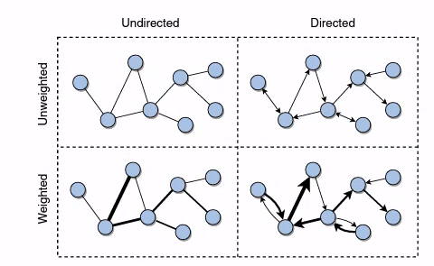
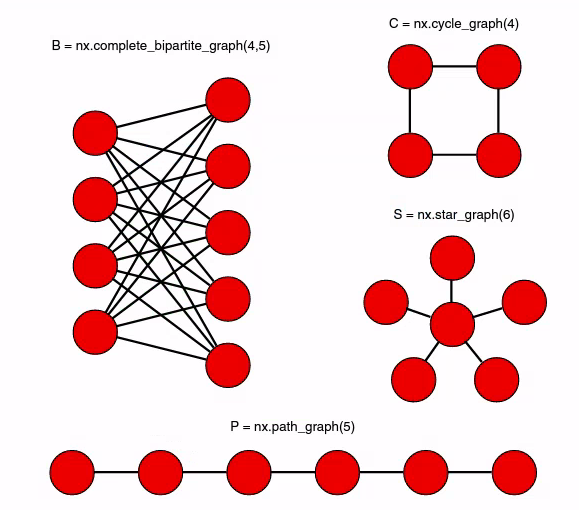
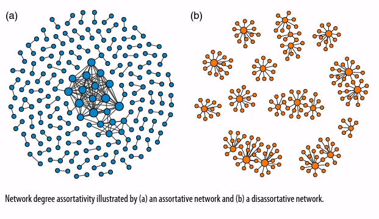
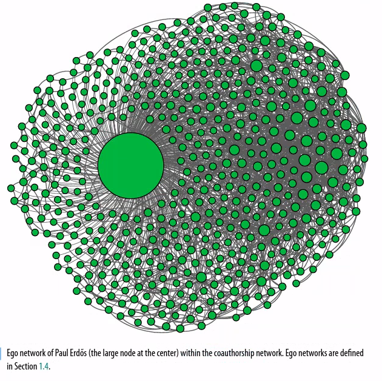

# References
- A First Course in Network Science
- Schaum's Outline of Graph Theory

# Basic Definitions - Graph Types
- **Graph**: a set of nodes/verticies and edges
- **Tree**: a connected graph with no cycles
- **Node/Verticies**: a point in the graph
- **Edge/Link**: a line connecting two nodes
- **Weighted Graph**: a graph where edges have weights
- **Directed Graph**: a graph where edges have direction
- **Undirected Graph**: a graph where edges have no direction

# Basic Definitions - Graph Properties
- **Degree**: the number of edges connected to a node
- **Path**: a sequence of nodes connected by edges
- **Cycle**: a path that starts and ends at the same node
- **Connected**: a graph where there is a path between every pair of nodes
- **Subnetwork**: a subset of nodes and edges from a graph
- **Fully Connected/Complete Network**: a graph where every pair of nodes is connected by an edge -- all connections are present
- **Density**: the fraction of edges present in a graph
- **Sparsity**: the fraction of edges not present in a graph
- **Bipartite Graph**: a graph where nodes can be divided into two disjoint sets such that no two nodes within the same set are connected by an edge
- **Homophily**: the tendency for nodes to be connected to other nodes with similar properties

# Basic Definitions - Graph Properties 2
- **Cliques**: a complete subnetwork - a subnetwork where every pair of nodes is connected by an edge
- **Component**: a connected subgraph
- **Ego Network**: a node and its neighbors
- **Assortativity**: the tendency for nodes to be connected to other nodes with similar properties
- **Dissassortativity**: the tendency for nodes to be connected to other nodes with dissimilar properties

Paul Erdos was a one of the world' greats mathmaticians.  He is know for his prolific collaboration.
An 'Erdos number' was the the shortest path to Erdos in publications.

# Basic Definitions - Graph Representations
- **Adjacency Matrix**: a matrix where the rows and columns are nodes and the entries are 1 if there is an edge between the nodes and 0 otherwise
- **Incidence Matrix**: a matrix where the rows are nodes and the columns are edges and the entries are 1 if the node is incident to the edge and 0 otherwise
- **Adjacency List**: a list of lists where each list contains the nodes connected to a node
- **Edge List**: a list of tuples where each tuple contains the nodes connected by an edge
- **Degree Matrix**: a diagonal matrix where the diagonal entries are the degrees of the nodes
- **Laplacian Matrix**: the degree matrix minus the adjacency matrix
- **Walk**: a sequence of nodes connected by edges
- **Trail**: a walk with no repeated edges
- **Path**: a trail with no repeated nodes

# Basic Definitions - Paths
- **Cycle**: a path that starts and ends at the same node
- **Diameter**: the longest shortest path in a graph
- **Shortest Path**: the path between two nodes with the smallest number of edges
- **Average Path Length**: the average shortest path between all pairs of nodes
- **Connected Component**: a maximal connected subgraph
- **Giants Component**: the largest connected component

# Basic Definitions - Graph Search
- **Breadth First Search (BFS)**: a search algorithm that explores all the nodes at the present depth before moving on to the next depth
- **Depth First Search (DFS)**: a search algorithm that explores as far as possible along each branch before backtracking
- **Dijkstra's Algorithm**: an algorithm that finds the shortest path between nodes in a graph

[flashcard]: <>
# How does Dijkstra's Algorithm Work?;"
- Dijkstra's algorithm applies to weighted graphs and finds the shortest path between nodes.
- Starting at the source node it searches paths that are the shortest distance from the source node.
- Therefore the search algorithm will not exhaustively search a given node like BFS, it will jump to the next
node that is the shortest distance, even if it's not the current node being searched.
"

# Basic Definitions - Neighbors
- **Neighbors**: the nodes connected to a node
- **Clustering Coefficient**: the fraction of a node's neighbors that are neighbors with each other
- **Triad**: a subgraph with three nodes and three edges
- **Triangle**: a subgraph with three nodes and three edges
- **Triadic Closure**: the tendency for nodes with a common neighbor to be connected

# Basic Definitions - Centrality
- **Centrality**: a measure of the importance of a node in a network
- **Average degree**: the average number of edges connected to a node
- **Closeness Centrality**: the average shortest path between a node and all other nodes
- **Communities**: groups of nodes that are more connected to each other than to other nodes

# Centrality Measures
- **Degree Centrality**: the number of edges connected to a node
- **Closeness Centrality**: the average shortest path between a node and all other nodes
- **Betweenness Centrality**: the fraction of shortest paths that pass through a node
- **Eigenvector Centrality**:
- **PageRank**:
- **Katz Centrality**: Degree centrality with a feedback loop - a node is important if it is connected to other important nodes

<!--
[flashcard]
Q:In words, how is Pagerank calculated?
A:PageRank is calculated by iteratively multipling the PageRank vector by the adjacency matrix and then normalizing the result. The process is repeated until the PageRank vector converges.
-->
