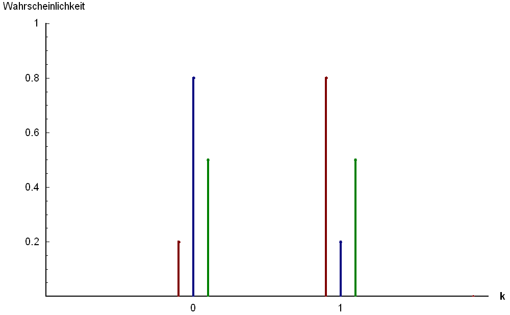
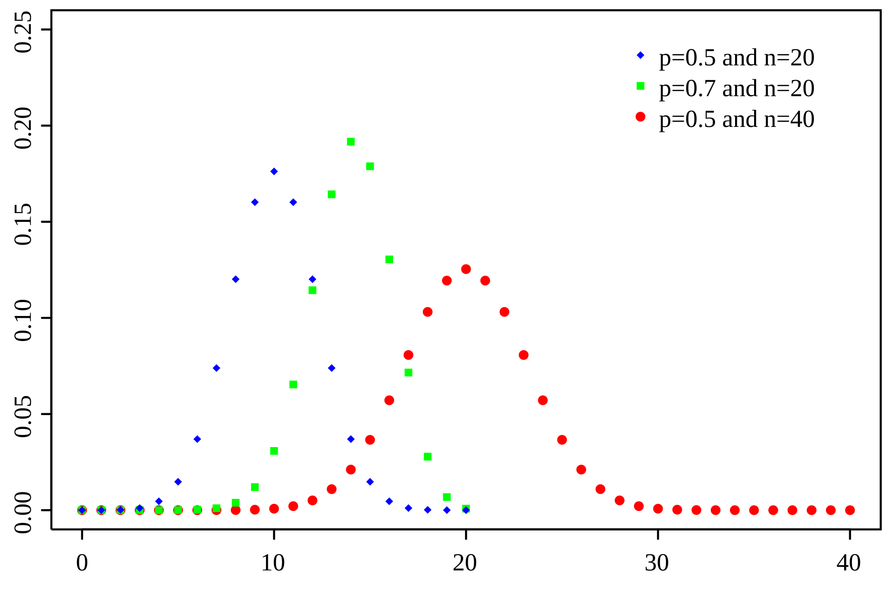

# Unrelated notes

- Please start using GenAI Chatbots for your ideation.
  - Chatbots are great at coming up with ideas introducing many different techniques.

## Random analytics reviews

All of these were generated or elucidated by ChatGPT5

### Error on sample-derived evaluation metric

Problem: hard-to-label dataset, how many do we need to label to get statistical power needed for our
metrics

- Could I have come up with this idea? I did.
- Did I know which method to use? No.
  - Would I have found the answer? Yes probably but would have taken time.

Solution:

- If you want precision (TP/(TP+FP)) then this is a ratio of just the positive samples.
  - Need to get a lot of positive predictions and then label
- Do you label only 10? 100000?
  - The error on our precision comes from a binomial proportion'
    - When you think 'binomial' think 'Bernoulli trials' - (biased) coin flips
      - In our case we sample from our predicted positives and see how many are true positives, not
        totally unlike flipping a coin and seeing how many heads we get

$$
n \approx \frac{z_{\alpha/2}^{2} \; p (1 - p)}{\varepsilon^{2}}
$$

where:

- $n$ is the required sample size
- $z_{\alpha/2}$ is the z-score corresponding to the desired confidence level
- $p$ is the estimated proportion of successes (e.g., estimated precision)
- $\varepsilon$ is the desired margin of error

# Wiki Ontology Analysis Review

Review: we would like to get all relevant terms that are related to machine learning to see an
interesting overview of what arcane topics/techniques we may want to know about ( e.g SMOTE,
Winzorize, AdaBoost.M1, Personal PageRank, FastRP etc)

- Problem: we have so many unrelated nodes (names etc)
- My first solution: Just do NER over these and filter out names, dates etc
- My second solution: get glossary of terms (strip them from glossary of machine learning books) and
  establish neighborhood based on connectedness between these terms
- ChatGPT's ideas:
  - Had about 11 of them, and I learned a lot
    - I had to use my experience to pick the best one
  - Landed on three:
    - Semantic Similarity
    - Personalized PageRank
    - Community Detection with Leiden/Louvain

## Personalize PageRank

### Reminder: PageRank
- Algorithm:
  - Start with a uniform probability distribution over all nodes.
  - Perform random walks on the graph, with a probability of returning to the starting node at each
    step.
  - After many iterations, nodes that are frequently visited during these random walks will have
    higher PageRank scores.
  - Rank nodes based on their PageRank scores to identify the most important nodes in the graph.

### Personalized PageRank
- Algorithm:
  - Start with a set of seed nodes (e.g., known machine learning terms).
  - Initialize a probability distribution where the seed nodes have higher probabilities.
  - Perform random walks on the graph, with a probability of returning to the seed nodes at each step.
  - After many iterations, nodes that are frequently visited during these random walks will have
    higher PageRank scores.
  - Rank nodes based on their PageRank scores to identify those most relevant to the seed terms.

## FastRP
- Algorithm:
  - Initialize random vectors for each node in the graph.
  - Perform a series of matrix multiplications and non-linear transformations to propagate
    information through the graph.
  - After several iterations, the resulting vectors capture the structural properties of the graph.
  - Use these vectors as embeddings for downstream tasks like node classification or clustering.

## Louvain/Leiden Community Detection
- Algorithm:
  - Start with each node in its own community.
  - For each node, evaluate the gain in modularity by moving it to the community of each neighbor.
  - Move the node to the community that yields the highest modularity gain (if positive).
  - Repeat until no further modularity improvements can be made.
  - Aggregate nodes in the same community into a single node and repeat the process on the new graph.
- Important concept: Modularity
  - A measure of the strength of division of a network into communities.
  - High modularity indicates dense connections within communities and sparse connections between them.