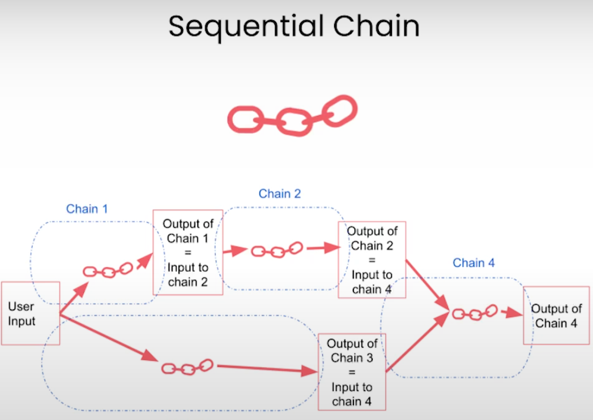
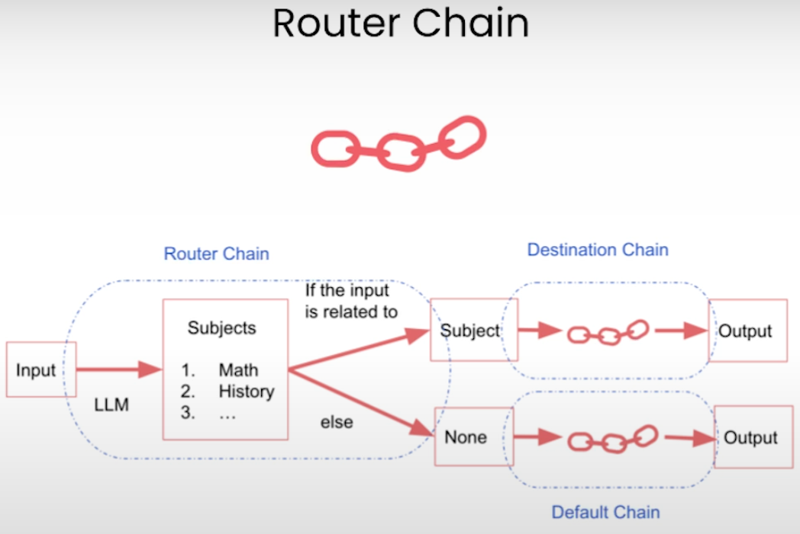
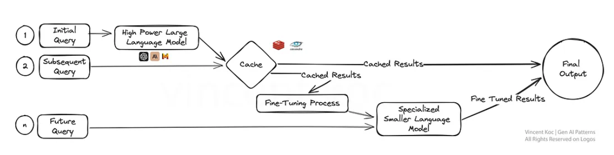
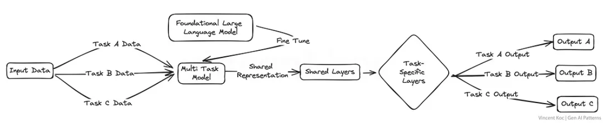
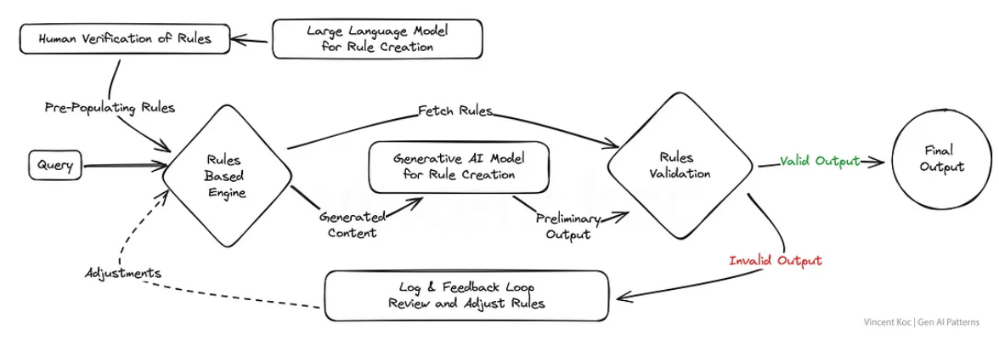
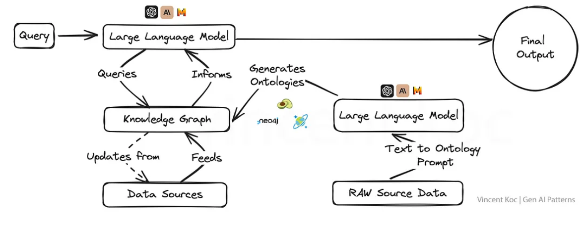
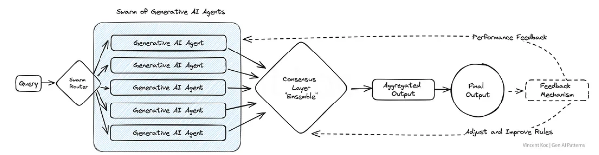
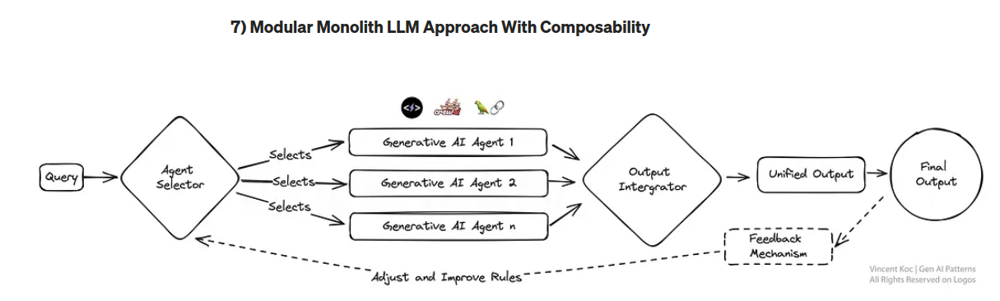
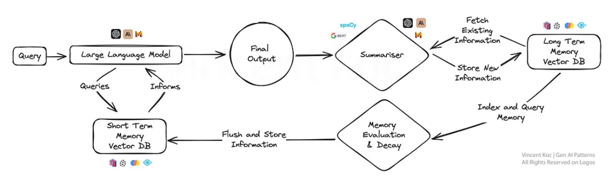
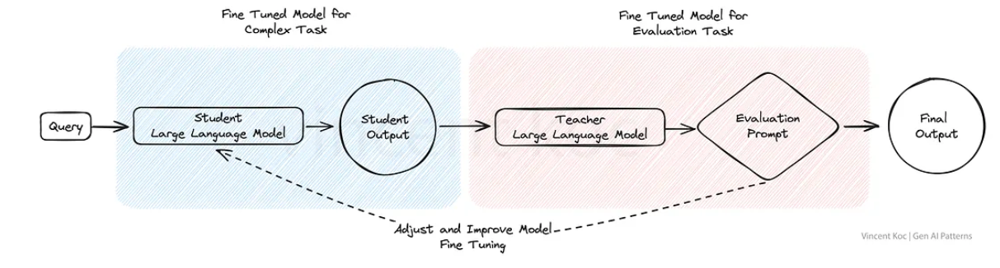

# LangChain Review

> LangChain is a software framework that helps faciliate the integration of large language models
> (LLMs) into applications. -- /Wikipedia/

LangChain is the backbone of more advanced generative ai solutions with an extensive API. This
document reviews the key concepts and methods of LangChain.

This document is heavily based on the
[DeepLearning.ai - LangChain for LLM](https://www.deeplearning.ai/short-courses/langchain-for-llm-application-development/)
short course.

## LangChain Overview

- Open-source development framework for LLM applications
- Python and Javascript (TypeScript) packages
- Models
  - LLMs: 20+ Integrations
  - Text Embedding Models: 10+ Integrations
- Prompts
  - Prompt Templates
  - Output Parsers: 5+ Integrations
  - Example Selectors: 5+ implementations
- Indexes
  - Document Loaders: 50+ implementations
  - Text Splitters: 10+ implementations
  - Vector stores: 10+ implementations
  - Retrievers 5+ implementations
- Chains
  - Prompt + LLM + Parsing
  - Application specific chains: 20+ types
- Agents
  - Agent Types: 5+ types
  - Agent toolkits: 10+ implementations
- LangChain was released in October 2022 by Harrison Chase
  - The API, indeed the entire LangChain library is very much in flux and changing rapidly.
  - Many functions are being deprecated and major changes in the api happen often.
    - The adoption of LangGraph for flow-control
    - **LangGraph** - library for building stateful, multi-actor applications with LLms, used to
      create agent and multi-agent workflows

### Models Prompts and Parsers.

#### Models - [`langchain.chat_models`](https://python.langchain.com/api_reference/langchain/chat_models.html)

- This subpackage is used to load and interact with LLMs
- Supports many chat models: AI21, Alibaba, Anyscale, Azure, Baichuan, Baidu, AWS Bedrock, Cerebras,
  Cohere, Coze, Dappier, Databricks, DeepInfra, Eden AI, EverlyAI, Fireworks, Friendli, GigaChat,
  Google, GPTRouter, Groq, ChatHuggingFace, IBM watsonx.ai, JInaChat, Kinetica, Konko, LiteLLM,
  Llama, Minimax, Nvidia, OCI ChatOc, Ollama, OpeanAI, Perplexity, PremAI, solary, SparkLLM,
  Tencent, Togyni among others

e.g

```python
from langchain.chat_models import ChatOpenAI
chat = ChatOpenAI(temperature=0.0, model=llm_model)
```

#### Prompts - [`langchain.prompts`](https://python.langchain.com/api_reference/core/prompts.html#module-langchain_core.prompts)

- This subpackage is used to generate prompts.
- There is support for many types of prompt templates (e.g FewShot, String, Pipeline, ChatMessage,
  SystemMessage etc.)

e.g

````python
template_string = """Translate the text \
that is delimited by triple backticks \
into a style that is {style}. \
text: ```{text}```
"""
prompt_template = ChatPromptTemplate.from_template(template_string)
````

#### Parsers - [`langchain.parsers`]()

- Tag and extract particular portions of output

```python
from langchain.output_parsers import ResponseSchema
from langchain.output_parsers import StructuredOutputParser

gift_schema = ResponseSchema(name="gift",
                             description="Was the item purchased\
                             as a gift for someone else? \
                             Answer True if yes,\
                             False if not or unknown.")
delivery_days_schema = ResponseSchema(name="delivery_days",
                                      description="How many days\
                                      did it take for the product\
                                      to arrive? If this \
                                      information is not found,\
                                      output -1.")
price_value_schema = ResponseSchema(name="price_value",
                                    description="Extract any\
                                    sentences about the value or \
                                    price, and output them as a \
                                    comma separated Python list.")

response_schemas = [gift_schema,
                    delivery_days_schema,
                    price_value_schema]

output_parser = StructuredOutputParser.from_response_schemas(response_schemas)
format_instructions = output_parser.get_format_instructions()
response = chat(messages)
output_dict = output_parser.parse(response.content)
# output_dict = {'gift': True, 'delivery_days': 2, 'price_value': ["It's slightly more expensive than the other leaf blowers out there, but I think it's worth it for the extra features.']}
```

### Memory


- Memory maintains Chain state, incorporating context from past runs. e.g.

```python
llm = ChatOpenAI(temperature=0.0, model=llm_model)
memory = ConversationBufferWindowMemory(k=1)
conversation = ConversationChain(
    llm=llm,
    memory = memory,
    verbose=False
)
conversation.predict(input="Hi, my name is Andrew")
conversation.predict(input="What is 1+1?")
conversation.predict(input="What is my name?")
```

- `ConversationBufferWindowMemory` is currently a deprecated method in LangChain 0.3.

### Chains

- Chains are a sequence of calls to components like models, document retrievers, other Chains, etc
  and provide a simple interface to this sequence
- Several types of chains
  - Sequential chain - combines multiple chains where the output of the one chain is the input to
    the next
  - Router chain - chain that outputs the name of a destination chain and the inputs to it

<p float="left">
  
   
</p>

```python
from langchain.chains import SimpleSequentialChain

llm = ChatOpenAI(temperature=0.9, model=llm_model)
# prompt template 1
first_prompt = ChatPromptTemplate.from_template(
    "What is the best name to describe \
    a company that makes {product}?"
)
# Chain 1
chain_one = LLMChain(llm=llm, prompt=first_prompt)
# prompt template 2
second_prompt = ChatPromptTemplate.from_template(
    "Write a 20 words description for the following \
    company:{company_name}"
)
# chain 2
chain_two = LLMChain(llm=llm, prompt=second_prompt)
overall_simple_chain = SimpleSequentialChain(chains=[chain_one, chain_two],
                                             verbose=True
                                            )
overall_simple_chain.run(product)
```

### Retrevial/Vectorstores - [`langchain.vectorstores`](https://python.langchain.com/api_reference/community/vectorstores.html)

Retrieval is the process of finding and returning documents that are relevant to a query. This is
usually done by passing an embedding to a vector store and returning the most similar documents
which the vector store determines by some similarity metric.

- This 'Retrevial' is the same 'Retrevial' as in the RAG (Retrieval Augmented Generation) method
- LangChain supports many vector stores
  - Currently the most popular vector stores are:
    1. Pinecone
    1. Milvus
    1. Chroma
    1. Qdrant

### Evaluation - [`langchain.evaluation`](https://python.langchain.com/api_reference/langchain/evaluation.html)

LangChain has the ability to run evaluation on LLM and Chain outputs.

```python
from langchain.evaluation import load_evaluator

evaluator = load_evaluator("qa")
evaluator.evaluate_strings(
    prediction="We sold more than 40,000 units last week",
    input="How many units did we sell last week?",
    reference="We sold 32,378 units",
)
```

### Agents

#### What is an Agent?

The definition of agent is evolving, and there doesn't seem to be an industry standard definition at
this point. As an example consider the different architectures:

- **Agent Candidate 1**: a series of questions to a hosted foundational model from one of the big AI
  companies where the prompt requests chain-of-thought reasoning. No external tools.
- **Agent Candidate 2**: to LLM models talking to each other
- **Agent Candidate 3**: a deterministic middleware layer that uses 20 separate tools
- **Agent Candidate 4**: independent code that takes independent action

From these examples we can see several properties which we may define an agent:

- Tools
- Reasoning
- Action
- Location of executing code

Currently LangChain defines agent as:

- **agent** - an agent is a system that uses an LLM to decide the control flow of an application
  

#### Agents - [`langchain.agents`](https://python.langchain.com/api_reference/core/agents.html)

```python
from langchain.agents.agent_toolkits import create_python_agent
from langchain.agents import load_tools, initialize_agent
from langchain.agents import AgentType
from langchain.tools.python.tool import PythonREPLTool
from langchain.python import PythonREPL
from langchain.chat_models import ChatOpenAI

llm = ChatOpenAI(temperature=0, model=llm_model)

tools = load_tools(["llm-math","wikipedia"], llm=llm)

agent= initialize_agent(
    tools,
    llm,
    agent=AgentType.CHAT_ZERO_SHOT_REACT_DESCRIPTION,
    handle_parsing_errors=True,
    verbose = True)

# Math
agent("What is the 25% of 300?")

# Wikipedia
question = "Tom M. Mitchell is an American computer scientist \
and the Founders University Professor at Carnegie Mellon University (CMU)\
what book did he write?"
result = agent(question)

# Python
agent = create_python_agent(
    llm,
    tool=PythonREPLTool(),
    verbose=True
)

customer_list = [["Harrison", "Chase"],
                 ["Lang", "Chain"],
                 ["Dolly", "Too"],
                 ["Elle", "Elem"],
                 ["Geoff","Fusion"],
                 ["Trance","Former"],
                 ["Jen","Ayai"]
                ]

agent.run(f"""Sort these customers by \
last name and then first name \
and print the output: {customer_list}""")

# Your own tool
from langchain.agents import tool
from datetime import date

@tool
def time(text: str) -> str:
    """Returns todays date, use this for any \
    questions related to knowing todays date. \
    The input should always be an empty string, \
    and this function will always return todays \
    date - any date mathmatics should occur \
    outside this function."""
    return str(date.today())

agent= initialize_agent(
    tools + [time],
    llm,
    agent=AgentType.CHAT_ZERO_SHOT_REACT_DESCRIPTION,
    handle_parsing_errors=True,
    verbose = True)
```

## Design Patterns

The common design patterns for GenAI applications is still evolving. However, some common patterns

### RAG (Retrieval Augmented Generation) - filtering at application layer

- Requirements.
  - User/Client wants to Ask question against single documents from a collection of documents.
  - Documents cannot fit in context window.
  - User provides input to limit the document to return

### RAG (Retrieval Augmented Generation) - filtering at LangChain Layer

- Requirements.
  - User/Client wants to Ask question against single documents from a collection of documents.
  - Documents cannot fit in context window.
  - User asks a question and LangChain filters the documents to return

### Fine-Tuned model over document store

- Requirements
  - User wants to ask questions against an entire document store
  - This is not specifically a LangChain design pattern

(The following patterns are from
[Generative AI Design Patterns A Comprehensive Guide - Vincent Kok](https://towardsdatascience.com/generative-ai-design-patterns-a-comprehensive-guide-41425a40d7d0))

### Layered CAshing Strategy Leading to Fine-Tuning

]

### Multiplexing AI Agents For A Panel of Experts


### Fine-Tuning LLM's for Multiple Tasks



### Blending Rules Based & Generative



### Utilizing Knowledge Graphs with LLM's



### Swarm of AI Agents



### Modular Monolith LLM Approach With Composability



### Approach To Memory Cognition for LLMs



### Red & Blue Team Dual-Model Evaluation


