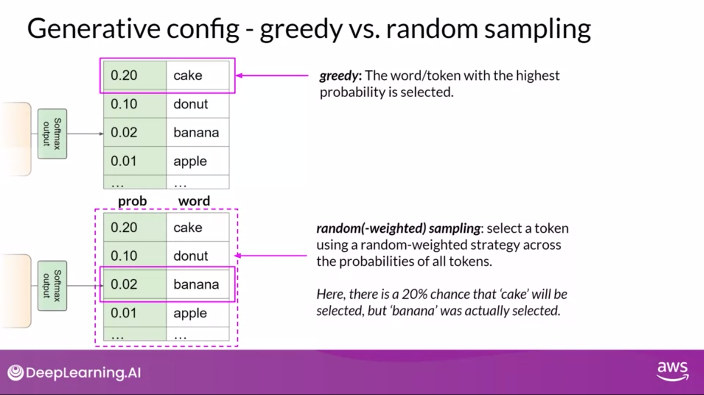

# LLMS and the Generative AI Lifecycle

Definitions:
- **Foundation Models**: ML model that is trained on broad data such that it can be applied across a wide range of uses cases
  - in LLM space: GPT, BERT, FLAN-T5, PaLM, LLaMa, BLOOM
- **Fine-tuning**: process of training a model on a specific dataset to create a model that is specialized for a particular use case
- **Prompt**: the input to a language model
- **Context Window**: memory available to prompt
- **Inference**: the process of generating output from a model
- **Completion**: the output of a language model

# LLM use cases:
- **Essay Writing**: generating an essay from a prompt
- **Text Summarization**: generating a summary of a text
- **Text Translation**: translating text from one language to another
- **Natural Language to Programming Language**: translating natural language to programming language
- **Entity Extraction**: extracting entities from text
- **Connecting to APIs**: extending the model with information from other systems

Aside: programming as requirements specification
- Every few lines of code in a program specifies a explict or implicit requirement of a program
- When code is generated there can be an assumption of the requirement or the requirement needs to be explicit
Question: with the idealized LLM, what is the minimum number of English prompts it would take to generate the Windows Oparating System?
Question: is there a future world without programmers in python? Maybe programmers just use English?
Bigger Question: is there some difficulty that arises between the race of model parameter size and the context window size?
Solution?: don't build Windows, build windows components? However this world still needs system-level designers.
To think about:

# Generating text before LLM
- RNN (Recurrent Neural Network) and LSTM (Long Short-Term Memory) networks.

# 2017 - 'Attention is All You Need' paper
- **Transduction**: reasoning from observed cases to specific cases
- **Induction**: reasoning from observed cases to general rule and applied to specific cases
- **Attention**: calculating soft weights in the context window
  - Sequential computation in RNNs and LSTMs
  - Parallel computation in Transformers

- AIAYN Paper
  - Google Researchers
  - Introduces the Transformer architecture
  - Only 10 pages
  - Currently in March 2024 has 7019 citations

# Attention:
- **Attention map**: a matrix that shows the relationship between the input and output of a model

# Transformer:
- Encoder-Decoder architecture
  - Encoder: encodes inputs ('prompts') with contextual understanding and produces one vector per input token
  - Decoder: Accepts input tokens and generates new tokens
- Tokenizer method must be same for training and inference
- Embedding layer: converts tokens to vectors
  - can relate words in embedding space and calculate distance between words (cosine similarity)
- Positional Encoding: adds information about the position of the token in the sequence
- Multi-head attention: allows the model to focus on different parts of the input
- Feed-forward network: a network where information flows forward (as opposed to recurrent networks for example)
- Softmax: a function that converts a vector of numbers into a probability distribution

# Architecture Variations:
- Encoder-only transformer: input and output sequence are same length
  - Can be used for classificaiton tasks, sentiment analysis
  - e.g. BERT
- Encoder-decoder transformer: used for tasks like translation
  - e.g. T5, BART,
  - sequence-to-sequence models
  - Can be used to text generation task
- Decoder-only transformer: used for tasks like language modeling
  - Most commonly used
  - e.g. GPT famiy, BLOOM, Jurassic, LLaMa
  - Can be generalized for most tasks

# Prompt Engineering:
- **Prompt Engineering**: the process of designing prompts to get the desired output from a model
- **In-context learning**: training a model on a specific dataset to improve performance on a specific task
  - **zero-shot inference**: training a model on a specific dataset to improve performance on a specific task

# Ways to improve LLM performance:
- **Prompt Engineering**: designing prompts to get the desired output
- **In-context learning**: training a model on a specific dataset to improve performance on a specific task
- **Inference Parameters**: adjusting parameters to improve performance
  - Not prameters or hypterprameters learned in training, but parameters that are set during inference
- **Fine-tuning**: training a model on a specific dataset to improve performance on a specific task
- **Model Size**: larger models tend to perform better
- **RAG (Retrieval Augmented Generation)**: integrates external data for enriched responses

# Ways to modify LLM output - Inference Prameters:
- - Examples:
    - **Top-p sampling**: samples from the top p tokens (where p is a probability threshold the tokens do not exceed)
    - **Top-k sampling**: samples from the top k tokens (where k is a number of tokens to sample from)
    - **Temperature**: controls the randomness of the output, by controling the shape of the softmax distribution
      - acutally modifies the probabilities as opposed to p or k sampling

# Generative AI Lifecycle:
- Define the use case -  define the problem you want to solve, as specifically and narrowly as possible
- Choosing an existing model or pretrain your own
- Prompt Engineering - design prompts to get the desired output
- Fine-tuning - train the model on a specific dataset to improve performance
- Align with human feedback
- Evaluate the model
- Optimize and deploy
- Augment model and build LLM-powered applications

references:
https://www.coursera.org/learn/generative-ai-with-llms/lecture/9uWab/course-introduction
