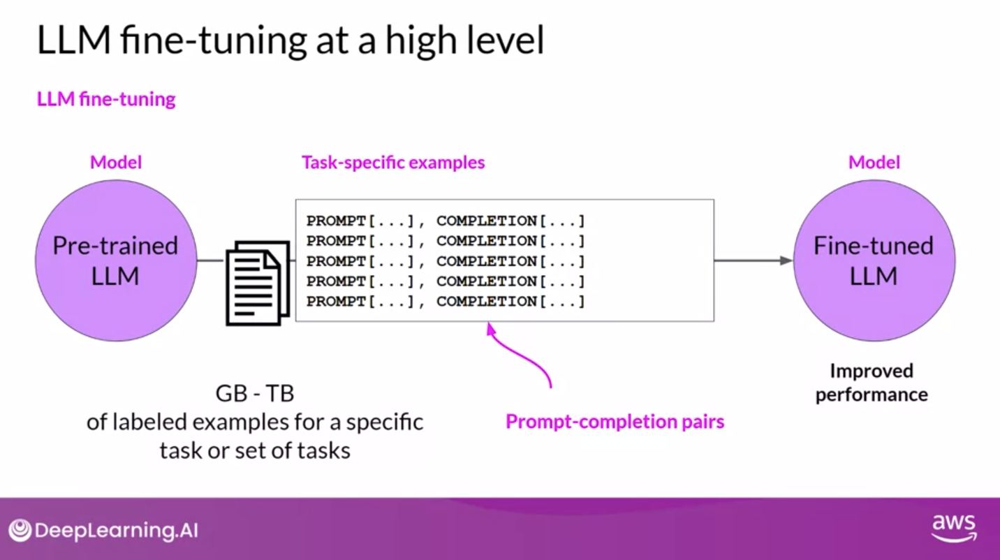
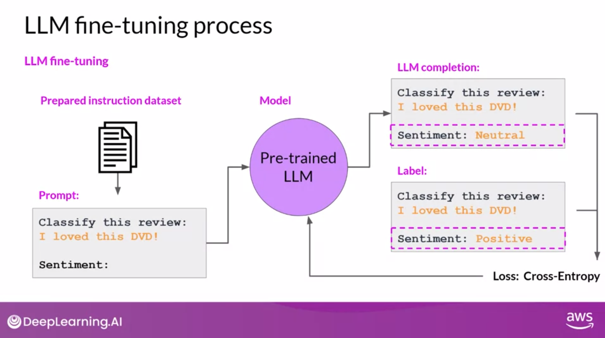
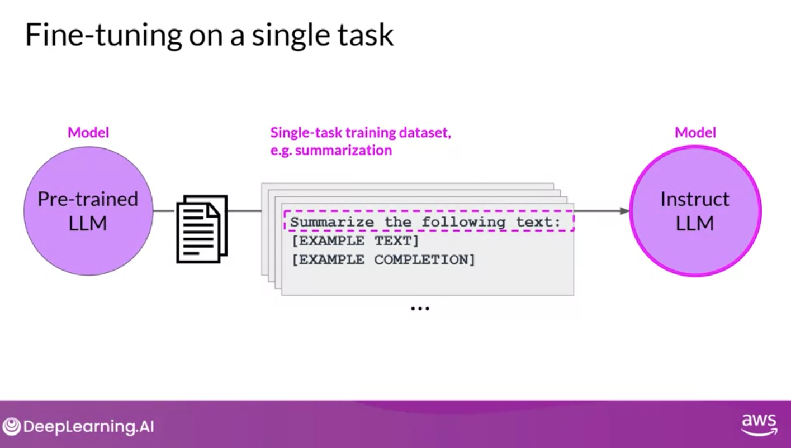
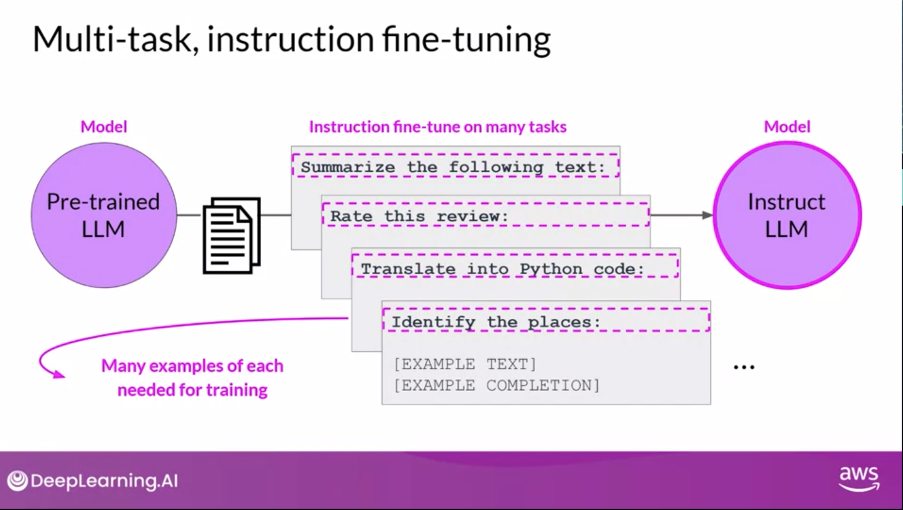
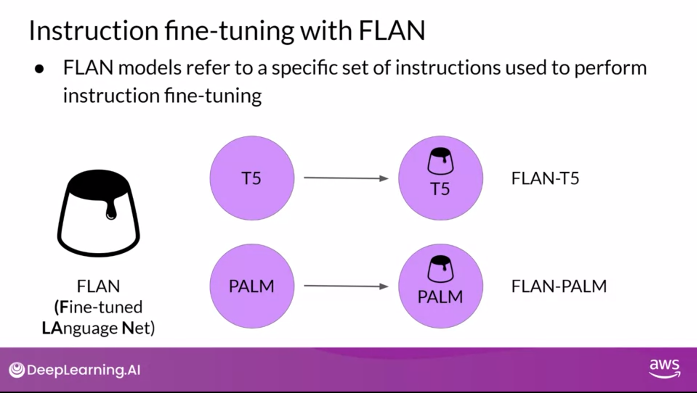

# Review
Ways to improve LLM performance:
- **Prompt Engineering**: designing prompts to get the desired output
- **In-context learning**: training a model on a specific dataset to improve performance on a specific task
- **Inference Parameters**: adjusting parameters to improve performance
  - Not prameters or hypterprameters learned in training, but parameters that are set during inference
- **Fine-tuning**: training a model on a specific dataset to improve performance on a specific task
- **Model Size**: larger models tend to perform better
- **RAG (Retrieval Augmented Generation)**: integrates external data for enriched responses
- **More Data** - more diverse data
- **Bigger Model** - more parameters

# Fine-tuning
- In-context learning can help a model but will often wont improve after 5 or 6 contextual examples
- PreTraining of LLMs is unsupervised in that no manual labels are applied.
  - However, given the structure of the language there is some inherent structure from the sentences that the model is learning from
  - Contrast with K-means where clusters cannot derive correct answers from the data itself
- Fine-tuning involves using manually labeled data
  - usually Prompt-completion pairs
- Fine-tuning process produces an 'instruct model'
- Fine-tuning via instruction--instruction fine-tuning--is the most common way to fine-tune a model

# Instruction Fine-tuning process
- Many examples can be scraped from data using templates
- Split into training, validation and test sets
- Compare completion with training data, calculate cross-entropy and update model weights in standard backpropagation
- Use validation set to calculate validation accuracy
- Use test set to calculate testing accuracy

# Fine-tuning on single task
- One can perform fine-tuning on a single task to improve performance
- Relatively small number of examples: 500-1000 are often all that are needed to make improvements
- Danger is Catastrophic forgetting -
  - Catastropic Forgetting - when a model forgets how to do a task it was previously trained on
    - E.g. Fine tune on entity recoginition, and model forgets sentiment analysis
  - How to avoid catastropic forgetting:
    - May not need generality so it's fine to forget
    - Fine-tune on multiple tasks at the same time
    - Use regularization techniques that limit the amount of change that can be made to the weights of the model during training
    - Consider using Parameter Efficient Fine-Tuning
      -**Parameter Efficient Fine-Tuning**: a method that fine-tunes a model on a new task without forgetting the previous task

# Multi-task, instruction fine-tuning
- **Multi-task fine-tuning** train on multiple tasks to avoid catastrophic forgetting
- Requires more data. Maybe 50,000 to 100,000
- **Fine-tuned Language Net (FLAN)** - specific set of instructions used to fine-tuned model
  - Because FLAN is the last step of training process, authors referred to it as the 'metaphorical desert' of the training process
  - FLAN-T5 is the FLAN insturct model of the T5 model
  - FLAN-PALM is the FLAN instruct model of the PALM model
- FLAN-T5 has been trained against 473 Datasets across 146 task categories

