# Pre-training large lanuage models

## Model Choice coniderations
- When designing a solution there will be the option to train from scratch instead of using a pre-trained model (foundation model)
  - These use cases are rare as usually most use cases will want to leverage the general knowledge of the pre-trained model
  - Many model hubs have training cards which show the use cases for the model

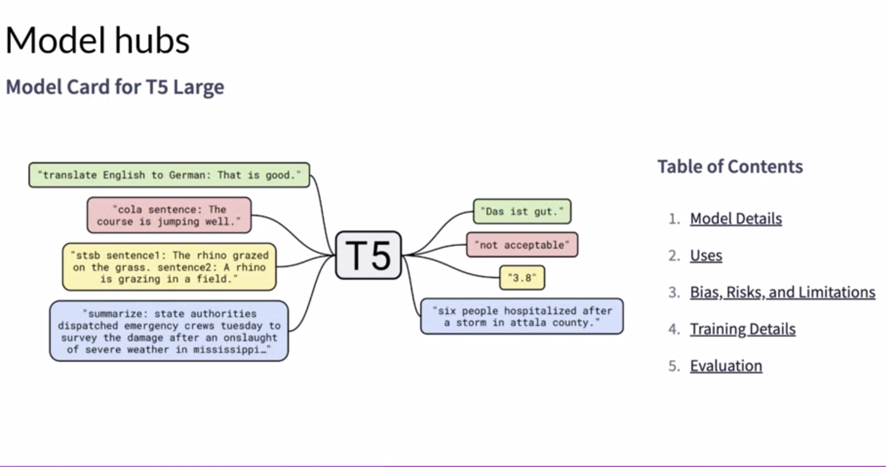

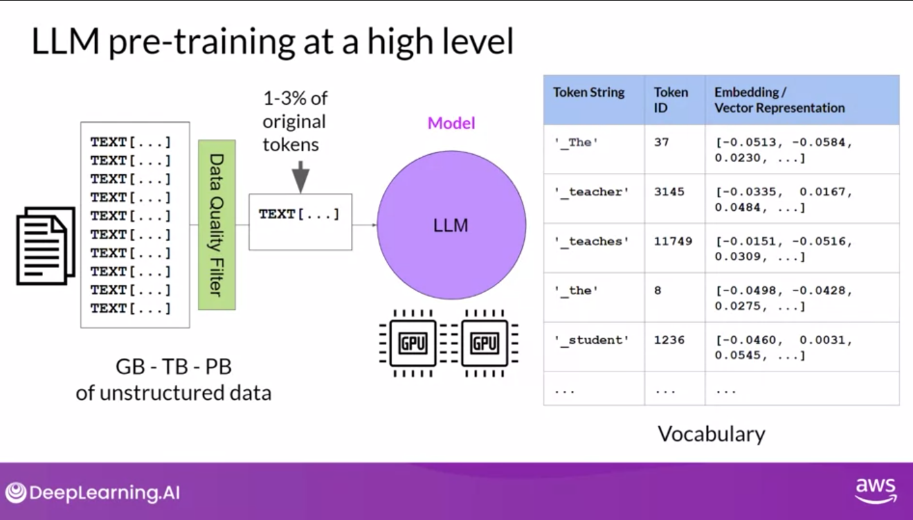

## Autoencoding models
- Encoder-only models, also known as autoencoders, are trained using Masked Language Modeling (MLM)
  - MLM is a type of self-supervised learning where the model is trained to predict a masked word in a sentence
- Have a bi-directional respresentation of the input sequence, therefore understands the context of the sentence
- Use cases: 
  - Sentement analysis
  - Named Entity Recognition
  - Word classification
- Example models:
  - BERT
  - RoBERTa

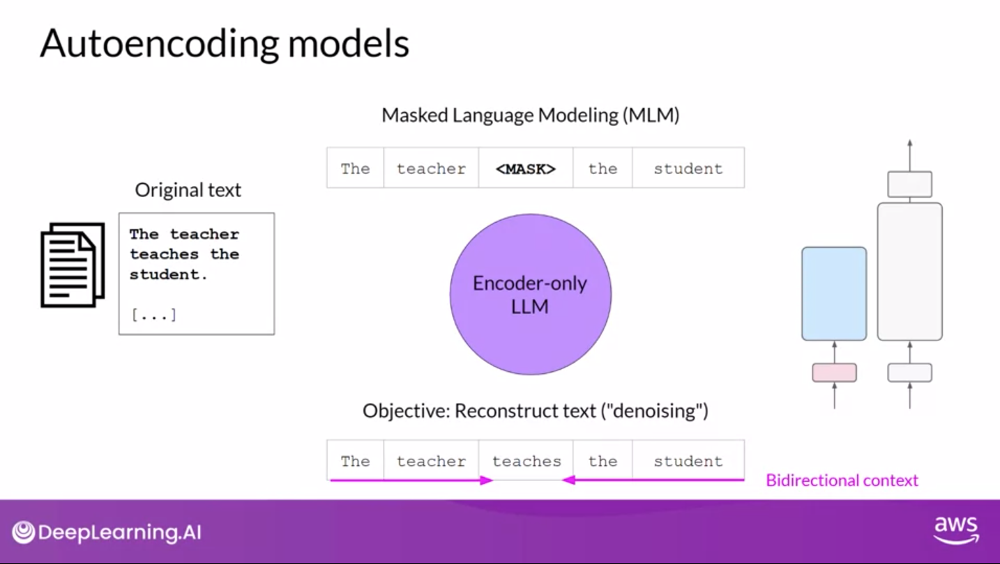

## Autoregressive models
- Decoder-only models, or Autoregressive models are trained using Causal Language Modeling (CLM)
  - CLM is a type of self-supervised learning where the model is trained to predict the next word in a sentence
    - Also known as 'Full Language Modeling' by researchers
  - Unlike autoencoder, autoregressive models are unidirectional
- Use cases:
  - Text generation
  - Other emergent behavior
    - Depends on model size
- Example models:
  - GPT
  - BLOOM
  
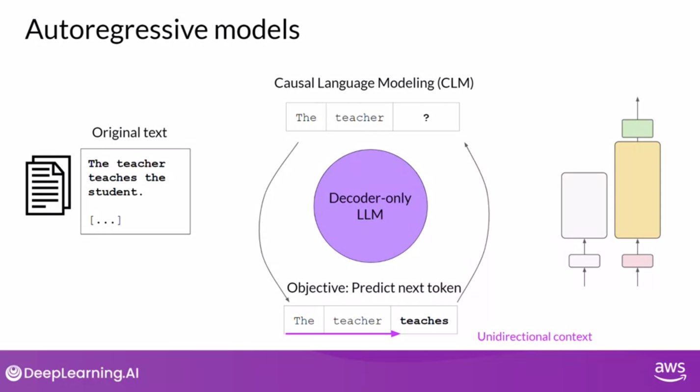

## Sequence-to-sequence models
- Encoder-Decoder models, or sequence-to-sequence models are trained in a model-dependent way 
  - For example, T5 trains via Span Corruption, which masks random spans of text that are replaced by a Sentinel token
    - Sentinel token is a special token that is added to the vocabulary but do not correspond to any actual word from the input text
- Use cases:
  - Translation
  - Summarization
  - Question Answering
- Example models:
  - T5
  - BART

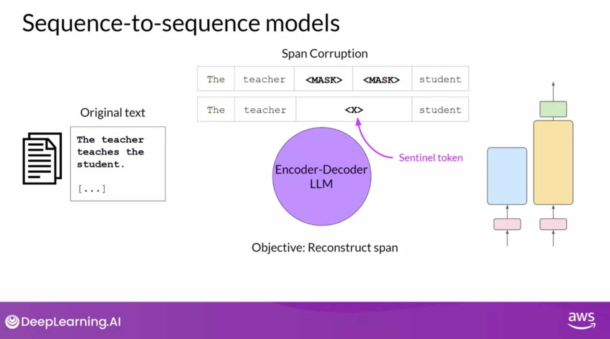

## Summary of pre-training models
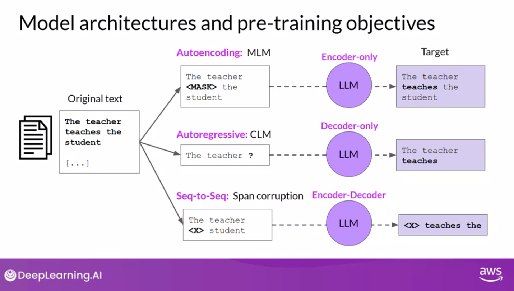

# Computational Challenges of training LLMs
- 1 parameter = 4 byes (32-bit float)
  - remember 1 byte = 8 bits
- 1 B parameter = 4E9 4 GB
- also:
  - Model Parameters (weights) - 4 bytes per parameter
  - Adam Optimizer (2 states) - 8 bytes per parameter
  - Gradients - 4 bytes per parameter
  - Activations and temp memory - 4 bytes per parameter
- Need about **6x** the memory in memory than needed on disk 
- 1B-params model needs 25GB (@ 32-bit full precision)
- Quantization - scalling a floating-point number to a smaller bit-size
  - BFLOAT16 - Brain Floating Point Format, an alternative format for floating-point numbers
    - BF16 is a hybrid between FP16 and FP32
    - FLAN-T5 uses BFLOAT16
- 175G Params = 4,200 GB of memory
- 500B Params = 12,000 GB of memory
- This traning require multi-GPU traning
  - Is expensive and another reason to use pre-trained models
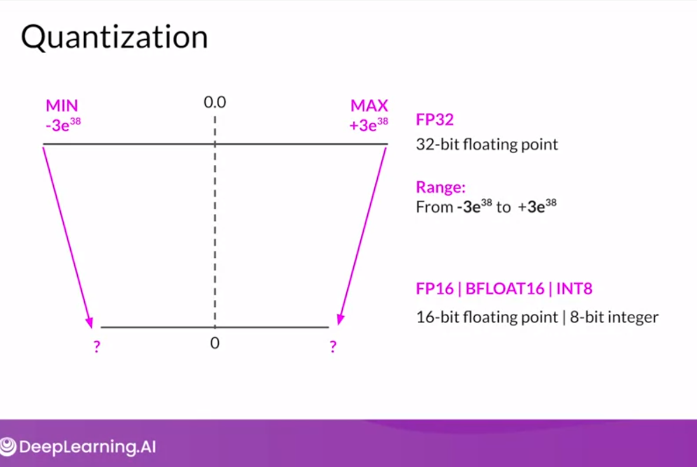

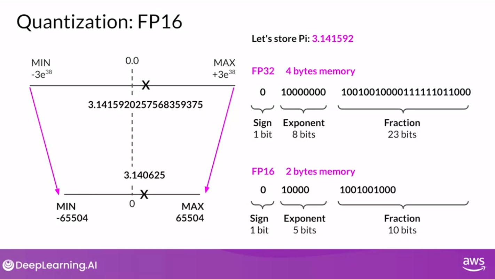

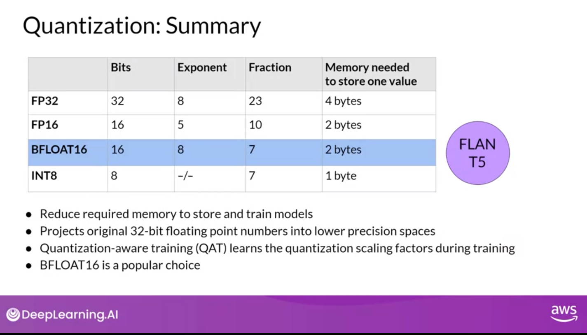

# Efficient multi-GPU training strategies
- Distributed Data Parallel (DDP)) - each GPU has a copy of the model and the data
  - Each GPU computes a forward and backward pass
  - Gradients are averaged across all GPUs
  - Each GPU updates its own copy of the model
  - Model and all weights, gradients, and activations are copied to each GPU, so if it doesn't fit in memory this is not a viable solution
  
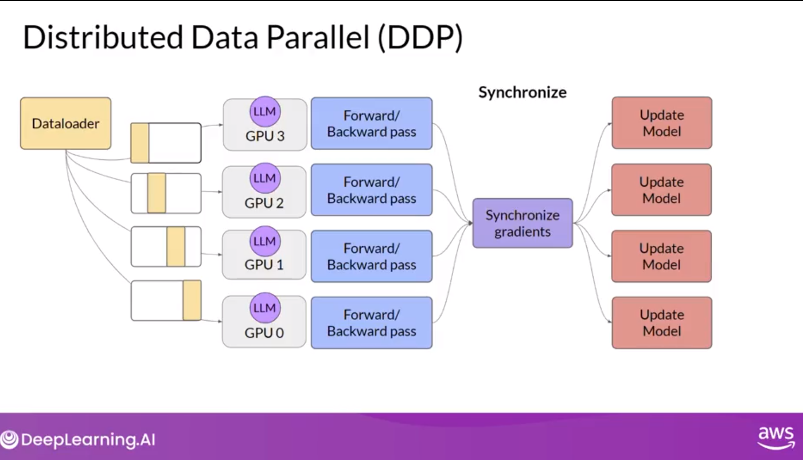

- Fully Shard Data Parallel (FSDP) - each GPU has a shard of the model and the data
  - Each GPU computes a forward and backward pass
  - Gradients are averaged across all GPUs
  - Each GPU updates its own shard of the model
  - Only the model and the gradients are copied to each GPU
  - This is more memory efficient than DDP
  - Based on ZeRO
    - Zero - Zero Redundancy Optimizer
      - Stage 1 - shards only optimzier states across GPUs
      - Stage 2 - shards optimizer states and gradients
      - Stage 3 - shards optimizer states, gradients, and parameters
    - With all stages, memory reduction is linear (e.g. sharding across 64 GPUs reduces memory by 64x)
  - can adust sharding from none, to full, or hybrid in between
  - can offload some to CPU
  
      
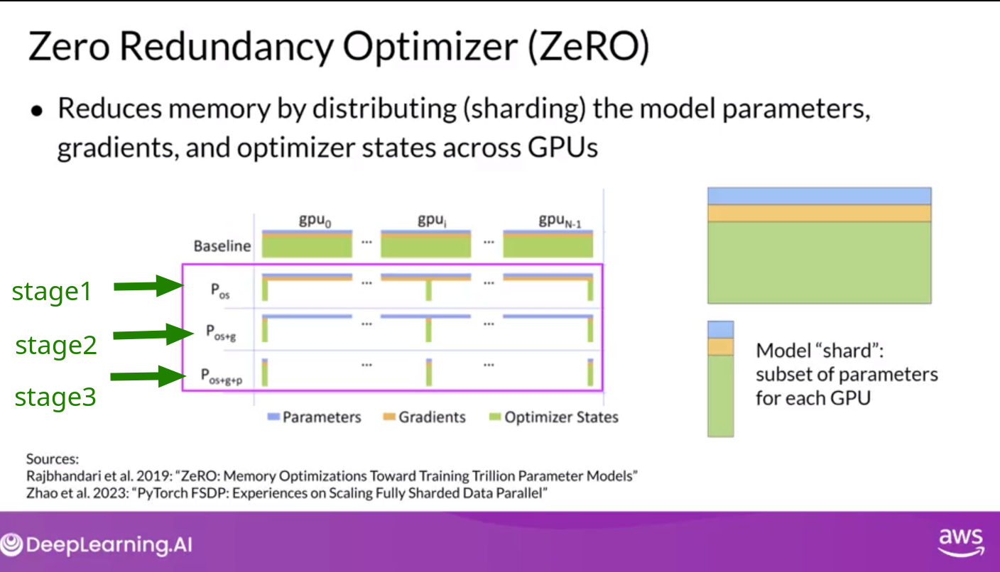

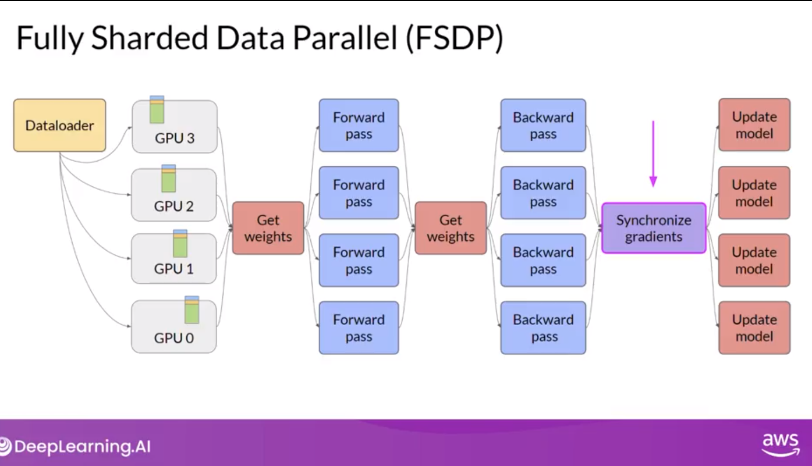

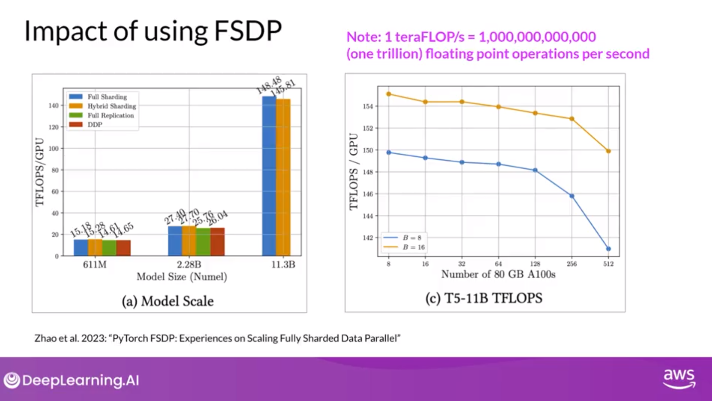

# Scaling laws and compute-optimal models
- When determining the feasbility of training your own LLM, compute budget is an important consideration
  - compute budget - the amount of compute resources available to train a model 
  - more time, more GPUs or faster GPUs all increase copute budget
- Compute budget is often described in terms of 'petaflop/s-days'
  - 1 petaflop = 1 quadrillion floating-point operations
  -  1 petaflop/s-day = 8 NVIDIA V100 GPUs for 1 day = 2 NVIDIA A100 GPUs for 1 day
- According to this rule-of-thumb and this data:

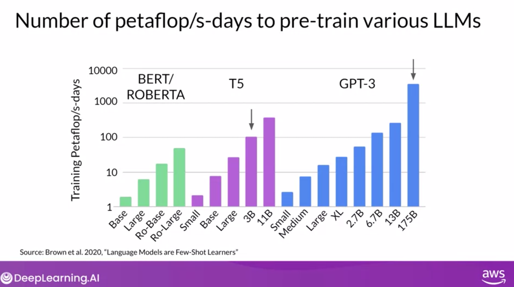

  We can see that to train GPT-3 (175 billion parameters) requires about 3700 Petflop/s-days. This would require 370 V100 GPUs running for 80 days.  As a rough calculation, on AWS a `p3.2xlarge` instance costs $3.06 per hour (consumer cost). So to train GPT-3 would cost about 27,100 USD over 80 days for a total of 2.1 million 

- Of course consumer prices for AWS machines are far more expensive than company bulk prices, and not all GPUs were using 100% FLOPS. Another estimate puts this cost at 4.6 million USD.

## Compute,Data, Model tradeoff
- Test loss scales logarithmically with compute budget 
- However, compute budget is usually a hard constraint

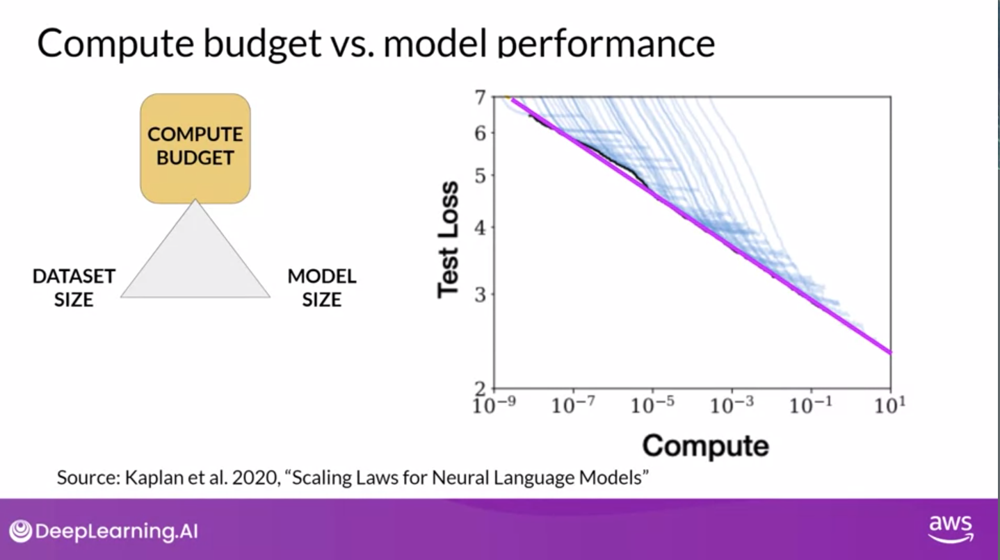

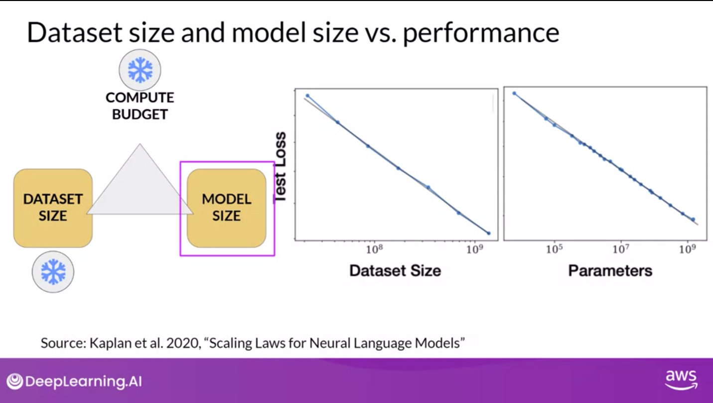

- *Chinchilla* paper discusses the optimal compute budget for a given model and data size
  - Named 'chinchilla' after the model which was an interation over 'ghoper' model
  - [https://arxiv.org/abs/2203.15556](https://arxiv.org/abs/2203.15556)
  - Argues that several models may be over-parameterized and under-trained
  - Optimal # of tokens should be 20x the # of parameters
  - GPT-3 may be under-trained and could have used more data

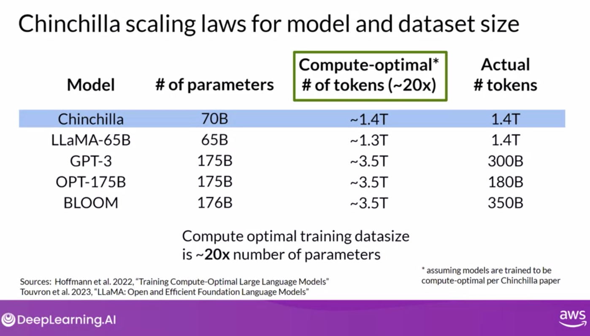

  - GPT-4 was trained over 13 billion tokens.  As a comparision some estimates put the entire internet at 600 billion words

# Pre-training for domain adaption
- Generally you will want to fine-tune a pre-trained model for your specific use case
- However, if you have a vocabularly that is not used in common language, you may need to pre-train a model from scratch
  - domain adapataion - training a model on a specific domain
- BloombergGPT is trained domain-specific 
  - 51 % finance and tax data - 363B tokens
  - 49 % general data - 345B tokens
  - also mostly Chinchilla Optimized, but they were data-constrained as their number of tokens is below the Chinchilla optimum for the compute budget and model size 
    - They only trained on 569B tokens because of early stopping
      - Early stopping - stopping training when model validation loss stops decreasing, to prevent overfitting 
  

# Review of BLOOM and other models
- BLOOM - BigScience Language Open-science Open-access Multilingual
  - 176B parameters
  - 70 layers, 112 attention heads per layers
  - 46 languages
  - 341 billion tokens
  - trained 18 weeks on 384 A100 80GB GPUs
- More info on BLOOM Model: 
  - https://bigscience.notion.site/BLOOM-BigScience-176B-Model-ad073ca07cdf479398d5f95d88e218c4
  - https://bigscience.huggingface.co/blog/what-language-model-to-train-if-you-have-two-million-gpu-hours

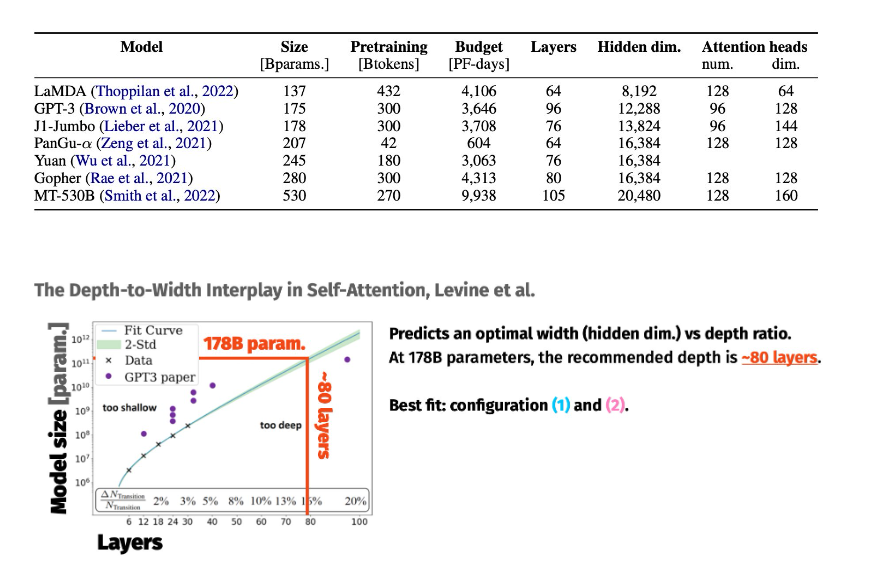

# Misc
- Paper: Language Models are Few-Shot Learners
  - https://arxiv.org/abs/2005.14165 
  - At a certain size, language models learn well from a few examples

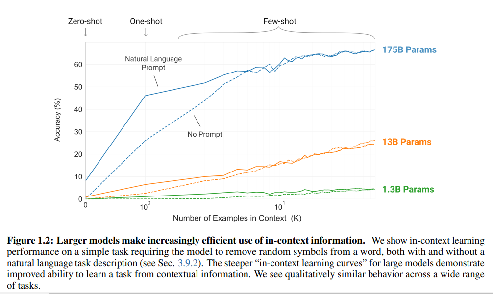