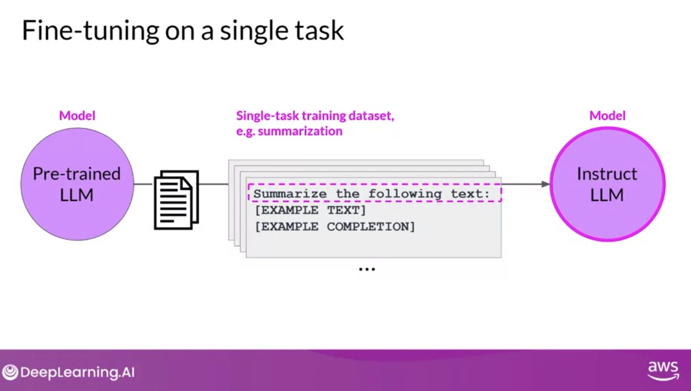
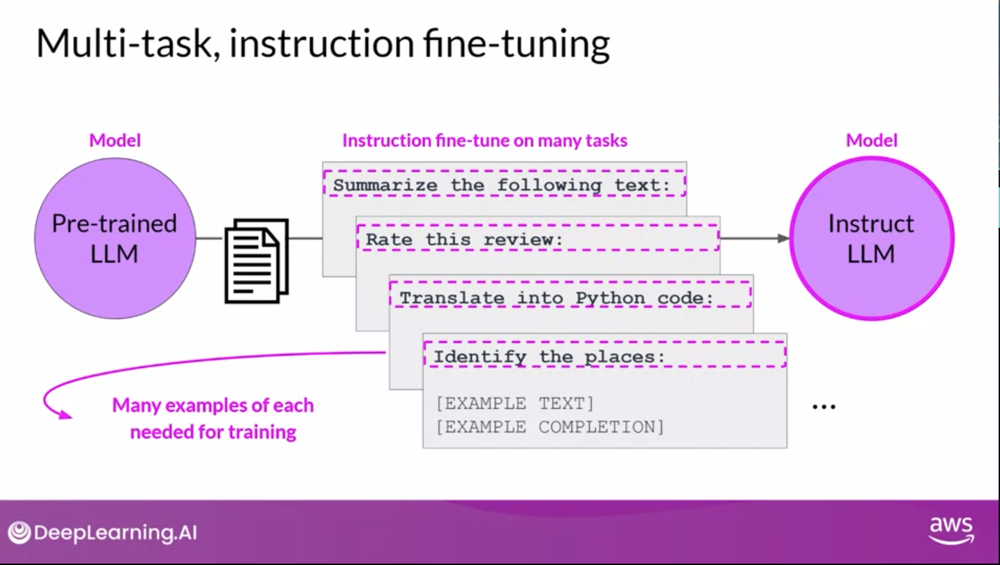
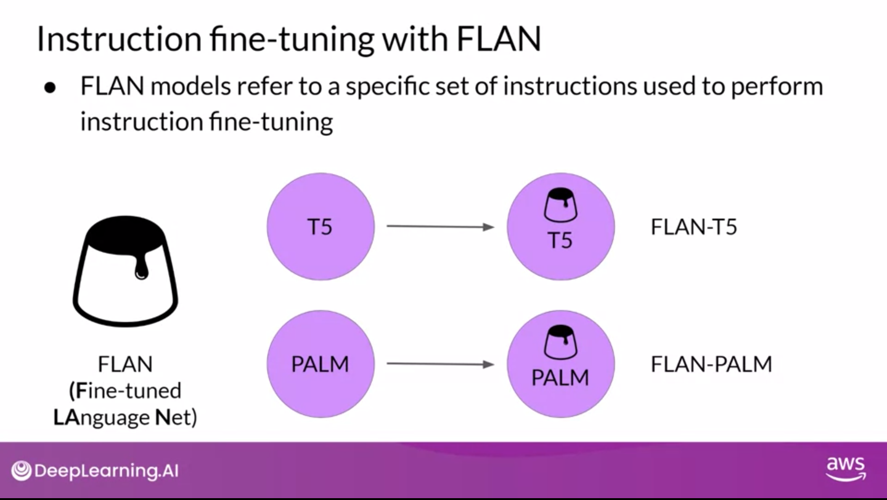

# Review
Ways to improve LLM performance for your task:
- **Pre-Training**: training a model from scratch on a large dataset
- **Inference Parameters**: adjusting parameters to improve performance
  - Not prameters or hypterprameters learned in training, but parameters that are set during inference
- **Prompt Engineering**: designing prompts to get the desired output
- **In-context learning**: training a model on a specific dataset to improve performance on a specific task
  - n-shot learning: training a model on n examples of a task
- **Fine-tuning**: additional training on an existing model to improve performance on a specific task(s)
  - Instruction fine-tuning: feeding task-specific dataset to pre-trained model and adjust parameters through backpropagation
  - Full fine-tuning: fine-tunning over all parameters  
  - PEFT: Parameter Efficient Fine-Tuning - trains over a subset of parameters to avoid catastrophic forgetting
  - 
- **Model Size**: larger models tend to perform better
- **RAG (Retrieval Augmented Generation)**: integrates external data for enriched responses
- **More Data** - more diverse data
- **Bigger Model** - more parameters

# Fine-tuning
- In-context learning can help a model but will often wont improve after 5 or 6 contextual examples
  - Also reduces the context window the more examples that are given
- PreTraining (Self-supervised) of LLMs is unsupervised in that no manual labels are applied.
  - However, given the structure of the language there is some inherent structure from the sentences that the model is learning from
  - Contrast with K-means where clusters cannot derive correct answers from the data itself
- Fine-tuning (Supervised) involves using manually labeled data
  - usually Prompt-completion pairs
- Fine-tuning process produces an 'instruct model'
- Fine-tuning via instruction--instruction fine-tuning--is the most common way to fine-tune a model

# Instruction Fine-tuning process
- Many examples can be scraped from data using templates
- Split into training, validation and test sets
- Compare completion with training data, calculate cross-entropy and update model weights in standard backpropagation
- Use validation set to calculate validation accuracy
- Use test set to calculate testing accuracy
- The resulting model is called an **instruct model** or 'instructed LLM'
- This is one of the most common ways to fine-tune a model, so much so that fine-tunning is often synonymous with instruction fine-tuning

# Fine-tuning on single task
- One can perform fine-tuning on a single task to improve performance
- Relatively small number of examples: 500-1000 are often all that are needed to make improvements
- Danger is Catastrophic forgetting -
  - ***Catastropic Forgetting** - when a model forgets how to do a task it was previously trained on
    - E.g. Fine tune on entity recoginition, and model forgets sentiment analysis
  - How to avoid catastropic forgetting:
    - May not need generality so it's fine to forget
    - Fine-tune on multiple tasks at the same time
    - Use regularization techniques that limit the amount of change that can be made to the weights of the model during training
    - Consider using Parameter Efficient Fine-Tuning
      -**Parameter Efficient Fine-Tuning**: (PEFT) a method that fine-tunes a model on a new task without forgetting the previous task

# Multi-task, instruction fine-tuning
- **Multi-task fine-tuning** train on multiple tasks to avoid catastrophic forgetting
- Requires more data. Maybe 50,000 to 100,000
- **Fine-tuned Language Net (FLAN)** - specific set of instructions used to fine-tuned model
  - Because FLAN is the last step of training process, authors referred to it as the 'metaphorical dessert' of the training process
  - FLAN-T5 is the FLAN insturct model of the T5 foundation model
  - FLAN-PALM is the FLAN instruct model of the PALM foundation model
- FLAN-T5 has been trained against 473 Datasets across 146 task categories
  - Full list of all task categories: https://github.com/google-research/FLAN/blob/main/flan/v2/flan_collection_info.csv

# FLAN - Fine-tuned Language Net
- Based on paper: https://arxiv.org/pdf/2210.11416
  - Google Authors
- Approach to instruction fine-tuning that uses
  - Scaling the number of tasks
  - Scaling the model size
- Fine-tuning on Chain-of-thought (CoT) data
  - **Chain-of-thought** - alternative setup to zero/n-shot tuning where the model is tuned on a
  step-by-step example rather than n examples 
- Used several benchmarks:
  - MMLU - Massive Multitask Language Understanding 
    - paper: https://arxiv.org/pdf/2009.03300
  - BBH - Big-Bench Hard 
    - site: https://github.com/suzgunmirac/BIG-Bench-Hard
    - paper:  https://arxiv.org/abs/2206.04615
    - Tasks that are believed to be beyond the scope of current language models
  - TyDiQA - Typologically Diverse Question Answering
    - site: https://arxiv.org/pdf/2003.05002
  - MGSM - Multilingual Grade School Math Benchmark
    - site: https://github.com/google-research/url-nlp/tree/main/mgsm
    - Paper: https://arxiv.org/abs/2210.03057
  - Current state of these benchmarks can be seen here:
    https://paperswithcode.com/sota/multi-task-language-understanding-on-mmlu
  - Reminder who makes which models:
    - Gemini - Google
    - Claude - Anthropic
    - Inflection - Inflection
    - Grok - xAI
    - LLAMA - Meta
    - GPT-4 - OpenAI
    - PALM - Microsoft
    - Qwen - Alibaba
    - Falcon - TII (Technology Innovation Institute in Abu Dhabi)
    - T5 - Google
    - GPT - OpenAI
    - BERT - Google
    - RoBERTa - Facebook
    - PALM - Microsoft
  - OpenSource Benchmarks can be seen here: https://huggingface.co/spaces/HuggingFaceH4/open_llm_leaderboard
  

# Model Evaluation
- **ROUGE** - Recall-Oriented Understudy for Gisting Evaluation
  - Used for text summarizaiton 
  - Compares a summary to one or more reference summaries
  - ROUGE-N: compares n-grams
    - ROUGE-1: unigrams
      - Doesn't consider ordering and only individual words.
  - ROUGE-L: Longest Common Subsequence
    - Considers the longest common subsequence of words between the generated summary and the reference summary
  - Rouge Clipping - Limit the count of matches to the maximum count for the unigram in the reference
- **BLEU** - Bilingual Evaluation Understudy
  - Used for text translation
  - Compares to human-generated tranlsations
  - Is an average precision across a range of n-gram sizes
    - Is provided by libraries such as HuggingFace
- These are good for diagnositic evaluation, not final evaluation. For final evaluation use researcher-created benchmarks.
  

  

# Benchmark
- Glue - General Language Understand Evaluation
  - Introduced in 2018
  - Natural Language Tasks (e.g Sentiment analysis, Question Answering, etc)
  - Leaderboard: https://gluebenchmark.com/leaderboard/
- SuperGlue - Super General Language Understanding Evaluation
  - Introduced in 2019
  - Multi-sentence reasoning, Reading comprehension
  - Leaderboard: https://super.gluebenchmark.com/leaderboard/
- BigBench - Big Bench Hard
  - Introduced in 2022
- MMLU - Massive Multitask Language Understanding
  - Introduced in 2021
- HELM - Human Evaluated Language Model
  - Evolving set of metrics
  - Includes Toxicity, Factuality, etc