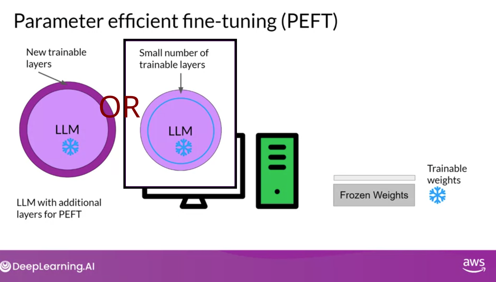
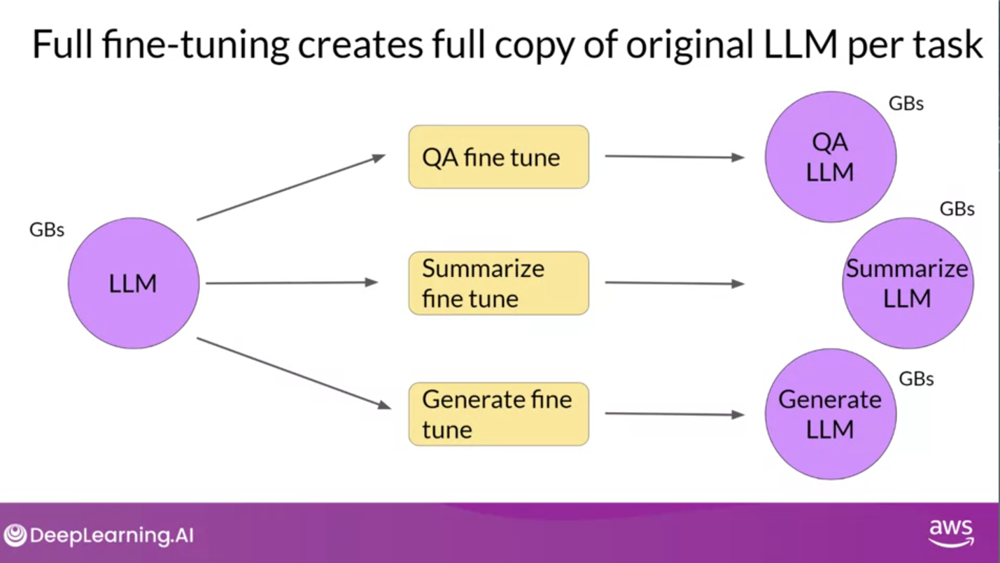
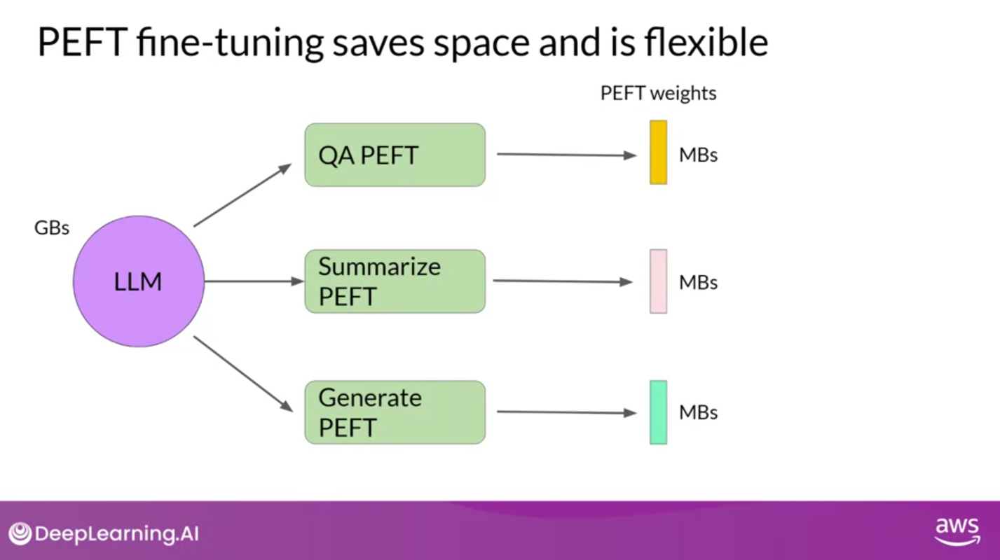
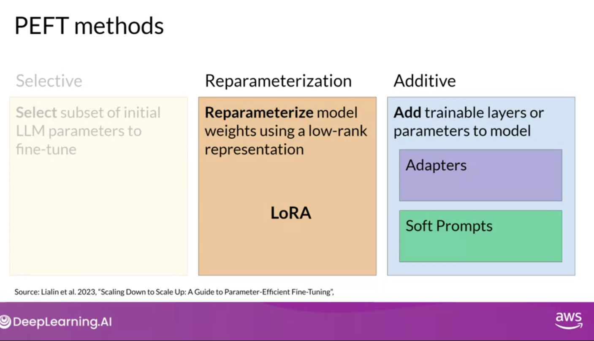
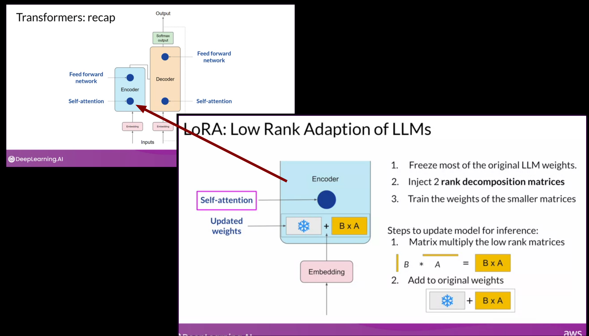
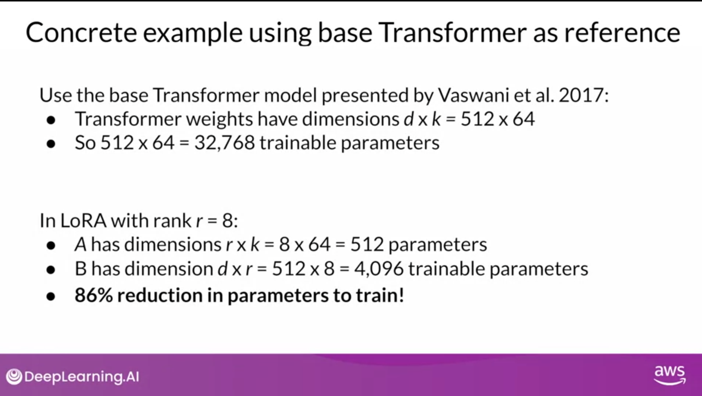
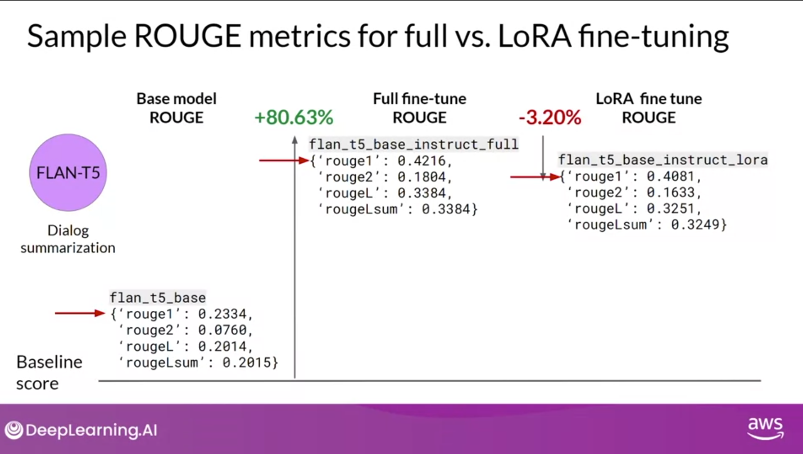
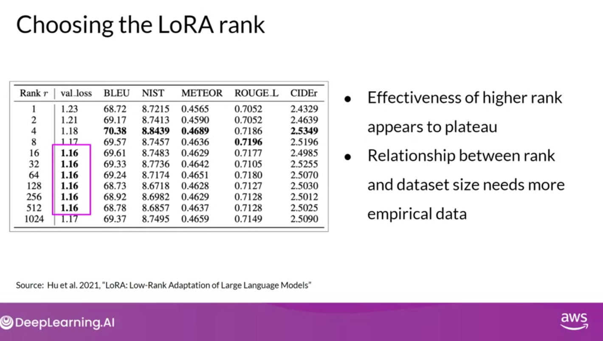

# Parameter Efficient fine-tuning (PEFT)

## Full fine-tuning of large LLMs is challenging
- Like pre-training models full fine-tuning large LLMs are challenging
  - Memory must be allocated for weights, optimizer states, gradients, forward activations, and temporary memory
  - weights alone can be 100s of gigabytes for the largest models
  - can be 12-20x the size of the weights

## Parameter Efficient Fine-Tuning (PEFT)
- Unlike full fine-tuning PEFT trains over a subset of parameters
  - One method: freeze most of model weights and fine tune a subset of existing model parameters (e.g. layers or components)
  - Or: don't touch any weights but add a small number of new parameters to the model to train
- Because trained parameters is 10-15% of original parameters, memory requirements are much lower
  - PEFT can often be done on a single GPU
  - Less prone to catastrophic forgetting

## PEFT Methods
 - Selective -  subset of initial LLM parameters to fine-tune
 - Reparameterization - model weights using a low-rank representation 
   - LORA is an example
 - Additive - add trainable layers or parameters to the model 
   - Adapters - add new trainable layers to arcitecture of the model typically inside the encoder or decoder after attention
   or feedforward layers
   - Soft prompt tuning - keep architecture fixed and frozen and focus on manipulating the input 
   - Prompt Tuning as an example

# Low-Rank Adaptation of Large Language Models (LORA)
- Version of reparamterization method of PEFT
- Process
  - Training
    - 1. Freeze most of the original LLM Weights
    - 1. Inect 2 rank decomposition matrices
    - 1. Train the weights of the smaller matrices
  - Inference
    - 1. Multiple the low rank matrices
    - 1. Add to orginal weights 
- Can use this process with the feed-forward layers, but attention layers (where most parameters are) is probably enough 
- Can reduce the number of parameters by 86%
- Can use this method for multiple tasks
- Rank size of 4-32 seem optimal

 