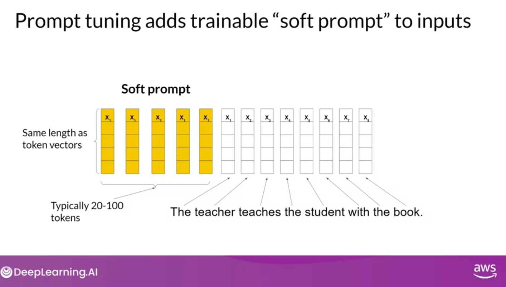
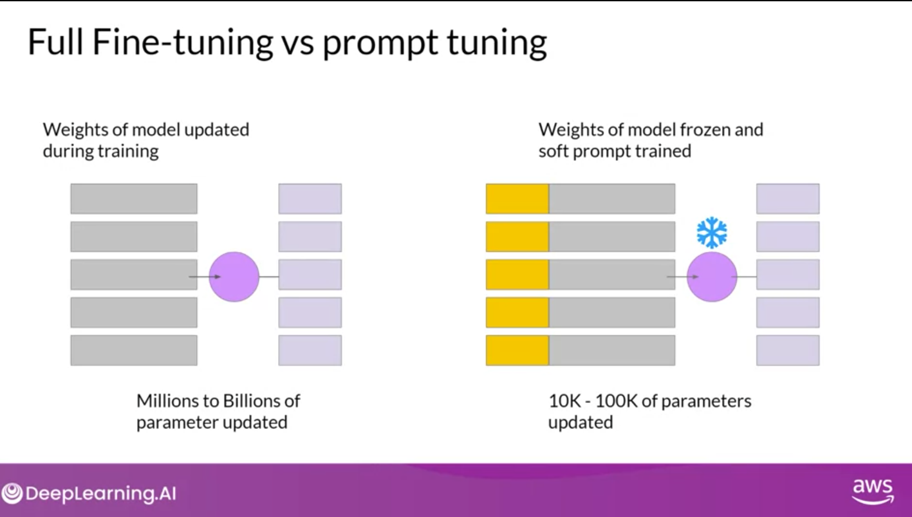
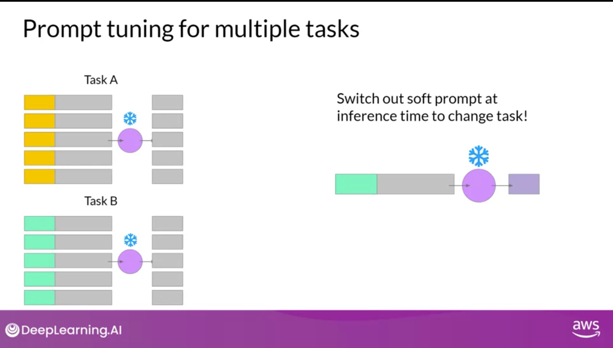
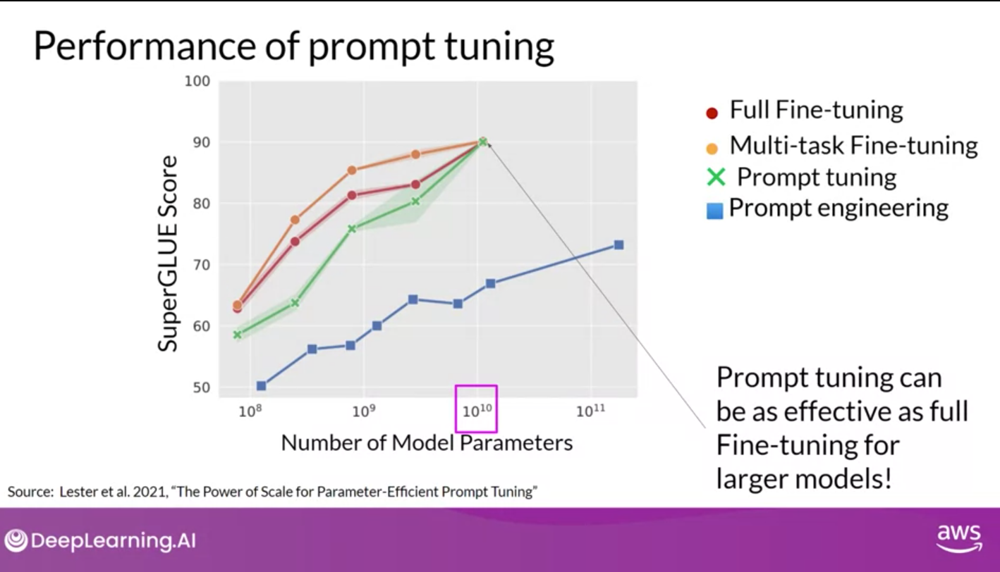

# Parameter Efficient fine-tuning (PEFT)

As a review: Ways to improve LLM performance for your task:

- **More Data** - more diverse data
- **Bigger Model** - more parameters
- **Pre-Training**: training a model from scratch on a large dataset
- **Inference Parameters**: adjusting parameters to improve performance
  - Not prameters or hypterprameters learned in training, but parameters that are set during
    inference
  - E.g. temperature, top-k, top-p, etc
- **Prompt Engineering**: designing prompts to get the desired output
- **In-context learning**: training a model on a specific dataset to improve performance on a
  specific task
  - n-shot learning: training a model on n examples of a task
- **Fine-tuning**: additional training on an existing model to improve performance on a specific
  task(s)
  - Instruction fine-tuning: feeding task-specific dataset to pre-trained model and adjust
    parameters through backpropagation
    - When you think 'fine tuning' think 'instruction fine-tuning'
  - Methods:
    - Full fine-tuning: fine-tunning over all parameters
    - PEFT: Parameter Efficient Fine-Tuning - trains over a subset of parameters to avoid
      catastrophic forgetting
      - Selective - subset of initial LLM parameters to fine-tune
      - Reparameterization - model weights using a low-rank representation
        - LORA - Low-Rank Adaptation of Large Language Models
      - Additive - add trainable layers or parameters to the model
        - Adapters - add new trainable layers to architecture of the model typically inside the
          encoder or decoder after attention or feed-forward layers
        - Soft prompt tuning - keep architecture fixed and frozen and focus on manipulating the
          input
- **Reinforcement with human feedback**: use human feedback to improve model performance
- **RAG (Retrieval Augmented Generation)**: integrates external data for enriched responses

## Full fine-tuning of large LLMs is challenging

- Like pre-training models full fine-tuning large LLMs are challenging
  - Memory must be allocated for weights, optimizer states, gradients, forward activations, and
    temporary memory
  - weights alone can be 100s of gigabytes for the largest models
  - can be 12-20x the size of the weights

## Parameter Efficient Fine-Tuning (PEFT)

- Unlike full fine-tuning PEFT trains over a subset of parameters
  - One method: freeze most of model weights and fine tune a subset of existing model parameters
    (e.g. layers or components)
  - Or: don't touch any weights but add a small number of new parameters to the model to train
- Because trained parameters is 10-15% of original parameters, memory requirements are much lower
  - PEFT can often be done on a single GPU
  - Less prone to catastrophic forgetting

 

## PEFT Methods

There are several different approaches to PEFT:

- Selective - subset of initial LLM parameters to fine-tune
  - Performance is mixed, and significant trade-offs, so usually not the best choice
- Reparameterization - model weights using a low-rank representation
  - LORA is an example
- Additive - add trainable layers or parameters to the model
  - Adapters - add new trainable layers to architecture of the model typically inside the encoder or
    decoder after attention or feed-forward layers
  - Soft prompt tuning - keep architecture fixed and frozen and focus on manipulating the input
  - Prompt Tuning as an example

## PEFT Technique 1: Low-Rank Adaptation of Large Language Models (LORA)

- As a review of transformer pretrianing
  - Text is tokenized
  - Tokens are converted to embeddings
  - Embeddings are passed into Encoder and/or Decoder layers
  - There are two kinds of neural networks in both encoder and decoder components
    - Attention layers
    - Feed-forward layers
  - The weights of these layers are learned during pre-training
    - Most weights are in the attetion layers
  - Embedding vectors are fed into self-attention layers to get attention scores
- Version of reparamterization method of PEFT
- Process
  - Training
    - 1. Freeze most of the original LLM Weights
    - 1. Inect 2 rank decomposition matrices
    - 1. Train the weights of the smaller matrices
  - Inference
    - 1. Multiple the low rank matrices
    - 1. Add to orginal weights
- Can use this process with the feed-forward layers, but attention layers (where most parameters
  are) is probably enough
- Can reduce the number of parameters dramatically with not much impact on perforance
- Can use this method for multiple tasks
- Rank size of 4-32 seem optimal

 

## PEFT Technique 2: Prompt tuning

- Prompt tuning is not Prompt engineering
  - Prompt engineering - change the language prompt (e.g. words, phrases, or examples for one or
    few-shot inference) to try and produce better results
    - Often requires a lot of manual effort to write and try different prompts
    - Limited by context window
  - Prompt tuning - adding additional trainable tokens to prompt and let learning determine optimal
    values
    - **soft prompt** - set of trainable token
    - soft prompt tokens same length as embedding vectors of the language tokens
    - Language tokens are hard and fixed in the embedding space
    - Soft prompts can take on any value anywhere in the embedding space
    - Learner finds values for these soft prompt a given task
    - You can switch out soft prompts at inference time to change task
    - Prompt tuning have performed as well as full fine-tuning for large model sizes

