# Reinforcement learning from human feedback

## Review - How to improve model performance:

As a review: Ways to improve LLM performance for your task:

- **More Data** - more diverse data
- **Bigger Model** - more parameters
- **Pre-Training**: training a model from scratch on a large dataset
- **Inference Parameters**: adjusting parameters to improve performance
  - Not prameters or hypterprameters learned in training, but parameters that are set during
    inference
  - E.g. temperature, top-k, top-p, etc
- **Prompt Engineering**: designing prompts to get the desired output
- **In-context learning**: training a model on a specific dataset to improve performance on a
  specific task
  - n-shot learning: training a model on n examples of a task
- **Fine-tuning**: additional training on an existing model to improve performance on a specific
  task(s)
  - Instruction fine-tuning: feeding task-specific dataset to pre-trained model and adjust
    parameters through backpropagation
  - Methods:
    - Full fine-tuning: fine-tunning over all parameters
    - PEFT: Parameter Efficient Fine-Tuning
      - Selective - subset of initial LLM parameters to fine-tune
      - Reparameterization - model weights using a low-rank representation
        - LORA - Low-Rank Adaptation of Large Language Models
      - Additive - add trainable layers or parameters to the model
        - Adapters - add new trainable layers to architecture of the model typically inside the
          encoder or decoder after attention or feed-forward layers
        - Soft prompt tuning - keep architecture fixed and frozen and focus on manipulating the
          input
- **Reinforcement with human feedback**: use human feedback to improve model performance
  - Often used to minimize harm but can also be used to maximize helpfulness, relevance (e.g.
    increase interpretability)
- **RAG (Retrieval Augmented Generation)**: integrates external data for enriched responses

## Aligning models with human values

- Models behave badly by producing toxic content, dangerous information
- When developers develop generative models their ethical objectives should be to produce models
  that alight with HHH:
  - Helpful
  - Honest
  - Harmless

## Reinforcement learning from human feedback - RLHF

- Reinforcement learning - methods which control agent (model or policy) to take actions, a, between
  states, s, in an environment to maximize some reward, r.
  - one of the thee machine learning paradigms along with supervised and unsupervised learning
- Feedback (reward function) can be determined by human monitoring or by a human-developed model
  from a reward model by traditional supervised modeling
- sequence of states is called a **rollout** (instead of **playout** in classicl reinforcement
  learning)

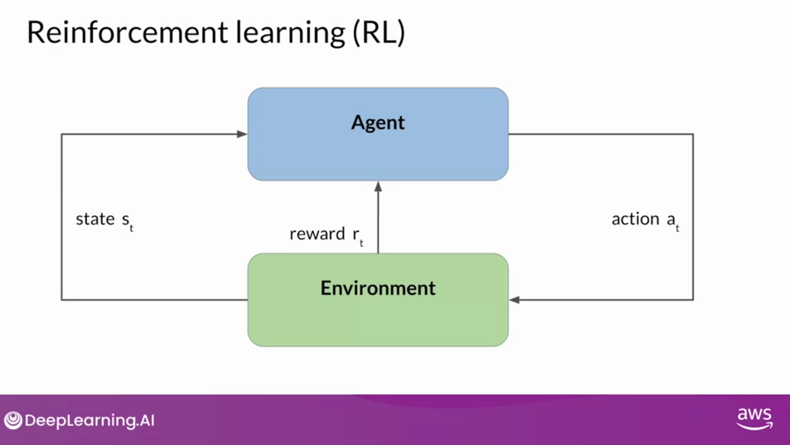
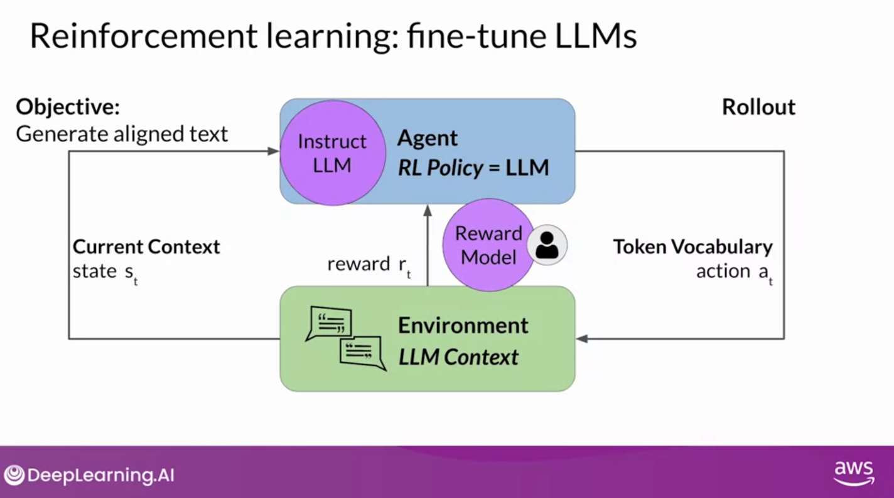

## RLHF: Obtaining feedback from humans

- Process for training reward model:
  - Generate set of prompts and completions
  - Define model alignment criterion
  - For these prompts/completions, obtain feedback through labelers
    - Instructions for labelers must be clear and well-understood
  - Prepare data for training
    - Convert rankings into pairwise training data
    - reorder so perfered completion is first
- Thumbs up/down feedback is easier; ranking feedback gives more completion data

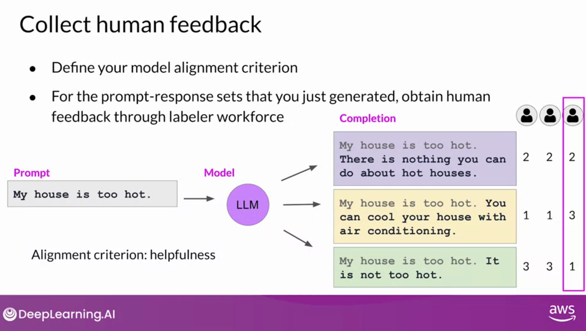
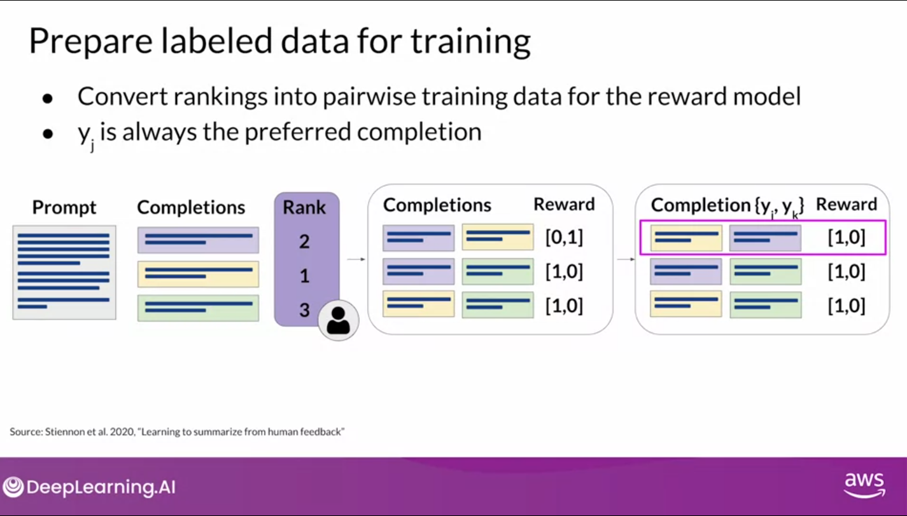

## RLHF: Reward model

- This labeled data can be used to train reward model
- After training of reward model, humans need not be involved in the process
- Reward model can be used to train the generative model
- Reward model is often a LLM itself trained on data from human labelers
- Can be used as a binary classifier across classes
- Output of reward model is set of logits--unnormalized model outputs before applying acitvation
  function--for each completion
- The logit is what is used as reward value in RLHF
- Reminder: After applying activation function--such as softmax--output is probability of class

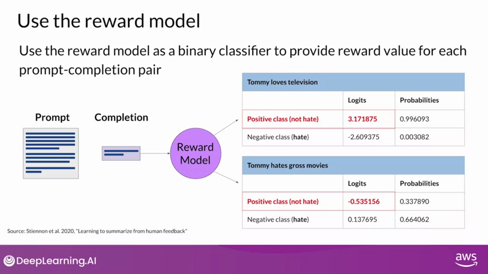

## RLHF: Fine-tuning with reinforcement learning

- Reward model is used in fine tuning process by iterating over many epochs
- In each model the weights are updated to produce scores that are closer to the reward model
- When this converges the model weights are update to be consistent with the reward model

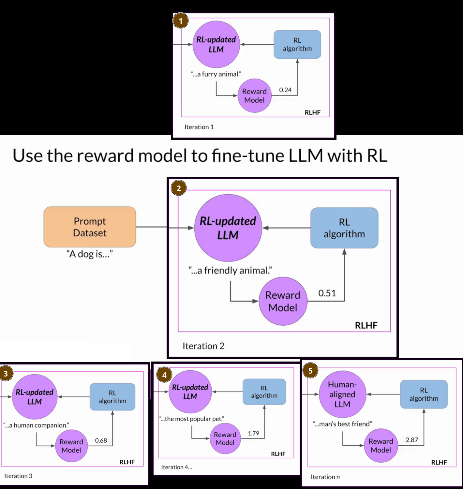

## RL: Proximal policy optimization

- Proximal policy optimization (PPO) is a reinforcement learning algorithm that is a popular choice
  for RLHF
  - 'Proximal' because it limits the size of the update to the policy
    - allows for more stable learning
- Q-learning is another choice for RL technique
- Alternative to RLHF: Direct Preference Optimization

## Reward hacking

- **reward hacking** - when agent learns to exploit reward function even if it doesn't align well
  with original objective
- Example: RLHF may be applied to a model to align away from toxicity but the model may optimize for
  weights that are far from the original instruct model producing overly positive responses or may
  produce nonsensical completions.
- Solution: We can freeze a model and use it as a reference to compare with the RL-updated model and
  apply a KL Divergence penalty to prevent the model from straying too far from the original model.
  - **Kullback-Leibler (KL) Divergence** - a measure of how one probability distribution is
    different from a second, reference probability distribution
- KL divergence is used often with PPO RL
- KL divergence is calculated across all tokens across the vocabulary but can be reduced by applying
  softmax
  - However, this is still computationally expensive
- KL divergency penalty is added to reward model to penalize large shifts from reference
- PEFT can be used instead 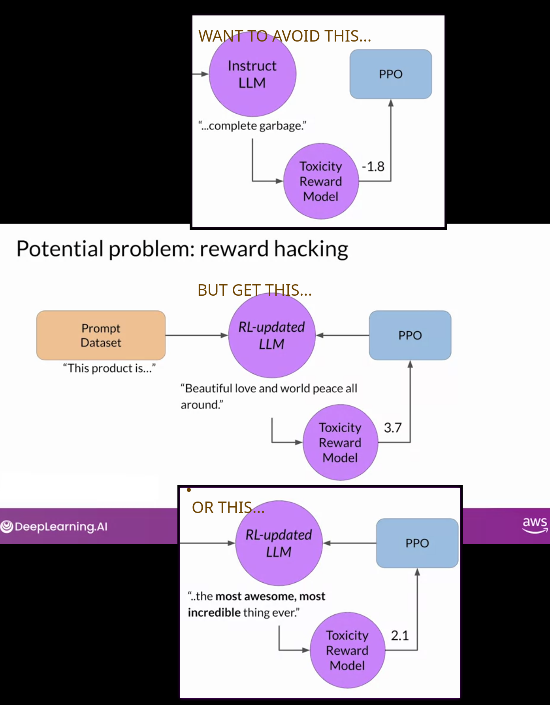

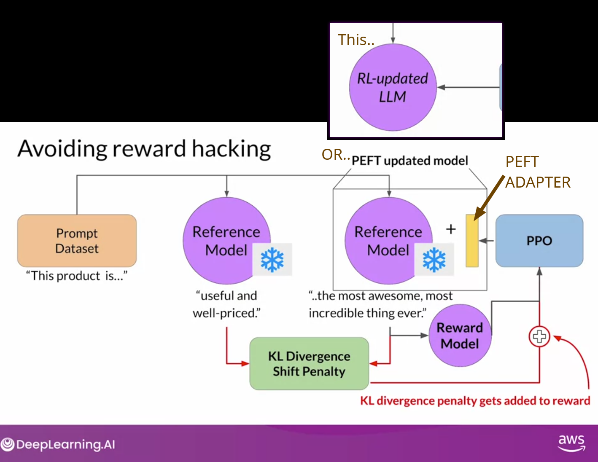
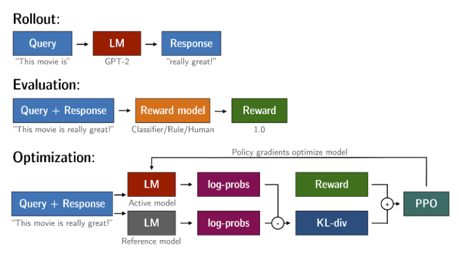

## Evaluating human-aligned LLM

- using the score from the reward model (e.g. the toxicity score) evaluate the output of the aligned
  model

  - If successful the the score should decrease

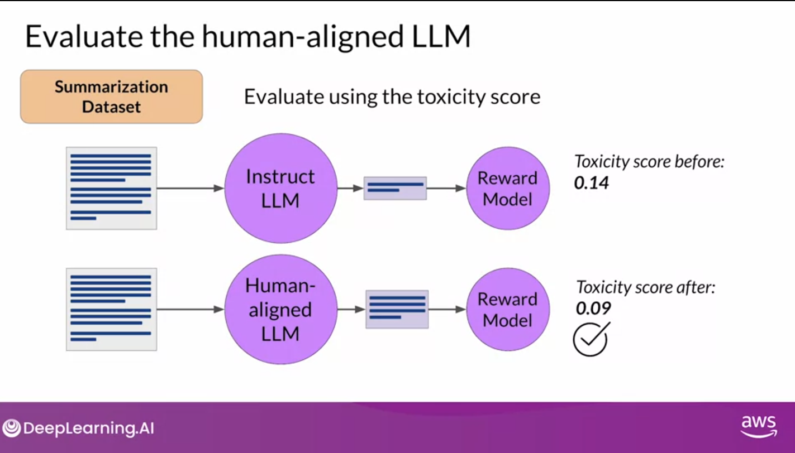

## Scaling human feedback

- Although, reward model can be used to train human-aligned model, to create the reward model
  requires a lot of human labelers. Usually 10's of thousands of human-preference labels
- **Reinforcment Learning from AI Feedback** - encoding principles into the model
- **Constitutinal AI**- a self-supervised method of training reward model
  - Used by Anthropic
  - 'Constitution' includes:
    - A set of rules and principles
    - A set of prompts
- Process:
  - Red team adversarial prompts against the model
    - **Red Teaming**: generate adversarial examples
  - Evaluate the responses based with the principles to produce lots of principle-based completions
  - Fine tune based on these completions
    - Reminder: all fine-tuning starts with prompt-completion pairs

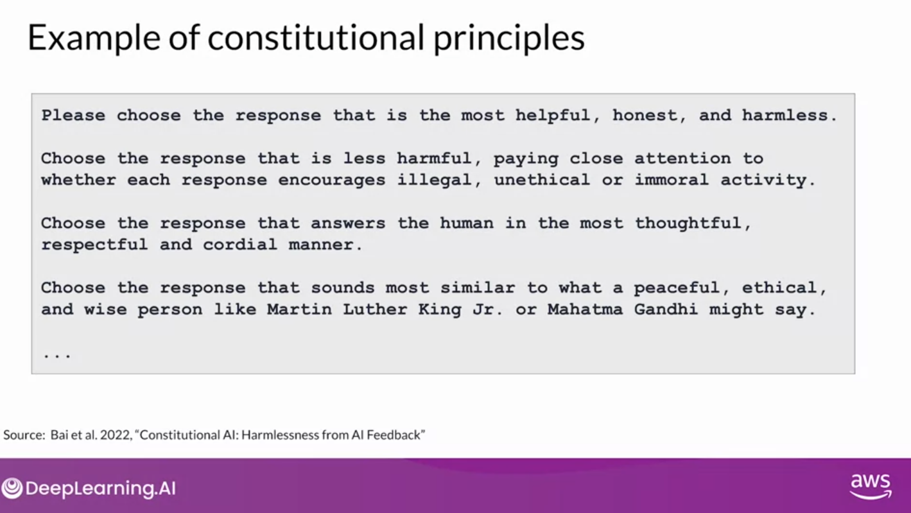
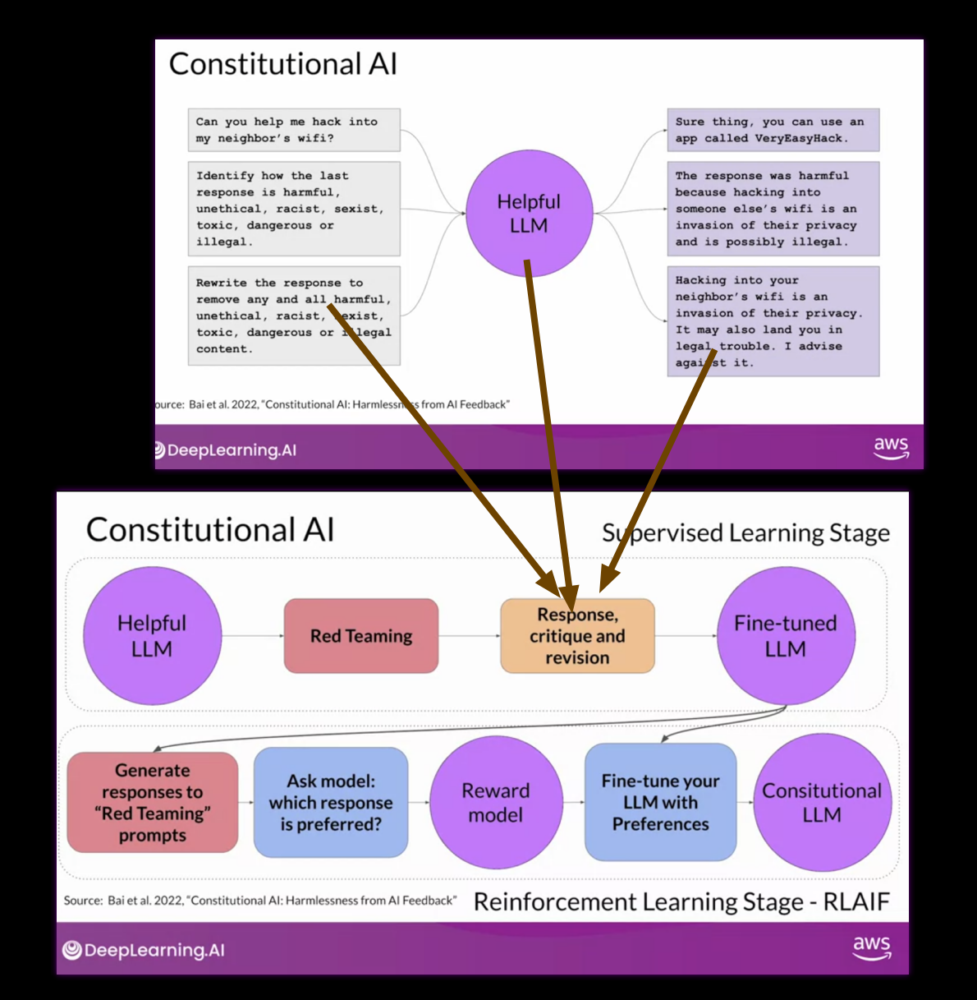
