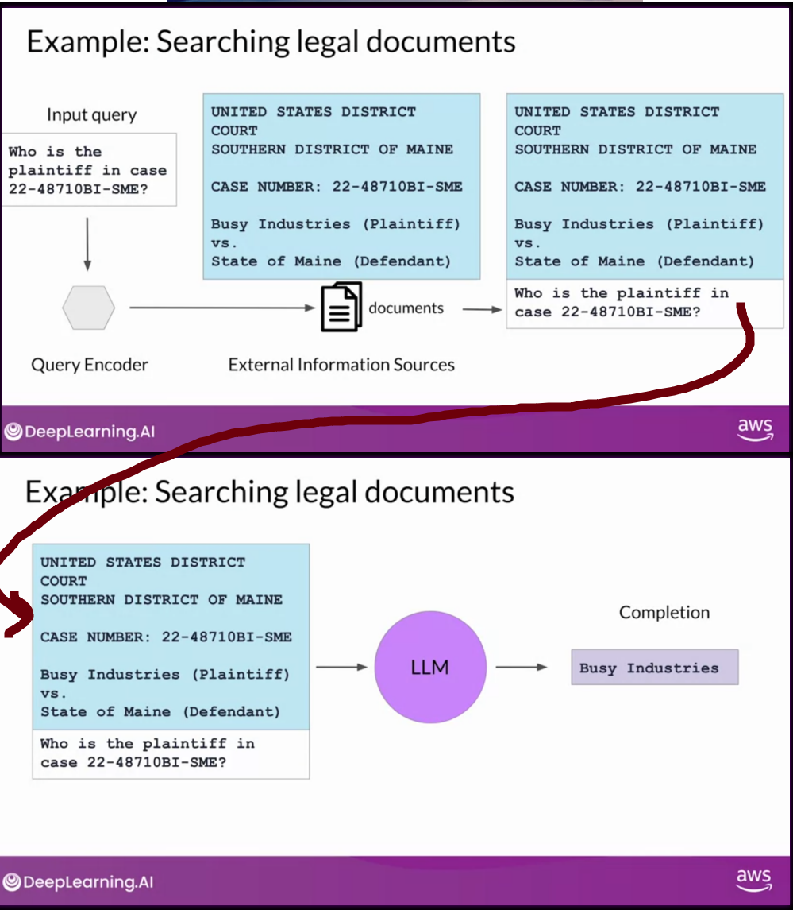

## Review - How to improve model performance:

As a review: Ways to improve LLM performance for your task:

- **More Data** - more diverse data
- **Bigger Model** - more parameters
- **Pre-Training**: training a model from scratch on a large dataset
- **Inference Parameters**: adjusting parameters to improve performance
  - Not prameters or hypterprameters learned in training, but parameters that are set during
    inference
  - E.g. temperature, top-k, top-p, etc
    - temperature - controls the randomness of the output, by controling the shape of the softmax
      distribution
    - top-p sampling - samples from the top p tokens (where p is a probability threshold the tokens
      do not exceed)
    - top-k sampling - samples from the top k tokens (where k is a number of tokens to sample from)
- **Prompt Engineering**: designing prompts to get the desired output
- **In-context learning**: training a model on a specific dataset to improve performance on a
  specific task
  - n-shot learning: training a model on n examples of a task
- **Fine-tuning**: additional training on an existing model to improve performance on a specific
  task(s)
  - Instruction fine-tuning: feeding task-specific dataset to pre-trained model and adjust
    parameters through backpropagation
  - Methods:
    - Full fine-tuning: fine-tunning over all parameters
    - PEFT: Parameter Efficient Fine-Tuning
      - Selective - subset of initial LLM parameters to fine-tune
      - Reparameterization - model weights using a low-rank representation
        - LORA - Low-Rank Adaptation of Large Language Models
      - Additive - add trainable layers or parameters to the model
        - Adapters - add new trainable layers to architecture of the model typically inside the
          encoder or decoder after attention or feed-forward layers
        - Soft prompt tuning - keep architecture fixed and frozen and focus on manipulating the
          input
- **Reinforcement with human feedback**: use human feedback to improve model performance
  - Often used to minimize harm but can also be used to maximize helpfulness, relevance (e.g.
    increase interpretability)
  - Remember, 3 models in this process:
    - Reference model - the model that is being improved
    - Reward model - the model that provides feedback to the reference model
    - Human-aligned LLM - the improved model
  - Process:
    1. Generate prompts and responses
    1. Get humans to rate the responses based on some desired criteria
    1. Train a separate LLM to produce a reward model on the human ratings
    1. Use the reward model to provide feedback to the reference model to produce the aligned model
- Makes performance worse but helpful: Compression/optimization/deployment
- **RAG (Retrieval Augmented Generation)**: integrates external data for enriched responses

## Model Optimizations For Deployment

- Reducing size of LLM allows for quicker loading and reduced latency
- There are trade-offs for accuracy and performance
- Three methods:
  - Distillation
  - Quantization
  - Pruning

### Distillation

- **Distillation** - process of training a smaller model to mimic the behavior of a larger model
- Student model is trained based on the results of the teacher model
- Process:
  - Start with original LLM and generate a smaller model (student model)
  - Freeze Teacher weights are frozen
  - Pass training data to teacher model and generate completions (**soft labels**)
  - Pass training data to studen tmodel and generate completions (**soft predictions**)
  - Minimize **distillation loss** between the two models, updating the prameters in the student
    model
    - uses probability distribution over teach models softmax layer to calculate the loss
    - add temperature parameter to softmax function
  - In parallel, you also train the student model to genreate correct predictions based on ground
    truth training data
    - loss between hard predictions and hard labels is **student loss**
- Distillation more effective for encoder only models such as BERT which have a lot of
  representation redundancy

### Quantization

- **Quantization** - process of reducing the number of bits that represent a number
- Unlike Distillation which doesnt change the size of the original model (a new model is trained)
  Quantization reduces the size of the original model
- Quantization can be done in two ways:
  - Quantization-aware training (was introduced earlier)
  - Post-training quantization (PTQ)
- Reduces weights to reduced precision (such as 16-bit floating point or 8 bit integer)

### Pruning

- **Pruning** removing model weights with values close or equal to zero
- May include full model retraining but also includes techniques such as PEFT/LoRA, or post-training
  methods
- In theory reduces model size and improves performance but in practice may not always be the case
  if small percent of weights are close to zero

## Generative AI Project Lifecycle Cheatsheet

## Using the LLM in applications

- Models can have some inherent limitations:
  - Out of Date
  - Wrong (math)
  - Hallucination
- An orchtestration library, such as LangChain, can be used to

### Interacting with external data sources - Retrieval augmented generation (RAG)

- Although models can be constantly retrained to remain current this is very expensive and time
  consuming. As an alternative we can give the models resources to stay current by allowing to
  access other systems
- **Retrieval augmented generation (RAG)** - a method that integrates external data for enriched
  responses
  - provides data not included in training at inference-time
  - Also can be proprietary knowledge stored in organizations private databases
  - Oringally published under:
    - Lewis et al. 2020 "Retrieval-Augmented Generation for Knowledge-Intensive NLP Tasks"

- Integrates with many types of data soruces
  - Documents
  - Wikis
  - Expert Systems
  - Web pages
  - Databases
  - Vector Store (e.g. Pinecone)

- Data preparation considerations:
  - Data must fit inside context window
    - Solution: split long sources into short chunks (LangChain can do this for you)
  - Data must be in a format that allows its relevance to be accessed and inference time (i.e.
    embedding vectors)
    - vector databases are a particular representation of a vector store
    - a key will allow for providing citations along with the response

## Interacting with external applications

- LLMs can be made to inetgrate with external applications (usually through APIs)
- The prompts and completion are the heart of the workflows and provide the reasoning for these
  workflows. So the LLM's prompt-completion is the reasoning engine.

## Helping LLMs reason and plan with chain-of-thought

- First: model size needs to be sufficiently large to handle complex reasoning tasks
- LLMs have difficulty with complex reasoning and planning
- One way to improve reasoning of models is to help the model think like a human
- By introducing chain-of-thought examples to the prompt, the model can be guided to think in a
  logical manner and often produce better results

## Program-aided language models (PAL)

- Chain-of-thought can help with planning but will probably not help with math calculations
- **Program-aided language models (PAL)** - A in-context learning method which supplies code as part
  of the prompt to pass as a program to an external application (e.g. python interpreter) to
  calculate the answer and inject back into the completion

 

## ReAct: Combining reasoning and action

- **ReAct (Synergizing Reasoning and Actions in LLMs)** - framework for assisting LLMs with
  reasoning and planing tasks
  - Original paper: "ReAct: Synergizing Reasoning and Actions in Language Models" by Yao et al. 2022
    - Develops series of complex prompting examples using Hot Pot QA--a multi-step question
      answering benchmark that requires reasoning over two or more Wikipedia passages--and Fever--a
      fact verification benchmark that uses Wikipedia to verify facts.
- ReAct shows structured examples on how to reason through a problem
- Process:
  - A Question, thought, Action, Observation structured example prompt is developed

## LangChain

- **LangChain** - a a framework to build LLM powered applications by chaining interoperable
  components
- Several LangChain components can be used to chain together tasks to develope complex applications

## LLM application architectures

## Ongoing research:

- Model interpretability
- Constitutional AI
- Scale models:
  - UP: GPT-5
  - Down: llama.cpp - C++ implmentation of LLaMA, with 4-bit quantization that can fit ona laptop
- Predict performance
- More efficiencies across model development lifecycle
  - pre-training
  - reinforcment learning
- Bigger context windows
- Multi-modality
- LLM reasoning
- Neuro-symbolic AI - combining traditional symbolic AI
