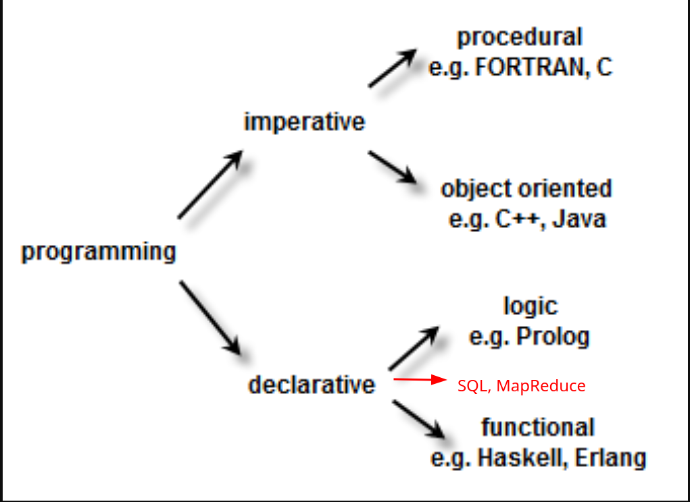

# Testing is good for:

- Make you a better programmer:
  - Defining pre and post conditions (all the if statements which restrict the input)
    - Can come formally from requirements
- Watch for regressions
- - Important for refactoring

# Unit Testing SQL?

- Not common because SQL is a declarative language
  - Declarative language: you tell the computer what you want, not how to do it
  - Imperative language: you tell the computer how to do it
    - Remember: as in Imparative sentence: "Go to the store and buy some milk"

# Testing Pyramid

- More tests at the bottom, fewer tests at the top
- Bottom runs faster; Top runs slower

# Types of Testing

- **Unit Testing**: testing individual functions or methods
- **Component Testing**: testing an entire component
- **Integration Testing**: testing the interaction between components
- **System Testing**: testing the entire system
- **Acceptance Testing**: testing the system against the requirements
- **Regression Testing**: testing the system after changes to ensure that no new bugs have been
  introduced
- **Load Testing**: testing the system under heavy load
- **Stress Testing**: testing the system under extreme conditions
- **Performance Testing**: testing the system's performance
- **Security Testing**: testing the system's security
- **Sanity Testing**: testing the system to ensure that it works after code changes
- **Smoke Testing**: testing the system to ensure that it works (critical functionalities)

- **Edge Case**: a test case with a unique condition (that often leads to a bug)
- **Corner Case**: a test case with multiple unique conditions

# Testing methodolgies

- **Specification-based Testing**: testing the system against the specification (oten UML or some
  requiements as testing input)
  - Found more in formal software development
- **TDD - Test-driven development**: writing tests before writing the code
  - Contriversal method. Some say it's hard to write tests first without knowing some amount of
    solution
    - This group will write code first, then quicly write tests
- **Behavior-driven development (BDD)**: a variation of TDD that focuses on the behavior of the
  system
  - It's possible to write agile user stories that feed directly into testing framework
    - See Cucumber.
    - Also more for traditional software development

# Code Coverage

- **Code Coverage**: the percentage of code that is executed by a test suite
  - Code Coverage should not be desired for it's own sake
  - Dumb tests can have 100% coverage, but dumb tests are almost worse than no tests.

# Mocks, Stubs, and Fakes

- **Mock**: an object that simulates the behavior of a real object
  - E.g. a mock database, web service, file system without testing against the real one
- **Stub**: a simple object that returns a hard-coded value
- **Fake**: a simple object that returns a hard-coded value and has some logic
- Pro Tip: Create an interface that will avoid mocking unit tests

# Big point: know why you're doing your testing. Each case is different:

- Stable API?
- Complex Algorithm?
- Data Science?
- Refactoring?

- **Black Box Testing**: testing the system without knowledge of the internal workings
- **White Box Testing**: testing the system with knowledge of the internal workings
