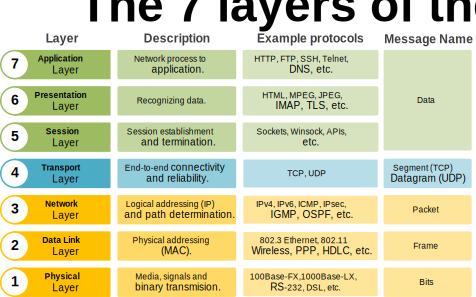

# Network Connection Diagnosis

This is best described as a **layered divide-and-conquer diagnostic workflow**.
It is **inspired by the OSI model**, but in practice it is not a strict textbook
"up the stack" or "down the stack" exercise. It is a practical workflow for
isolating the **first failing dependency**.

## OSI review



The OSI model is the classic 7-layer way to think about communication:

| Layer | Name         | What it covers                          | Common examples                                   |
| ----- | ------------ | --------------------------------------- | ------------------------------------------------- |
| 7     | Application  | User-visible protocols and app behavior | HTTP, HTTPS, DNS, SMTP, PostgreSQL, MySQL         |
| 6     | Presentation | Encryption, encoding, representation    | TLS, SSL, JSON, ASCII, UTF-8                      |
| 5     | Session      | Session setup and connection state      | RPC sessions, NetBIOS sessions, API session state |
| 4     | Transport    | End-to-end transport, ports, retries    | TCP, UDP                                          |
| 3     | Network      | Routing between networks                | IP, ICMP                                          |
| 2     | Data Link    | Local delivery on a subnet              | Ethernet, MAC, ARP, switching                     |
| 1     | Physical     | Signals, cables, radio, hardware        | copper, fiber, Wi-Fi radio                        |

In day-to-day troubleshooting, layers 5-7 are often collapsed together, and
layer 6 is usually where people conceptually place **TLS**.

### What these protocol examples mean

- **HTTP / HTTPS**: application protocols for web requests and responses
- **DNS**: application protocol for translating names into IP addresses
- **SMTP**: application protocol for sending email
- **PostgreSQL / MySQL**: application protocols spoken by database clients and
  servers
- **TLS / SSL**: presentation-layer encryption that protects higher-layer data
  in transit
- **JSON / ASCII / UTF-8**: data representation and encoding formats
- **TCP / UDP**: transport protocols; TCP is connection-oriented and reliable,
  UDP is connectionless and lightweight
- **IP**: network-layer addressing and routing between networks
- **ICMP**: network control protocol used for messages like ping and unreachable
- **Ethernet / MAC / ARP**: local-link protocols and addressing inside a subnet

### Concrete layering example

When you open `https://example.com`, the data is conceptually wrapped like this:

```text
Layer 7  Application:   HTTP GET /index.html
Layer 6  Presentation:  TLS encrypts the HTTP message
Layer 5  Session:       session state / connection context
Layer 4  Transport:     TCP src port 51514 -> dst port 443
Layer 3  Network:       IP 10.28.104.121 -> 93.184.216.34
Layer 2  Data Link:     Ethernet frame src MAC -> dst MAC
Layer 1  Physical:      bits on wire / fiber / radio
```

Another useful example for database troubleshooting:

```text
Layer 7  Application:   PostgreSQL query or startup message
Layer 6  Presentation:  TLS protects the PostgreSQL bytes
Layer 4  Transport:     TCP src port -> dst port 5432
Layer 3  Network:       IP src address -> dst address
Layer 2  Data Link:     Ethernet frame or Wi-Fi frame
Layer 1  Physical:      bits on copper / fiber / radio
```

### What "fits inside" what

At the lowest useful level, the computer sends **bytes**. The receiver
interprets the first bytes as one protocol header, then uses fields in that
header to decide how to interpret the next bytes.

So for HTTPS, it is clearer to say:

```text
[Ethernet header][IP header][TCP header][TLS bytes][HTTP bytes]
```

Conceptually, an HTTP request like:

```text
GET /index.html HTTP/1.1
Host: example.com
```

becomes:

```text
Layer 2 Ethernet
  dst-mac: 00:11:22:33:44:55
  src-mac: aa:bb:cc:dd:ee:ff
  type: IPv4
  payload:
    Layer 3 IP
      src: 10.28.104.121
      dst: 93.184.216.34
      proto: TCP
      payload:
        Layer 4 TCP
          src-port: 51514
          dst-port: 443
          flags: ACK,PSH
          payload:
            Layer 6 TLS
              record-type: application_data
              payload:
                Layer 7 HTTP
                  GET /index.html HTTP/1.1
                  Host: example.com
```

## Home network mental model: Layer 2 vs Layer 3 vs Layer 4

Very roughly in home-network terms:

- **cable modem / ONT**: physical or provider-edge handoff
- **switch**: mostly Layer 2
- **home router / pfSense / UniFi gateway**: mostly Layer 3, often with Layer 4
  firewalling and NAT
- **wireless access point**: Layer 2 bridge for Wi-Fi clients, even though it
  feels like a "router" to many users

So when network people say things like:

- "That is a **Layer 2** problem" -> same-subnet switching / ARP / VLAN issue
- "That is a **Layer 3** problem" -> routing / gateway / subnet / IP
  reachability issue
- "That is a **Layer 4** problem" -> port, TCP, UDP, firewall, stateful
  inspection issue

## Private vs public IPs

When you resolve a hostname, ask whether the returned IP is **private** or
**public**.

Private IPv4 ranges are:

- `10.0.0.0/8`
- `172.16.0.0/12` (`172.16.x.x` through `172.31.x.x`)
- `192.168.0.0/16`

If a hostname resolves to one of those ranges, it is using a **private IP**.
Anything outside those ranges is generally **public**.

Examples:

- `10.28.x.x` -> private
- `172.28.x.x` -> private
- `172.37.x.x` -> **not** RFC1918 private, but can still be an internally routed
  enterprise range
- `3.x.x.x`, `54.x.x.x`, `98.x.x.x` -> public

So in enterprise environments, distinguish between:

- **RFC1918 private**: standard private address space
- **internal/non-public organizational range**: not internet-routable in
  practice, but not one of the standard RFC1918 blocks

## Core Network Diagnosis method

1. **Resolve the name**
2. **Open the socket**
3. **Negotiate the protocol**
4. **Authenticate**
5. **Exercise the application**
6. **Compare working and failing paths**
7. **Inspect cloud/network controls at the first failing layer**

For real troubleshooting, people often collapse this into a simpler progression:

1. **Name resolution**
2. **IP reachability**
3. **TCP port reachability**
4. **Application behavior**

Diagnose connectivity by checking layers **selectively and in dependency
order**, then stopping at the **first failing layer**. Do not jump to passwords,
SQL, or app logic before proving DNS, TCP, and protocol behavior.

| Layer          | Question                                                                  | Commands                                                                                                                         |
| -------------- | ------------------------------------------------------------------------- | -------------------------------------------------------------------------------------------------------------------------------- |
| DNS            | Does the hostname resolve, and to what IPs?                               | `getent hosts HOST`, `nslookup HOST`, `dig HOST`                                                                                 |
| ICMP           | Is the host pingable? Useful only if ICMP is allowed.                     | `ping -c 3 HOST`                                                                                                                 |
| TCP            | Can I open the destination port?                                          | `nc -vz HOST PORT`, `timeout 5 bash -lc '</dev/tcp/HOST/PORT'`                                                                   |
| TLS / protocol | Does the endpoint behave like the expected service after connect?         | `openssl s_client -connect HOST:443 -servername HOST`, `openssl s_client -connect HOST:5432 -starttls postgres -servername HOST` |
| Service client | Can a real client connect far enough to fail or succeed meaningfully?     | `curl -I --max-time 8 URL`, `psql "host=HOST port=5432 dbname=DB user=USER sslmode=require connect_timeout=5"`                   |
| Auth           | Are credentials or permissions the problem?                               | inspect service/client error text, IAM, secrets, app config                                                                      |
| App            | Is the application using the expected host, port, protocol, and settings? | app config, saved connection settings, app logs                                                                                  |

## AWS API workflow

The same layer-by-layer method applies to AWS service connections, but the
checks are usually:

1. **DNS**
   - does `service.region.amazonaws.com` resolve to private or public IPs?
2. **HTTPS reachability**
   - can the client reach port `443`?
3. **TLS / HTTP response**
   - does `curl` or the SDK get any response at all?
4. **AWS auth**
   - are IAM credentials, STS, signing, and permissions valid?
5. **Dependent services**
   - is another AWS API in the chain failing, such as Glue, STS, or S3?

This is how you can discover patterns like:

- one AWS endpoint resolves private
- another resolves public
- both are on `443`, but only one path is usable

In that case, the issue may not be "Athena is broken." The issue may be that a
**dependency in the AWS API chain is taking the wrong network path**.

## Exact commands for a live layered diagnostic demo

These are good live-demo commands because they work on many Linux machines
without custom infrastructure.

### Main example: `example.com`

This is a **practical troubleshooting order**, not strict numeric OSI order. In
practice, you often check:

1. **DNS first** even though it is Layer 7, because nothing else works if the
   name does not resolve
2. **Layer 3 reachability** next
3. **Layer 4 TCP**
4. **Layer 6 TLS**
5. **Layer 7 HTTP**

```bash
# Setup: pick a hostname for the demo
HOST=example.com
```

```bash
# Step 1: Layer 7 DNS lookup -> prerequisite dependency when connecting by hostname
# Often this talks to a DNS server, not the final target server
getent hosts "$HOST"
```

```bash
# Step 2: Layer 3 ICMP reachability -> quick sanity check, but not very reliable
# Many hosts and firewalls block ICMP, so failure here is ambiguous
ping -c 3 "$HOST"
```

```bash
# Step 3: Layer 4 TCP -> low-level test to see if the port is reachable and open
# Success means something accepted the TCP connection, not that the full service works
# 0 = successfully opened
timeout 5 bash -lc "</dev/tcp/$HOST/443"
echo $?
```

```bash
# Step 4: Layer 6 TLS -> does the endpoint actually complete a TLS handshake?
# This proves more than "port open"; it shows the service is speaking TLS here
# This only applies when the service actually uses TLS or a TLS upgrade path
# This is common for web traffic and many modern encrypted services
# SSH and SFTP use SSH encryption, not TLS, so they will not respond with a TLS handshake
# Plain FTP or non-SSL PostgreSQL will also need other clients
openssl s_client -connect "${HOST}:443" -servername "$HOST" < /dev/null | sed -n '1,12p'
```

```bash
# Step 5: Layer 7 HTTPS -> HTTP on top of the working TLS connection
# This checks that the endpoint is not just doing TLS, but is actually speaking HTTP over it
curl -I --max-time 8 "https://$HOST"
```

For Step 5, you often switch to a **protocol-specific client** depending on the
service you are testing.

| Port / protocol     | Common client tool     |
| ------------------- | ---------------------- |
| `443` / HTTP(S)     | `curl -v https://HOST` |
| `5432` / PostgreSQL | `psql ...`             |
| `22` / SSH          | `ssh -v HOST`          |
| `3306` / MySQL      | `mysql ...`            |
| `6379` / Redis      | `redis-cli ...`        |

## Hex and packet inspection examples

These are useful when you want to show what bytes look like on the wire.

### Bits and bytes reminder

- a **bit** is a `0` or `1`
- a **byte** is **8 bits**
- 8 bits gives `2^8 = 256` possible values, so one byte ranges from **0 to 255**
- the same byte can be displayed in different ways:
  - binary: `01000001`
  - hex: `41`
  - decimal: `65`
  - ASCII: `A`

Practical reminder:

- internet speeds are usually advertised in **bits per second**
  - for example, **1 gigabit per second (1 Gbps)**
- file sizes and disk space are usually discussed in **bytes**
  - for example, **gigabytes (GB)**

So a rough conversion is:

- **divide by 8** to go from bits to bytes
- `1 Gbps` is roughly `0.125 GB/s`, or about `125 MB/s`

### Hex + ASCII view of a plaintext HTTP request

```bash
printf 'GET / HTTP/1.1\r\nHost: example.com\r\n\r\n' | hexdump -C
```

How to read it:

- left column = byte offset
- middle = bytes in hex
- right = ASCII rendering when printable
- `.` usually means "not printable ASCII"

### Watch live packets while generating traffic

In one terminal:

```bash
sudo tcpdump -i any -s0 -X port 443
```

In another terminal:

```bash
curl -v https://example.com
```

Notes:

- `tcpdump -X` shows **hex + ASCII**
- for HTTPS, much of the payload will look unreadable because it is encrypted
- for plaintext protocols, the ASCII side may be easier to read

## Interpretation

- **DNS fails** -> name resolution / private DNS / endpoint issue
- **TCP fails** -> routing / SG / NACL / firewall / listener issue
- **TCP works, TLS/protocol fails** -> handshake / proxy / cert / protocol issue
- **TLS works, auth fails** -> credentials got far enough to matter
- **Auth works, app fails** -> schema / query / application issue

## Cloud debugging follow-up

After finding the first failing layer, inspect the cloud objects that control
it:

- `aws ec2 describe-vpc-endpoints`
- `aws ec2 describe-security-groups`
- `aws ec2 describe-network-acls`
- `aws ec2 describe-route-tables`
- `aws rds describe-db-proxies`
- `aws rds describe-db-instances`

## Practical rule

Do not debug a higher layer until the lower one is proven.

- If DNS fails, do not discuss passwords.
- If TCP fails, do not discuss SQL.
- If TLS fails, do not discuss queries.
- If auth fails, do not discuss dashboards.
