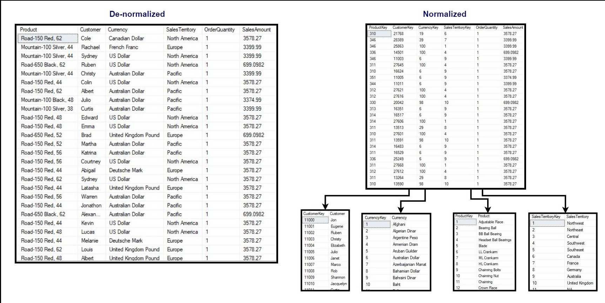
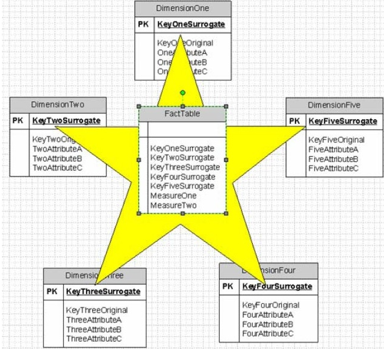
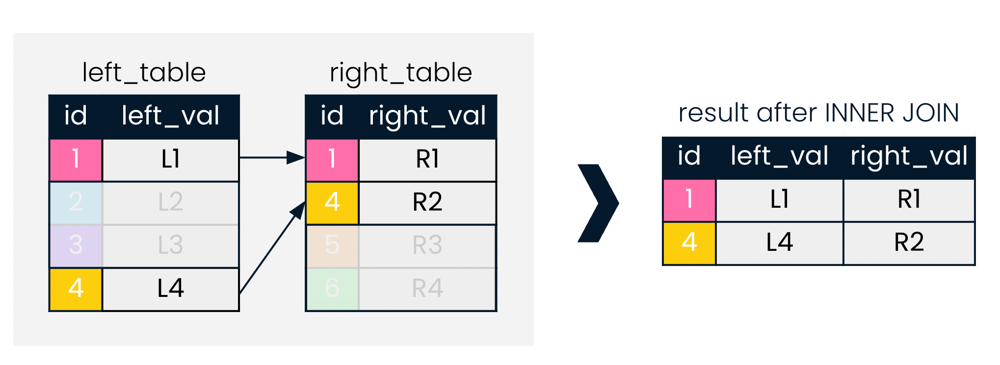
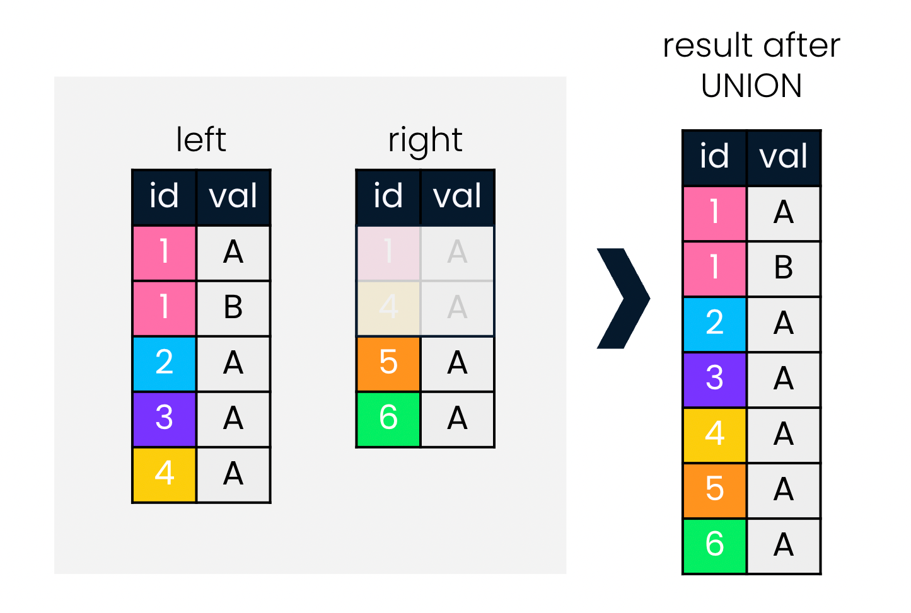
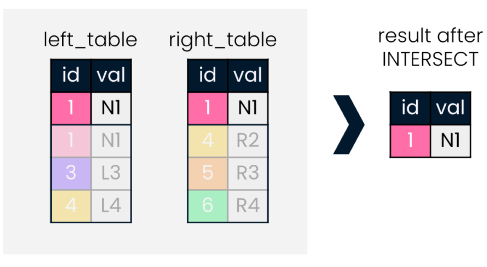
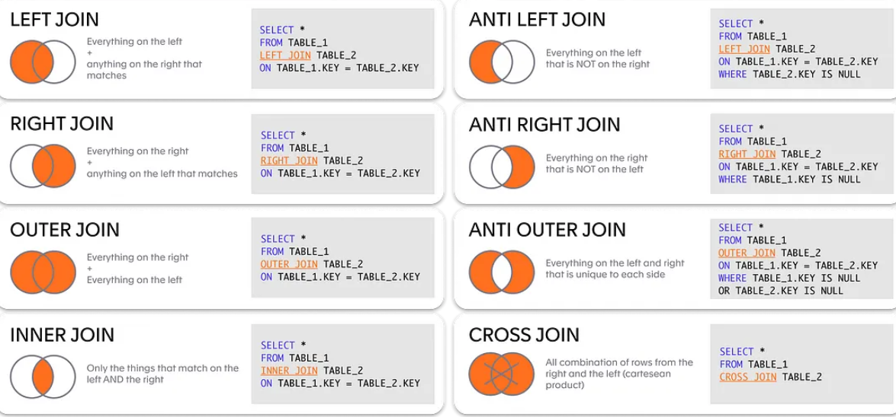

#

# Intro
## Get most-used keywords in a codebase
When SQL keywords are all caps, we can get a list of all the keywords used in a codebase using:

```bash
find . -type t -exec cat {} + | grep -oE "\b[A-Z]+\b" | sort | uniq -c | sort
```
To find the largest file recursively:
```bash
find . -type f -ls | sort -k7 -r | head -n 1
```
It's good to understand the power of bash, and avoid python if bash can do it in one line.

## A Note
This primer is made for beyond the basics, and written for someone who has used SQL before. If you are new to SQL, you may want to start with a more basic primer.
This primer is PostgreSQL specific, but much of the information is applicable to other SQL databases.

# General Tips
- Try and find a tool with close-to-infinite history.  You will want to revisit old queries. 
- Consider pulling data to pandas as part of a pipeline as it is generally faster to work with data in memory.
  - If you are memory constrained, SQL generally doesn't have memory constraints as it is disk-based.
  - Our results show a difference of hours vs minutes for some queries.
- If your queries take a long time to complete you may need clean information used by the query planner.
  - Run `VACUUM FULL <tablename>`
- `ANALYZE` your tables after big inserts, it will keep your queries optimized
- Some clients, like pgadmin, will return **client-side** errors if the query is too large **for the client**.  
This is not a server-side error. If you write your query results to a table the query will complete.


# Relational Data Model
- SQL
 - Different Dialects
  - PostgreSQL
  - MySQL
  - MariaDB
  - SQLite
  - Oracle
  - SQL Server
  - DB2
 - Is a declarative language vs imperative
  - "What you want" vs "How to get it"
  - SQL is Declarative
  - Declarative makes sense for data table operations, don't want to program your own queries you use often like `SELECT`
  - However, the language is constrained, it's hard properly 'program' in pure SQL without the SQL-programming extensions
  like PL/pgSQL
    - Incidentally, SQL **is** turring complete system[^1]
      - **Turing complete** - a system that can simulate a Turing machine. By Turing Equivalence this means one language
      can perform any algorithm that another can.  A collelary is that a language can perform any task another can 
      (resources notwithstanding).

  
## Other models - NoSQL
There are many other databases that don't use SQL.
- Key-value cache
  - Redis
- Key-value store
  - Azure Cosmos
  - Amazon DynamoDB
- Object Database - Objects as in object-oriented programming 
  - Objectivity/DB
- Document Store
  - MongoDB
  - Elasticsearch
  - Azure Cosmos
- Column Store
  - Cassandra
  - HBase
  - Azure Cosmos
  - Amazon DynamoDB
- Tuple Store
  - Amazon SimpleDB
- Graph Database
  - Neo4j
  - Azure Cosmos
  - Amazon Neptune
- Time Series Database
  - InfluxDB
- Vector Database
  - Pinecone
  - AWS Kendra

- https://db-engines.com/en/ranking


## Keys, Indexes, and Constraints
Check constraint - a constraint that is checked when data is inserted or updated.
Non-null constraint - a constraint that requires a column to not be null.
Unique constraint - a constraint that requires a column to be unique.
Primary Key - a unique identifier for a row in a table (many not be null like a unique constraint, and can only have one).
Foreign Key - a key that references a primary key in another table.

## Normalization - Why separate tables?
Normalization stores data more efficiently and speeds up queries.  It also reduces redundancy and makes it easier to update data.
However, it can make queries more complex and slow down inserts and updates.





## Types
### Numeric
- `SMALLINT` - 2-byte integer
- `INTEGER` - 4-byte integer
- `BIGINT` - 8-byte integer
- `DECIMAL` - arbitrary precision number
- `NUMERIC` - arbitrary precision number
- `REAL` - 4-byte floating-point number
- `DOUBLE PRECISION` - 8-byte floating-point number
- `SERIAL` - autoincrementing integer
- `BIGSERIAL` - autoincrementing integer
### Character
- `CHARACTER(n)` - fixed-length string
- `CHAR(n)` - fixed-length string
- `VARCHAR(n)` - variable-length string
- `TEXT` - variable-length string
### Temporal
- `DATE` - date
- `TIME` - time
- `TIMESTAMP` - date and time
- `TIMESTAMP WITH TIME ZONE` - date and time with timezone
- `INTERVAL` - time interval
### Boolean
- `BOOLEAN` - true or false
### Array
- `ARRAY` - array of any type
### Binary
- `BYTEA` - binary data


# SQL Clients/Tools
Tip: Try and find a tool with close-to-infinite history.  You will want to revisit old queries. 

- pgadmin
  - If you highlight it will only run highlighted code 
  - You can do a lot of management through the GUI
- SQL Workbench
- DBeaver
- CLI - psql
  - `psql` is a command line tool to run queries 
  - Also `pgdump` - to dump a table
- sqlalchemy - Python library to interact with SQL databases
```python
from sqlalchemy import create_engine

engine = create_engine('/path/to/your/db...')
connection = engine.connect()

my_query = 'SELECT * FROM my_table'
results = connection.execute(my_query).fetchall()
```
- pandas
```python
pd.read_sql('SELECT int_column, date_column FROM test_data', conn)
```
- polars
```python
import polars as pl
pdf = pl.read_sql('SELECT int_column, date_column FROM test_data', conn)
pdf.write_database('tablename', conn)
```


# Query Optimizer
All SQL engines have a query optimizer that will take your query and try to find the most efficient way to execute it.
For example, if you are filtering lots of rows, it will try and filter out the data before running other parts of the query.
However, you can write a query that is hard to optimize or the table can be in a poor state in terms of the metadata 
That the optimizer may make suboptimal choices. You can use `EXPLAIN` to see how the query is being executed. Also
use `ANALYZE` and `VACUUM` to keep your tables optimized.

```sql 

# SQL Syntax
Notice the declariative nature of the syntax. It is limited but can avoid bugs easier.

## DELETE

Synopsis:  
```sql
[ WITH [ RECURSIVE ] with_query [, ...] ]
DELETE FROM [ ONLY ] table_name [ * ] [ [ AS ] alias ]
    [ USING from_item [, ...] ]
    [ WHERE condition | WHERE CURRENT OF cursor_name ]
    [ RETURNING * | output_expression [ [ AS ] output_name ] [, ...] ]
```

## CREATE
Easiest method is to simply copy tables that someone else has created (see recipes).

## SELECT

Synopsis: https://www.postgresql.org/docs/current/sql-select.html
```sql
[ WITH [ RECURSIVE ] with_query [, ...] ]
SELECT [ ALL | DISTINCT [ ON ( expression [, ...] ) ] ]
    [ * | expression [ [ AS ] output_name ] [, ...] ]
    [ FROM from_item [, ...] ]
    [ WHERE condition ]
    [ GROUP BY [ ALL | DISTINCT ] grouping_element [, ...] ]
    [ HAVING condition ]
    [ WINDOW window_name AS ( window_definition ) [, ...] ]
    [ { UNION | INTERSECT | EXCEPT } [ ALL | DISTINCT ] select ]
    [ ORDER BY expression [ ASC | DESC | USING operator ] [ NULLS { FIRST | LAST } ] [, ...] ]
    [ LIMIT { count | ALL } ]
    [ OFFSET start [ ROW | ROWS ] ]
    [ FETCH { FIRST | NEXT } [ count ] { ROW | ROWS } { ONLY | WITH TIES } ]
    [ FOR { UPDATE | NO KEY UPDATE | SHARE | KEY SHARE } [ OF table_name [, ...] ] [ NOWAIT | SKIP LOCKED ] [...] ]

where from_item can be one of:

    [ ONLY ] table_name [ * ] [ [ AS ] alias [ ( column_alias [, ...] ) ] ]
                [ TABLESAMPLE sampling_method ( argument [, ...] ) [ REPEATABLE ( seed ) ] ]
    [ LATERAL ] ( select ) [ [ AS ] alias [ ( column_alias [, ...] ) ] ]
    with_query_name [ [ AS ] alias [ ( column_alias [, ...] ) ] ]
    [ LATERAL ] function_name ( [ argument [, ...] ] )
                [ WITH ORDINALITY ] [ [ AS ] alias [ ( column_alias [, ...] ) ] ]
    [ LATERAL ] function_name ( [ argument [, ...] ] ) [ AS ] alias ( column_definition [, ...] )
    [ LATERAL ] function_name ( [ argument [, ...] ] ) AS ( column_definition [, ...] )
    [ LATERAL ] ROWS FROM( function_name ( [ argument [, ...] ] ) [ AS ( column_definition [, ...] ) ] [, ...] )
                [ WITH ORDINALITY ] [ [ AS ] alias [ ( column_alias [, ...] ) ] ]
    from_item join_type from_item { ON join_condition | USING ( join_column [, ...] ) [ AS join_using_alias ] }
    from_item NATURAL join_type from_item
    from_item CROSS JOIN from_item

and grouping_element can be one of:

    ( )
    expression
    ( expression [, ...] )
    ROLLUP ( { expression | ( expression [, ...] ) } [, ...] )
    CUBE ( { expression | ( expression [, ...] ) } [, ...] )
    GROUPING SETS ( grouping_element [, ...] )

and with_query is:

    with_query_name [ ( column_name [, ...] ) ] AS [ [ NOT ] MATERIALIZED ] ( select | values | insert | update | delete )
        [ SEARCH { BREADTH | DEPTH } FIRST BY column_name [, ...] SET search_seq_col_name ]
        [ CYCLE column_name [, ...] SET cycle_mark_col_name [ TO cycle_mark_value DEFAULT cycle_mark_default ] USING cycle_path_col_name ]

TABLE [ ONLY ] table_name [ * ]

```
- Use `LIMIT` judiciously when testing queries as it will speed up development.
- The `DISTINCT` keyword can be used at the statement-level and also the column-level.
- `WHERE` (and `UNION`/`INTERSECT`) can also take an entire `SELECT` statement of it's own. Also known as a subquery.
- `WITH` preamble to the query also can take `SELECT`.  This is known as a Common Table Expression (CTE).

## INSERT
```sql
[ WITH [ RECURSIVE ] with_query [, ...] ]
INSERT INTO table_name [ AS alias ] [ ( column_name [, ...] ) ]
    [ OVERRIDING { SYSTEM | USER } VALUE ]
    { DEFAULT VALUES | VALUES ( { expression | DEFAULT } [, ...] ) [, ...] | query }
    [ ON CONFLICT [ conflict_target ] conflict_action ]
    [ RETURNING * | output_expression [ [ AS ] output_name ] [, ...] ]

where conflict_target can be one of:

    ( { index_column_name | ( index_expression ) } [ COLLATE collation ] [ opclass ] [, ...] ) [ WHERE index_predicate ]
    ON CONSTRAINT constraint_name

and conflict_action is one of:

    DO NOTHING
    DO UPDATE SET { column_name = { expression | DEFAULT } |
                    ( column_name [, ...] ) = [ ROW ] ( { expression | DEFAULT } [, ...] ) |
                    ( column_name [, ...] ) = ( sub-SELECT )
                  } [, ...]
              [ WHERE condition ]
```

## UPDATE 
- **UPSERT** - portmaneau of UPDATE and INSERT - this will update a row if it exists, and insert it if it doesn't.
```sql

[ WITH [ RECURSIVE ] with_query [, ...] ]
UPDATE [ ONLY ] table_name [ * ] [ [ AS ] alias ]
    SET { column_name = { expression | DEFAULT } |
          ( column_name [, ...] ) = [ ROW ] ( { expression | DEFAULT } [, ...] ) |
          ( column_name [, ...] ) = ( sub-SELECT )
        } [, ...]
    [ FROM from_item [, ...] ]
    [ WHERE condition | WHERE CURRENT OF cursor_name ]
    [ RETURNING * | output_expression [ [ AS ] output_name ] [, ...] ]
```

# Subqueries vs Common Table Expressions
Subqueries are defined within the query.  CTEs are defined before the query.

Subquery:
```sql
SELECT *
FROM Customers
WHERE age = (
    SELECT MAX(age)
    FROM Customers
);
```

CTE:
```sql
WITH test (age) AS (
    SELECT MAX(age)
    FROM Customers
)
SELECT *
FROM test
```

## Other imporant keywords
- `TRUNCATE` - removes all rows from a table.
- `DROP` - removes a table or database.
- `COALESCE` - returns the first non-null value in a list.
- `CASE...WHEN...THEN...ELSE...END` - used to create conditional statements.
- `IS (NOT) NULL` - used to check if a value is null.
- `WHERE (NOT) EXISTS` - used to check if a subquery returns any rows. Checks if data has already been processed
- `NULLIF` - returns null if two values are equal.
- `LPAD` - pads a string to a certain length.
- `USING` - used in `JOIN` to specify the columns to join on.
  - Shorthand for `USING ( a, b, ... ) is shorthand for ON left_table.a = right_table.a AND left_table.b = right_table.b`
- `ON CONFLICT` - used in `INSERT` to specify what to do if a conflict occurs.
- `TRUNCATE...CASCADE` - used to remove all rows from a table and any dependent tables.
- `ALTER TABLE` - used to modify a table. Can be used to change the owner.
- `GRANT <PRIVLEDGE> ON` - used to grant privileges to a user.
- `CREATE VIEW` - used to create a view.
- `CREATE TEMP` - used to create a temporary table.


## Set Operations
Compared to the horizontal operation of `JOIN`:



`UNION` and `INTERSECT` are vertical operations.





## Comparison Operators

| Operator	                     | Description
---------------------------------|------------
| <    | Less than
| >    | Greater than
| <=   | Less than or equal to
| >=   | Greater than or equal to
| =    | Equal
| <>   | Not equal
| !=   | Not equal
| ~~   | `LIKE` 
| ~~*  | `ILIKE` (case-insensitive `LIKE`)
| !~~  | `NOT LIKE`
| !~~* | `NOT ILIKE`

## JOIN
- Outside of understanding different join types, it's important to know how they behave with duplicates and nulls



# Grouping and Summarizing Data
- Like Pandas and all other languages that can do aggregation, you can't select non-aggregated data next to aggregated.
This introduces an ambiguity of which row in the group to select. The exception is if you select the first in a group
```sql
SELECT 
   name, -- you can select a column if it is in the GROUP BY
   state,
   -- age -- this WONT work because it is not in the GROUP BY.  "Age of WHICH Chris in DC?" 
   avg(height), -- you can select a column not in the GROUP BY if it is aggregated (SUM, AVG, COUNT, etc.) "Average age of WHICH Chuck in DC? Avg of ALL of them"
   MAX(number_pets), -- you can select a column not in the GROUP BY if a certain selection method is used (MIN, MAX, etc.) 
FROM 
   table_name
GROUP BY 
   name, -- note these are the only two columns grouped by
   state,-- note these are the only two columns grouped by
```

## Functions vs Stored Procedures 
Postgres can store some methods server-side to run over data. There are two types: functions and stored procedures.
Functions cannot modify the database, it can only return a value. Stored procedures can modify the database, they 
are similar to SQL code that is stored in the database and called as needed.

## Views and Temp Tables
- Views are a way to save a query and run it as if it were a table. This allows these views to to be dynamic.

## Extending SQL via Programming
- PL/pgSQL
## EXPLAIN
## Connections
- ODBC/JDBC
## Window Functions
## Data Warehousing
## Transactions
## Partitioning, Clustering Sharding


[^1]: https://stackoverflow.com/questions/900055/is-sql-or-even-tsql-turing-complete