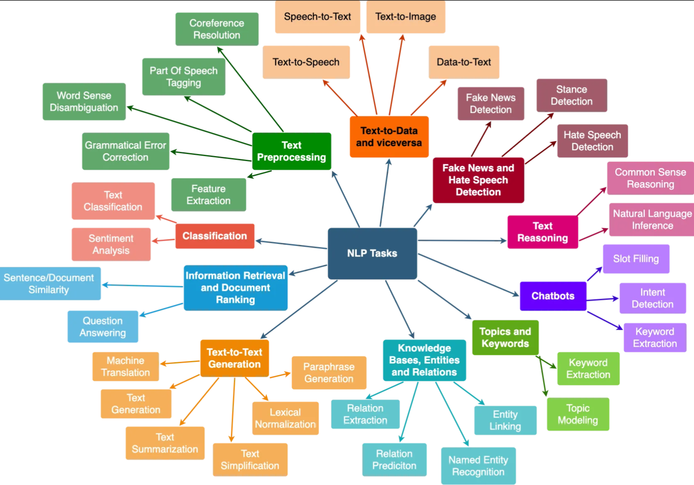

# Overview

The content of this series comes from Andrew Ng's
[deeplearning.ai](https://www.coursera.org/specializations/natural-language-processing) Coursera NLP
Specialization.

Some content has also come from Natural Language Processing in Action 2nd edition by Lane and
Dyshel.

# Major Changes in NLP Space

## Off-the-shelf Development Pattern

Huggingface was founded in 2016, with major adoption in the early 2020s. Prior to the existence of
such model zoo sites the general workflow as for a data scientist was to build models from scratch
with a combination of knowledge, learning, and googling. This was especially true for deep learning
models where the architecture has a large parameter space and is non-trival. While there still is an
opportunity for data scientists to build at this low level (there are 1.1 million models on
huggingface contributed by the community), an increasingly common workflow is for a data scientist
to pull off the shelf models that have already been designed by someone else.

It should be noted that this new workflow applies to computer vision, natural language processing,
audio processing, reinforcment learning, time series forcasting, graph machine learning, and some
tabular modalities (such as classification). However, many algorithmic techniques: simulation,
classical statistics, classical AI (MDP, search, etc.), classical machine learning (SVM, decision
trees, etc.), optimization, unsupervised learning are not found in model zoos. This is proably
because the parameter space for these modalities are to large to allow easy packaging of models.

## LLM Revolution

In addition to the new off-the-shelf workflow, we have seen a revolution of large language models.
Now LLMs can perform many tasks that traditional NLP models have. It is often easier to use a
pre-trained LLM to perform traditional NLP tasks like sentiment analysis, named entity recognition,
or text classification.

## Is Traditional NLP still worth learning?

Insofar as someone wants to build low-level models (and possibly contribute to a model zoo), it is
certainly worth learning NLP as taught prior to 2020. However, in the three main development
patterns:

1. low-level model building from scratch
1. off-the-shelf traditional NLP
1. off-the-shelf LLM

All three could benefit from traditional NLP education insofar as intimate knowledge of NLP allows
one to improve performance or make modifications based on requirements. It should also be
said--according to the Spacy authors--traditional NLP is more performant than LLMs in many cases.
For a consultant, top-performance is rarely the goal, but when it is applicable, a bespoke model may
be desired.

## How to modify learning based on these changes in NLP

Any series that does not cover these major changes is not properly covering the space. To this end,
we will try and incorporate LLM/off-the-shelf methods and performance comparisions
