# Sentiment Analysis with Naive Bayes

# Probability and Bayes' Rule

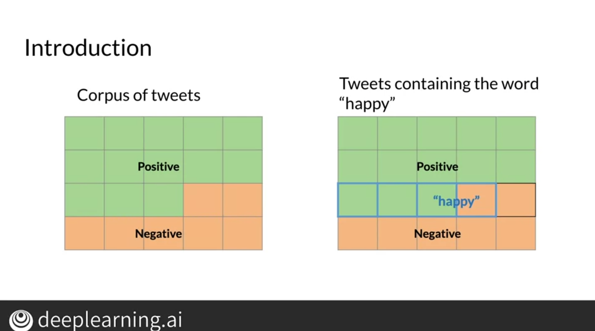

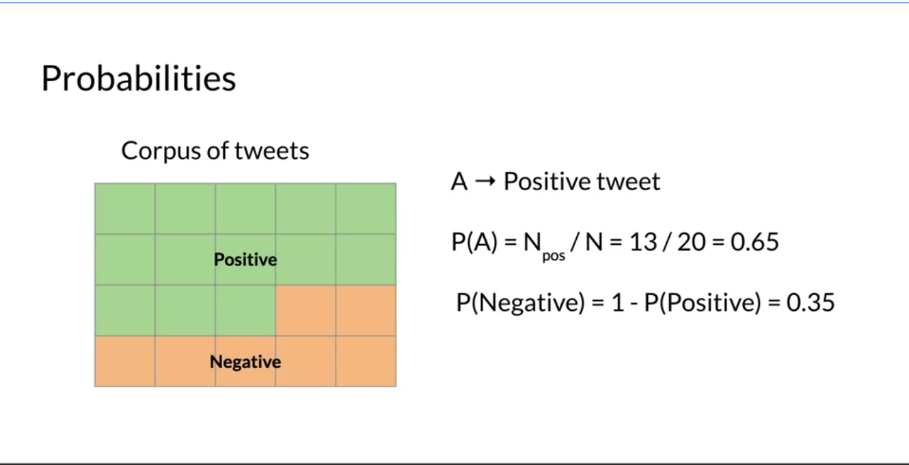

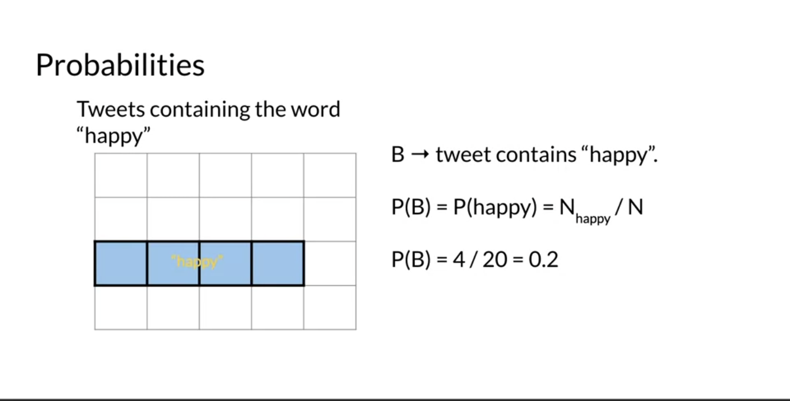

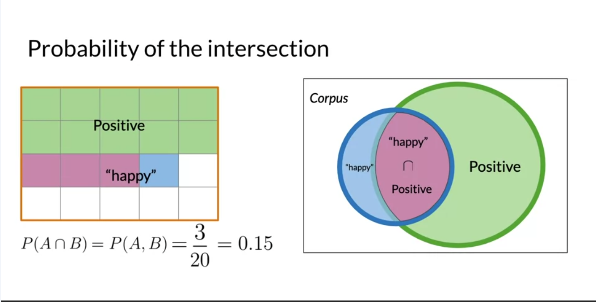

# Bayes' Rule

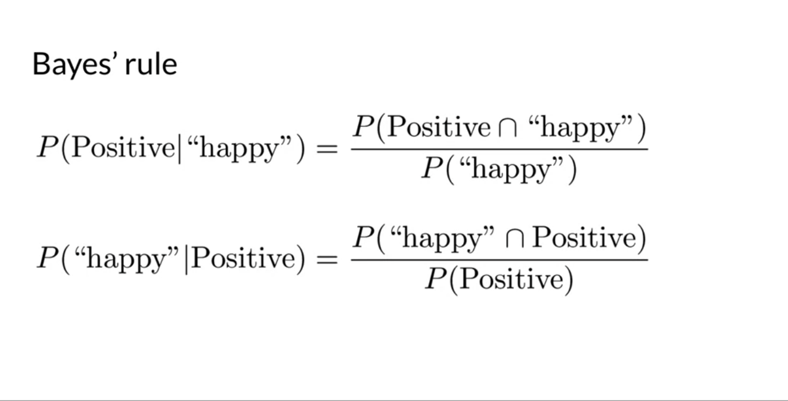

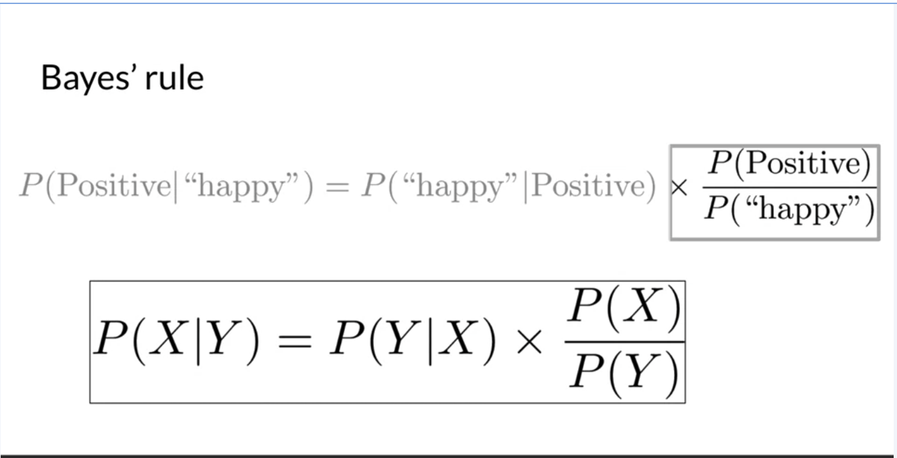

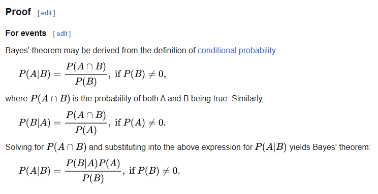

# Naive Bayes Intro

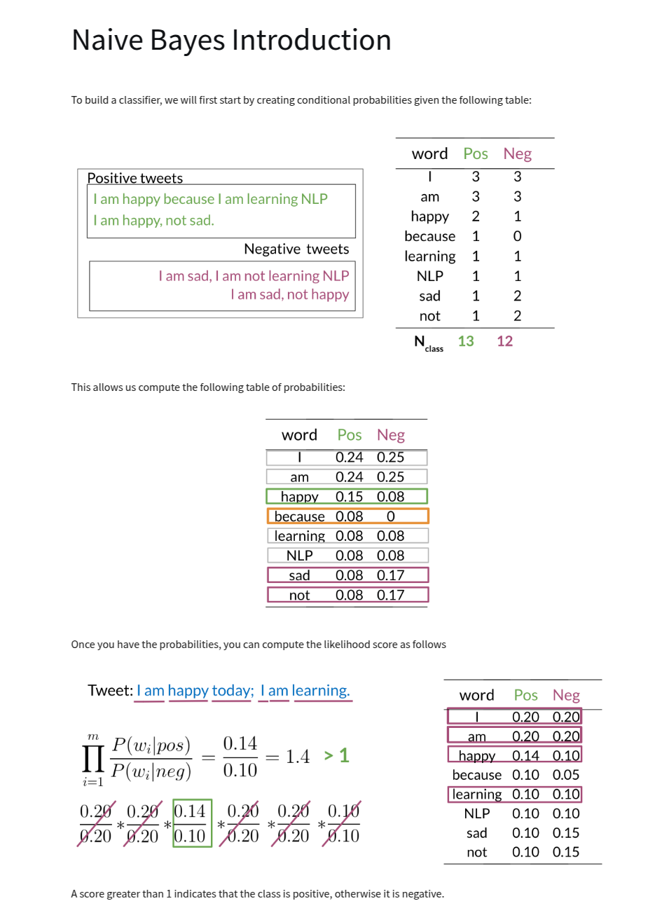

# Laplacian Smoothing

Modification to Naive Bayes formula to avoid zero probabilities.

# Log Likelihood

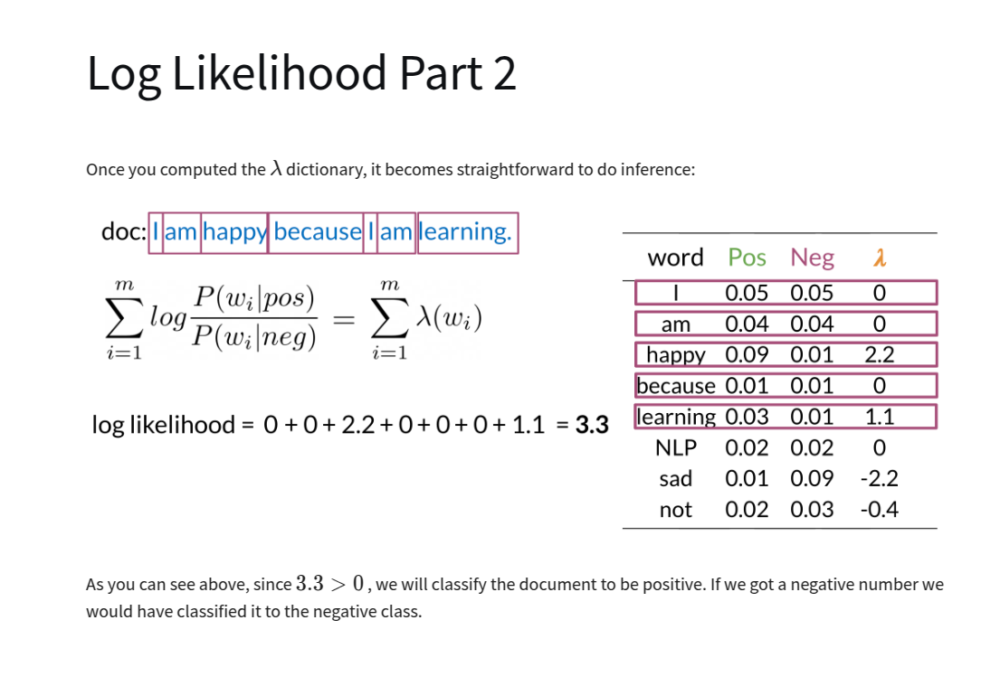

# Training Naive Bayes

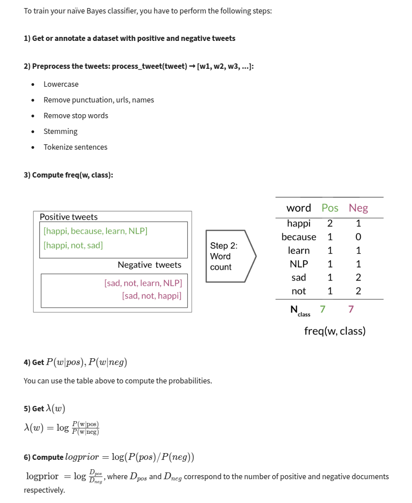

# Testing Naive Bayes

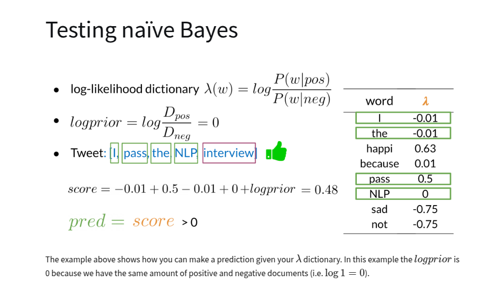

# Applications of Naive Bayes

- Author identification - i.e. who wrote a particular document
- Spam filtering
- Information retrieval
- Word disambiguation - i.e. bank (financial institution) vs bank (side of a river)

# Naive Bayes Assumptions

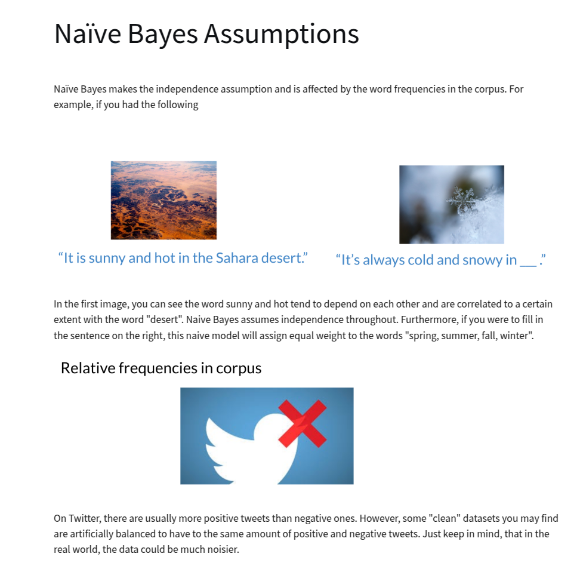

# Error Analysis

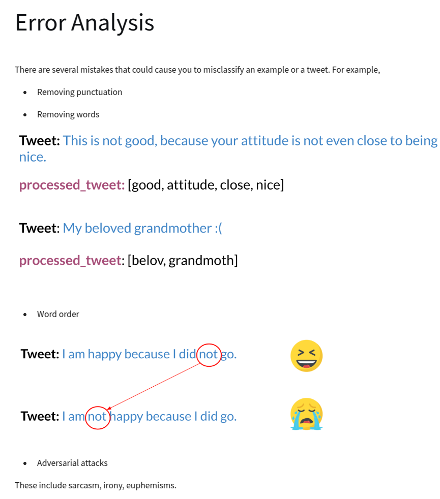
