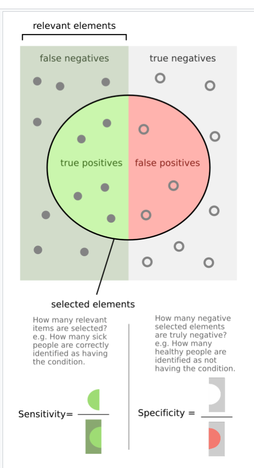
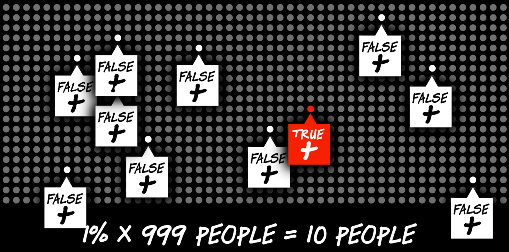
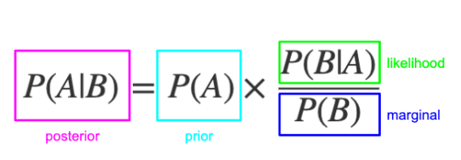
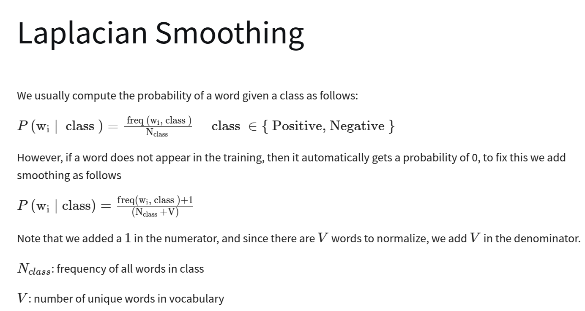
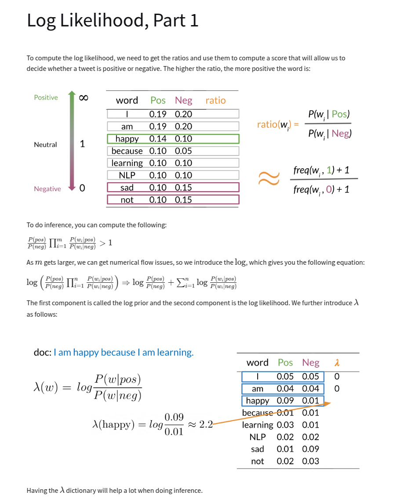

# Sentiment Analysis with Naive Bayes

## What you should remember for life:

### Facts to know:

- Left side of bayes equality (e.g $P(A|B)$, "probability of A given B") The 'given' part (i.e $B$
  in this case) is in the denominator on the right side of the equation.
  - You can also derive with venn diagrams and plugging $P(A|B)$ into $P(B|A)$

# Probability and Bayes' Rule

# Bayes' Rule

## Example

You test positive for a test where that is 99% accurate: correctly identifies 99% of people that
have the disease but only incorrectly identifies 1% of people who don't have the disease. What is
the chance you have the disease if you test positive?

$$ P(D|+) = P(+|D)\frac{P(D)}{P(+)} $$
$$ P(D|+) = P(+|D)\frac{P(D)}{P(+|D)P(D) + P(+|D')P(D')} $$

$$
P(D|+) = P(\text{Positive given you have Disease})\frac{P(\text{You have Disease})}{P(\text{Having Disease and
testing positive}) + P(\text{Not having disease but testing positive})}
$$

Another formulation is:

$$
P(D|+) = \frac{\text{Sensitivity} \times \text{Prevalance}}{\text{Sensitivity} \times \text{Prevalance} +
(1 - \text{Prevalance}) \times (1 - \text{Sensitivity})}
$$

---

_Sensitivity and Specificity Review_

- Ratio is always 'true' over 'all'
- 'seN' and 'sPe' are _opposite_ positive and negative.
- **Sensitivity** - ratio of true positives to all actual positives
- **Specificity** - ratio of true negatives to all actual negatives

## 

The prior is often hard to estimate, but in this case the disease prevalence in the population is a
good guess, 0.001:

$$P(D|+) = 0.99 \times \frac{0.001}{0.99 \times 0.001 + 0.01 \times 0.999} = 0.09$$

or 9%.

So why is the result so counterintuitive? The test is very accurate, but the disease is very rare.
Yes it will correctly identify 99% that have the disease, so it will identify that 0.001% very well.
But it also misidentifies 1% of the 99.9% that don't have the disease, so it will identify 0.01% of
the 99.9% that don't have the disease. So the test is more likely to be wrong than right.

|                    | x,P(+\|D) | y,P(D)                  |          |          |
| ------------------ | --------- | ----------------------- | -------- | -------- |
| disease prevalence |           | test accuracy wrong in… |          | accuracy |
| 1 in 1000          | 0.001     | 1 in 10000              | 0.9999   | 0.909165 |
| 1 in 10000         | 0.0001    | 1 in 100,000            | 0.99999  | 0.909098 |
| 1 in 100,000       | 0.00001   | 1 in 1 million          | 0.999999 | 0.909092 |

## Derivation

To remember the derivation: left side of equality conditional ('given'; right of "|") equality goes
in demoninator on rightside (also true of bayes formula generally) To remember bayes formula:
remember the same rule and just remember to put the X, Y in the right place

# Naive Bayes Intro

# Laplacian Smoothing

Modification to Naive Bayes formula to avoid zero probabilities.

# Log Likelihood

# Training Naive Bayes

# Testing Naive Bayes

# Applications of Naive Bayes

- Author identification - i.e. who wrote a particular document
- Spam filtering
- Information retrieval
- Word disambiguation - i.e. bank (financial institution) vs bank (side of a river)

# Naive Bayes Assumptions

# Error Analysis

