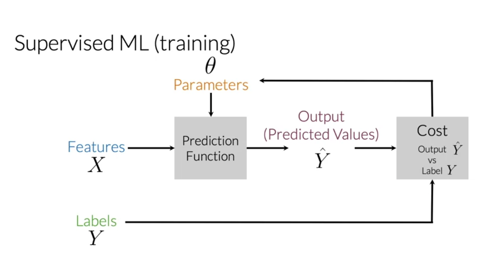
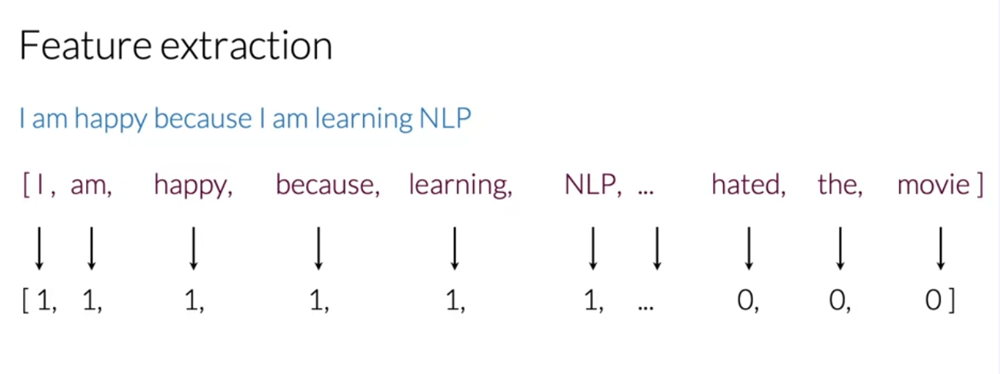
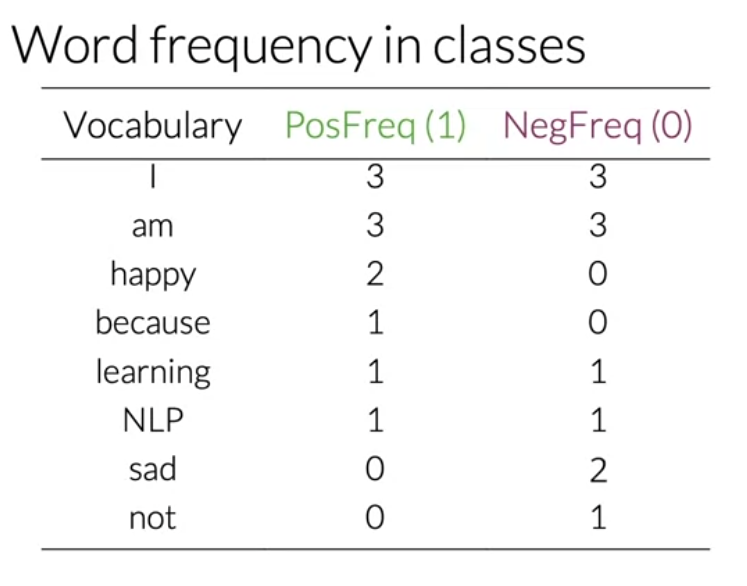
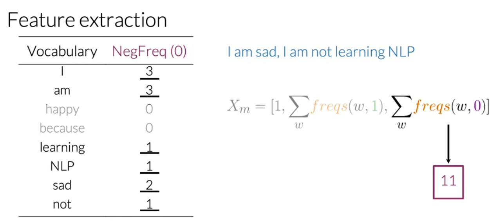
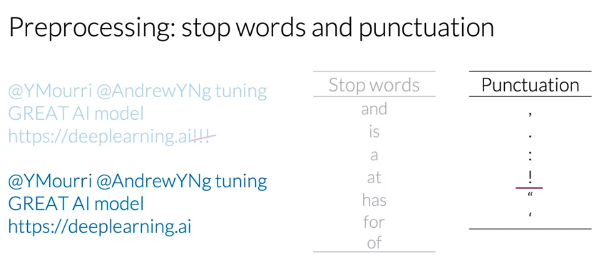
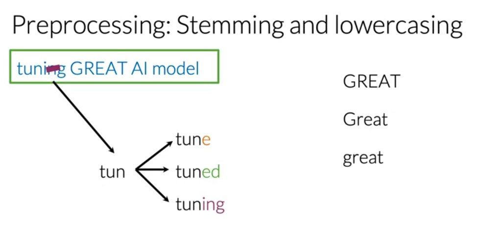
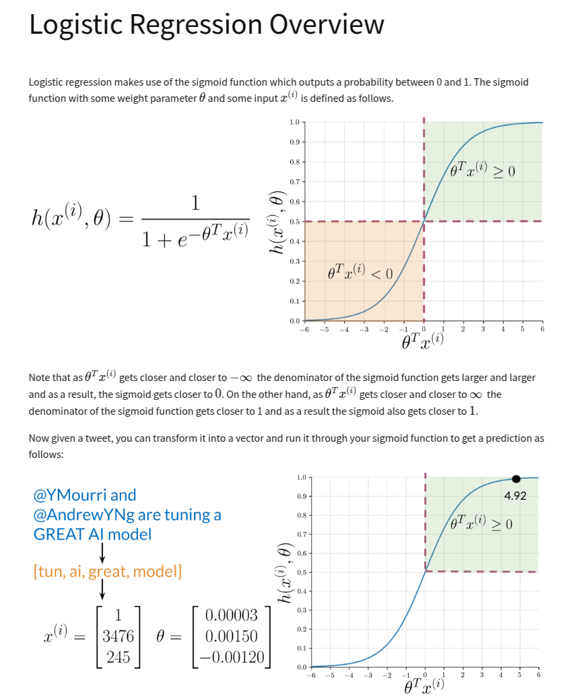
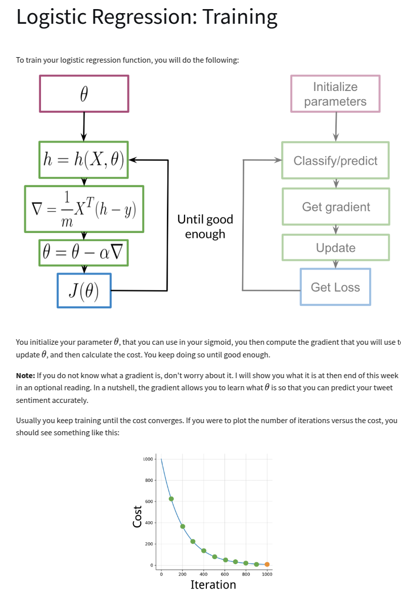
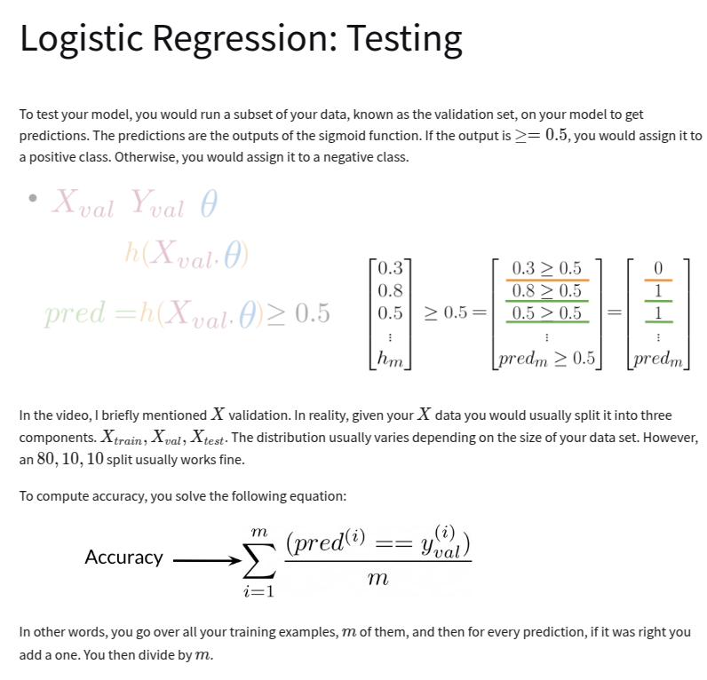

# Sentiment Analysis with Logistic Regression

# Abstract

## What you should remember for life:

1. Weighted sum like linear regression. ($z = w_1x_1 + w_2x_2 + ... + w_nx_n + b$)
2. Sigmoid function to map to probability. ($\sigma(z) = \frac{1}{1 + e^{-z}}$)
3. Iterate through gradient decent to minimize loss. (Log loss)

## Facts to know:

- It is almost always a classification algorithm, but it is called regression.
- You can do multi-class classification with multinomial logistic regression.
- Does not work with missing data

Logistic regression is a classification algorithm used to predict binary outcomes by modeling the
probability of an instance belonging to a particular class. It computes a weighted sum of input
features, applies a sigmoid function to map the result to a probability between 0 and 1, and
classifies the output based on a threshold (typically 0.5). The model is trained using log loss
(cross-entropy loss) and optimized with gradient descent to adjust the weights for better accuracy.
Extensions include multinomial logistic regression for multi-class classification and regularization
(L1/L2) to prevent overfitting.

## How Logistic Regression Works

### 1. Linear Combination of Inputs

Logistic regression calculates a weighted sum of input features, similar to linear regression:

$$
z = w_1x_1 + w_2x_2 + ... + w_nx_n + b
$$

where:

- $w_i$ are the weights (coefficients) for each feature $x_i$,
- $b$ is the bias (intercept),
- $z$ is the linear combination output.

### 2. Applying the Sigmoid Function

The sigmoid function is used to map $z$ to a probability between 0 and 1:

$$
\sigma(z) = \frac{1}{1 + e^{-z}}
$$

This ensures that the output represents a probability, which can then be thresholded to classify
data points.

### 3. Making Predictions

- If $\sigma(z)$ is greater than 0.5, the prediction is class **1**.
- If $\sigma(z)$ is less than 0.5, the prediction is class **0**.

### 4. Loss Function (Log Loss)

The model is trained using **log loss (cross-entropy loss)**, which measures how well the predicted
probabilities match the actual labels:

$$
L = - \frac{1}{m} \sum_{i=1}^{m} \left[ y_i \log(\hat{y}_i) + (1 - y_i) \log(1 - \hat{y}_i) \right]
$$

where:

- $y_i$ is the true label,
- $\hat{y}_i$ is the predicted probability,
- $m$ is the number of samples.

### 5. Optimization with Gradient Descent

To minimize the loss, **gradient descent** or other optimization techniques adjust the weights $w$
and bias $b$ iteratively until convergence.

### 6. Extensions

- **Multinomial Logistic Regression:** Used for multi-class classification (Softmax Regression).
- **Regularization (L1/L2):** Helps prevent overfitting (L2 is Ridge, L1 is Lasso).

## Summary

Logistic regression transforms a linear model into a probability-based classifier using the sigmoid
function. It predicts the likelihood of an instance belonging to a particular class and is trained
using log loss optimization.

## Review of Supervised ML



(Notice the parameters, theta, here. This is an example of the parametric/nonparametric distinction.
There are other examples of nonparametric models in ML, such as KNN and certain types of decision
trees like CART and C4.)

## Feature Extraction

We need to vectorize the text data. We can simply one-hot encode the words in the text. If the word
appears it gets a 1; if not, a zero. This representation is very sparse and has large training and
prediction time as the vocabulary increases.



## Frequency Dictionary

In order to represent text, tweets in this case, we convert the occurrence of words in positive and
negative tweets into a frequency dictionary.



## Feature Extraction

We can extract features from the text by summing the frequency in the positive and negative
dictionaries to produce a 3-dimensional vector for a given tweet.



## Preprocessing

### Stopwords

Stopwords are words that are filtered out before or after processing of text. They are usually the
most common words in a language and do not add much meaning to the text.



### Stemming

Stemming is the process of reducing inflected (or sometimes derived) words to their word stem, base
or root form.



# Review of Logistic Regression







# Logistic Regression for scratch in R

```r
train <- function(data, labels, alpha){
    iter <- 1
    # set random values for theta
    n <- length(data)
    d <- nrow(data)
    theta <- runif(d, -1, 1)
    old_theta <- rep(1, d)
    # while all thetas are greater than threshold
    while(any(abs(old_theta - theta) > 0.001)){
        # shuffle
        for(i in sample(x=1:n, replace=FALSE)){
            old_theta <- theta
            subtract <- (labels[[i]] * data[[i]])/(1 + exp(-labels[[i]]*drop(theta %*% data[[i]])))
            theta <- theta - alpha * subtract
        }
        iter <- iter + 1
        if(iter > 100){
            print("early exit")
            return(theta)
        }
    }
    return(theta)
}

```

# Quick Review of NLP Logistic Regression

#
