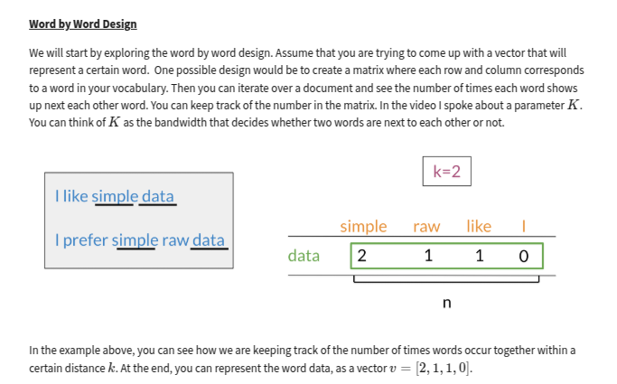
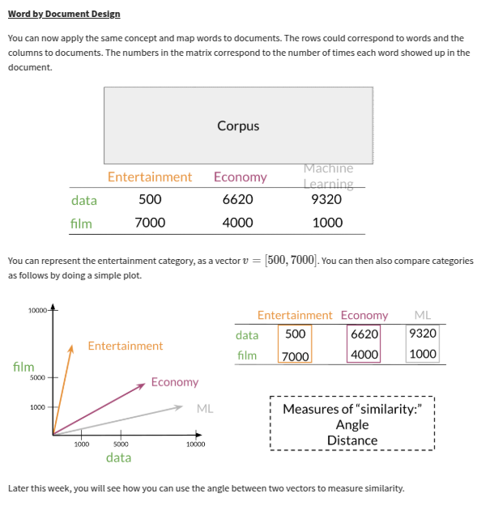
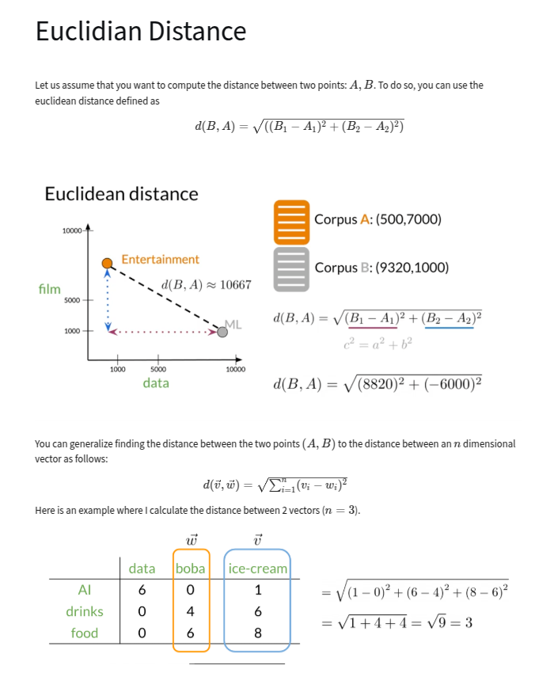
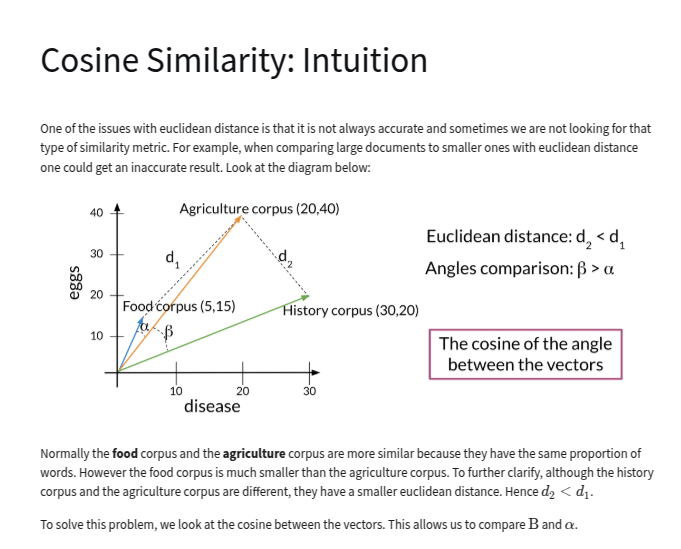
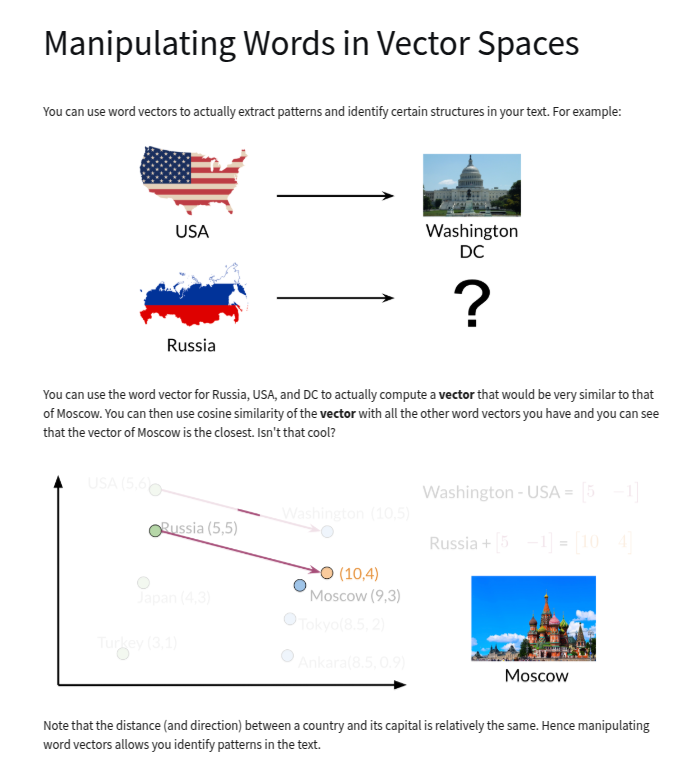
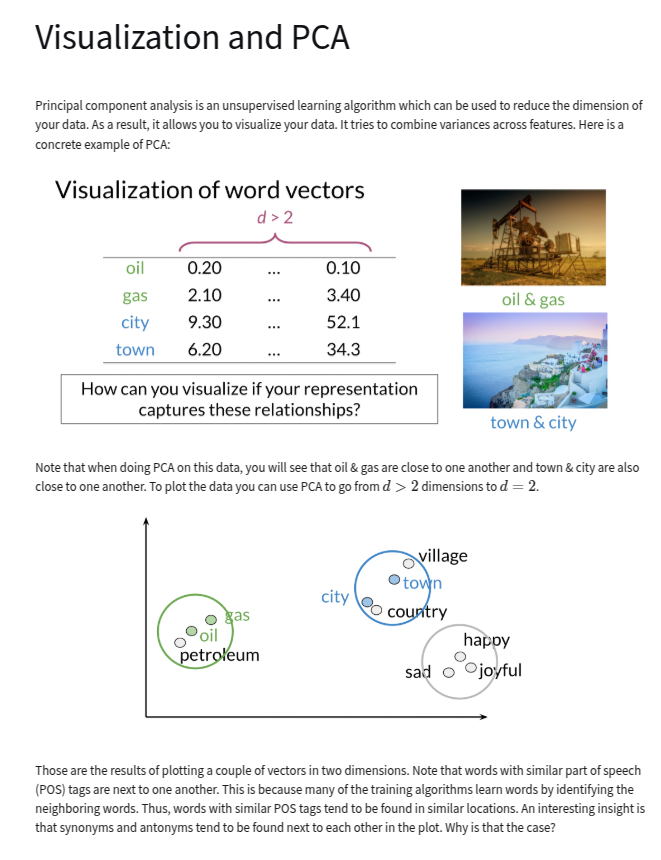
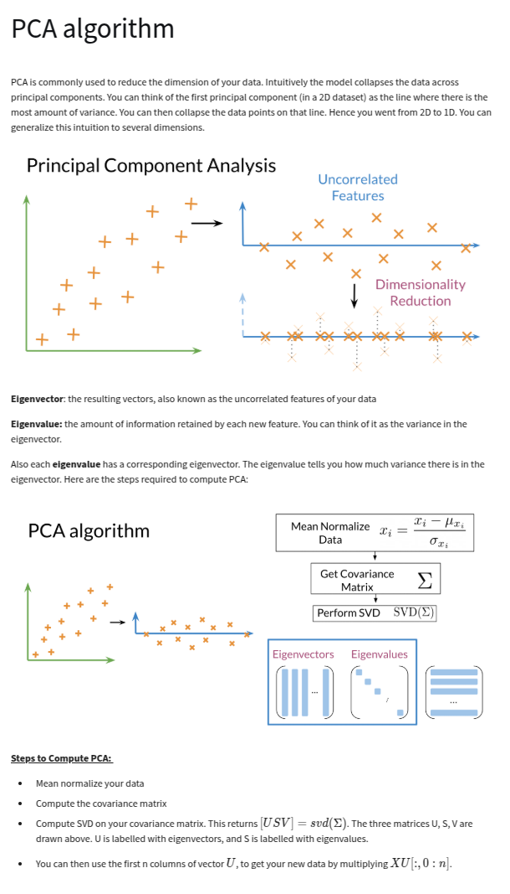

# Vector Space Models and PCA

## Introduction

This lecture is a introductory description of vector space models. We will not discuss more
complicated embedding algorithms like Word2Vec, but the basics here will be useful for understanding
those more advanced models.

Vector Space Models are used for various purposes:

- Information Extraction
- Machine Translation
- Chatbots

## Vector Designs

- Word by Word - Get co-occurrence within a distance of k

- Word by Doc - Get word per document counts

- Word co-location and naive vector space model

## Similarity metrics

### Euclidean distance

### Cosine similarity

Using these definitions:

- Vector norm

<!-- prettier-ignore-start -->
$$ \|\mathbf{v}\| = \sqrt{\sum^{n}_{i=1} v_i^2} $$
<!-- prettier-ignore-end -->

- Dot product

<!-- prettier-ignore-start -->
$$ \mathbf{v} \cdot \mathbf{w} = \sum_{i=1}^{n} v_i w_i $$
<!-- prettier-ignore-end -->

and the definition of the dot product:

$$ \mathbf{v} \cdot \mathbf{w} = \|\mathbf{v}\| \|\mathbf{w}\| \cos(\theta) $$

we can solve for the cosine of the angle between two vectors:

$$ \cos(\theta) = \frac{\mathbf{v} \cdot \mathbf{w}}{\|\mathbf{v}\| \|\mathbf{w}\|} $$

which is the cosine similarity. Because the sum of the products of each dimension is normalized by
the length of the vectors, the size of the vectors don't matter in this calculation.

### PCA - Principal Component Analysis

---
#### PCA Algorithm

Input: Data matrix X (m × n) with m samples and n features  
Output: Reduced data matrix X' (m × k), where k ≤ n  

1. Center the data:
   - Compute mean of each feature: mean_vector = mean(X, axis=0)
   - Subtract mean from data: X_centered = X - mean_vector

2. Perform Singular Value Decomposition (SVD):
   - [U, S, V^T] = SVD(X_centered)
   - U: Left singular vectors (m × m)
   - S: Singular values (diagonal matrix, size min(m, n))
   - V^T: Right singular vectors (n × n)

3. Select the top k principal components:
   - Choose k based on variance explained or predefined value
   - Select the first k columns of V^T: V_k = V^T[:k]

4. Transform the data:
   - Project the data onto the new basis: X' = X_centered × V_k^T

5. Return X' (dimensionality-reduced data)

## Other Relevant Dimensionality Reduction

- PCA - Principal Component Analysis
- SVD - Singular Value Decomposition
- t-SNE - t-distributed Stochastic Neighbor Embedding
- LDA - Latent Dirichlet Allocation
- LSA - Latent Semantic Analysis
- NMF - Non-negative Matrix Factorization
