# Sentiment Analysis with Naive Bayes

**To Remember Forever**

### Facts to know:

- To memorize Bayes' Formula: Left side of bayes equality (e.g $P(A|B)$, "probability of A given B")
  The 'given' part (i.e $B$ in this case) is in the denominator on the right side of the equation:

  $$P(A|B) = P(B|A)\frac{P(A)}{P(B)}$$

- You can also derive with venn diagrams and plugging $P(A|B)$ into $P(B|A)$
  - Formally you take two versions of $P(A|B)$ and $P(B|A)$ in terms of their join probability and
    set them equal to each other
- Standard Naive Bayes is a parametric model because it can be fully described by a reduced set of
  parameters (e.g. the probabilities of each word in a class)

  - Contrast this by a non-parametric Naive Bayes model that uses kernel estimation as the
    underlying distribution and needs to retain all data to make predictions:

    $$p(X = x|C = c) = \frac{1}{n}\sum_i{g(x,\mu, \sigma_c)}$$

    In this case the estimation is the sum many little Gaussians to get the distribution

  - See: https://dl.acm.org/doi/pdf/10.5555/2074158.2074196

### Naive Bayes Algorithm:

"Get the log prior (ratio) for entire corpus, get all log likelihood (ratio) for all words. For a
given document, sum the log likelihoods for each word and add the log prior for the class. If the
sum is positive, the class is positive"

- Processing
  1. Get dataset and preprocess corpus
- Training
  1. Calculate frequencies of words by class (e.g. sentiment, spam) in corpus and therefore the
     probabilities by word and class, $P(w|c)$
  1. Get $\lambda(w) = \log{\frac{P(w|c_1)}{P(w|c_2)}}$ for all words and the logprior,
     $\log{\frac{P(c_1)}{P(c_2)}}$ for the corpus,
- Inference
  1. For each document, calculate the sum of $\lambda(w)$ for each word in the document and add the
     logprior for the class, if the sum is positive, the class is positive

---

**Parametric vs Non-Parametric Models Review** Non-parametric models (the more rare case) do not
mean non parameters at all, but rather that the number and nature of parameters are flexible and not
fixed in advance. A rule of thumb: if the training data can be disgarded after training, it is
parametric. If the training data must be kept, it is non-parametric.

- See: https://dl.acm.org/doi/pdf/10.5555/2074158.2074196
  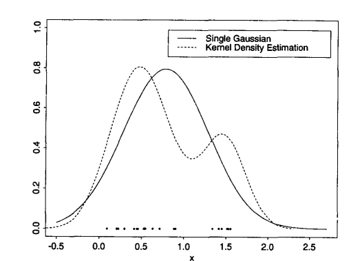

---

# Probability and Bayes' Rule

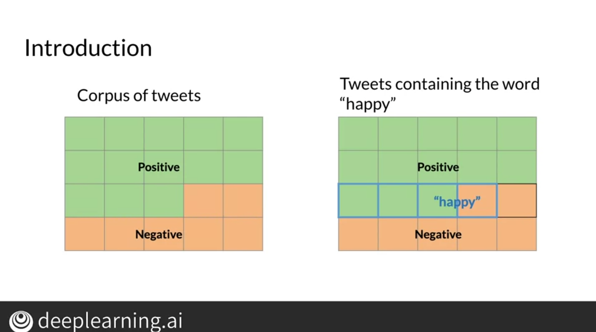

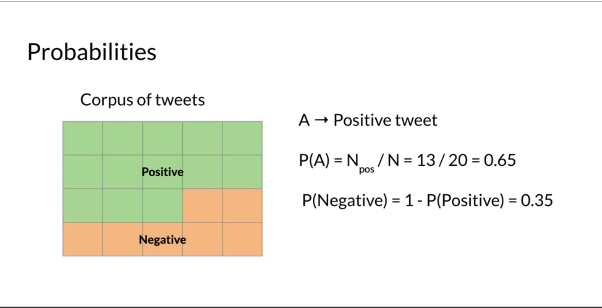

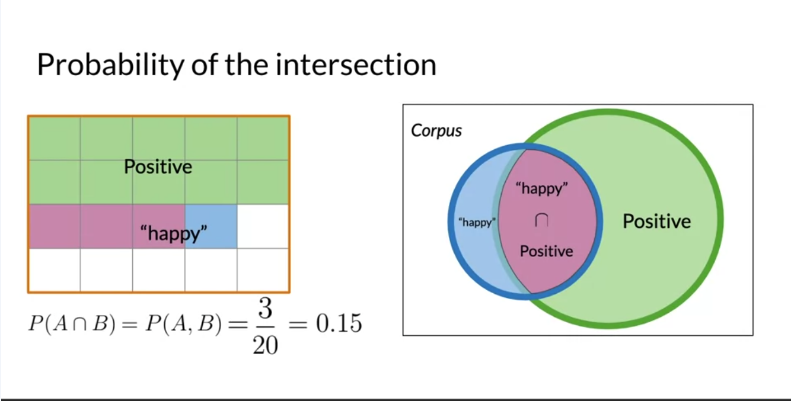

# Bayes' Rule

## Example

You test positive for a test where that is 99% accurate: correctly identifies 99% of people that
have the disease but only incorrectly identifies 1% of people who don't have the disease. What is
the chance you have the disease if you test positive?

$$ P(D|+) = P(+|D)\frac{P(D)}{P(+)} $$
$$ P(D|+) = P(+|D)\frac{P(D)}{P(+|D)P(D) + P(+|D')P(D')} $$

$$
P(D|+) = P(\text{Positive given you have Disease})\frac{P(\text{You have Disease})}{P(\text{Having Disease and
testing positive}) + P(\text{Not having disease but testing positive})}
$$

Another formulation is:

$$
P(D|+) = \frac{\text{Sensitivity} \times \text{Prevalance}}{\text{Sensitivity} \times \text{Prevalance} +
(1 - \text{Prevalance}) \times (1 - \text{Sensitivity})}
$$

---

_Sensitivity and Specificity Review_

- Ratio is always 'true' over 'all'
- 'seN' and 'sPe' are _opposite_ positive and negative.
- **Sensitivity** - ratio of true positives to all actual positives
- **Specificity** - ratio of true negatives to all actual negatives

## 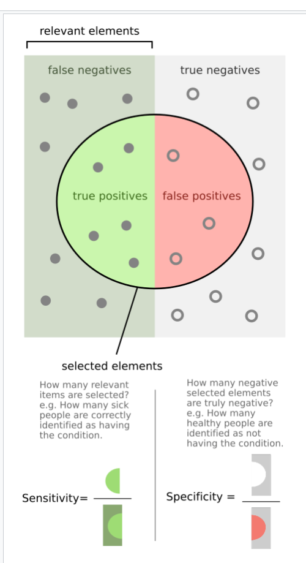

The prior is often hard to estimate, but in this case the disease prevalence in the population is a
good guess, 0.001:

$$P(D|+) = 0.99 \times \frac{0.001}{0.99 \times 0.001 + 0.01 \times 0.999} = 0.09$$

or 9%.

So why is the result so counterintuitive? The test is very accurate, but the disease is very rare.
Yes it will correctly identify 99% that have the disease, so it will identify that 0.001% very well.
But it also misidentifies 1% of the 99.9% that don't have the disease, so it will identify 0.01% of
the 99.9% that don't have the disease. So the test is more likely to be wrong than right.

|                    | x,P(+\|D) | y,P(D)                  |          |          |
| ------------------ | --------- | ----------------------- | -------- | -------- |
| disease prevalence |           | test accuracy wrong in… |          | accuracy |
| 1 in 1000          | 0.001     | 1 in 10000              | 0.9999   | 0.909165 |
| 1 in 10000         | 0.0001    | 1 in 100,000            | 0.99999  | 0.909098 |
| 1 in 100,000       | 0.00001   | 1 in 1 million          | 0.999999 | 0.909092 |

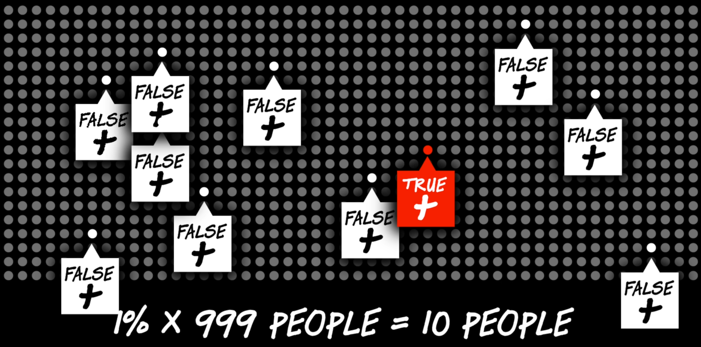

## Derivation

To remember the derivation: left side of equality conditional ('given'; right of "|") equality goes
in demoninator on rightside (also true of bayes formula generally) To remember bayes formula:
remember the same rule and just remember to put the X, Y in the right place

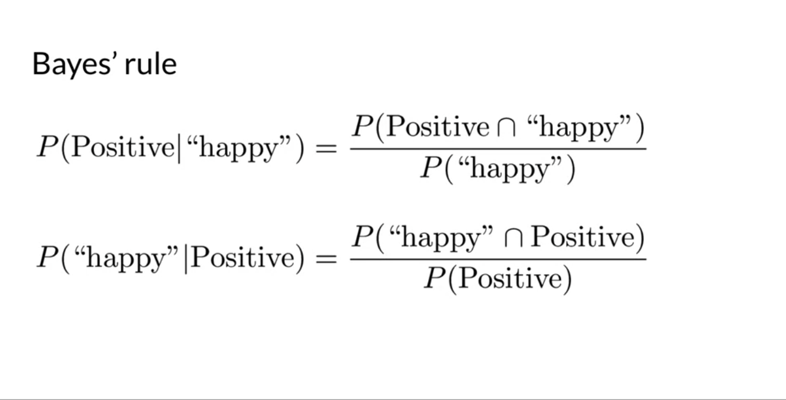

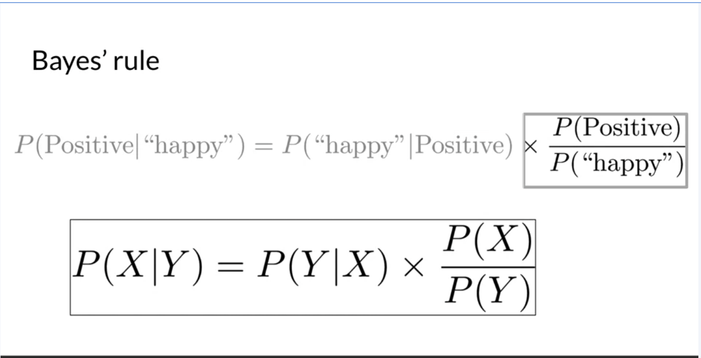

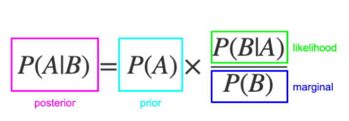

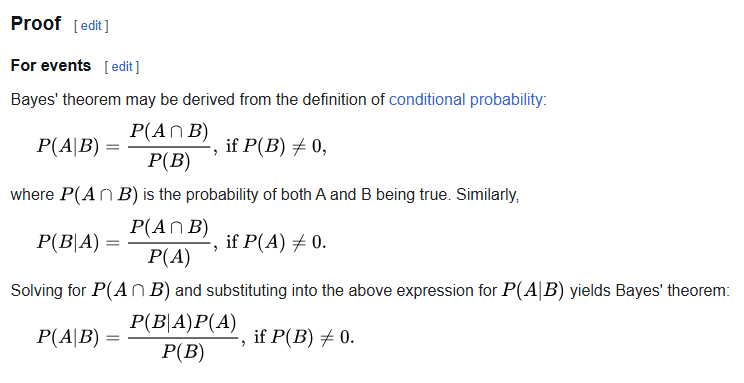

# Naive Bayes Intro

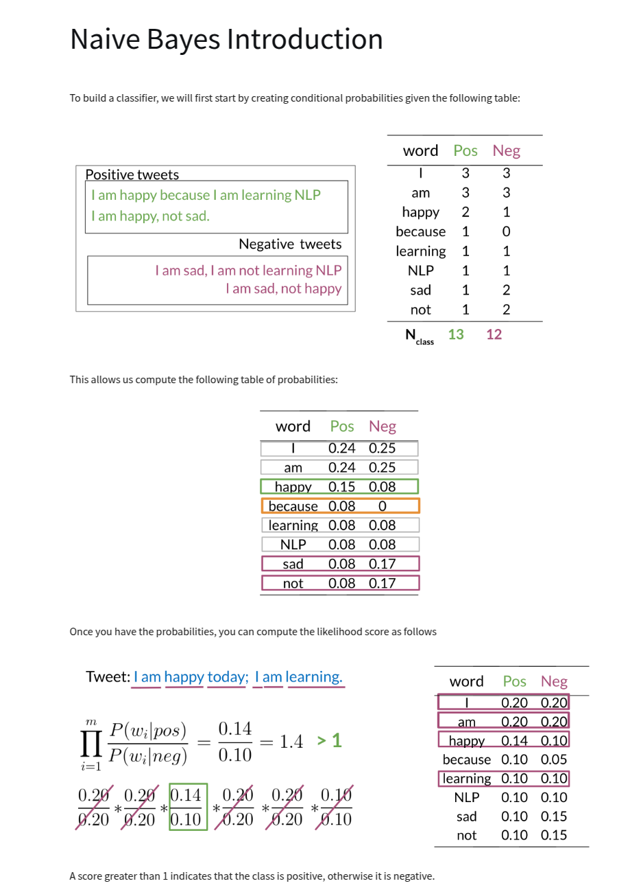

# Laplacian Smoothing

Modification to Naive Bayes formula to avoid zero probabilities.

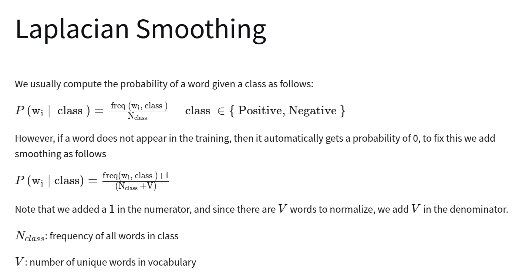

# Log Likelihood

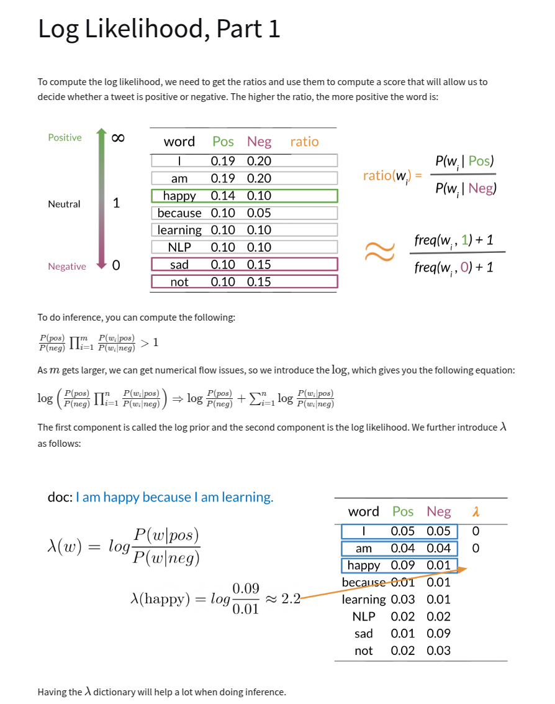

We are trying to calculate the probability of a class given the evidence. From bayes formula:

$$P(C|E) = \frac{P(E|C)P(C)}{P(E)}$$

We need the prior and likelihood. The marginal is a normalization constant and doesn't appear in
classification calculations. The product of the prior and all likelihoods across evidence in the
case (words in tweet in our example) gives us the likelihood. The log is taken to avoid numerical
underflow and ease optimization.

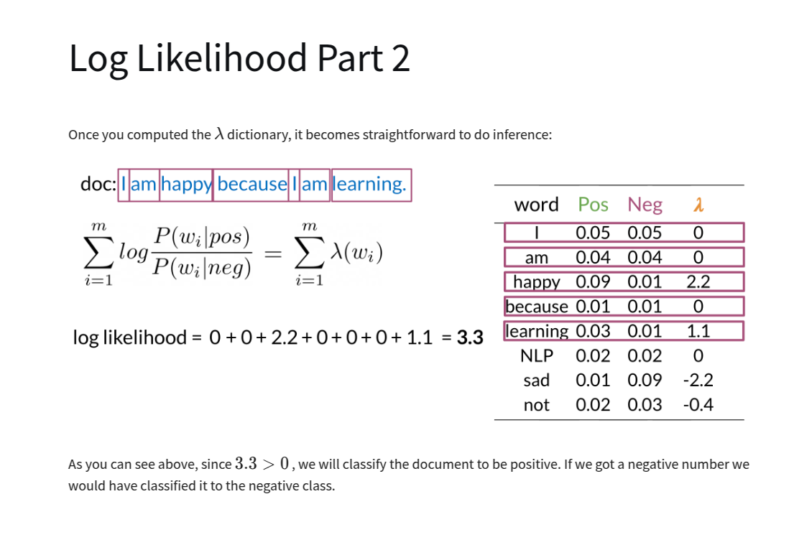

# Training Naive Bayes

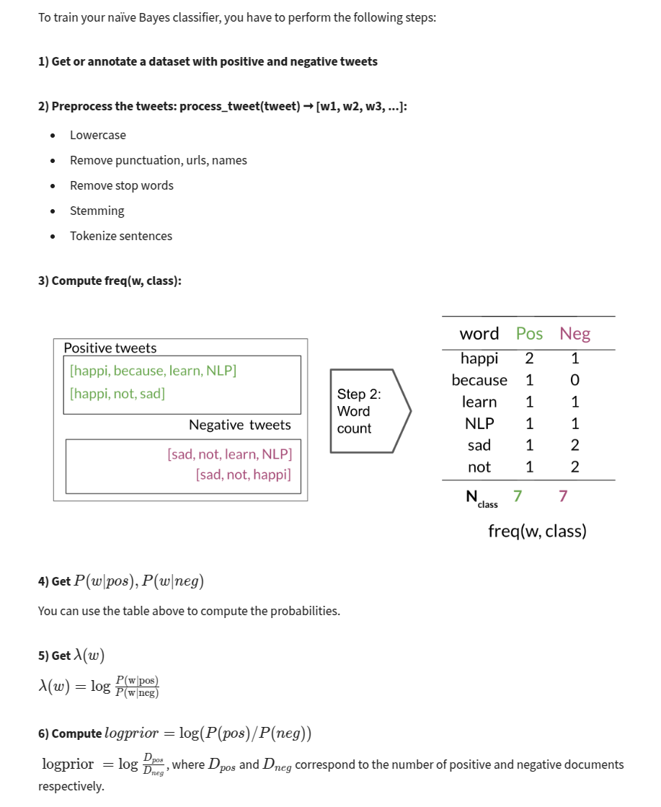

# Testing Naive Bayes

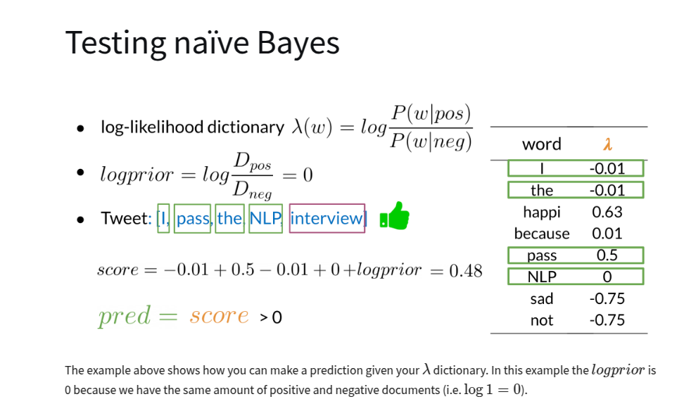

# Applications of Naive Bayes

- Author identification - i.e. who wrote a particular document
- Spam filtering
- Information retrieval
- Word disambiguation - i.e. bank (financial institution) vs bank (side of a river)

# Naive Bayes Assumptions

# Error Analysis

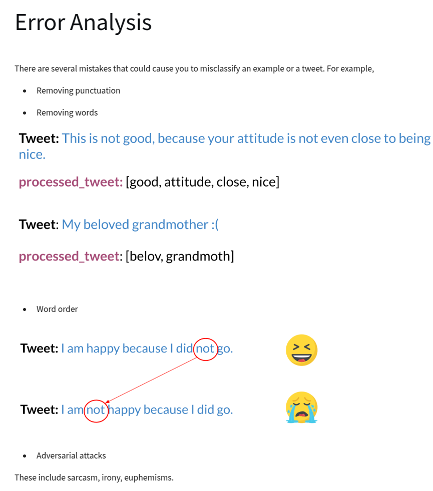
