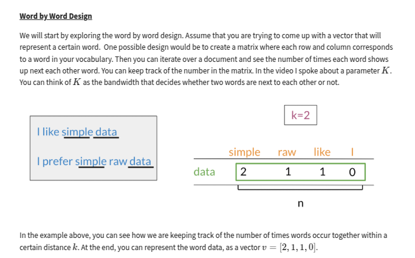
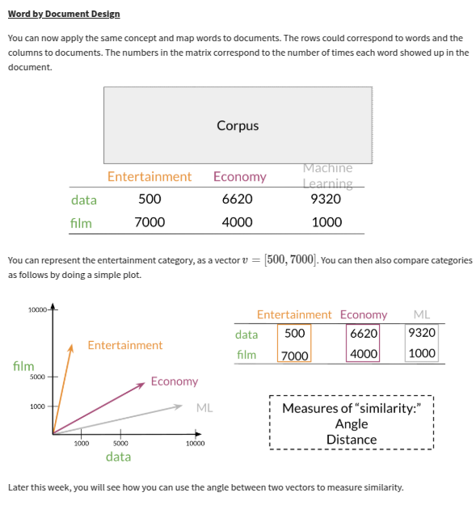
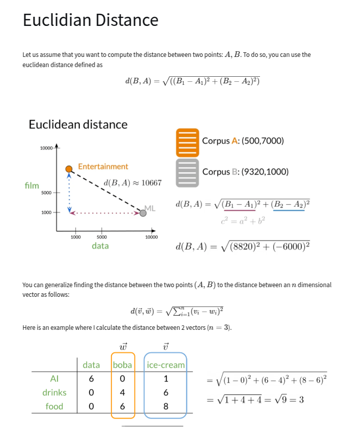
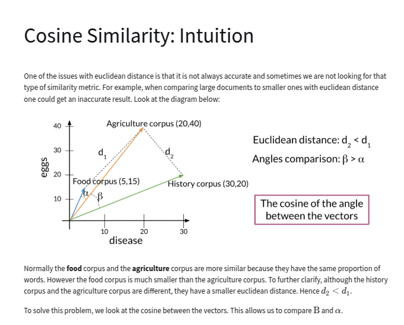
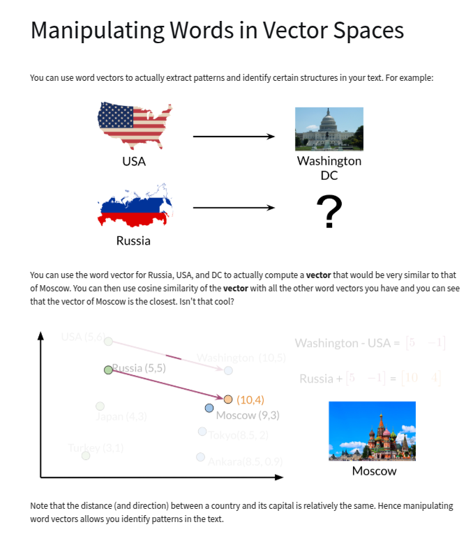
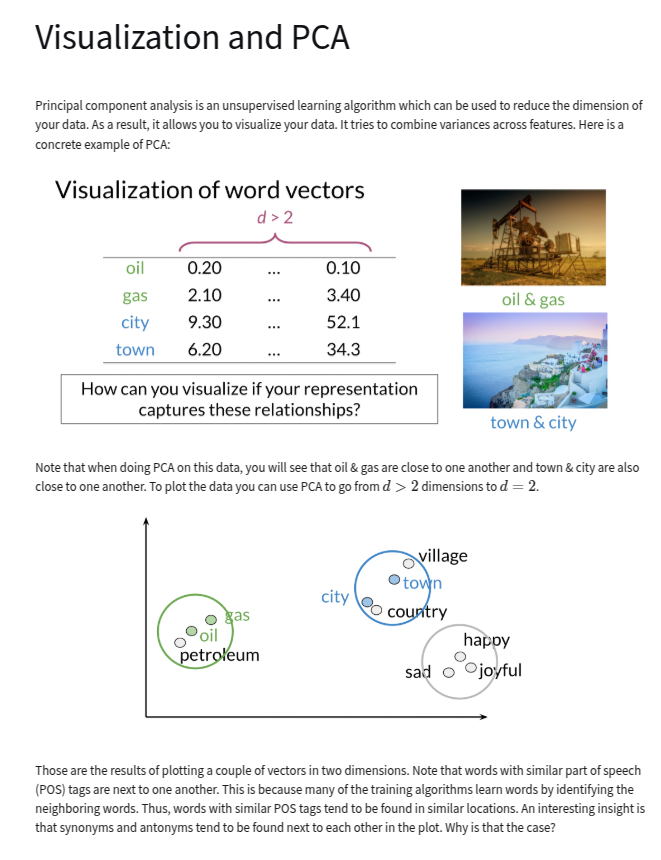
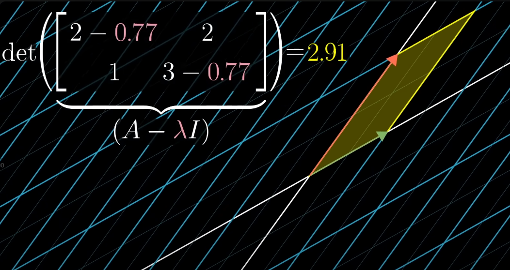
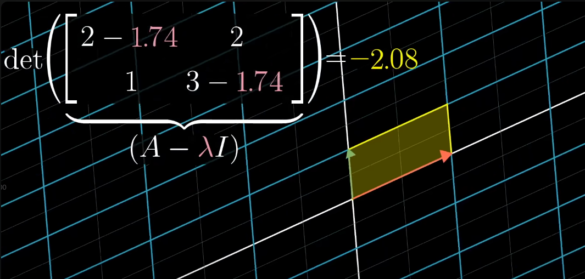
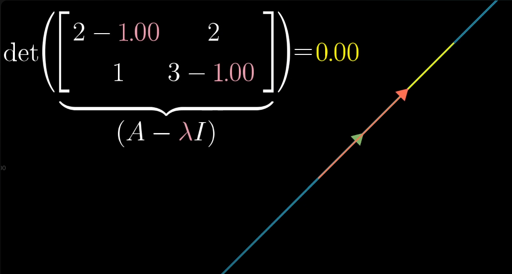

# Vector Space Models and PCA

## Introduction

This lecture is a introductory description of vector space models. We will not discuss more
complicated embedding algorithms like Word2Vec, but the basics here will be useful for understanding
those more advanced models.

Vector Space Models are used for various purposes:

- Information Extraction
- Machine Translation
- Chatbots

## Vector Designs

- Word by Word - Get co-occurrence within a distance of k

- Word by Doc - Get word per document counts

- Word co-location and naive vector space model

## Similarity metrics

### Euclidean distance

### Cosine similarity

Using these definitions:

- Vector norm

<!-- prettier-ignore-start -->
$$ \|\mathbf{v}\| = \sqrt{\sum^{n}_{i=1} v_i^2} $$
<!-- prettier-ignore-end -->

- Dot product

<!-- prettier-ignore-start -->
$$ \mathbf{v} \cdot \mathbf{w} = \sum_{i=1}^{n} v_i w_i $$
<!-- prettier-ignore-end -->

and the definition of the dot product:

$$ \mathbf{v} \cdot \mathbf{w} = \|\mathbf{v}\| \|\mathbf{w}\| \cos(\theta) $$

we can solve for the cosine of the angle between two vectors:

$$ \cos(\theta) = \frac{\mathbf{v} \cdot \mathbf{w}}{\|\mathbf{v}\| \|\mathbf{w}\|} $$

which is the cosine similarity. Because the sum of the products of each dimension is normalized by
the length of the vectors, the size of the vectors don't matter in this calculation.

### PCA - Principal Component Analysis

- This is also called 'Princpal Compoents Regression' in the context of regression: reduce the
  dimensionality of the data and then perform regression on the reduced data.

---

#### Eigenvalues and Eigenvectors

(Great Explainer by 3brown1blue: https://www.youtube.com/watch?v=PFDu9oVAE-g)

---

**To Remember Forever**

- 'eigen' from German word for 'own'
  - An eigenvector is a vector that doesn't change its direction when a linear transformation is
    applied to it
  - The eigenvalue is the scalar that represents how the eigenvector was scaled during the linear
    transformation

---

$$ A \mathbf{v} = \lambda \mathbf{v} $$

where:

- `A` is a square matrix
- `v` is an eigenvector
- `λ` is an eigenvalue

This can be transformed to:

$$ (A - \lambda I) \mathbf{v} = 0 $$

So we are looking for a vector that when multiplied by the matrix $A - \lambda I$ results in the
zero vector. This can only happen if the transformation associated with this matrix reduces space to
a lower dimension. This corresponds to a zero determinant of the matrix $A - \lambda I$.

$$ \det(A - \lambda I) = 0 $$

What the determinant equaling zero means geometrically.

Where do we see Eigenvalues and Eigenvctors in data science?

- PCA
  - PCR
- Ridge Regression
- LDA
- Smoothing Splines
- Geometric Transformations
- Gaussian Radial Basis functions
- Spectral Graph Theory
- Markov Chains
- 'Eigenfaces'
- Many more.

(Non-data science: vibration analysis, Schrodinger's equation, tensor moment of inertia, molecular
orbitals, wave transport)

#### SVD - Singular Value Decomposition

An important component of one version of PCA algorithm is the Singular Value Decomposition (SVD). It
is also used in:

- LSA
- Image compression
- Recommender Systems
- Collaborative Filtering
- Data Clustering

---

**To Remember Forever**

SVD is a matrix factorization technique that decomposes a matrix into three matrices. For a matrix
`X`, the SVD is given by:

$$ A = U \Sigma V^T $$

where:

- `U` is an `m x m` unitary matrix
  - Unitary matrices are matrices where the conjugate transpose is the inverse of the matrix
- `Σ` is an `m x n` rectangular diagional matrix with the 'singular values' on the diagonal
- `V^T` is an `n x n` unitary matrix

---

This is a more-general form of matrix factorization derived from ordinary diagionalization where the
matrix can be factored by:

$$ A = Q \Lambda Q^{-1} $$

and the left and right (inverted) matrices are the same.

The eigenvalues of A measure the degree to which the eigenvectors stretch the data. If $\lambda_1$
is the eigenvalue with the greatest value then the corresponding eigenvector $v_1$ is the direction
in which the data is most stretched.

##### SVD Algorithm

Algorithm:

- Compute $A^T A$
- Find the eigenvalues of $A^T A$
  - Can be solved via the characteristic equation: $\det(A^T A - \lambda I) = 0$
- Find the eigenvectors of $A^T A$
  - Get reduced echelon form of $[A - \lambda I | 0]$ by Gaussian elimination or other methods
- Normalize the eigenvectors
- U is the matrix of normalized eigenvectors of $A^T A$, $v_1, v_2, \ldots, v_n$
- $\Sigma$ is the square root of eigenvalues of $A^T A$ along the diagonal -- these are called the
  _singular values_
- $V^T$ is the matrix of eigenvectors of A transformed eigenvectors: $A v_1, A v_2, \ldots, A v_n$

##### SVD Example

$$
SVD(A) = AA^T = U \Sigma V^T
$$

Example:

$$
SVD(A) = SVD\left(
\begin{bmatrix}
4 & 11 & 14 \\
8 & 7 & -2 \\
\end{bmatrix}
\right)
$$

$$
A A^T =
\begin{bmatrix}
4 & 11 & 14 \\
8 & 7 & -2 \\
\end{bmatrix}
\begin{bmatrix}
4 & 8 \\
11 & 7 \\
14 & -2 \\
\end{bmatrix}
=
\begin{bmatrix}
80 & 100 & 40 \\
100 & 170 & 140 \\
40 & 140 & 200 \\
\end{bmatrix}
$$

$$
U \Sigma V^T =
\begin{bmatrix}
-0.3333 & 0.6667 & 0.6667 \\
-0.6667 & 0.3333 & -0.6667 \\
-0.6667 & -0.6667 & 0.3333
\end{bmatrix}
\begin{bmatrix}
6\sqrt{10} & 0 & 0 \\
0 & 3\sqrt{10} & 0 \\
0 & 0 & 0
\end{bmatrix}
\begin{bmatrix}
-0.3333 & -0.6667 & -0.6667 \\
0.6667 & 0.3333 & -0.6667 \\
0.6667 & -0.6667 & 0.3333
\end{bmatrix}
$$

The middle matrix, $\Sigma$, is a diagonal matrix with the singular values along the diagonal.

#### PCA Algorithms

There are two ways to perform PCA:

1. Using the covariance matrix
2. Using the SVD

<!--
TODO:
- Description of NMF and how we used it in topic models
- Exploration of PCA notebook for tier score
  - Scree plot
  - Is number of findings dominating

-->

##### Using the Covariance Matrix

---

**To Remember Forever**

Input: Data matrix X (m × n) with m samples and n features  
Output: Reduced data matrix X' (m × k), where k ≤ n

1. Center the data:

$$ X\_{\text{centered}} = X - \text{mean}(X) $$

2. Compute the Covariance Matrix:

$$ Cov(X) = \frac{1}{m-1} X^T X $$

3. Compute the eigenvectors and eigenvalues of the covariance matrix:

$$ Cv = \lambda v $$

4. Select the top k principal components:

   - Sort the eigenvalues in descending order
   - Choose k based on variance explained or predefined value
   - Select the first k columns of V^T: V_k = V^T[:k]

5. Transform the data:

   - Project the data onto the new basis: X' = X_centered × V_k^T

Important results and interpretation:

- The last step has three matrices $Z = X W $, the original (centered) data, X, the eigenvectors, W,
  and the transformed data, Z
  - The top k vectors in Z are the principal components, they explain the data the best
  - The eigenvectors in W also represent the principal components and the eigenvalues represent the
    variance explained by each principal component. Remember: the eigenvectors don't change
    direction under transformation.
- Because we are getting the eigenvectors of the **covariance matrix**--a measure of how much each
  variable correlates with others--we have a transformation that **maximizes the variance** of the
  data (stretches it the most).

---

##### Using the SVD

Once you decompose the matrix $A$ into $U$, $\Sigma$, and $V^T$ you will have:

- The principal components are the **right singular vectors** in the columns of $V^T$
- The variance explained by each prinicpal component is proportional to the square of the singular
  values in $\Sigma$

6. Return X' (dimensionality-reduced data)

## Other Relevant Dimensionality Reduction

- PCA - Principal Component Analysis
- SVD - Singular Value Decomposition
- NMF - Non-negative Matrix Factorization
- t-SNE - t-distributed Stochastic Neighbor Embedding
- LDA - Latent Dirichlet Allocation
- LSA - Latent Semantic Analysis
