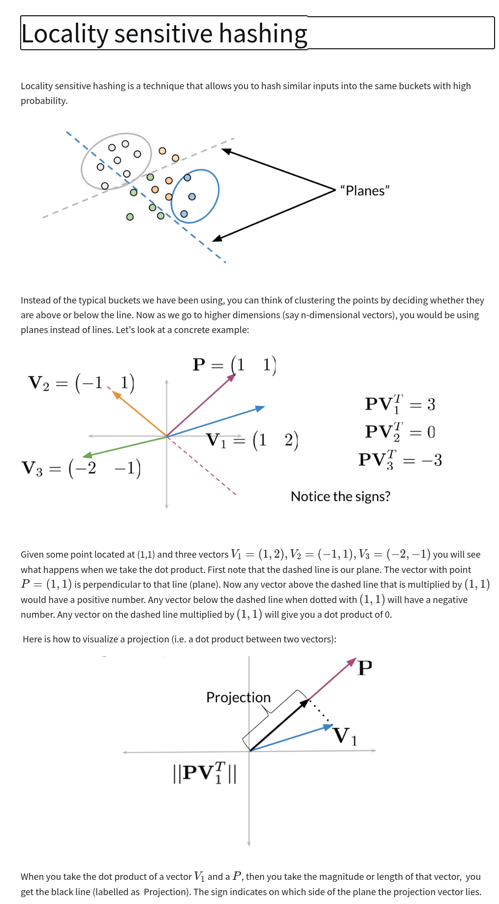
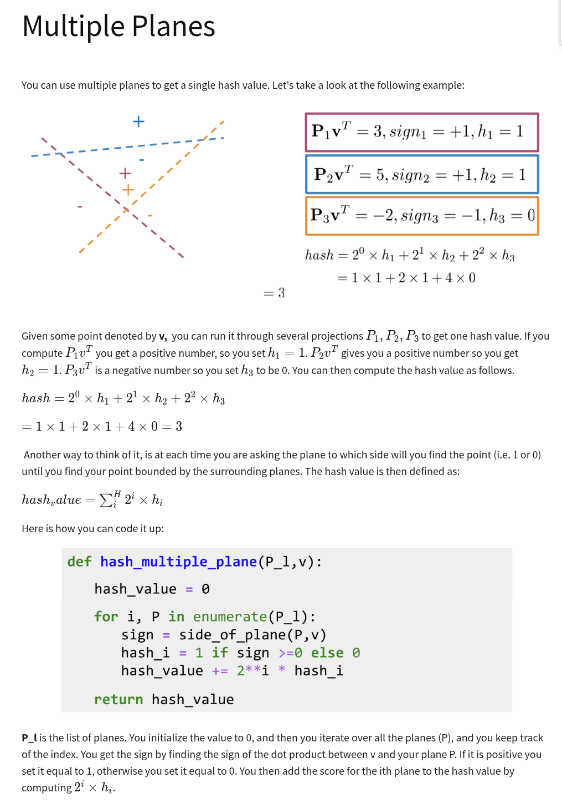

# Machine Translation and Documentation Search

## Review from Week 3

<u>**'eigen' from German word for 'own'**</u>

- $Av = \lambda v$
- Eigenvector = vector that doesn't change under linear transformation
- Eigenvalue = scale of the transformation

<u>**Singular Value Decomposition (SVD)**</u>

- Given Matrix $A$ that you will decompose $\color{red} A = U \Sigma V^T $
- Algorithm
  1. Find the eigenvalues of $A^T A$
     - Can be solved via the characteristic equation: $\det(A^T A - \lambda I) = 0$
  1. Find the eigenvectors of $A^T A$, and normalize
     - Get reduced echelon form of $[A - \lambda I | 0]$ by Gaussian elimination or other methods
  1. Form Decomposition $A = U \Sigma V^T$
     - U is the matrix of normalized eigenvectors of $A^T A$, $v_1, v_2, \ldots, v_n$
     - $\Sigma$ is the square root of eigenvalues of $A^T A$ along the diagonal -- these are called
       the <span style="color:yellow">**singular values**</span>
     - $V^T$ is the matrix of eigenvectors of A transformed eigenvectors:
       $A v_1, A v_2, \ldots, A v_n$
- PCA from SVD:
  - The <span style="color:red">**principal components**</span> are the **right singular vectors**
    in the columns of $V^T$ - The <span style="color:yellow">**square of singular values is variance
    explained**</span> Example
    $$
    U \Sigma V^T =
    \begin{bmatrix}
    -0.3333 & 0.6667 & 0.6667 \\
    -0.6667 & 0.3333 & -0.6667 \\
    -0.6667 & -0.6667 & 0.3333
    \end{bmatrix}
    \color{yellow}
    \begin{bmatrix}
    6\sqrt{10} & 0 & 0 \\
    0 & 3\sqrt{10} & 0 \\
    0 & 0 & 0
    \end{bmatrix}
    \color{red}
    \begin{bmatrix}
    -0.3333 & -0.6667 & -0.6667 \\
    0.6667 & 0.3333 & -0.6667 \\
    0.6667 & -0.6667 & 0.3333
    \end{bmatrix}
    $$

<u>**PCA from Covariance Matrix**</u>

- Input: Data matrix X (m × n) with m samples and n features
- Output: Reduced <span style="color:red">**principle components**</span> data matrix, X' (m × k),
  where k ≤ n, and <span style="color:yellow">**engenvalues of the covariance matrix describing
  variance explained**</span>
- Algorithm:

  1. Center the data: $$X_{\text{centered}} = X - \text{mean}(X)$$
  1. Compute the Covariance Matrix: $$ Cov(X) = \frac{1}{m-1} X^T X $$
  1. Compute the eigenvectors and eigenvalues of the covariance matrix: $$ Cv = \lambda v $$
  1. Select the top k principal components: - Sort the eigenvalues in descending order - Select the
     first $k$ columns of $V^T$: $V_k = V^T[0..k]$
  1. Transform the data: - Project the data onto the new basis:

     ${\color{red} \textbf X'} = X_{\text{centered}} × {\color{yellow} \textbf V_k^T}$

<u>**PCA Notebook Summary**</u>

- Vector Math and Cosine Similarity
  - The previous talk on 'Vector Space Models' used word embeddings and cosine similarity to find a
    country of a capital city based on the vector relations between cities and countries.
    $$v_{\text{country2}} = v_{\text{country1}} -  v_{\text{capital1}} + v_{\text{capital2}}$$
  - For example: $$v_{\text{country2}} = v_{\text{Athens}} -  v_{\text{Greece}} + v_{\text{Cario}}$$
  - The cosine similarity is calculated between this calculated vector and all other vectors to find
    the unknown country vector. In the example above, the vector with the smallest cosine similarity
    should be the vector for Egypt.
- PCA dimensionality reduction to visualize embeddings
  - Using algorithm above, reduce the demsionality of 300 down to 2
  - Plot these 2 dimensions to visualize the embeddings. Even these 2 dimensions (which explain the
    most variance) can group similar words.

---

## Transforming word vectors

Word vectors can be transformed from one space to another. For example, if we have word vectors in
English and we want to transform them to French, we can use a transformation matrix $R$ to do this.

### Steps required to learn $R$


<!-- prettier-ignore-start -->

1. Initilize $R$
1. For loop
   - Calculate **Frobenius norm** for Loss
     - $ \text{Loss} = \|XR - Y \|_F$
     - $ g = \frac{d}{dR}\text{Loss}$
     - $ R = R - \alpha \star g$

<!-- prettier-ignore-end -->

Example how Frobenious norm is calculated:

$$
A = \begin{bmatrix}
2 & 2 \\
2 & 2
\end{bmatrix}
$$

<!-- prettier-ignore-start -->

$$ \|A\|_F = \sqrt{2^2 + 2^2 + 2^2 + 2^2} = \sqrt{16} = 4 $$

$$
\|A\|_F = \sqrt{\sum_{i=1}^m
\sum*{j=1}^n |a*{ij}|^2} = \sqrt{a*{11}^2 + a*{12}^2 + a*{21}^2 + a*{22}^2}
$$

<!-- prettier-ignore-end -->

## K-Nearest Neighbors

## Hash Function

A hash function is any function that can be used to map data of arbitrary size to fixed-size values.
The values returned by a hash function are called hash values.

We see hash functions used in many applications, including:

- password encryption/storage
- data integrity verification
- digital signatures

MD5, SHA-1, and SHA-256 are all examples of hash functions.

```bash
$ echo -n "hello world" | md5sum
5eb63bbbe01eeed093cb22bb8f5acdc3
```

```bash
$ echo -n "hello world" | sha1sum
2aae6c35c94fcfb415dbe95f408b9ce91ee846ed
```

```bash
$ echo -n "hello world" | sha256sum
a591a6d40bf420404a011733cfb7b190d62c65bf0bcda190f2c91f8b3c4e9e91
```

In linux the password is hashed using `yescrypt` Key Derivation Function (KDF) and stored in the
`/etc/shadow` file. The `yescrypt` KDF is a memory-hard function that is designed to be slow and
difficult to compute, making it more resistant to brute-force attacks. You can reproduce the hash
found in the `/etc/shadow` file by running the following command:

```bash
# /etc/shadow format starts $6$SALT$HASH:LAST_CHANGE:MIN:MAX:WARN:INACTIVE:EXPIRED:LOGIN_COUNT:AGE
# see man https://www.cyberciti.biz/faq/understanding-etcshadow-file/
$ openssl passwd -6 -salt <salt found in /etc/pass for user> <user's password>
```

For security purposes, hash functions can be made to be hard to compute so slow down brute-force
attacks from high-performance computers. However, outside the security domain, hash lookups are
$O(1)$, can be accessed in constant time.

Python dictionaries are an example of a hash table.

```python
# Hash table
hash_table = {
    "key1": "value1",
    "key2": "value2",
    "key3": "value3"
}
```

Regardless of the size of the hash table, the time complexity for searching for a key is $O(1)$.
This is because the key itself defines the location in memory and no sorting or searching is
required.

### Locality Sensitive Hashing

Sometimes we want to hash values but for values to have relationships so that hash values will group
similar values together. This is called locality sensitive hashing (LSH). This would be dangerous in
the security domain where we don't want any information of the password to be determined by the
algorithm, but for lookups, LSH is a useful technique.





## Notebook Example

### Word Embeddings for English and French Words

- Given word embeddings and English to French dictionary
  - It appears that embeddings come from word2vec (Gensim)
- Create embedding matrix `get_matrices` which is a (vertically) stacked matrix of the word vectors
  (also for training subset)

### Translations

Summary: If we have a transformation across word embeddings in English to French, we can compute the
nearest neighbor to any general English embedding to get likely French translation.

- Finding the transformation matrix involves finding an R that minimizes the norm of the difference
  between the transformed English embedding and the French embedding.

$$\arg \min _{\mathbf{R}}\| \mathbf{X R} - \mathbf{Y}\|_{F}\tag{1} $$

Here we use the Frobenius norm:

$$\|\mathbf{A}\|_{F} \equiv \sqrt{\sum_{i=1}^{m} \sum_{j=1}^{n}\left|a_{i j}\right|^{2}}\tag{2}$$

In practice, the square of the Frobenius norm is used to make it easier to compute the gradient, and
we divide by the number of words, $m$ to get the average loss over the examples because loss can
increase with dictionary size.

$$\frac{1}{m} \| \mathbf{X R} - \mathbf{Y} \|_{F}^{2}$$

- To minimize the elements of R, we calculate the gradient of the loss and perform Gradient Descent.
  The derivative is:

$$\frac{d}{dR}𝐿(𝑋,𝑌,𝑅)=\frac{d}{dR}\Big(\frac{1}{m}\| X R -Y\|_{F}^{2}\Big) = \frac{2}{m}X^{T} (X R - Y)$$

<div style="background-color: rgb(87, 61, 61);">

<font color="red">**To Remember Forever**</font>

#### Early Stopping

Early stopping is a technique used to prevent overfitting in machine learning models. It involves
monitoring the model's performance on a validation set during training and stopping the training
process when the performance starts to degrade.

</div>

### LSH and Document Search
