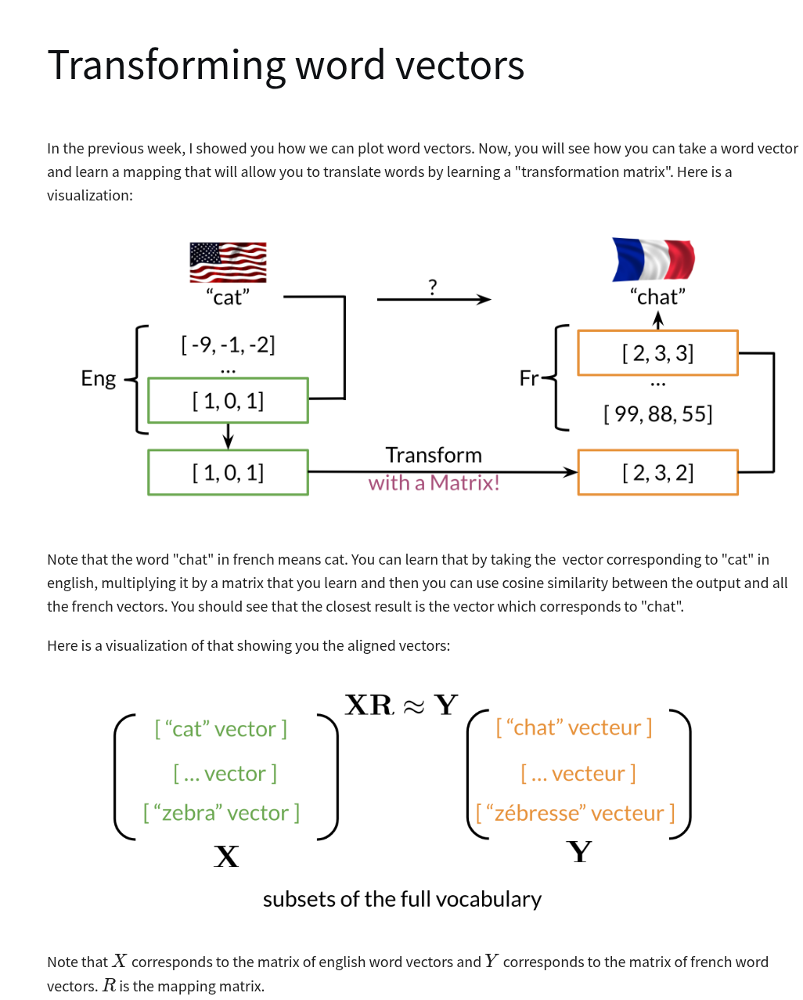

# Machine Translation and Documentation Search

## Steps required to learn $R$

1. Initilize $R$
1. For loop
   - Calculate **Frobenius norm** for Loss
     - $ \text{Loss} = \|XR - Y \|\_F$
     - $ g = \frac{d}{dR}\text{Loss}$
     - $ R = R - \alpha \star g$

Example how Frobenious norm is calculated:

$$
A = \begin{bmatrix}
2 & 2 \\
2 & 2
\end{bmatrix}
$$

$$ \|A\|\_F = \sqrt{2^2 + 2^2 + 2^2 + 2^2} = \sqrt{16} = 4 $$

$$
\|A\|\_F = \sqrt{\sum_{i=1}^m
\sum*{j=1}^n |a*{ij}|^2} = \sqrt{a*{11}^2 + a*{12}^2 + a*{21}^2 + a*{22}^2}
$$

## K-Nearest Neighbors

## Hash Function

A hash function is any function that can be used to map data of arbitray size to fixed-size values.
The values returned by a hash function are called hash values.

### Locality Sensitive Hashing
