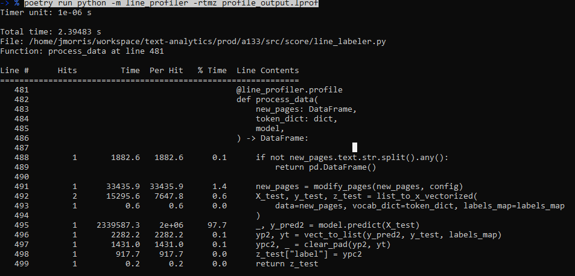
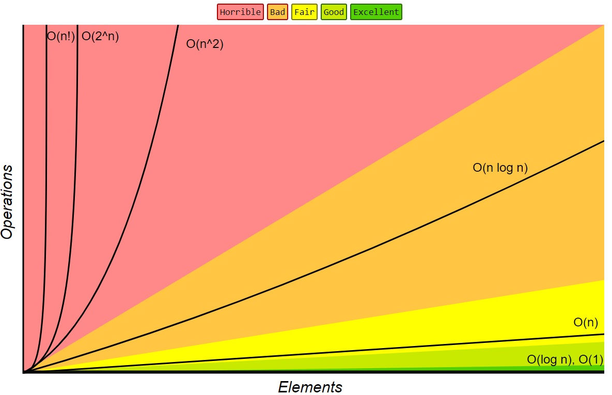
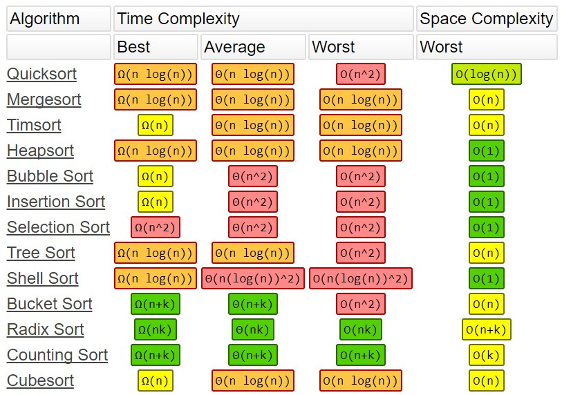
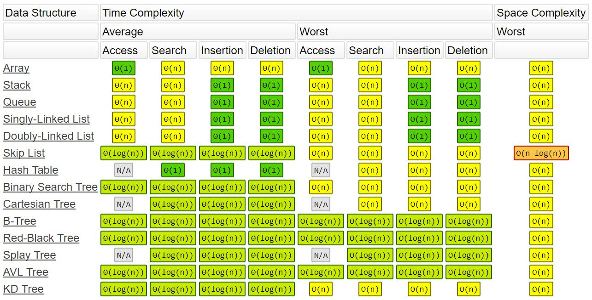
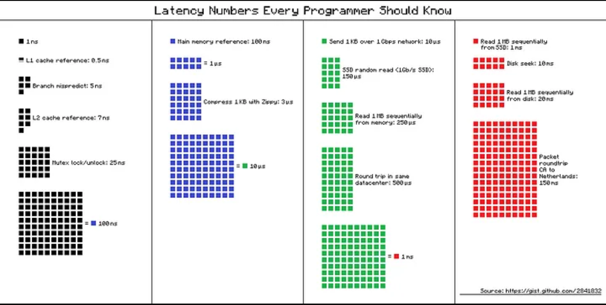

# Practical High Performance Computing - Python

Outside of the formal content found in HPC courses and books there are on-the-ground relevant
information for data scientists. Formal textbooks go deeper into the subject for hardware engineers
for specialized applications; Practical HPC for data scientists should be centered around
usually-softer requirements, and deployed Python.

## Summary: How do you get a program to complete faster?

- **Parallelism**: Divide the work among multiple processors.
- **Clustering**: Divide the work among multiple computers.
- **Vectorization**: Use SIMD instructions to perform the same operation on multiple data elements.
- **Memory access**: Minimize the time spent waiting for data to be fetched from memory.
- **Algorithmic improvements**: Use a better algorithm.
- **Hardware**: Use faster hardware.
- **Profiling**: Identify the bottlenecks in your code.
- **Tuning**: Optimize the code for the bottlenecks.

## Two major problems for AI/ML Engineers (and Data Scientists):

- Getting a program to complete faster.
- Giving the resources necessary to complete the program.

# General Performance profiling workflow.

## The "is it worth it question"

- Remember your requirements
  - For low throughput, batching on weekly cadence, the requirements for speed are minimal
  - For realtime applications, the requirements may be stringent

## Memory question: is there enough memory to complete (quickly)

- Here `top` or `mem` is your friend.
  - In Sagemaker, the memory usage popup is helpful
  - AWS Cloudwatch will also show memory usage of machines
- You can also watch memory as you run:
  - `while true; do awk '/MemAvailable/ { printf "%.3f \n", $2/1024/1024 }' /proc/meminfo; sleep 10; done`
- Does the program fit in memory or does it spill to disk.
  - Disk will be orders of magnitude slower than memory.
  - Some libraries and platforms like Pandas on Sagemaker will usually crash if memory is exhausted.
- If it doesn't spill to disk then you don't need any more memory than is required to run the
  program.
- If it does spill to disk or crash, try and scale up the machine with more memory.
  - Cloud computing allows one to scale up to over a terrabyte of memory and beyond, however this
    could be expensive depending on the workflow.
- If you cant scale up, consider distributed computing with Spark clusters or Hadoop

## Processor question

- Here `top` or `htop` is your friend
  - There is a gpu equivalent: `nvidia-smi`
  - AWS Cloudwatch will also show CPU usage of machines
- Remember your theory:
  - Big-O: how does the algorithm scale with the size of the input
    - AKA: "The order of algorithmic complexity"
- Profile your code
  - `trace` is a good tool to see real-time which parts of your code are slow
    - `python -m trace --trace myscript.py`
    - You will probably want to ignore library directories, this may work or you can specify it
      manually:
      - `python -m trace -g -t --ignore-dir=$(python -c 'import sys ; print(":".join(sys.path)[1:])') line_labeler.py`
    - This can show you realtime bottlenecks but you dont' get a top-level view
  - `line-profiler` is a good tool for showing which part of your code is slow
    
- Is the program slow?
  - If it's slow, then you need to determine if it's CPU bound or IO bound.
  - If it's CPU bound try and vectorize your code (works well with dataframes and arrays)

## Theory: review of algorithmic complexity

How fast do the following algorithms go:

- Nested for loop: O(n^2)
- Sorting: O(n log n)
- Searching: O(log n)
  - Searching through an alphabatized list (e.g. phonebook)
- Hashing: O(1)
- Vectorization: O(n)

### Hashing Review: How does hashing work:

- Algorithm with low collisions that map to memory address
  - The question itself (what to lookup) gives you the location of the answer

```python
in_1_not_2 = [el for el in giant_list1 not in giant_list2] ]
#vs
in_1_not_2 = set(giant_list1) - set(giant_list2) # MUCH faster
```

Why is this faster?

- The first example is O(n^2) because it has to search through the list for each element in the list
- The second example is O(n) because it doesnt need to search. It just needs to hash the elements
  and compare the hashes.





```python
# This takes 3350ms
v1_scaled = np.zeros((1000000, 1))
for i in range(len(v1)):
    v1_scaled[i] = 2 * v1[i]
# vs
# This takes 11ms
v1_scaled = np.zeros((1000000, 1))
v1_scaled = 2 * v1
```

- Vectorization is a different way of thinking about the problem, but it's much faster.
  - Instructions called SIMD - Single Instruction Multiple Data
- If you can't vectorize, then you can try parallelism.
  - Paralleization is not easy to implment. Many libraries do not support it (e.g. `igraph`,
    `requests` even `pandas` natively)
  - Consider other data processing libraries (e.g. `dask`, `polars`, `duckdb`) which have
    parallelism builtin
  - In python be aware of the GIL (Global Interpreter Lock) which prevents true parallelization.
    native parallelization or other features that allow for faster processing.
    - TODO: describe GIL
    - GIL does not apply for IO-bound tasks.
      - So if you want to download multiple files simultaneously, you can use threads to do so, the
        GIL will not prevent you from doing so.

```python
from concurrent.futures import ProcessPoolExecutor, ThreadPoolExecutor
def multithreading(func, args, workers):
    with ThreadPoolExecutor(workers) as ex:
        res = ex.map(func, args)
    return list(res)
def multiprocessing(func, args, workers):
    with ProcessPoolExecutor(workers) as ex:
        res = ex.map(func, args)
    return list(res)
```

[Multigrheading VS MultiProcessing][1]

- You will often have to roll your own with CPU parallelization libraries:
  - `multiprocessing`
  - `Parallel` from `joblib`
  - `threading`
- GPUs have 16000 CUDA cores (RTX 4090), vs CPUs which max out around 128 cores
- For even greater parallelization you can use GPU parallelization with libraries like `cupy` or
  `numba`, but it's easier to use libraries that natively support GPUs like `tensorflow`, `pytorch`,
  or `cuDF`.
- If you can't parallelize, the number of cores of a machine or any number of GPUs wont help you.
  - Try and get a machine with the fastest CPU clock speeds and turbo boost (in aws z-series, or
    c-series)
- You may need to do convert funcitions to C by using `cython` or in some cases you may need to
  rewrite the code in a more performant langauge like C
- If you still need more speed consider distributed computing with Spark clusters or Hadoop

_Disk question_

- If it's CPU bound, you can use parallelism, vectorization, or algorithmic improvements.
- If it's IO bound, you can use clustering or memory access improvements.

## How do you get a program to complete faster?

- **Parallelism**: Divide the work among multiple processors.
- **Clustering**: Divide the work among multiple computers.
- **Vectorization**: Use SIMD instructions to perform the same operation on multiple data elements.
- **Memory access**: Minimize the time spent waiting for data to be fetched from memory.
- **Algorithmic improvements**: Use a better algorithm.
- **Hardware**: Use faster hardware.
- **Profiling**: Identify the bottlenecks in your code.
- **Tuning**: Optimize the code for the bottlenecks.

### Speed of different computer components


