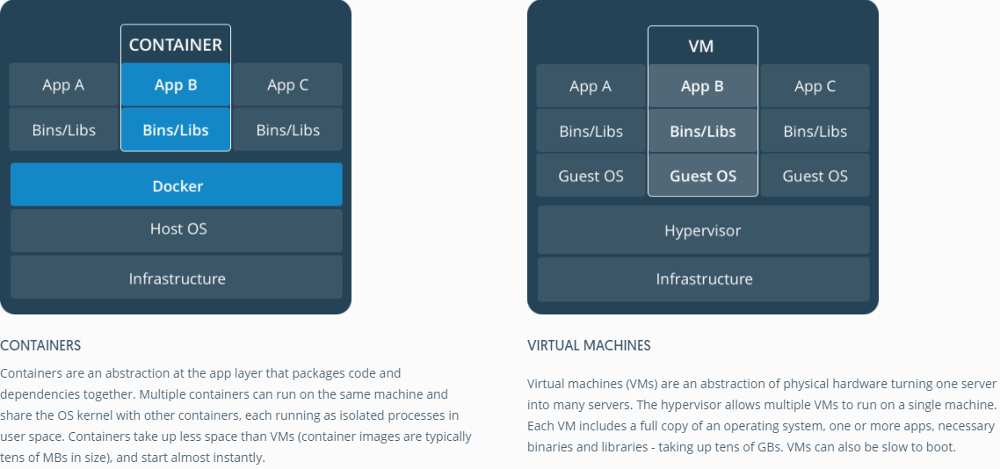
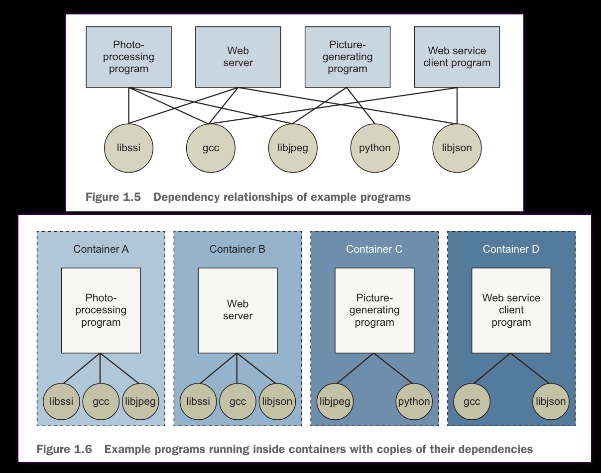
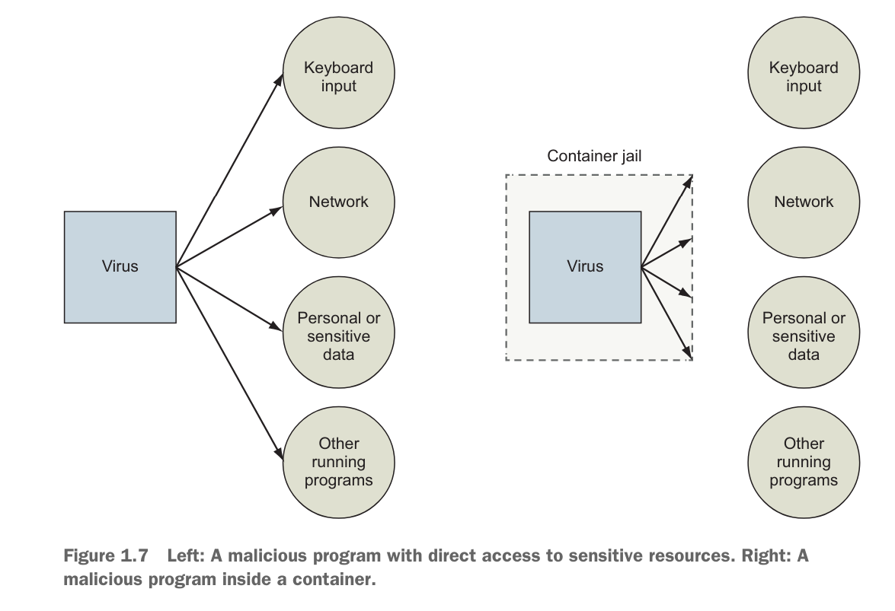
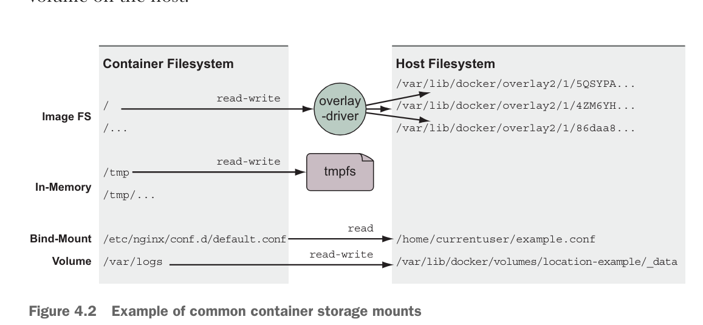
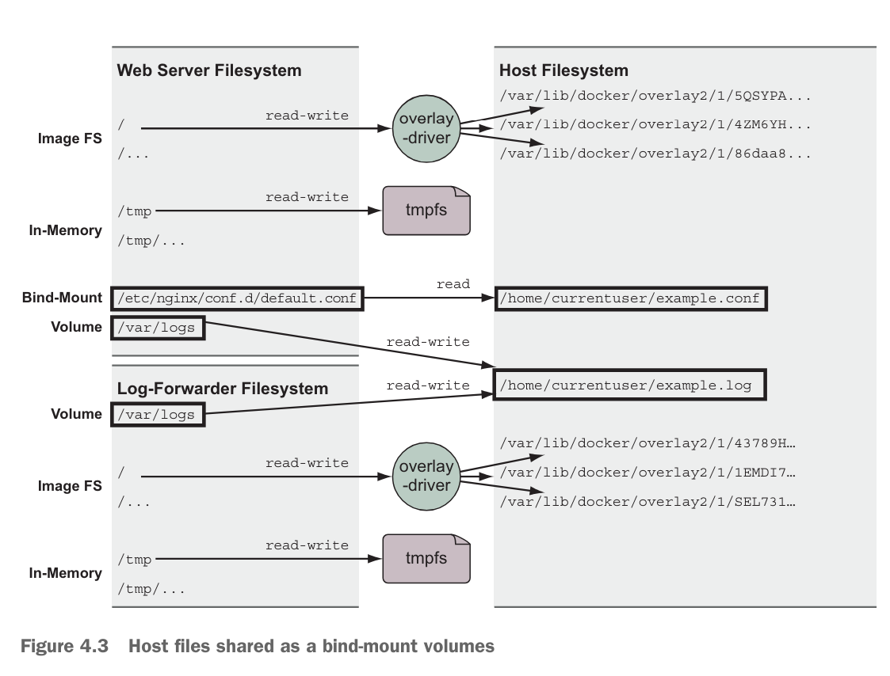

# Docker Primer

- Adapted from [Docker in Action](https://www.manning.com/books/docker-in-action-second-edition) by
  Jeff Nickoloff and Stephen Kuenzli

## Important Concepts to Concentrate on Retaining:

- How to clean out unneeded containers and images
- How to get **inside** a container for development/debugging
- How to build a Dockerfile
- The DockerFile development workflow
- Save config files outside of the container
- You need to expose ports in order to get services to work
- Different types of environment variables
- `ENTRYPOINT` vs `CMD`
- `docker-compose.yaml`

## What is Docker?

- Docker is a platform for developing, shipping, and running applications in containers.
- Docker enables you to separate your applications from your infrastructure so you can deliver
  software quickly.
  - You separate the operating system (if using), libraries, all from the machine it's running on.
- Docker uses existing support of the OS to support isolation and resource management.

## What is Docker not?

- Docker Containers are not virtualization
  - Virtual machines, VirtualBox, VMware, KVM (linux), Hyper-V (Windows) are virtualization
    technologies.
  - Unlike virtual machines, containers are lightweight and share the host OS kernel, they don't use
    any hardware virtualization
  - The container may package up operating system files for userspace functionality, but it doesn't
    include a kernel or isolate processes like a virtual machine does.
    - You can see this by running `top` or `ps` on the host system and seeing the processes running
      in the container.
    - This is the reason why Windows, Mac, and cloud computing use a VM to run docker (Docker
      Desktop or WSL in windows) -- it needs a linux kernel to run the containers.
- Docker containers are not application containers
  - Some package managers isolate applications with limited access to host system
  - Examples are: Flatpak, Snap, AppImage, etc.



## Benefits of Docker

- **Consistency**: Docker containers are consistent across environments. This means that you can run
  the same container on your laptop, on your development server, and in production.
- **Isolation**: Docker containers are isolated from each other and from the host system. This means
  that you can run multiple containers on the same host without them interfering with each other.
- **Resource Management**: Docker containers can be configured to use a specific amount of CPU,
  memory, and other resources. This means that you can run multiple containers on the same host
  without them competing for resources.
- **Portability**: Docker containers are portable. This means that you can build a container on your
  laptop and run it on your development server, in production, or in the cloud.
- **Scalability**: Docker containers are scalable. This means that you can run multiple instances of
  a container to handle increased load.
- **Security**: Docker containers are secure. This means that you can run containers with confidence
  that they won't interfere with each other or with the host system.




## Important Docker Commands:

- `docker build`: builds an image from a Dockerfile and a 'context'
- `docker run <image>`: Will fetch an image from Docker Hub if needed, create and run a container
  based off the image
  - `--detach/-d`: Run the container in the background
  - `--name <name>`: Name the container
  - `-p <host_port>:<container_port>`: Map a port from the host to the container
    - You'll need to expose any port from the container that you want to access from the host or
      from other containers
  - `-i`: Run the container interactively
  - `-t`: Allocate a pseudo-TTY
  - `-rm`: You should almost always use this flag to remove the container when it stops otherwise
    you'll have a lot of stopped containers
  - Default repository is [Docker Hub](https://hub.docker.com/), but you can specify a different
    repository with `docker run <repository>/<image>`
  - `--entrypoint`: Override the `ENTRYPOINT` in the Dockerfile
  - Very useful: (know how to go INSIDE a container)
    - `docker exec -it <container_name> /bin/bash`
- `docker start <container>`: Start a container
  - `run` starts a new container based on an image; `start` starts an existing container
- `docker ps`: List running containers
  - `-a`: List all containers
- `docker images`: List images
- `docker stop <container>`: Stop a container
- `docker rm <container>`: Remove a container
  - `docker rm -v -f $(docker ps -qa)`: Remove ALL containers (useful when you've created many
    containers as part of development) Which typically happens because sucessive runs of
    `docker run` will create new containers (if you `--name` them it will fail if the name is
    already in use)
- `docker rmi <image>`: Remove an image
  - `docker rmi -f $(docker images -qa)`: Remove ALL images (useful when you have many images as
    part of development)
- `docker logs <container>`: View logs of a container
  - If you don't run your containers detached, and output isn't being sent to a file you can usually
    see the output real time

## Dockerfile

- A Dockerfile is a text file that contains the instructions for building a Docker image.
- Important: Dockerfiles have a build context. The directory you run the `docker build` from can
  access all files underneath that directory but no parent directories. This means if you need files
  from a unrelated directory you'll need to copy them into the build context or expand your build
  context to inlcude this directory.

## Dockerfile example:

```Dockerfile
FROM komljen/ubuntu
MAINTAINER Alen Komljen <alen.komljen@live.com>

ENV MONGO_VERSION 2.6.6

RUN \
  apt-key adv --keyserver hkp://keyserver.ubuntu.com:80 --recv 7F0CEB10 && \
  echo "deb http://downloads-distro.mongodb.org/repo/ubuntu-upstart dist 10gen" \
       > /etc/apt/sources.list.d/mongodb.list && \
  apt-get update && \
  apt-get -y install \
          mongodb-org=${MONGO_VERSION} && \
  rm -rf /var/lib/apt/lists/*

VOLUME ["/data/db"]

RUN rm /usr/sbin/policy-rc.d
CMD ["/usr/bin/mongod"]

EXPOSE 27017
```

## A workflow for container development:

1. **Write a Dockerfile**: This is a text file that contains the instructions for building a Docker
   image.

- `vim Dockerfile`

1. **Build the Docker image**: This creates a Docker image from the Dockerfile.

- `docker build -t <image_name> .`

1. **Iterate on modifying the Dockerfile**: If build-time errors occur, modify the Dockerfile to fix
   them.
1. **Run the Docker container (not detached)**: This creates a Docker container from the Docker
   image.

- `docker run <image_name>`

1. **Check the logs as they appear while running and modify Dockerfile**: if containers don't start
   or application has application-level errors, further modify the Dockerfile to fix these errors

## `ENTRYPOINT` vs `CMD`

- `ENTRYPOINT` is the command that is run when the container starts.
  - If `CMD` is present, it is appended to the `ENTRYPOINT` command.
- So if you have `ENTRYPOINT ["echo", "Hello"]` and `CMD ["World"]` the container will run
  `echo Hello World`
- This can be confusing. If you want to `docker run` with a custom command you will need to override
  the `ENTRYPOINT` `--entrypoint` flag.

## Environment Variables

- Careful: there are three sets of environment variables when dealing with Docker. Environment
  variables can exist in the:
  - Host System
    - Usually defined in `.bashrc`, `.bash_profile`, `.profile`, or `.zshrc`
    - Defined with `export VAR=value` in bash/zsh
  - Dockerfile
    - Defined with `ARG = value`
    - Variable used at build time. Exists within the context of the Dockerfile/building image.
  - container
    - Defined with `ENV VAR=value`
    - Variable used at runtime. Exists within the context of the container.

## Image layers

- With docker it is possible to build images in layers. Each layer is a set of changes to the
  filesystem.
- You can use some part of an output of a layer--such as some compiled code--and discard the rest.
- This creates a slimer image with fewer dependencies and a smaller attack surface.
- This looks like multiple `FROM` statements in a Dockerfile, but it's actually a single image with
  multiple layers.

## Storage and volumes

- Key point: If you are using any application-level modificaitons to a container, you'll want to
  save these modifications external to the container. Modificaitons to the container are ephemeral
  modifications to the base image require a new image at each change. Saving these modificaitons
  outside of a container allows you to keep a flexible image/container that you can modify easily.
- Remember: in Linux everything is a file as part of a monolithic tree structure.
  - Network storage, USB drives, Cloud storage, even de all other non-local disk storage can be
    `mount`ed to an arbitrary location in the filesystem--usually `/mnt` or `/media`.
  - Even devices like the CPU, memory, and network interfaces are represented as files in the `/dev`
    directory.
- Aside from one exception (in-memory) Docker container storage is also mounted on the host system.
- There are three most common types of storage mounted into containers:
  - Bind mounts - Used to mount parts of a filesystem tree onto other locations
  - In-memory storage - temporary storage used inside the container
  - Docker volumes - named filesystem trees managed by docker
- While the image filesystem is mounted into the host filesystem via an overlay driver. There is no
  direct access to the image filesystem from the host system




## Docker Compose

- Docker Compose is a tool for defining and running multi-container Docker applications.
  - For single-use applications it allows a user to specify run-time parameters in a single file
- If you are pulling from Dockerhub a repository with no internal os/package-level modifications you
  will not need a `Dockerfile`. If you do need these changes then you can call the build process
  from the dockerfile.

## Example docker-compose.yml

```yaml
version: "3"
services:
  web:
    build: .
    ports:
      - "5000:5000"
    volumes:
      - .:/code
    environment:
      FLASK_ENV: development
  redis:
    image: "redis:alpine"
```

## Networking

- While it is possible for containers to communicate with each other if properly defined in a
  `docker-compose.yml` file (even without exposed ports), without Docker Compose, you will need to
  expose ports to the host in order to access services.
  - At runtime this is done via the `-p` flag in the `docker run` command.
  - At buildtime this is done via the `EXPOSE` command in the Dockerfile.
- With these ports exposes it is possible to access (via browser, client etc)

## Other

- Docker Swarm and Kubernetes - these solutions scale containers across multiple hosts for
  rudundancy, load balancing.
- Docker Secrets
