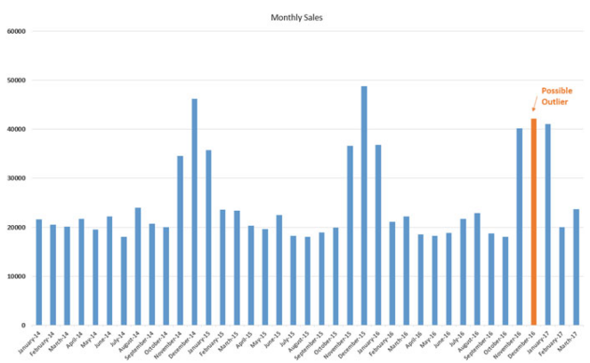

# Resources

## Courses

- Machine Learning - Anomaly Detection via PyCaret -
  https://www.coursera.org/projects/anomaly-detection
- Intel - Anomaly Detection -
  https://www.intel.com/content/www/us/en/developer/topic-technology/artificial-intelligence/training/course-anomaly-detection.html
- Datacamp - Anomaly Detection in Python -
  https://www.datacamp.com/courses/anomaly-detection-in-python
- Udemy - Anomaly Detection: Machine Learning, Deep Learning, AutoML -
  https://www.udemy.com/course/anomaly-detection/?couponCode=OF83024F

## Textbooks

- Beginning Anomaly Detection Using Python-Based Deep Learning - Apress
- Anomaly Detection Princples and Algorithms - Springer

# What is Normal? What is an Anomaly?

## Survey of Possible Anomalies - The wide world of anomalies:





 [^1]
 [^2]


Also:

- In cybersecurity (malware, hacking, fraudulent emails), anomalous network traffic.
- In finance (fraud detection, credit card fraud), anomalous transactions.
- Healthcare (disease detection), anomalous patient data.

## Definitions and considerations

### Anomalies as an observer-dependent concept

- **Anomaly** - A deviation from what is standard, normal, or expected.
- An anomaly is some data that is different than what is defined as normal.
- **outlier** - A data point that is significantly different from other data points. Some say that
  outliers are anomalies, however, a more robust definitions reserves anomalies based on expectation
  and outlier based on distance from other data points.
  - An outlier need not be an anomaly
- **inlier** - A data point that is not an outlier, a 'normal' data point.
- In the grandest sense, nothing is an anomaly. The universe does what the universe does. However,
  in a given context, with a given expectation, hypotehesis, model, or understanding of the scope of
  data, an anomaly can be defined.
- Note a possible more human-centered quality of anomaly detection: it's depending on what (a human)
  expects.
  - This differs from, say, building a statistical model which aims to describe or predict based on
    regularity of the data, which may include anomalies, and may require modeling of those
    anomalies, but there is less observer-dependent nature of the task:
    - Statistical description or prediction asks if it has properly modeled the data and relevant
      anomalies; anomaly detection asks what should even classifiy as an anomaly in the first place.

### How the human-centered concept of anomaly is important to practioners

- Very important caveats surround this definition:
  - **stationarity** - the underlying generating process of the data is not changing significantly
    over time.
  - And underlying model of the data is assumed in order to define what is normal and what is not.
    - It can be argued that most of scientific progress is the study of anomalies.
    - Because of the human-centeredness of anomaly detection, a expert can provide important context
      and define 'anomaly' different that a novice.
  - Is there enough data to define what is normal?
  - Since normality is defined by ill-defined parameters (such a deviation from the mean), the
    definition can be subjective.
    - A domain expert familiar with the generating process will provide important context to help
      define normal or anomalies.

# Ways to describe Anomaly Detection

- note: note not Novelty detection
  - **novelty detection** - detecting class of data exists in the new data

## Labeled data or not

1. Supervised Anomaly Detection
2. Semi-Supervised Anomaly Detection
3. Unsupervised Anomaly Detection

## Approach based:

1. Distance-based: points are farther from other are anomalous.
1. Density-based: points that are in low density regions are considered anomalous.
1. Rank-based: The most anomalous points are those whose neighbors have others as nearest neighbors.

## Dimensionality of the data

### Unidimensional

- Not all distributions are gaussian.  
  
  - Although standard deviation is defined on all distributions it is less useful in non-normal
    distributions. However, it may still be used to define anomalies, except where the distribution
    is asymmetrical.
  - Luckily many distributions end up being near normal or almost symmetrical.
    - But many will not be symmetrical, let alone normal. (E.g. income, wealth, almost anything to
      do with money), or multimodal.
    - If possible use the properties of a closer-matched distribution
    - This is NOT because of the central limit theorem. - Aside: - **Central Limit Theorem** - The
      distribution of the sum of a large number of independent, identically distributed random
      variables approaches a normal distribution, regardless of the shape of the original
      distribution. - Said for a specific case: the sampling distribution from any distribution
      shape will be normal 
- Shape matters because a naive (and often correct way) to find anomalies it to cut out data that
  exists outside of a certain number of standard deviations from the mean.

#### Naive unidemensional anomaly detection

- The fundamental issue: can we create a set of rules that increases precision () and recall?
  - Review precisison and recall:
    - Precision: Of all data 'retrieved' (postiive), what percent are relevant (true)?
    - Recall: of all data that are relevant (true), what percent are relevant (true)?


- In the case of (quasi-)symmetrical distributions, you may be able to use the properties of a
  normal distribution (mean and standard deviation) to make cuts.
- Cutting on z-score is possible, but most distributions will not be normal and z-scores work best
  with normal distributions.
- Mean and standard deviation are not robust statistics, and are sensitive to outliers.


- Alternative is using Mean Absolute Dispersion (MAD)

  - **Mean Absolute Dispersion (MAD)** - The average of the absolute values of the differences
    between the data points and the mean.

    $$ MAD = Median(|X_i - \tilde{X}|)$$

    where $\tilde{X}$ is the median of the data, and $X_i$ is the data point.

- In the case of asymmetrical distributions, a simple method is to visualize the data and decide
  (maybe with a domain expert) a cut point to classify as an anomaly.


In this case maybe we pick a value greater than 8000 or 10000 as an anomaly.

- In the case of multimodal distributions, there may be no other option than ad hoc slicing.


### Box Plots


### Multidimensional

- Euclidean distance is the most common way, but may not be appropriate if numbers have different
  scales and scaling factor is not obvious across dimensions.
- An outlier may exist in a orthogonal dimension that cannot be separated in other dimensions.
- Also applying PCA may reveal a separation that is not obvious in the original dimensions because
  of slight differences that compound across dimensions.

### PyOD

Python library [pyod](https://pyod.readthedocs.io/en/latest/index.html) can be used for
multidimensional anomaly detection.

#### List of PyOD API/methods

- Angle-based Outlier Detector (ABOD)
- AE-1SVM - One-Class SVM
- Adversarially Learned Anomaly Detection (ALAD)
- Anomaly Detection with Generative Adversarial Networks (ADGAN)
- AutoEncoder Outlier Detection
- Clustering Based Local Outlier Factor (CBLOF)
- Connectivity-Based Outlier Factor (COF)
- Cook's distance outlier detection (CD)
- Copula Based Outlier Detector (COPOD)
- Deep One-Class Classification for Outlier Detection (DeepSVDD)
- Deep Anomaly Detection with Deviation Networks (DevNet)
- Deep Isolation Forest (DIF)
- Unsupervised Outlier Detection Using Emperical Cumulative Distribution Functions(ECOD)
- Feature Bagging Detector
- Outlier Detection on Gaussian Mixture Models (GMM)
- Histogram-based Outlier Detection (HBOS)
- **Isolation Forest Outlier Detector (IForest)**
- Isolation-based anomaly detection using nearest-neighbor ensembles
- Kernel Density Estimation (KDE) for Unsupervised Outlier Detection
- k-Nearest Neighbors Detector (KNN)
- Kernel Principal Component Analysis (KPCA)
- Linear Model Deviation-base outlier detection
- Lightweight on-line dector of anomalies (Loda)
- Local Outlier Factor (LOF)
- Local Correlation Integral (LOCI)
- Unifying Local Outlier Detection Methods via Graph Neural Networks
- Locally Selective Combination of Parallel Outlier Ensembles (LSCP)
- **Mean Absolute Deviation (MAD)**
- Minimum Covariance Determinant (MCD)
- Multiple-Objective Generative Adversarial Active Learning (MO-GAAL)
- One-class SVM detector (OCSVM)
- Principal Component Analysis (PCA)
- Quasi-Monte Carlo Discrepancy outlier detection (QMCD)
- R-graph
- Rotation-based Outlier Detector (ROD)
- Outlier Detection based on Sampling (SP)
- Subspace Outlier Detection (SOD)
- Single-Objective Generative Adversarial Active Learning (SO-GAAL)
- Stochastic Outlier Selection (SOS)
- Scalable Unsupervised Outlier Detection (SOD)
- Variational AutoEncoder (VAE)
- Unsupervised Anomaly Detection with Gernative Adversarial Networks to Guide Marker Discovery

#### Isolation Forests

- Healthcare data with a patient that is 12 years old, 160cm tall and 190 pounds is an outlier (190
  lbs is not normal for a 12-year-old), but it can't be determined from any single variable alone.
- **Isolation Forests** - A tree-based algorithm that isolates anomalies by randomly selecting a
  feature and then randomly selecting a split value between the maximum and minimum values of the
  selected feature.

---

Isolation Tree Algorithm

**Require:** Input matrix $ X \in R^{n \times p} $

1. $ t = \emptyset $ (the empty tree)
2. If $ \text{nrow}(X) = 1 $ then return $ t $
3. End if
4. Randomly select $ x_i $, a feature of $ X $
5. Randomly select a split point $ p \in (\min(x_i), \max(x_i)) $
6. Add to $ t $ the node $ N\_{i,p} $
7. Define $ X_l $ and $ X_r $ as the matrix composed of the samples of $ X $ where the variable $
   x_i $ is respectively larger and smaller than $ p $.
8. Repeat the algorithm with $ X = X_l $. Link the obtained tree as the left child of $ t $.
9. Repeat the algorithm with $ X = X_r $. Link the obtained tree as the right child of $ t $.

---

- **Isolation Trees (iTrees)** - trees used in the isolation forest algorithm.

  - Randomized versions of (untrained) decision trees. No training is required.
  - Algorithm selects a random feature and splitting (branching) occurs randomly - because outliers
    are far from most data it is more likely that random split will isolate the outlier
    

  - Points that require fewer splits will be closer to the root node and become outliers
  - Trees grow until all points are isolated or maximum depth is reached
  - Each datapoint is assigned an anomaly score based on the detph they were found
  - Isolation _forrest_ uses many trees and averages the results

- Hyperparameters:

  - contamination: the proportion of outliers in the data (e.g. 0.10 means choosing the top 10% of
    data as outliers)
    - This hyperparameter exists in all `pyod` estimators except MAD
    - Setting the right contamination is cricial to trust the predictions
  - n_estimators: number of trees, use more trees for more complex data
  - max_samples: number of samples to draw to build a tree, frequent sampling reduces overfitting
  - max_features: number of features to draw to build a tree

- Advantages:

  - Can handle high-dimensional data
  - Can handle mixed data types
  - Can handle large datasets
  - Can handle data with many outliers
  - No statistical assumptions

- Challenges:
  - As an unsupervised method the only way to tune and test for correctness is to combine it with a
    supervised method or informal evaluation

#### KNN

- **K-Nearest Neighbors (KNN)** - An algorithm that classifies a data point based on the majority
  class of its k-neighbors


- In the anomaly detection context, we have to specify contamination
- Some say you can use KNN for Unsupervised (clustering?)
  - Haven't found evidence of this.
  - It is true that `scikit.neighbors` does have a `NearestNeighbors` class that can be used
    unsupervised, but this uses different algorithms than KNN: BallTree, KDTree, and brute-force
    `scikit.metrics.pairwise`.
- KNN doesn't train at all, it simply memorizes, therefore it is called a non-generalizing
  supervised model

- Advantages:
  - Fast
- Challenges:
  - memory-inefficient
  - sensitive to feature-scales -- curse of dimensionality
    - WARNING: do not standardize using `StandardScaler`, outliers will skew mean and standard
      deviation
      - Alternative is `QuantileTransformer`

### Comparision of some Scikit Learn Anomaly Detection Algorithms


Recall that a similar comparison is made in the clustering context:


While clustering may be an option in some context, rarely will your data have non-anomalous forming
a cluster, therefore these methods are not appropriate for anomaly detection.

#### One Class - Support Vector Machine (OC-SVM)

Traditional SVM in scikit learn (`sklear.svm.LinearSVC`):

```python-repl
>>> from sklearn.svm import LinearSVC
>>> from sklearn.pipeline import make_pipeline
>>> from sklearn.preprocessing import StandardScaler
>>> from sklearn.datasets import make_classification
>>> X, y = make_classification(n_features=4, random_state=0)
>>> clf = make_pipeline(StandardScaler(),
...                    LinearSVC(random_state=0, tol=1e-5))
>>> clf.fit(X, y)
Pipeline(steps=[('standardscaler', StandardScaler()),
                ('linearsvc', LinearSVC(random_state=0, tol=1e-05))])
>>> print(clf.named_steps['linearsvc'].coef_)
[[0.141...   0.526... 0.679... 0.493...]]
>>> print(clf.named_steps['linearsvc'].intercept_)
[0.1693...]
>>> print(clf.predict([[0, 0, 0, 0]]))
[1]
```

One-Class SVM in scikit learn (`sklearn.svm.OneClassSVM`):

```python-repl
>>> from sklearn.svm import OneClassSVM
>>> X = [[0], [0.44], [0.45], [0.46], [1]]
>>> clf = OneClassSVM(gamma='auto').fit(X)
>>> clf.predict(X)
array([-1,  1,  1,  1, -1])
>>> clf.score_samples(X)
array([1.7798..., 2.0547..., 2.0556..., 2.0561..., 1.7332...])
```

Note that the one-class version takes unlabeled data.

### Advanced supervised methods

The Beginning anomaly detection text does suggest more advanced methods. However it should be noted
that these methods use labeled training data. When anomalies are labeled, anomaly detection falls
back to simple classification and any method used for classification can be used for anomaly
detection.

#### AutoEncoder

#### Generative Adversarial Networks

#### LSTM

#### Temporal Convolutional Networks

#### Transformers


[^1]:
    Sinus Tachacardia - "A 40 year old lady comes to the emergency department from her husband’s
    funeral with a sensation of ‘fluttering’ in her chest. She is feeling very anxious. An ECG is
    performed. What is the diagnosis?" - rarely goes above 120bpm and no p-waves visible
    https://oxfordmedicaleducation.com/ecgs/ecg-examples/

[^2]: Also see: https://cds.cern.ch/images/ATLAS-PHOTO-2012-001-2
