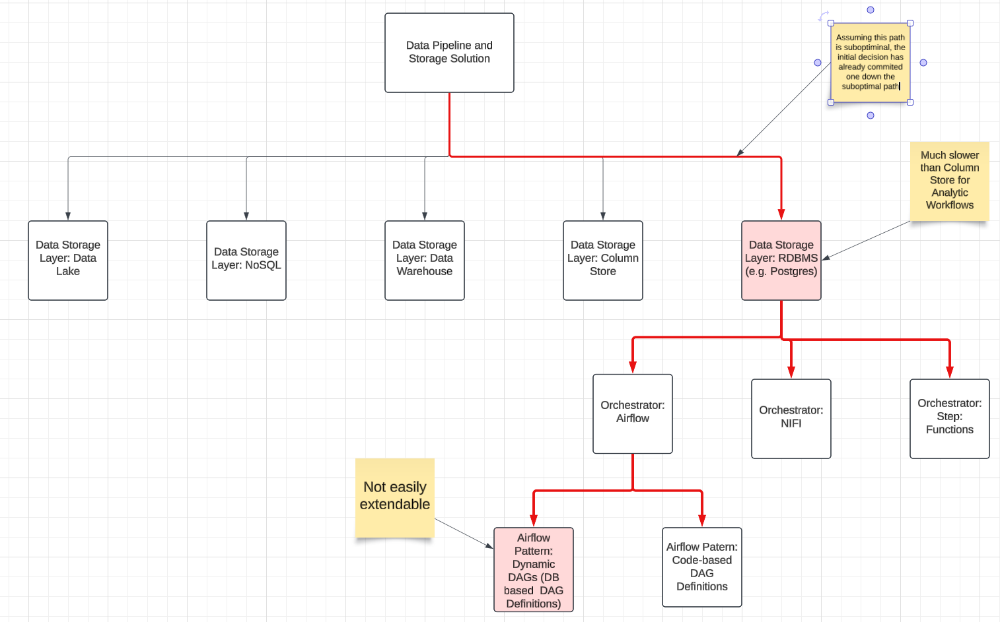

# Overview of Solution Design

The broadest definition of solution design would include methods across such diverse domains as
science software engineering, data science, data governance, business processes, cloud architecture,
finance, hardware design, algorithm design--any complex process that requires a systematic approach
to problem-solving.

We should restrict the scope of solution design to the domains of technology relevant to the data
science consultant. In this regard, software, algorithm, cloud, analytics, data engineering and
application design are the primary areas of focus.

There seems to be a dearth of resources defining the approach of solution design in these areas.

## Some examples of solution design (for a data science consultant)

### Software Design

Data scientists rarely need to design anything beyond scripts and notebooks. However, even these can
be sufficiently complex as to require an undestanding of some software design principles and best
practices.  Some of these principles can apply to simple scripting and SQL code.

### Cloud Architecture Design

Insofar as data scientists are to deploy their models or data pipelines, they will need to
understand beyond a modicum of cloud architecture design.

### Analytics Design

The decision around complex analytics solutions can be some of the most difficult. Whereas there may
be established design patterns in the software and cloud spaces, sometimes the number of free
parameters and decisions in the analytics space make creating solutions some of the most complex.

## Goal of Optimal Design: Avoiding Sub-Optimal Solutions

### Solution Space and Exponential Complexity

The solution space is defined by the total number of decisions that need to be made in creating a
solution. The solution space grows with the number of decision points. If there are 2 possible
alternatives for all decisions for a solution but 5 solutions total there is a total of `2^5 = 32`
possible solutions. If there are 3 possible alternatives for all decisions for a solution but 5
solutions total there is a total of `3^5 = 243` possible solutions. The number of possible solutions
grows exponentially with the number of decision points.

### The Branching Path Problem

Compounding this issue is the fact that because these decisions are ordered, if a sub-optimal
decision is made at the outset it will commit one to a sub-optimal path. This is the branching path
problem.

## High-Level Methods to Optimal Solution Design
How can we increase probability of optimal design even if we are not familiar with the solution space?

* Knowledge of Design Patterns
* Best Practices
* Heuristics - approach to problem solving that employes a pragmatic method that is not guaranteed to be optimal but may be the best process given limited knowledge

## Best Practices when exploring the Solution Space

* Familiarize yourself with existing design patterns and possible solution.  A broad knowledge is the best preparation for exploration of the solution space.
* Dedicate significant time to early design decisions (early decision paths) and when cost of error is high
* DO NOT go straight to what you know and the fastest solution you can get. Go slow and explore the solution space as constraints will allow.  In the tradeoff of exploration vs. exploitation, exploration is hard work and often aggravating when it forces you to learn new things, but it is almost always worth it, if time will allow, because over time you will produce better solutions and gain broad experience.  
* SEEK FEEDBACK OFTEN: Constantly bother others for input, especially those who are expert in a particular task or domain experts. 

