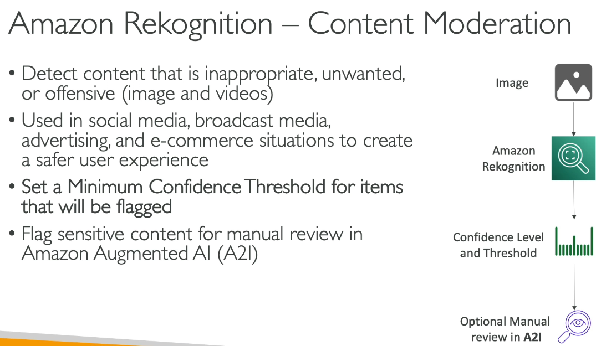
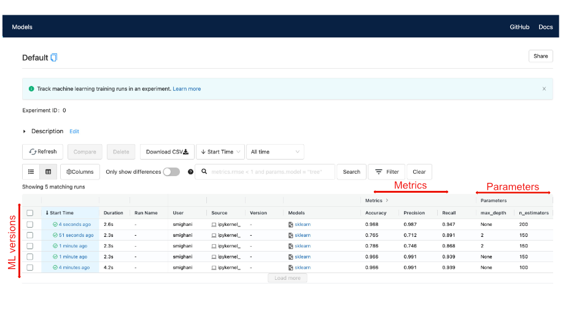

# AWS Data Science Services and SAP CO2

This is a review of some AWS Data Science Services which overlap with the SAP SO2 exam - AWS
Certified Solutions Architect - Professional.

Much of this material comes from Stephane Maarek's course on Udemy - Ultimate AWS Certified
Solutions ARchitect Associate 2025.

# Rekognition
Way to remember: 'Reccognize' objects, people, text, scences in images and video

# Transcribe
Way to remember: Transcriptionist - convert speech to text

- Google's version: Speech

# Polly
Way to remember: Polly (the parrot) outputs audible speech, therefore: text->speech 

 

- Google's version: Speech

# Translate

# Lex+Connect
Way to remember: Think 'A(lex)a'

# Comprehend
Way to remember: 'Comprehend' think general NLP service

# Sagemaker

## Sagemaker sub-services

### Notebook Instances

### Studio

- Jupyterlab
- RStudio
- Canvas - no code ML 

  - 3 environments with flexibility/knowledge tradeoff - Canvas - no code - Sagemaker
    off-the-shelf/managed containers - Sagemaker custom containers
  - was 'AutoPilot'
  - under the 'Auto ML' link in studio

- Code Editor - VS Code web-based editor
- MLFlow 

### Ground Truth

Ground Truth is a data labeling service that makes it easy to build highly accurate training
datasets for machine learning. You can use Ground Truth to create labeled training data for image,
text, and 3D point cloud data.

The service allows designing labeling ui, creating labeling workflows for internal employees or
hiring external workers directly through amazon like mechanical turk.

### "Experiments" in Studio

- AWS UI Abstraction in Studio for MLFlow.
  - Alternative tracker is Weights and Biases (wandb)

### Pipelines

### Models

- Create, Register, deploy, monitor, and manage models

### Jumpstart

# Forecast
Way to remember: Forecast: Predicting in time.

# Kendra
Way to remember: Kendra means 'knowing' in Celtic: Document search service

# Personalize
Way to remember: Personalize: Personalized recommendations

# Textrack
Way to remember: Textrack (Text + Extract): Extracting text from images

# Bedrock

- Fully managed
- Allows for (easier?) serverless deployment of ML models

# Amazon Q

- Generative AI Assistant
- Also used in Sagemaker for code completion
