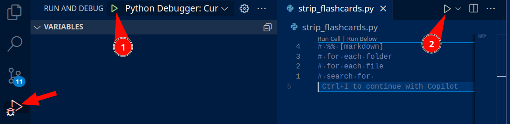
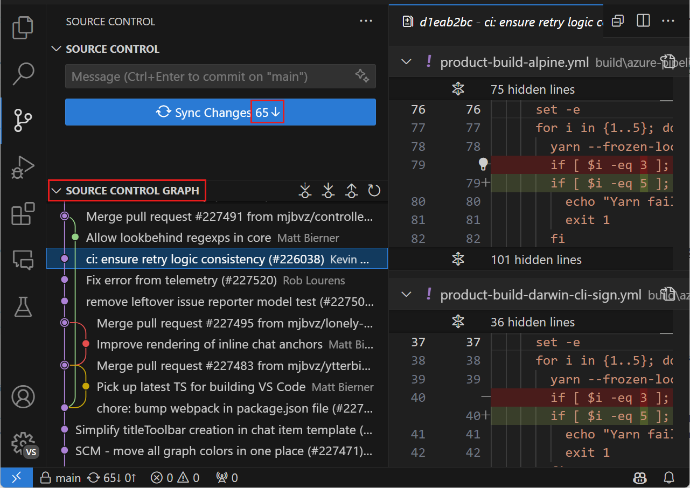
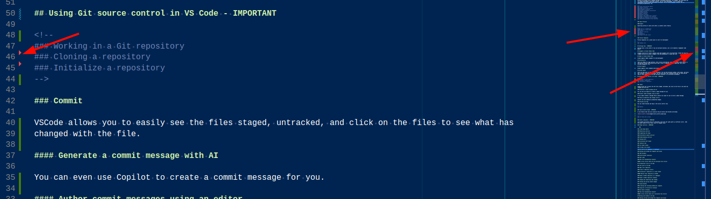
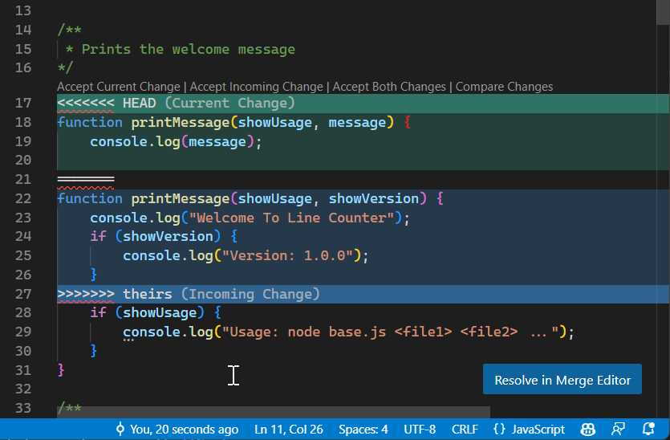
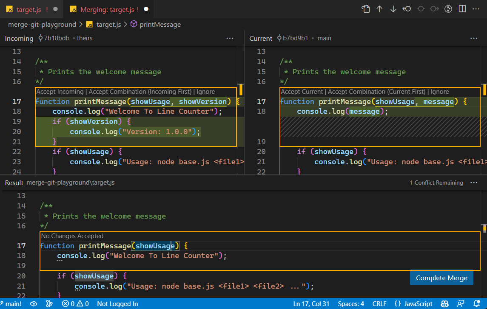
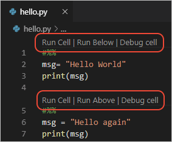

# VSCODE PRIMER

The purpose of this document is an instruction manual to VSCode, but rather a survey of all the
important features in VSCode. See the [official documentation](https://code.visualstudio.com/docs)
for particular instructions.

# Explore of first level of interface.

- `CTRL+SHIFT+P` - Command Palette
- `CTRL+P` - Quick Open

# USER GUIDE

## Editing


### Keyboard shortcuts - IMPORTANT

- There are so many keyboard shortcuts for almost any action
- The file `keybindings.json` can be used to customize the shortcuts.
  - Look to the top right buttons to switch between GUI and JSON view.

### Multiple selections (multi-cursor)

You can add secondary cursors with `Alt+Click` or `Alt+Shift+Down/Up`.

```
The quick brown fox jumps over the lazy dog.
    The quick brown fox jumps over the lazy dog.
        The quick brown fox jumps over the lazy dog.
            The quick brown fox jumps over the lazy dog.
```

#### Shrink/expand selection

Very useful to limit the code selection of a giant file.

```cpp
namespace Hello {
    namespace World {
        class HelloWorld {
            public:
                void sayHello() {
                    std::cout << "Hello, World!" << std::endl;
                }
        };
    }
}
```

### Column (box) selection

Can select a section with `Shift+Alt` and click-select.

```
//Key                   Character       Virtual Key Code
//Ctrl+Shift+Alt+Up     Arrow ↑         38
//Ctrl+Shift+Alt+Down   Arrow ↓         40
//Ctrl+Shift+Alt+Left   Arrow ←         37
//Ctrl+Shift+Alt+Right  Arrow →         39

```

[//]: <> (#### Column Selection mode)

### Save / Auto Save - IMPORTANT

- Essential feature to continually save without having to remember.
  - The default is to save 1 second
- History of all local saves is saved and can be viewed.

### Hot Exit

- By default VS remembers all unsaved changes to files when you exit.

### Find and Replace - IMPORTANT

- Essential feature of any editor that allows you to search and replace all text or step through and
  replace one by one.

#### Seed Search String From Selection

- Defaults search to selected word

#### Find In Selection

- You can limit your search to only the selection

#### Advanced find and replace options

- You can use regex and other advanced options

#### Multiline support and Find Widget resizing

- You can search for multiline strings and resize the find widget

### Search across files - IMPORTANT

- An essential feature to search across all files in a project.
- This is key to find particular line in a code base and trace back logic across several files.

#### Advanced search options

- Allows you to limit the global search to particular directories or file types.

#### Search and replace

- You can also search and replace across all files.

#### Case changing in regex replace

- Search and replace supports regex

### Search Editor

- Search Editor allows you to see search results in a full-sized window with surrounding context
- Use the `Open Search Editor` command.
<!--

#### Search Editor commands and arguments

#### Search Editor context default

#### Reuse last Search Editor configuration

-->

### IntelliSense - IMPORTANT

- IntelliSense is the code completion feature that provides context-aware suggestions as you type.
- You can hover over a keyword to see the documentation.

### Formatting - IMPORTANT

- VSCode allows for formatting by command or on save.
- You can also format a selection.
- Advanced teams should establish code standard norms and enable auto formatting as part of a
  githook.
  - This will ensure that changes to the code found in diffs or in git history reflect substantive
    changes and not just formatting changes.

### Folding

- You can fold code blocks to make it easier to read and concentrate only on the code that is
  relevant for your current task.

<u>Other shortcuts</u>

- Fold (`Ctrl+Shift+[`) folds the innermost uncollapsed region at the cursor.
- Unfold (`Ctrl+Shift+]`) unfolds the collapsed region at the cursor.
- Toggle Fold (`Ctrl+K Ctrl+L`) folds or unfolds the region at the cursor.
- Fold Recursively (`Ctrl+K Ctrl+[`) folds the innermost uncollapsed region at the cursor and all
  regions inside that region.
- Unfold Recursively (`Ctrl+K Ctrl+]`) unfolds the region at the cursor and all regions inside that
  region.
- Fold All (`Ctrl+K Ctrl+0`) folds all regions in the editor.
- Unfold All (`Ctrl+K Ctrl+J`) unfolds all regions in the editor.
- Fold Level X (`Ctrl+K Ctrl+2 for level 2`) folds all regions of level X, except the region at the
  current cursor position.
- Fold All Block Comments (`Ctrl+K Ctrl+/`) folds all regions that start with a block comment token.

#### Fold selection

- You can fold a selection of code.
- There are also plenty of other shortcuts for different folding commands.

<!--
### Indentation
#### Auto-detection

### File encoding support
### Overtype mode
-->

### Compare files - IMPORTANT

The `diff`ing capabilities of VSCode are very powerful.

- You can compare files during git merges, in your history, or just to compare two arbitrary files.

## Extensions

- VSCode has a extendable extension system that allows you to add new features to the editor.
- Wikipedia used to list VSCode as merely a 'text editor' because stock VSCode has few language
  specific features until you install extensions.
  - This means that you must instal (several) python extensions to get the full python experience.

Great (non-OS) extensions:

- Vim/Neovim - for even more powerful editing and navigation
  - Is great for navigation, may be worth the investment for many, but many may not want to make the
    investment.
  - There are character-level navigation in neovim that works with vscode with the neovim plugin
- jumpy - allows you to jump to any character in the editor
- Git Pull Request - allows you to get a link to the github code and create and handle pull requests
- GitLens - more powerful than Git Pull Request, allows you to see git history and blame directly in
  the editor
- Even Better TOML - better TOML support
- Peacock - allows you to color code your editor to easily distinguish between different projects
- Copilot - AI code completion
- Sonarqube for IDE - allows you to see Sonarqube issues directly in the editor
- SQL Notebooks - allows you to run SQL queries and edit in a notebook format
- Data Wrangler - allows you to wrangle data/modify data.
- AWS Toolkit - allows you to interact with AWS services directly from the editor
- PostgreSQL - allows you to interact with Postgres databases directly from the editor
- Docker - allows you to interact with Docker containers directly from the editor
- Black - autoformatter for python
- Ruff - autoformatter for python
- Code Spell Checker - spell checker
- Prettier - autoformatter for many languages
- GitLens - allows you to see git history and blame directly in the editor
- Live Share - allows you to share your editor with others for pair programming (not supported in
  the OSS version currently, also probably needs ports/infrastructure to be configured)

## IntelliSense - IMPORTANT

IntelliSense is the code completion feature that provides context-aware suggestions as you type.
This is independent and predates the AI code completion feature. It allows you to see documentation
and API references as you type. Press `Ctrl+Space` to trigger IntelliSense, or it will automatically
trigger as you type.

## Code Navigation

### Quick file navigation - IMPORTANT

You can quickly open files by pressing `Ctrl+P` and typing the name of the file. Remember:
`Ctrl+Shift+P` opens the command palette; `Ctrl+P` opens the quick open file dialog.

Also: `Ctrl+Alt+R` (when terminal focused) opens recent commands from terminal. However, bash should
be configured with `Ctrl+R` to search history in the terminal.

### Breadcrumbs

The editor will have a bar above the contents called BreadCrumbs. It shows the current location in
the file system or the current class or function. You can jump to a different location by clicking
on the breadcrumb.

### Gutters - IMPORTANT

Gutters are the vertical bars on the left and right side of the editor. The left shows line numbers,
breakpoints, suggestions, git changes, and errors. The right shows the minimap, which shows git
changes, warnings, and errors. A nice use is showing where errors exist in the code.

### Filename colors - IMPORTANT

- Green - File added to the project
- Yellow - File modified
- Red - File deleted for identified potential errors in file.
- White - File unchanged
- Grey - File ignored
-

<!--
#### Breadcrumb customization
#### Symbol order in Breadcrumbs
-->

#### Breadcrumb keyboard navigation

Like most features in VSCode, you can navigate the breadcrumbs with the keyboard shortcuts.

### Go to Definition - IMPORTANT

A very useful feature is the ability to jump to the definition of a function or class. Press `F12`
to jump to the definition of a symbol. You can also right-click on a symbol and select
`Go to Definition`.

<!--
### Go to Type Definition
-->

### Go to Implementation

You can also navigate in the reverse by going to the implementation of a function or class. A list
will be provided showing all implementations of the symbol.

### Go to Symbol

You can navigate symbols inside a file by pressing `Ctrl+Shift+O`.

### Open symbol by name

You can also navigate to a symbol by a text search. Press `Ctrl+T` to open the symbol search

### Peek

You can peek at the definition of a symbol without leaving the current file.

### Bracket matching

The matching bracket under the cursor will be highlighted

#### Bracket Pair Colorization

Matching brackets will be colorized

<!--
### Reference information
-->

### Rename symbol

You can rename a symbol across the entire project by right-clicking on the symbol and selecting
`Rename Symbol`.

### Errors & warnings - IMPORTANT

With the proper linter you can see the warnings and errors underlined in the editor. This feature
can be made more strict by adding type checking.

The error panel will show all errors and warnings in the project.

### Code Action

### Inlay Hints

Hints are also inlaid in the editor for suggestions to improve your code.

<!--
### Outgoing link protection
-->

## Refactoring

There are several refactoring actions that occur when highlighting (such as `Extract Method`,
`Extract Variable`, `Rename Symbol`). These can be enabled my pressing the lightbulb that appears on
highlight.

### Code Actions = Quick Fixes and refactorings - IMPORTANT

An important feature is the ability to run actions on save. The most useful of these are
autoformatters.

<!--
#### Code Actions on save
### Refactoring actions
#### Extract Method
#### Extract Variable
#### Rename symbol
### Refactor Preview
-->

## Debugging - IMPORTANT

- `printf debugging` - the act of adding print statements to debug code.
- `pdb debugging` - the act of using the pdb cli tool to debug code.

Debugging is one of the most important killer features of VSCode and most IDEs. It allows you to
step through code, set breakpoints, and inspect variables, modify the stack real-time, and more.

Exploring with a debugger is key for beginning programmers to understand how the call stack works

Debugging can be used in both testing and jupyter notebooks as well.

Note: there are two 'run button' arrows in VSCode. One in the 'Run and Debug' charm and another in
the top right margin whenever any python file is open.



### User interface


#### Run and Debug view

A 'charm' that shows a debugging view with all the features.

#### Debug actions - IMPORTANT

A set of buttons that allow you to step through code, pause, stop, and restart. Important
understanding:

- `Step Over` - steps over the current line of code, if the line is a function call it will not step
  into the function.
- `Step Into` - steps into the current line of code, if the line is a function call it will step
  into the function.
- `Step Out` - steps out of the current function and back to the calling function.

<!--
### Debugger extensions
### Start debugging
-->

#### Run mode

### Launch configurations - IMPORTANT

You can specify many different options in run configurations

```json
{
  // Use IntelliSense to learn about possible attributes.
  // Hover to view descriptions of existing attributes.
  // For more information, visit: https://go.microsoft.com/fwlink/?linkid=830387
  "version": "0.2.0",
  "configurations": [
    {
      "name": "Python Debugger: Current File",
      "type": "debugpy", // can be 'python' for specialized configs like Django
      "request": "launch",
      "program": "${file}",
      "console": "integratedTerminal",
      "env": {
        "API_KEY": "wsljfkqh32" // environment variables (also can use .env file)
      },
      "args": ["--port", "5678"], // arguments to the program being run
      "cwd": "${workspaceFolder}",
      "justMyCode": true // important to try and understand library code (or if theres a bug in the library)
    }
  ]
}
```

<!--
#### Generate a launch configuration with AI
-->

#### Launch versus attach configurations

You can attach to an already running process or launch a new one. Attach is useful for debugging a
running server/program.

#### Add a new configuration - IMPORTANT

You can have multiple configurations for different scenarios.

### Breakpoints - IMPORTANT

Breakpoints allow you to stop at a particular line of code and inspect the state of the program.
Important to understand:

- You can set conditional breakpoints that are useful for edge and corner cases.
- You can use the debug console to run arbitrary code while the program is paused.
  - Understand that if you define or modify variables here (or in watch) it will not affect the
    program state.
- You can remove and disable breakpoints by right-clicking the red dot or in the breakpoints view.

### Logpoints

Logpoints are breakpoints that log a message to the console instead of pausing the program.

### Data inspection - IMPORTANT

An powerful feature is the ability to inspect an object and see its properties and values.

<!--
### Launch.json attributes
### Variable substitution
### Platform-specific properties
-->

### Global launch configuration

You can specify a global launch configuration that will be used across your workspaces.

### Advanced breakpoint topics

#### Conditional breakpoints

As mentioned above, you can set a condition for a breakpoint to only trigger when the condition is
met.

#### Triggered breakpoints

A trigered breakpoint is a breakpoint that is enabled once another breakpoint is hit.

<!--
#### Inline breakpoints
#### Function breakpoints
#### Data breakpoints
-->

### Debug console REPL

As mentioned above expressions can be evaluated with the Debug Console REPL.

<!--
### Redirect input/output to/from the debug target
-->

### Multi-target debugging

Python debugging supports debugging multiple threads/processes.

#### Compound launch configurations

You can start multiple debug sessions at once.

### Remote debugging

VScode supports debugging (and running) code on remote machines.

<!--
### Automatically open a URI when debugging a server program
#### Trigger debugging via Edge or Chrome
#### Triggering an arbitrary launch config
-->

## Testing

Software testing is an important part of software development. VSCode has a built-in test runner
that allows you to run and debug tests.

<!--
### About testing in VS Code
### Get started with testing in VS Code
### Extensions for testing
-->

### Automatic test discovery in Testing view - IMPORTANT

After selecting your test runner (pytest, unittest in python) usually the tests will be detected and
populated in the testing view. However, in practice sometimes there is some quirk about vscode or
the test setup that make the tests not populate. Tips to get tests working:

- Run `pytest` from the command line and get the tests working from the command line first
- Check the logs for errors

### Write tests with AI

- Using Copilot to generate tests may be one of the best ways to use code completion tools. It
  should be good for meeting coverage metrics, but particular edge cases may be more difficult to
  generate.

### Run and debug tests

You can selectively run some tests or run all tests. You also can debug particular tests.

### Test coverage - IMPORTANT

There is support for test coverage built into VSCode.

<!--
### Task integration
### Test configuration settings
-->

## VS Code for the Web

FYI: VS Code is available as a web app. It is not as feature rich as the desktop app, but it is
useful for quick edits and for those who are not able to install software on their machine.
[https://vscode.dev/](https://vscode.dev/)

## Integrate with External Tools via Tasks

There are many development tools out there (Maven, Grunt, Make, etc) that can be integrated with
VSCode via tasks. "Tasks" are ways to automate tasks like linting, building, packaging, testing, or
deploying.

<!--
### TypeScript Hello World
### Task auto-detection
### Custom tasks
#### Compound tasks
#### User level tasks
### Output behavior
### Run behavior
### Customizing auto-detected tasks
### Processing task output with problem matchers
### Binding keyboard shortcuts to tasks
### Variable substitution
### Operating system specific properties
### Global tasks
#### Character escaping in PowerShell
### Changing the encoding for a task output
### Examples of tasks in action
#### Transpiling TypeScript to JavaScript
#### Transpiling Less and SCSS into CSS
### Defining a problem matcher
### Defining a multiline problem matcher
### Modifying an existing problem matcher
### Background / watching tasks
-->

## Profiles in Visual Studio Code - IMPORTANT

(Important to know but usually the default profile is sufficient for most users.)

Settings can be applied at several levels:

- system-level - (in sagemaker code editor) setting sync is disabled, so settings can be applied to
  a given machine
- user-level - settings can apply to a user across all workspaces
- workspace-level - settings can apply to a workspace

Profiles are another way to manage settings (including extensions). For example, you could have one
for python development (with data science), one for java development, one for javascript
development, one for python development on Windows, one for doing leetcode problems, one for
developing documentation, etc.

<!--
### Access the Profiles editor
### Create a Profile
#### Check the current profile
#### Configure a profile
#### Folder & workspace associations
### Manage profiles
#### Switch profiles
#### Edit a profile
#### Delete a profile
#### Open a new window with a profile
#### Apply a setting to all profiles
#### Apply an extension to all profiles
### Synchronize profiles across machines
-->

### Share Profiles

#### Export

Exporting profiles to share with others is another useful feature.

<!--
##### Save as a GitHub gist
##### Save as a local file
#### Import
### Uses for profiles
#### Demos
#### Education
#### Report VS Code issues
-->

### Profile Templates

Profile templates are a great place to start for development

<!--
### Command line
-->

## Settings Sync - IMPORTANT

Settings Sync is very useful if you use multiple machines, but is not enabled in Sagemaker Code
Editor

## Snippets in Visual Studio Code

Snippets allow you to insert commonly used code snippets with a few keystrokes. VSCode has built-in
snippets and you can install snippets from the marketplace or create your own.

## Emmet in Visual Studio Code

Vscode supports Emmet snippets for web development

## Accessibility

There are themes for high contrast, color vision accessibility, and zoom. Another great feature is
the ability to have notification bells when a task is complete, such as compiling, unit tests,
hitting breakpoints, etc.

## Voice Support

VScode supports voice commands and dictation.

## Custom Layout

There are many ways to lay out your workspace. You can have multiple windows, split panes, and place
your terminal in different locations. You can also split your terminals and tear out tabs and put
them on other windows. You can open multiple instances to run different workspaces.

## Using Git source control in VS Code - IMPORTANT

<!--
### Working in a Git repository
### Cloning a repository
### Initialize a repository
-->

### Commit

VSCode allows you to easily see the files staged, untracked, and click on the files to see what has
changed with the file.

#### Generate a commit message with AI

You can even use Copilot to create a commit message for you.

#### Author commit messages using an editor

If you commit without a message then an editor will open for you to write a commit message.

### Review uncommitted code changes with AI

Copilot can also summarize uncommitted changes.

### Branches and Tags

You can create branches and tags in the source control view.

<!--
### Remotes
-->

### Source Control Graph - IMPORTANT

A nice feature that lets you visualize the git history and branches and merges.



<!--
### Git Status Bar actions
-->

### Gutter indicators - IMPORTANT

Line changes and moved lines are reflected in the left and right gutter as different colors. (Red
for moves, green for new lines, blue for changed lines)



### Merge conflicts - IMPORTANT

The best place to resolve merge conflicts is in a graphical tool like VSCode. It is more visually
intuitive and clear.



### 3-way merge editor - IMPORTANT



There is an option for a 3-way merge editor that allows you to see the incoming, current, and remote
changes.

<!--
#### Resolving conflicts
#### Completing the merge
#### Alternative layouts and more
#### Understanding conflicts
-->

### Viewing diffs - IMPORTANT

Comparing diffs side-by-side is a powerful feature of VSCode. This diff comparison is available when
navigating git changes, local history changes, or ad-hoc file comparisons (right-click on a file and
select `Select for Compare`, then right-click on another file and select `Compare with Selected`).


<!--
#### Accessible Diff Viewer
-->

### Timeline view - IMPORTANT

The timeline view include both local changes and changes due to git. It is possible to compare a
diff between these historical versions in the timeline.

<!--
### Git output window
### VS Code as Git editor
#### VS Code as Git difftool and mergetool
### Working with GitHub Pull Requests and Issues
### SCM Providers
#### SCM Provider extensions
### Set up Git in VS Code
### Open a Git repository
#### Clone a repository locally
#### Initialize a repository in a local folder
##### Publish local repository to GitHub
#### Open a GitHub repository in a codespace
#### Open a GitHub repository remotely
-->

### Staging and committing code changes

The commit workflow is very easy to use in VSCode. It allows you to select certain files for a given
commit and then others for another. You can easily check diffs and revert changes as needed.

<!--
### Pushing and pulling remote changes
-->

### Using branches

Vscode git supports multiple branches and can be easily changed from the bottom left corner. It also
integrates with `git stash` so can stash changes as needed and pop them back later.

#### Creating and reviewing GitHub pull requests

You can manage your pull requests directly from VSCode using the Github Pull Request extension. This
extension also allows you to get direct links to the github page to send to others.

### Using Git in the built-in terminal

You can still use git in the built-in terminal or any terminal as needed.

<!--
#### Git Bash on Windows
-->

## Working with GitHub in VS Code

<!--
### Getting started with GitHub Pull Requests and Issues
### Setting up a repository
#### Cloning a repository
#### Authenticating with an existing repository
### Editor integration
#### Hovers
#### Suggestions
### Pull requests
#### Creating pull requests
#### Reviewing
-->

### Issues

It is possible to submit issues to github via VSCode

<!--
#### Creating issues
#### Working on issues
### GitHub Repositories extension
#### Opening a repository
#### Switching branches
#### Remote Explorer
#### Create Pull Requests
#### Virtual file system
#### Continue Working On...
-->

# PYTHON

## Running Python code in Visual Studio Code - IMPORTANT

There are several ways to run Python code in VSCode.

- In the native REPL (search for the command--in the command pallete--for
  `Python: Start native REPL`)
- In the terminal (terminal REPL) manually (with cli commands)
- In the terminal automatically by pressing the `Run Python` button (this will not support run
  configuration features)
- As part of a run configuration in the `Run and Debug` Charm, which also allows for debugging
- As part of a jupyter notebook
- As part of an interactive window session

### Interactively running Python code

#### Native REPL and Terminal REPL

There is both a native REPL and a terminal REPL. The native REPL is cleaner and integrated, but
running python from the terminal also works.

<!--
### Run Python code
#### Smart Send
## Editing Python in Visual Studio Code
### Autocomplete and IntelliSense
#### Customize IntelliSense behavior
#### Enable Auto Imports
#### Enable IntelliSense for custom package locations
### Enhance completions with AI
### Navigation
### Quick Fixes
#### Add import
#### Search for additional import matches
#### Change spelling
### Refactorings
#### Extract Variable
#### Extract Method
#### Rename Module
#### Move Symbol
#### Implement All Inherited Abstract Classes
-->

#### Sort Imports

Imports can be sorted using `isort` or `Ruff`

## Linting Python in Visual Studio Code

There are several official and community supported linters for VSCode and python to see syntax
errors and ways to improve your code.

<!--
### Choose a linter
### General Settings
### Disable linting
### Run linting
### Code Actions
### Logging
### Severity
### Troubleshooting linting
### Next steps
#### Was this documentation helpful?
##### In this article there are 9 sectionsIn this article
-->

## Formatting Python in VS Code

A more advanced feature beyond linters--which identify issues-- is autoformatting on save. `black`
is one of the popular standards, `Ruff` is a new powerful competitor (which also supports import
sorting)

<!--
### Choose a formatter
### Set a default formatter
### Format your code
### General formatting settings
-->

## Python debugging in VS Code

See debugging information above.

<!--
### Python Debugger Extension
### Initialize configurations
### Additional configurations
### Basic debugging
### Command line debugging
#### Install debugpy
#### Command line syntax
#### Example
#### Command line options
### Debugging by attaching over a network connection
#### Local script debugging
#### Remote script debugging with SSH
### Set configuration options
#### name
#### type
#### request
#### program
#### module
#### python
#### pythonArgs
#### args
#### stopOnEntry
#### console
#### purpose
#### autoReload
#### subProcess
#### cwd
#### redirectOutput
#### justMyCode
#### django
#### sudo
#### pyramid
#### env
#### envFile
#### gevent
#### jinja
### Breakpoints and logpoints
#### Conditional breakpoints
#### Invoking a breakpoint in code
#### Breakpoint validation
### Debugging specific app types
#### Flask debugging
### Troubleshooting
-->

## Python environments in VS Code

Although there is os system python and maybe conda environments, it is best to use virtual
environments, and all three types can be used in VSCode. A forthcoming environments plugin will
allow easer management of environments.

<!--
### Types of Python environments
#### Global environments
#### Local environments
##### Virtual environments
##### Conda environments
#### Python environment tools
### Creating environments
#### Using the Create Environment command
#### Create a virtual environment in the terminal
#### Create a conda environment in the terminal
### Working with Python interpreters
#### Select and activate an environment
#### Manually specify an interpreter
#### How the extension chooses an environment automatically
#### Where the extension looks for environments
#### Environments and Terminal windows
#### Choose a debugging environment
### Environment variables
#### Environment variable definitions file
#### Use of the PYTHONPATH variable
-->

## Python testing in Visual Studio Code

See testing information above

<!--
### A little background on unit testing
### Example test walkthroughs
### Configure tests
### Create tests
#### Tests in unittest
#### Tests in pytest
### Test discovery
### Run tests
### Run tests in parallel
### Run tests with coverage
### Debug tests
### Test commands
### Django unit tests
#### Troubleshooting
### IntelliSense for pytest
### Test configuration settings
#### General UI settings
#### General Python settings
#### unittest configuration settings
#### pytest configuration settings
#### IntelliSense settings
-->

## Python Interactive window - IMPORTANTJj:w

As alternative to python scripting and jupyer notebooks, one can develop code in a python
interactive window. This workflow uses a notebook style interface but uses regular python files. It
does not rely on the JSON-based jupyter notebook format with embedded output resulting in a format
that is hard to version control.

On the other hand, output is not embedded in the notebook and needs to be run from scratch each time
to generate the notebook. This doesn't allow the format to be as portable as a jupyter notebook.

You can turn any python file that supports the interactive window into a python file by adding
`# %%` to sections creating cells. VSCode will then support running them independently. The output
will not be displayed inline, but rather as part of a separate interactive window.

Pycharm also supports this style of python cell-based scripting using it's **Scientific Mode** (Only
available in the paid product).

### Jupyter code cells



<!--
#### Additional commands and keyboard shortcuts
-->

### Using the Python Interactive window - IMPORTANT

You can also add ad-hoc python commands to the interactive window.

<!--
#### IntelliSense
-->

#### Plot Viewer

It is possible to easily plot in the interactive window, much like jupyter notebooks.

### Variables Explorer and Data Viewer

There is a variable explorer, not unlike the variable explorer in the vscode debugger. There is also
a data viewer not unlike what is found in when inspecting pandas dataframes

<!--
### Connect to a remote Jupyter server
-->

### Convert Jupyter notebooks to Python code file

You can convert a jupyter notebook to a python file with the convert command/button.

### Debug a Jupyter notebook - IMPORTANT

Unlike most implentations of jupyter notebooks, VSCode allows you to debug a jupyter notebook.

### Export a Jupyter notebook

You can also create a jupyter notebook from a python file with the `Jupyter: Export...` commands.

# DATA SCIENCE

<!--
## Jupyter Notebooks in VS Code
### Setting up your environment
### Workspace Trust
-->

### Create or open a Jupyter Notebook

Information on setting up your environment (selecting your kernel) is above.

<!--
### Running cells
#### Run a single code cell
#### Run multiple code cells
#### Run cells in section
### Save your Jupyter Notebook
### Export your Jupyter Notebook
### Work with code cells in the Notebook Editor
#### Create a code cell
#### Code cell modes
#### Add additional code cells
#### Select a code cell
#### Select multiple code cells
#### Move a code cell
#### Delete a code cell
#### Undo your last change
#### Switch between code and Markdown
#### Clear output or restart/interrupt the kernel
#### Enable/disable line numbers
-->

### Table of Contents - IMPORTANT

Exploratory notebooks tend to get very messy after trying multiple things. A nice way to navigate it
to use markdown to describe your notebook as you go and use the **Table of Contents** extension to
navigate.

<!--
### IntelliSense support in the Jupyter Notebook Editor
### Variable Explorer and Data Viewer
-->

#### Data Viewer - IMPORTANT

The data viewer is a powerful feature to view dataframes in a tabular format.

<!--
#### Filtering rows
-->

### Saving plots

You can save plots as images from your explorations in the notebook.

### Custom notebook diffing

Diffing notebooks can be difficult if you don't have a tool to do so. VSCode has built in notebook
diffing to show differences in the code layer and not the json layer

### Debug a Jupyter Notebook

#### Run by Line

You can run a notebook cell by line. Select the `Run by Line` to run one line at a time.

#### Debug Cell

You can set break points, run and inspect variables from a notebook cell.

<!--
#### Search through notebook
### Connect to a remote Jupyter server
### Data Science profile template
-->

## Data Wrangler - IMPORTANT

Data Wrangler is a code-centric data viewing and cleaning tool that is integrated into VS Code and
VS Code Jupyter Notebooks.

<!--
### Set up your environment
### Open Data Wrangler
#### Launch Data Wrangler from a Jupyter Notebook
#### Launch Data Wrangler directly from a file
-->

### UI tour

#### Viewing mode interface

#### Editing mode interface

Editing mode allows additional functionality to clean and modify data.

## PyTorch support in Visual Studio Code

### Data Viewer support for Tensors and data slices

### TensorBoard integration

Tensorboard is integrated into VSCode for PyTorch.

### PyTorch Profiler integration

PyTorch Profiler is integrated into VSCode.
