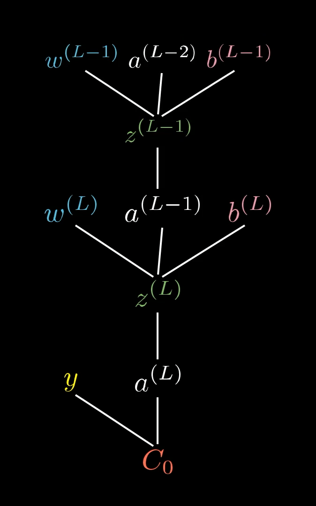
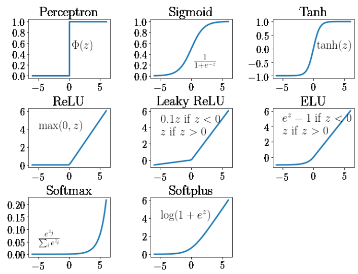

# Karpathy - Neural Networks and Backpropagation

## Summary

### What should you know for life:

#### How a neural network is trained

Given a network with layers, neurons with corresponding activation function, weights and biases for
each neuron with initial random values, and a loss function:

1. Forward pass: input values multipled by weights through each layer to the output layer
1. Loss Calculation: Calculate the loss using the loss function
1. Backpropagation: The loss is propagated back through the network by calculating the gradients of
   the loss with respect to the weights and biases
1. Update the weights and biases using the gradients and a learning rate
1. Repeat steps 1-4 until the loss converges or a stopping criterion is met

#### What do you need to make a neural network

_For a trained neural network_:

- A mathematical construct, Neurons, which holds values and gradients
  - The values aggregate all inputs that connect with the neuron. This is a linear sum of the inputs
    and weights plus a bias
  - A non-linear activation function is applied to the linear sum
- Connect many of these neurons together to form a layer, create multiple layers and modify the
  final layer activation function to get the output you want.

_To train a neural network_:

- Need to run data through the network to tune the weights and biases. This is why we need the
  gradients to move in the direction of the lowest loss. We need partial derivatives because we need
  to use the chain rule to propagate the loss over multiple nodes of the network
- Need to get the partial derivatives of the loss function with respect to the weights and biases
  along the network in order to update the weights and biases in the direction of the lowest loss

## Micrograd

Andrej Karpathy introduces a simple neural network library called `micrograd` which is a tiny, pure
Python autograd engine. It is a simple implementation of backpropagation and gradient descent. The
library is used to demonstrate the concepts of neural networks and backpropagation

Autograd - reverse mode automatic differentiation

## Introduction to derivatives

Andrej describes what a derivative is from the definition of a derivative:

$$L = \lim_{h \to 0} \frac{f(a+h)-f(a)}{h}$$

He shows a couple of examples. In particular he shows an example calculating a function about a
small $h$ and compares the slope derived to the analytic derivative.

He uses this definition **extensively** in this lecture to calculate derivatives numerically. In
many cases he also calculated the derivatives analytically.

## Construction of micrograd

He creates a data structure that maintain the massive expressions of the neural network

### Create Value object

Andrej creates a `Value` object that stores the value (activation), the gradient, children, and a
few other properties. It essentially holds all the infromation about a given node in the neural
network and can nest other `Value` objects.

Important python: He defines `__init__`, `__repr__`, `__add__`, `__mul__`: `__init__` is defined in
most objects. It is a special method used to initialize a class's objects. `__repr__` is a special
method used to represent a class's objects as a string--basically a string output of the object

Other 'dunder'/'double under' methods are listed here:
https://docs.python.org/2/reference/datamodel.html#special-method-names

The purpose of the `Value` object is to store the value of the node in the computation graph. It
also will contain references to the children of the node in the computation graph. An important
feature is when performing addition or multiplication the data is the sum or product of the `data`
property, but the two objects added or multipled are stored in the `children` property of the parent
object.

```python
class Value:

    def __init__(self, data, _children = (), _op =''):
        self.data = data
        self.grad = 0.0
        self._backward = lambda : None
        self._prev = set(_children)
        self._op = _op

    def __add__ (self, other):
        out = Value(self.data + other.data, (self, other), '+')
        return out
    # ...
    def __mul__ (self, other):
        out = Value(self.data * other.data, (self, other), '*')
        return out
```

### Show sample backpropagation



$$\frac{\partial C_0}{\partial w^{(L)}} = \frac{\partial z^{(L)}}{\partial w^{(L)}}\frac{\partial a^{(L)}}{\partial z^{(L)}}\frac{\partial C_0^{(L)}}{\partial a^{(L)}}$$

He shows a sample backpropagation with a simple linear functions without weights or biases,
calculating the partial derivatives and using the chain rule to calculate the gradients.

The reason for adding only the sum and product (`__add__`, `__mul__`) as member functions is he is
working up the basis for the "transfer function", $net_j$ across all the nodes in the neural
network. The output of a neuron (the activation) is given by the activation function applied over
the linear combination of the weights and inputs:

$$o_j = \varphi(\text{net}_j) = \varphi\left(\sum_{k=1}^n w_{kj}x_k\right),$$

And the linear combination of the weights and inputs requires the addition and multiplication
operations.


He will later need additional operations for more complex activation functions.

### Activation functions

Andrej uses the `tanh` activation function and adds it to the `Value()` class. The derivative of
`tanh` is $1 - \text{tanh}^2(x)$ and is included in the code.

```python
    def tanh(self):
        x = self.data
        t = (math.exp(2*x) - 1)/(math.exp(2*x) + 1)

        out = Value(t, (self, ), 'tanh')

        def _backward():
            self.grad += (1 - t**2) * out.grad
        out._backward = _backward

        return out
```

He then decomposes the `tanh` function into the `exp` function and other fundamental mathematical
operations. It doesn't matter if the activation functions are composite like `tanh` or atomic like
what defines `tanh`, `exp`:

$$\text{tanh}(x) = \frac{e^{2x} - 1}{e^{2x} + 1}$$

as long as each operation (composite or atomic) has a `backward` function that calculates the
gradient.

---

**Activation Function review**



| Activation Function | Best Use Case                                        |
| ------------------- | ---------------------------------------------------- |
| **Sigmoid**         | Binary classification (output layer)                 |
| **Tanh**            | Hidden layers in shallow networks, sequential models |
| **ReLU**            | Hidden layers in deep networks (default choice)      |
| **Leaky ReLU**      | When facing the dying ReLU problem                   |
| **PReLU**           | Advanced version of Leaky ReLU for deep networks     |
| **ELU**             | Faster convergence, more stable than ReLU            |
| **Swish**           | Cutting-edge deep learning tasks                     |
| **Softmax**         | Multi-class classification (output layer)            |

---

### Pytorch

Andrej shows how to implement the same neural network in PyTorch. He shows how you can use
`backward()` to backpropagate the gradients. We note that each tensor here is a 1-d tensor which
makes this similar to micrograd, however the power of PyTorch is that it can handle tensors of any
sizes and allow for large parallel computations.

```python
import torch
x1 = torch.Tensor([2.0]).double()                  ; x1.requires_grad = True
x2 = torch.Tensor([0.0]).double()                  ; x1.requires_grad = True
w1 = torch.Tensor([-3.0]).double()                 ; x1.requires_grad = True
w2 = torch.Tensor([1.0]).double()                  ; x1.requires_grad = True
b = torch.Tensor([6.8813735870194532]).double()     ; b.requires_grad = True
n = x1*w1 + x2*w2 + b
o = torch.tanh(n) # <-- the activation function over the 'transfer function'

print(o.data.item())
o.backward()

print('---')
print('x2', x2.grad.item())
print('w2', w2.grad.item())
print('x1', x1.grad.item())
print('w1', w1.grad.item())
```

### Neurons, Layers, and MLPs

The above handles the forward pass and backpropagation for a single neuron. He develops further
levels of abstraction by defining a single `Neuron` by the number of incoming connections, a `Layer`
as a collection of neurons, and an `MLP` as a collection of layers.

### Optimization

Optimization is performed via a loss function comparision with the target value. He takes loss
function as the sum of the squared differences between the target and the output of the neural
network at each output neuron. Given the gradients, he changes all weights in the direction of the
gradient by a step size. The optimization occurs via gradient descent: forward pass, backward pass,
update weights.

```python
# FORWARD PASS
ypred = [n(x) for x in xs]
#  calculate loss
loss = sum((yout - ygt)**2 for yout, ygt in zip(ys, ypred))
# BACKWARD PASS
#  flush gradients
for p in n.parameters():
    p.grad = 0.0
loss.backward()
# UPDATE WEIGHTS
for p in n.parameters():
    p.data = -0.01 * p.grad
```
