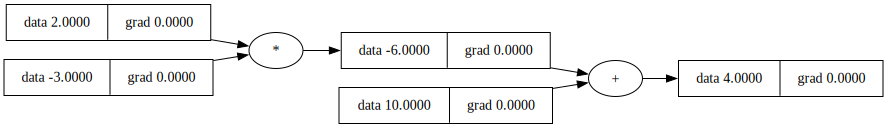

# Karpathy - Neural Networks and Backpropagation

## Summary

### Micrograd

Andrej Karpathy introduces a simple neural network library called `micrograd` which is a tiny, pure
Python autograd engine. It is a simple implementation of backpropagation and gradient descent. The
library is used to demonstrate the concepts of neural networks and backpropagation

Autograd - reverse mode automatic differentiation

## Introduction to derivatives

Andrej describes what a derivative is from the definition of a derivative:

$$L = \lim_{h \to 0} \frac{f(a+h)-f(a)}{h}$$

He shows a couple of examples. In particular he shows an example calculating a function about a
small $h$ and compares the slope derived to the analytic derivative.

He uses this definition **extensively** in this lecture to calculate derivatives numerically. In
many cases he also calculated the derivatives analytically.

## Construction of micrograd

He creates a data structure that maintain the massive expressions of the neural network

### Create Value object

Andrej creates a `Value` object that stores the value (activation), the gradient, children, and a
few other properties. It essentially holds all the infromation about a given node in the neural
network and can nest other `Value` objects.

Important python: He defines `__init__`, `__repr__`, `__add__`, `__mul__`: `__init__` is defined in
most objects. It is a special method used to initialize a class's objects. `__repr__` is a special
method used to represent a class's objects as a string--basically a string output of the object

Other 'dunder'/'double under' methods are listed here:
https://docs.python.org/2/reference/datamodel.html#special-method-names

The purpose of the `Value` object is to store the value of the node in the computation graph. It
also will contain references to the children of the node in the computation graph. An important
feature is when performing addition or multiplication the data is the sum or product of the `data`
property, but the two objects added or multipled are stored in the `children` property of the parent
object.

```python
class Value:

    def __init__(self, data, _children = (), _op =''):
        self.data = data
        self.grad = 0.0
        self._backward = lambda : None
        self._prev = set(_children)
        self._op = _op

    def __add__ (self, other):
        out = Value(self.data + other.data, (self, other), '+')
        return out
    # ...
    def __mul__ (self, other):
        out = Value(self.data * other.data, (self, other), '*')
        return out
```

### Show sample backpropagation

He shows a sample backpropagation with a simple linear functions without weights or biases,
calculating the partial derivatives and using the chain rule to calculate the gradients.

The reason for adding only the sum and product (`__add__`, `__mul__`) as member functions is he is
working up the basis for the "transfer function", $net_j$ across all the nodes in the neural
network. The output of a neuron (the activation) is given by the activation function applied over
the linear combination of the weights and inputs:

$$o_j = \varphi(\text{net}_j) = \varphi\left(\sum_{k=1}^n w_{kj}x_k\right),$$

And the linear combination of the weights and inputs requires the addition and multiplication
operations. The activation function comes next.



### Activation functions

Andrej uses the `tanh` activation function and adds it to the `Value()` class. The derivative of
`tanh` is $1 - \text{tanh}^2(x)$ and is included in the code.

```python

```
