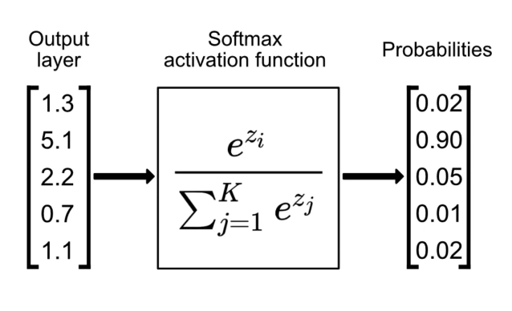
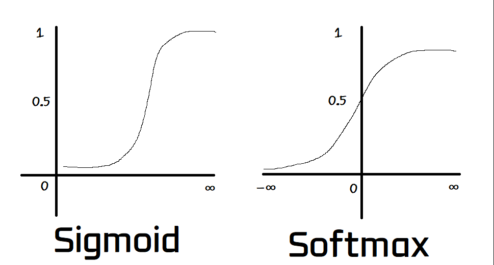
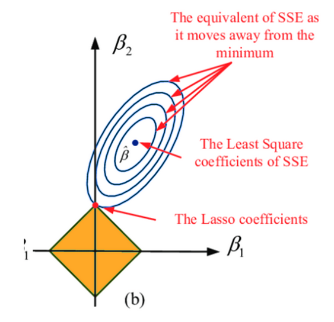

# Intro to langauge modeling - building MakeMore

We continue with the 'LLM From Scratch' series from Andrej Karpathy's Neural Networks: Zero to Hero
lecture series

https://karpathy.ai/zero-to-hero.html

The code repository for this series can be found here:

https://github.com/karpathy/makemore

A static snapshot, of this code has been cloned to the repo directory of this folder.

## MakeMore

Makemore is a tool for creating more of the type of training data given to the network. In the
example he gives a list of names and making more names similar to the training list.

Makemore is a character-level language model.

<div style="background-color: rgb(87, 61, 61);">

<font color="red">**To Remember Forever**</font>

## Broadcasting Review

### Matrix review:

$$ [ a \times b ] [c \times d] = [a \times d] $$

where

$c = b$

So the inner dimensions must match to multiply, the outer dimensions give the shape of resultant
matrix.

### What is a tensor?

In computer science, in terms of dimension and data structure:

- An **array** is a collection of elements, each identified by at least one array index or key.
- A **vector** is a one-dimensional array.
- A **matrix** is a two-dimensional array.
- A **tensor** is a multi-dimensional array.

In computer science tensor object may also have assigned methods that allow for autodifferentiation,
and other properties. So rarely is it merely a collection of numbers. But the properties are not
inherent to the tensor. In computer science, a tensor is essentially an object that holds a
multi-dimensional array and has some properties.

In mathematics, tensors have additional mathetmatical properties and requirements, such as the being
invariant under transformation.

In physics, tensors also describe a physical properties, such as

- Finite deformation tensors: pressing on a non-rigid cube from the top, z-direction will cause a
  deformation in the x and y directions
- General Relativity: Einstein's field equations are tensor equations
  - Of particular note are 'Christoffel symbols' which are used to describe the curvature of space
    time. These are not tensors in the physical/mathetmatical sense (they are array-like collections
    of numbers): under _linear transformations_ they transform like components of a tensor but under
    general coordinate transformations they do not.

The tensors in physics do not tend to have the high dimensionality as those in computer science.

Broadcasting Review:

For two tensors to be "broadcastable":

- Each tensor has at least one dimension.
- When iterating over the dimension sizes, starting at the trailing dimension, the dimension sizes
  must either be equal, one of them is 1, or one of them does not exist.

```python
>>> x=torch.empty(5,7,3)
>>> y=torch.empty(5,7,3)
# same shapes are always broadcastable (i.e. the above rules always hold)

>>> x=torch.empty((0,))
>>> y=torch.empty(2,2)
# x and y are not broadcastable, because x does not have at least 1 dimension

# can line up trailing dimensions
>>> x=torch.empty(5,3,4,1)
>>> y=torch.empty(  3,1,1)
# x and y are broadcastable.
# 1st trailing dimension: both have size 1
# 2nd trailing dimension: y has size 1
# 3rd trailing dimension: x size == y size
# 4th trailing dimension: y dimension doesn't exist

# but:
>>> x=torch.empty(5,2,4,1)
>>> y=torch.empty(  3,1,1)
# x and y are not broadcastable, because in the 3rd trailing dimension 2 != 3
```

If two tensors, x, y are "broadcastable" the resulting tensor size is calculated as follows:

- If the number of dimensions of x and y are not euqal, prepend 1s to the dimensions of the tensor
  with fewer dimensions.
- Then, for each dimension size, the resulting tensor size is the maximum of the sizes of x and y
  along that dimension.

```python
# can line up trailing dimensions to make reading easier
>>> x=torch.empty(5,1,4,1)
>>> y=torch.empty(  3,1,1)
>>> (x+y).size()
torch.Size([5, 3, 4, 1])

# but not necessary:
>>> x=torch.empty(1)
>>> y=torch.empty(3,1,7)
>>> (x+y).size()
torch.Size([3, 1, 7])

>>> x=torch.empty(5,2,4,1)
>>> y=torch.empty(3,1,1)
>>> (x+y).size()
RuntimeError: The size of tensor a (2) must match the size of tensor b (3) at non-singleton dimension 1

```

see: https://pytorch.org/docs/stable/notes/broadcasting.html

</div>

## Evaluating this naive model

We can pass the bigrams of the input words into our bigram probability array to see the probability
the model associates with each bigram that domes through for the list of words. As a reminder these
probabilities come from the frequency of letter-letter associations in the training data (word
list). The model performance is poor because there are many bigrams possible.

We would like a single number that measure the performance of the model. In this evaluation we are
not predicting bigrams but rather passing the actual words through and seeing what probability is
associated with a given bigram. If the probability is close to 1 then the model is performing well.
If we multiply all probabilities, it would give us a number between 0 and 1. For a large number of
words this can give us a measure of performance: the closer to 1 the better the model is performing.
This likelihood is a function of the model parameters, $\theta$. In this case, the parameters are
simply the bigram probabilities.

<div style="background-color: rgb(87, 61, 61);">

<font color="red">**To Remember Forever**</font>

### Maximum Likelihood Estimation

<!-- prettier-ignore-start -->
This is the basis behind Maximum Likelihood Estimation (MLE). We want to find the parameters that
optimize some likelihood function where the observed data is most probable. The likelihood function
is taken to be a product of univariate density functions. From Wikipedia,

> Evaluating the joint density at the observed data sample $ \mathbf{y} = (y_1, y_2, \ldots, y_n)
> \;$ gives a real-valued function,
>
> $$\mathcal{L}_{n}(\theta) = \mathcal{L}_{n}(\theta; \mathbf{y}) = f_{n}(\mathbf{y}; \theta) \;,$$
>
> which is called the likelihood function. For independent and identically distributed random
> variables, $f_{n}(\mathbf{y}; \theta)$ will be the product of univariate Probability density
> function|density functions:
>
> $$ f_{n}(\mathbf{y}; \theta) =  \prod_{k=1}^n \, f_k^\mathsf{univar}(y_k; \theta) ~.$$
>
> The goal of maximum likelihood estimation is to find the values of the model parameters that
> maximize the likelihood function over the parameter space, that is:
>
> $$ \hat{\theta} = \underset{\theta\in\Theta}{\operatorname{arg\;max}}\,\mathcal{L}\_{n}(\theta\,;\mathbf{y}) ~. $$
<!-- prettier-ignore-end -->

Key to note: the likelihood is a product that optimizes for parameters, $\theta$, given the observed
data, $y$.

#### Motivating the log and the negative in Negative Log Likelihood

As the size of matrix, N, increases the probabilities will become very small. If we multiply these
the number will be extremely small, perhaps too small to be represented by a computer. If we take
the log of these numbers we can add them together by the identity:

$$ \log\left(\prod_i x_i\right) = \sum_i \log(x_i) $$

For further numerical reasons, we take the negative of the log likelihood. The logarithm is a
monotonically increasing function, so the negative of the log likelihood is a monotonically
decreasing function. This is useful for optimization algorithms that are trying to minimize a
function. (Monotonic: always increasing or always decreasing.)

Said more mathematically, MLE (Maximum Likelihood Estimation) seeks to maximize the likelihood
function:

$$ L(\theta) = P(y | X; \theta) $$

Instead of maximizing $L(\theta)$ , we minimize the negative log likelihood:

<!-- prettier-ignore-start -->
$$ \mathcal{L}(\theta) = -\sum_{i} \log P(y_i | X_i; \theta) $$
<!-- prettier-ignore-end -->

</div>

#### Where have we seen likelihood before?

- Naive Bayes: we calculated the likelihood of class given the evidence based on the prior and
  likelihood for each evidence (words in our example)

$$
log \left( \frac{P(c_1)}{P(c_2)} \right) + \sum_i \log \left( \frac{P(w_i | c_1)}{P(w_i | c_2)}
\right)
$$

where $c_1$ and $c_2$ are the classes and $w_i$ is the evidence (words in the document in our case).

### Model Smoothing

Because there are cases in our probability matrix where the probability is 0, the negative log would
go to infinity. To avoid this we can add 1 to all values in the matrix. Then the negative log of 1
is 0. This could change the model slightly (since some non-zero letters also get an extra 1), but
fixes the singularity in the math.

One is not the only number that we can add: the more we add the more we smooth the model.

## Beyond the naive model

Up to this point we based our bigrams based on frequencies in our corpus. Now we want to cast this
problem in terms of neural network with parameters that we want to optimize. Previously the
parameters were merely the frequency count of the bigrams, now we want to train a more complex model
that optimizes parameters. However, although we will train via gradient descent on a neural network,
we don't expect a better loss than the naive frequency-based model because we are not taking in any
additional information.

### One-hot encoding of input (character) integers

We have single integers for incoming input letters. Neural networks take in vectors of floats. In
order to vectorize these integers we perform one-hot encoding as with traditional machine learning
models. To make the float vectors, we cast the integers as floats.

### Single neuron

#### Architecture

By initializing a set of weights and multiplying by the one-hot encoded input we get activations for
the neuron. We want the output to be of dimension 27 to associate a probability with all letters
(and period) based on a given input.

#### Getting Probabilities - the Softmax

The matrix product of x and w gives us positive and negative values that don't have the properties
of probabilities (i.e. between 0 and 1 and sum to 1). However, if we exponentiate these values we
get positive numbers which can be normalized to be between 0 and 1.

So given a 1-hot encoded input, we multiply this by 27 weights, and the resulting 27 numbers will
eventually be the probabilities of the next letter.

<div style="background-color: rgb(87, 61, 61);">

<font color="red">**To Remember Forever**</font>

Formally this is the softmax function $\sigma: \mathbf{R}^K \rightarrow (0,1)^K$ where $K > 1$,
takes a vector $z = (z_1, z_2, \ldots, z_K)$ and comptues each compoentn of a vector
$\sigma(z) \in (0,1)^K$ as:

$$ \sigma(z)_i = \frac{e^{z_i}}{\sum_{k=1}^K e^{z_k}} $$

</div>





<div style="background-color: rgb(87, 61, 61);">

<font color="red">**To Remember Forever**</font>

#### Optimization of Network with Probability Output

The optimization of the neural network will run the same way as with micrograd.

1. Get the input data
1. Past the input data through the 'network' (single node, linear activation, just weights)
1. Softmax: calculate the probabilities of the next letter
1. Calculate the loss, the negative log likelihood for the expected letters
1. Backpropagate the loss to get the gradients
1. Update the weights by nudging the opposite direction of the gradient
1. Reset the gradients and repeat

</div>

<div style="background-color: rgb(87, 61, 61);">

<font color="red">**To Remember Forever**</font>

#### Regularization

Recall the three types of regularization:

- LASSO: penalizes the sum of the absolute values of the weights
  - LASSO - Least Absolute Shrinkage and Selection Operator
    - To remember: when you think 'absolute' think 'absolute value', the term of the regularization.
  - L1 regularization
  - Use when you want to select important features (automatically sets some coefficients to zero)
  - $ \lambda \sum_i |w_i| $
- Ridge: penalizes the sum of the squares of the weights
  - L2 regularization - how to remember: the L2 has a square in it
  - When features are highly correlated and you want to shrink coefficients without eliminating them
  - $ \lambda \sum_i w_i^2 $
- Elastic Net: a combination of the two
  - L1 and L2 regularization
  - good for high-dimensional data
  - $ \lambda_1 \sum_i |w_i| + \lambda_2 \sum_i w_i^2 $

**Visual Interpretation**

With regularization optimization is applied across the loss function and the regularization terms

$$ \sum_i V(f(x_i,y_i)) + \lambda \sum_i R(f)$$

Where V is the underlying loss function and R is the regularization term. For the case of RSS
(Residual Sum of Squares) for OLE (Ordinary Least Squares) regression, the loss function with ridge
regression is:

$$ \sum^n_i \left( y_i - \beta_o - \sum^p_j \beta_j x{ij} \right)^2 + \lambda \sum^p_j \beta_j^2 $$

and for LASSO regression is:

$$ \sum^n_i \left( y_i - \beta_o - \sum^p_j \beta_j x{ij} \right)^2 + \lambda \sum^p_j |\beta_j| $$

Projecting into 2-D for visualizing, although the optimized minium is most likely a single point in
this
$\beta_1, \beta_2 $ parameter space, when we introduce a regularization term to avoid over
fitting the regularization pulls the optimized coefficients away from this minium where the 
parameters can take a set of values away from the non-regularized minimum. (The set of $\beta$
parameter values form an elliptical contour in this space--like walking around the bottom of a
valley above the minimum bottom.) The regularization forces the parameters to be minimized both for
the loss function but also for the size of the terms under the assumption that smaller terms are
less likely to overfit.



</div>

Regularization can be used in almost any type of machine learning algorithm: Linear regression,
Logistic regression, Neural networks, Random Forests, KNN, PCA. Whenever some sort of optimization
is being performed regularization can be used.
