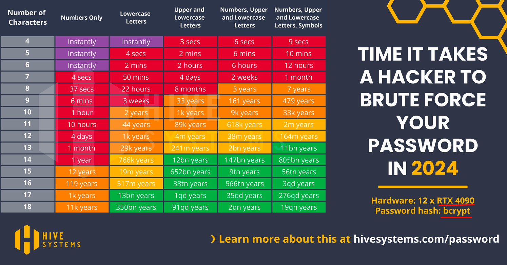

# Cryptography - Encryption, Hashing and how to pick the best password

# Cryptography 101

Cryptography consists of several topics. In very broad strokes, for our purposes the most relevant
are:

- Private-Key Symmetric Encryption - the same key is used to encrypt and decrypt the message.
  - Message Authentication
- Hash Functions - a one-way function that takes an input and produces a fixed-size output.
- Public-Key Asymmetric Encryption - a public key is used to encrypt the message and a private key
  is used to decrypt it.
  - Public-Key Encryption
  - Digital Signatures
- Post-Quantum Cryptography

In this lecture we will focus only on Hash functions, in particular how the relate to password
security.

## Hash Functions

Hash functions are one-way mathematical functions with the following properties:

- Deterministic: The same input will always produce the same output.
- Fast: The output is computed quickly.
- Fixed-size output: The output is always the same size, regardless of the input size.
- One-way: It is computationally infeasible to reverse the function.
- Collision resistance: It is computationally infeasible to find two different inputs that hash to
  the same value.

## Different Hash Functions

- MD5: 128-bit hash value, considered broken.
- SHA-1: 160-bit hash value, considered broken.
- SHA-2: Includes SHA-254, 256-bit hash value, considered secure.
- SHA-3: 224, 256, 384, or 512-bit hash value, considered secure.
- bcrypt: A password hashing function that is considered secure.
- scrypt: A password hashing function that is considered secure.

Note that these algorithms are not seen in the case of SSH and symmetric encryption which use
private-public key pairs, which use different algorithms, including:

- RSA
- AES
- ECDSA
- DSA

## SHA-256 Algorithm

The SHA-256 algorithm is a widely used hash function that produces a 256-bit hash value.

(See example code in `sha256hash.py)

## Hashing Passwords for Security

When storing passwords, it is important to hash them. This is because if an attacker gains access to
the database they will not be able to see the passwords in clear text. Instead, they will see the
hashed values. When a user logs in, the password they enter is hashed and compared to the stored
hash.

However, hashing is not enough. If an attacker gains access to the database that is merely hashed,
there are two immediate attacks they can perform:

- Lookup attack: The attacker can hash a list of common passwords and compare them to the hashes in
  the database.
- Rainbow table attack: The attacker can use a precomputed table of hash reduction chains to look up
  the original password.

---

### Rainbow Tables

Idea behind rainbow tables:

- An attacker would like to precompute a lot of passwords and at attack-time just look up the hash
  to find the corresponding password.
- However storing all these can be huge for a giant keyspace
- If an attacker can have a deterministic method to calculate the password/hash pairs then they can
  store a much smaller set of data.
- The attacker can use a faster 'reduction function' to generate new passwords to precompute hashes
  from.
- The attacker can chain a series of reduction functions and hashes together to create a rainbow
  table.
- At attack time the attacker performs computations that can tell them which series of computations
  in a chain the attacker needs to compute to find the password (without storing all the
  intermediate hashes).

Rainbow tables allow an attacker to tradeoff time for space. Instead of storing all possible hashes
an attacker computes a series of reduction functions and hashes in series:

- `P1 -> R1 -> H -> P2 -> R2 -> H -> P3 -> R3 -> H -> ... -> Pn -> Rn -> H`
- `Pn+1 -> R1 -> H -> Pn+2 -> R2 -> H -> Pn+3 -> R3 -> H -> ... -> P2n -> Rn -> H`

Where:

- `P` is the password
- `R` is the reduction function
- `H` is the database hashing function

stores the starting password and final hash of a _chain_ of hash-reduction function pairs. The
reduction functions are all different, the hashes are the same used to hash the password in the
database. These chains can be thousands long.

When an attacker wants to try and crack a hash they apply:

1. Apply the final reduction function to the stolen hash
2. Check if the result is in the rainbow table
3. If not, they apply the second to the last reduction function and then last reduction function to
   the hash
4. If the password is in the rainbow table, the attacker starts with the original password in the
   chain and applies reduction functions and hashes working up the chain until the user finds the
   hash they were looking for. The password that preceded the most recent hash in the chain is the
   password that corresponds to the hash they are trying to crack and the attack is successful.

#### Why does this work?

The reduction functions are a deterministic set of steps that create chains that themselves have
many hash values that cane be derived deterministically. The attacker doesn't need to store any of
the intermediate hashes. Once an attacker attempts the chain of operations on a given hash and finds
a resulting password in the rainbow table they know the password and hash exist somewhere in that
chain and just need to recompute chain to find the cracked password.

#### Salting

To defend against this attack, we can add a bit of randomness to the password before hashing it.
This is called salt:

`hash(salt + password)`

e.g.

`hash("@#$%" + "password")`

The salt can be stored as plaintext in the database and is used with the user's password when they
try and login by appending it to the password, hashing it and comparing with the hash in the
database.

##### Why salting breaks lookups and rainbow tables:

- Lookup attack: The attacker would never have a precomputed hash of a known password because the
  salt would change the hash. 'password' may be in the attackers lookup table but '#@$#@password'
  probably is not.

- Rainbow table attack: Because every user has a unique salt, every hashing operation must include
  the unique salt, this means every H() opperation needs to have salt for the user and the attacker
  needs a rainbow table for every user in the database. This is infeasible.

## Learning Crypography by learning how to pick the best password

### BAD Password: use the most commonly used passwords

According to internet security firm SplashData the most popular passwords are over the last 10
years:

| Rank | Common Password |
| ---- | --------------- |
| 1    | 123456          |
| 2    | password        |
| 3    | 123456789       |
| 4    | 12345           |
| 5    | 12345678        |
| 6    | qwerty          |
| 7    | 111111          |
| 8    | 123123          |
| 9    | 1234567         |
| 10   | qwerty123       |
| 11   | 1q2w3e4r        |
| 12   | admin           |
| 13   | welcome         |
| 14   | abc123          |
| 15   | 654321          |
| 16   | 1234            |
| 17   | password1       |
| 18   | 123321          |
| 19   | qwertyuiop      |
| 20   | iloveyou        |

An attacker needs your login and if they try these 20 passwords they can get access.

#### Definitions

- **online attack** - a password attack is throttled by a website restricting the number of attempts
  that can be made in a given time period.
- **offline attack** - a password attack is not throttled and can be done directly to a hash on an
  offline machine. These can be run much faster.
- **impact** - The damage incurred if a password is broken.

Amount of damage incurred by password break is called

#### How do attackers crack passwords?

1. Guess the password
2. Hash the guess
3. Compare the hash to the stolen hash
4. If the hashes match, the attacker knows your password

#### Are you safe?

Most password experts do not account for risk tolerance. If you use a commonly used password in a
low-value situation, maybe the worst someone can do is post to your old reddit account. That said,
there's almost no reason to use a commonly used password.

#### Most common attacks

1. Attackers get your password or hash

   1. Attackers get access to a database of hashed passwords
      - Attackers then try and crack the passwords
      - **Dictionary attack** - uses a list of common passwords, almost always an offline attack
      - **Brute force attack** - tries every possible combination of characters, almost always an
        offline attack
   1. Attackers get access to a database of hashed passwords AND clear text passwords
      - RockYou attack - because RockYou stored passwords 32 Million passwords in clear text and it
        was hacked and leaked to the internet. This real world usage of passwords provided a
        real-world list of passwords that any hacker could hash and use to perform lookups against
        hashes in other databases.

2. Attackers attempt to log in to other sites using your username and password

   - Two Factor Authentication (2FA) can help protect against this Credential Stuffing
     - 2FA - Two Factor Authentication - requires a second form of authentication, such as a text
       message or a code from an app, in addition to a password.
       - Three factors of authentication: something you know (password), something you have (key
         generator), something you are (biometrics).
     - **Credential stuffing** - attackers use a list of known username and password pairs to try
       and log in to other sites. This is why it is important to use a different password for every
       site.
   - Many important sites (Banking, Email etc.) will use 2FA by default.
   - The promise of 'passkeys' is a future world without passwords, using keys over passwords.

### Pick a better password




Options:

- N Random Chraracters
- 'Leetspeak' password
- Random Words
- Passphrases
- Passphrase or Random Words with spelling error

#### Running `hashcat` against passwords

(Another program is `john the ripper`)

##### N-Random Characters

_7-character, 1 charset (lowercase), MD5 hashes_

```bash
> hashcat -m 0 -t 32 -a3 example0.hash '?l?l?l?l?l?l?l'

Session..........: hashcat
Status...........: Exhausted
Hash.Mode........: 0 (MD5)
Hash.Target......: example0.hash
Time.Started.....: Tue Mar 11 04:13:04 2025 (2 secs)
Time.Estimated...: Tue Mar 11 04:13:06 2025 (0 secs)
Kernel.Feature...: Pure Kernel
Guess.Mask.......: ?l?l?l?l?l?l?l [7]
Guess.Queue......: 1/1 (100.00%)
Speed.#1.........:  3945.1 MH/s (0.67ms) @ Accel:256 Loops:512 Thr:32 Vec:1
Recovered........: 2168/6494 (33.38%) Digests (total), 21/6494 (0.32%) Digests (new)
Remaining........: 4326 (66.62%) Digests
Recovered/Time...: CUR:N/A,N/A,N/A AVG:N/A,N/A,N/A (Min,Hour,Day)
Progress.........: 8031810176/8031810176 (100.00%)
Rejected.........: 0/8031810176 (0.00%)
Restore.Point....: 456976/456976 (100.00%)
Restore.Sub.#1...: Salt:0 Amplifier:17408-17576 Iteration:0-512
Candidate.Engine.: Device Generator
Candidates.#1....: fkxcxjq -> xqxqxqg
Hardware.Mon.#1..: Temp: 54c Fan: 15% Util: 62% Core:1949MHz Mem:4006MHz Bus:16

```

As you increase the number of charsets then the keyspace will increase rapidly

- lowercase - 26 characters
- uppercase - 26 characters
- numbers - 10 characters
- special characters - 33 characters
- total for all 4 charsets - 95 characters

_8-character, 4 charset, MD5 hashes_

- MD5 is considered unsafe. Never use for secret information

```bash
> hashcat -m0 8char4charset_MD5.txt -a3 '?a?a?a?a?a?a?a?a'

Session..........: hashcat
Status...........: Quit
Hash.Mode........: 0 (MD5)
Hash.Target......: 8char4charset_MD5.txt
Time.Started.....: Tue Mar 11 03:50:39 2025 (39 secs)
Time.Estimated...: Sun Mar 23 15:12:23 2025 (12 days, 11 hours)
Kernel.Feature...: Pure Kernel
Guess.Mask.......: ?a?a?a?a?a?a?a?a [8]
Guess.Queue......: 1/1 (100.00%)
Speed.#1.........:  6155.9 MH/s (9.95ms) @ Accel:256 Loops:512 Thr:32 Vec:1
Recovered........: 0/100 (0.00%) Digests (total), 0/100 (0.00%) Digests (new)
Progress.........: 242165760000/6634204312890625 (0.00%)
Rejected.........: 0/242165760000 (0.00%)
Restore.Point....: 245760/7737809375 (0.00%)
Restore.Sub.#1...: Salt:0 Amplifier:256000-256512 Iteration:0-512
Candidate.Engine.: Device Generator
Candidates.#1....: _7k>F000 -> tArL"BER
Hardware.Mon.#1..: Temp: 63c Fan: 26% Util:100% Core:1784MHz Mem:4006MHz Bus:16
```

_8-character, 4 charset, SHA-256 hashes_

- Would take 53 days to crack with a GTX 1070 (1,447,000 Hashes/second)
  - The time does not scale with number of hashes when you are searching the entire keyspace. Once a
    hash is revealed you can compare with an aribtrary number of hashes quickly.
  - AWS T4 - 3300 MH/s - Twice as fast
  - AWS H100 - 12,000 MH/s - 8 times as fast
  - If you double the speed when you distribute across multiple GPUs.
  - 7 H100s would crack in 1 day.
    - But this costs and can get prohibitively expensive (i.e. not worth the payload, unless you
      know it's crypto or something valuable).

```bash
>  hashcat -m1400 8char4charset_SHA2-256.txt -a3 '?a?a?a?a?a?a?a?a'

Session..........: hashcat
Status...........: Quit
Hash.Mode........: 1400 (SHA2-256)
Hash.Target......: 127e6fbfe24a750e72930c220a8e138275656b8e5d8f48a98c3...aba935
Time.Started.....: Tue Mar 11 03:30:15 2025 (2 mins, 19 secs)
Time.Estimated...: Sat May  3 04:50:16 2025 (53 days, 1 hour)
Kernel.Feature...: Pure Kernel
Guess.Mask.......: ?a?a?a?a?a?a?a?a [8]
Guess.Queue......: 1/1 (100.00%)
Speed.#1.........:  1447.3 MH/s (10.63ms) @ Accel:16 Loops:256 Thr:256 Vec:1
Recovered........: 0/1 (0.00%) Digests (total), 0/1 (0.00%) Digests (new)
Progress.........: 203298385920/6634204312890625 (0.00%)
Rejected.........: 0/203298385920 (0.00%)
Restore.Point....: 184320/7737809375 (0.00%)
Restore.Sub.#1...: Salt:0 Amplifier:736768-737024 Iteration:0-256
Candidate.Engine.: Device Generator
Candidates.#1....: P_[3LBER -> kM]"&***
Hardware.Mon.#1..: Temp: 66c Fan: 36% Util: 98% Core:1885MHz Mem:4006MHz Bus:16
```

##### Dictionary-based attack

##### Leetspeak Password and Rules-based attack

Hackers have got wise that many people change common characters that look like other characters.
Example:

- a -> @
- e -> 3
- I -> 1
- o -> 0
- s -> $

_Rules-based attack_

```bash
> hashcat -m 0 -a 0 -r dive.rule example0.hash example.dict


```

##### Passphrase - Random Words

To calculate the keyspace:

$$ \text{keyspace} = \text{number of charsets}^{\text{password length}} $$

However when useng a passphrase the keyspace blows up

$$ \text{keyspace} = \text{number of words in dictionary}^{\text{number of words in passphrase}} $$

Password cracking dictionaries will have thousands to hundreds of thousands of words in them. This
make the keyspace blow up because instead of 95 possibilities for the first letter there are
thousands to hundreds of thousands of possibilities for the first word. (We are assuming here that
the attacker is doing a word based attack)

So to calculate the keyspace of 5 word passphrase for 'correcthorsebatterystaple':

$$ \text{keyspace} = 7776^5 = 2.8 \times 10^{19} $$

The similar calculation for a 10 character password with 4 charsets:

$$ \text{keyspace} = 95^{10} = 5.9 \times 10^{19} $$

To calculate how long it would take to exhaust the keyspace:

$$ \text{time} = \frac{\text{keyspace}}{\text{hashes per second}} $$

If you're at a keyspace at the order of $10^{19}$ it would proably take 10+ years to crack your
password using 1000 GPUs with GPUS that are 100s of times faster than today's technology. (Quantum
computers invalidate all of this, however.)

##### A sentence?

You can increase the number of words by simply using a sentence as a passphrase, and again it can be
all lowercase.

`Willahackerbeabletocrackthispassword?`

Pros:

- Lots of words
- 1 Capital letter
- 1 punctuation mark

Cons:

- Capital at the start of the sentence, Common pattern
- Punctuation at the end of the sentence, common pattern
- Very much a sentence that many will think up; adversarial passwords are very common

This is probably a strong password but does rely on some obscurity. Ideally we want to be able to
tell the attacker "My password is nine words with a capital at the beginning and a symbol at the
end" and still have it take decades to crack.

`inagreatbookIreadthekidstesser`

This is better (a reference to 'A Wrinkle in Time')

`inagreatbookIread!thekidstesser`

Probably te best password so far. The random character (not at the end, which is common) makes this
even more difficult to break. You could tell the attacker: "My password is 9 words with a special
character somewhere in the password" and it would probably still have a very low chance of being
cracked.

A great website to test passwords: https://lowe.github.io/tryzxcvbn/

## Tips for a good password

- Use a passphrase - you can even use all lowercase
- Try to use words that you don't think would be in an attackers dictionary (foreign words, uncommon
  mispellings, science fiction)
- This may be enough for 5 to 6 words, but if you add in a single random character, you can be
  almost assured that this word with a random character will never be in an attackers dictionary.

  - is this the much-maligned 'security by obscurity'? Ideally we want to be able to tell the
    attacker our pattern and still have it hard for them to crack. Adding a random character to a
    passphrase may result in
