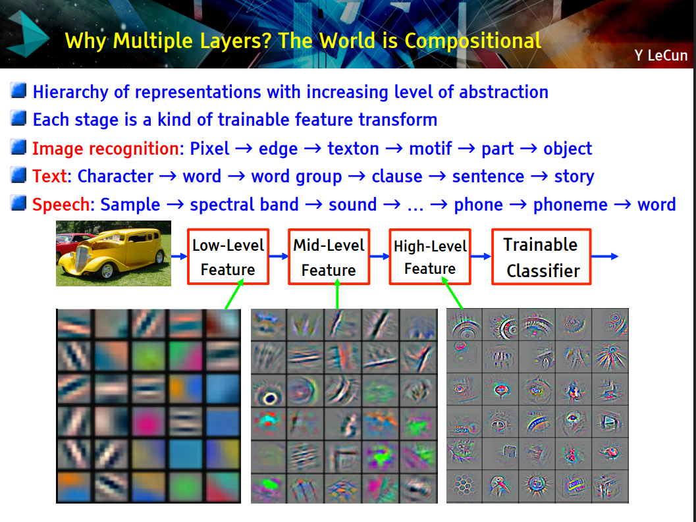
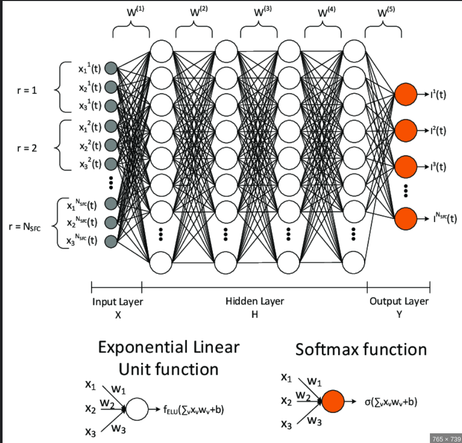
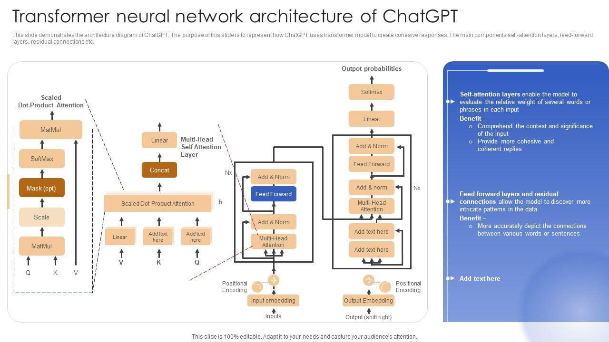
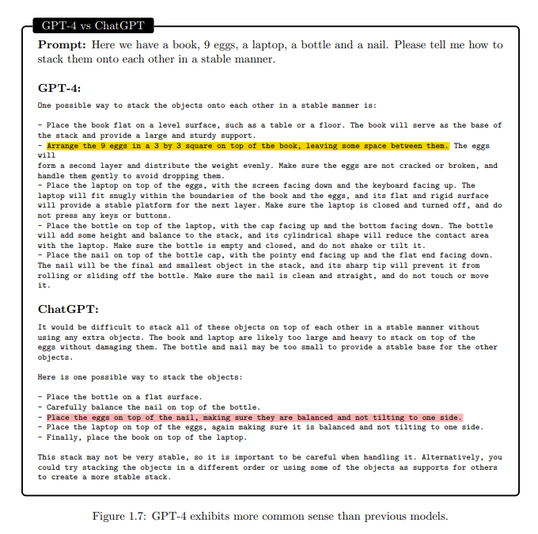

# Overview of GenAI Industry, Tools, and Resources

This analysis was preformed on March 18, 2025 and will certainly be out of date quickly. We want to
analyze the current state of the industry in particular risk of job loss and the tools that are
currently in use (e.g. vibecoding tools).

# Review of Industry Opinions on Important Topics

## Risk

### Terminology, Facts

- AGI - Artificial General Intelligence
- ASI - Artificial Super Intelligence
- UBI - Universal Basic Income

- Three Godfathers of AI: Jeff Hinton, Yann Lecun, Yoshua Bengio
  - Won the Turing Award in 2018

### Expert Opinions

<!-- disable word wrap in vscode make the table more readable: alt+z  -->
<!-- prettier-ignore-start -->
| Person            | Occupation                                       | Opinion                                                                                                                 | Link                                                                                                                                             |
|-------------------|--------------------------------------------------|-------------------------------------------------------------------------------------------------------------------------|--------------------------------------------------------------------------------------------------------------------------------------------------|
| Jeff Hinton       | AI Researcher                                    | Believes in widespread job loss and advocates for UBI                                                                   | https://blog.getodin.ai/ai-takes-jobs-odin-offers-hope-geoffrey-hinton/                                                                          |
| Andrew Ng         | AI Researcher                                    | Massive Boost in Productivity, create new jobs, but some losses are inevitable                                          |                                                                                                                                                  |
| Yann Lecun        | AI Researcher                                    | Won't take over the world or permanently destroy jobs.                                                                  | https://www.bbc.com/news/technology-65886125#:~:text=One%20of%20the%20three%20%22godfathers,humanity%20were%20%22preposterously%20ridiculous%22. |
|                   | AI Researcher                                    |                                                                                                                         |                                                                                                                                                  |
| Yoshua Bengio     | AI Researcher                                    | Will transform job market by replacing specific roles, it wont 'steal' jobs                                             |                                                                                                                                                  |
| Gary Marcus       | Cognitive Scientist, Founder of two AI Companies | Will transform jobs; wont take massively relplace jobs in the short term                                                |                                                                                                                                                  |
| Dario Amodei      | CEO, Anthropic                                   | "In the next 3 to 6 months, AI is writing 90% of Code"                                                                  |                                                                                                                                                  |
| Kevin Roose       | Journalist, NYTimes                              | "Powerful AI is Coming. We're not Ready.                                                                                | https://www.nytimes.com/2025/03/14/technology/why-im-feeling-the-agi.html                                                                        |
| Ezra Klein        | Journalist, NYTimes                              | "Government Knows AGI Is Coming"                                                                                        | https://www.nytimes.com/2025/03/04/opinion/ezra-klein-podcast-ben-buchanan.html                                                                  |
| Eliezer Yudkowsky | AI Researcher                                    | Massive Job Losses, most likely end of the world                                                                        |                                                                                                                                                  |
| Primogen          | Software Developer (youtube)                     | Tools create bad code, maybe help some productivity, but not putting developers out of a job in the near to medium term |                                                                                                                                                  |
<!-- prettier-ignore-end -->

### Prediction sites

- Metaculus
  - "When will the first general AI system be devised, tested, and publically announced?"
    - https://www.metaculus.com/questions/5121/date-of-artificial-general-intelligence/
  - "When will the first weakly general AI system be devised, tested, and publically announced?"
    - https://www.metaculus.com/questions/3479/date-weakly-general-ai-is-publicly-known/
- Manifold
  - "AGI When?" 2033
    - https://manifold.markets/ManifoldAI/agi-when-resolves-to-the-year-in-wh-d5c5ad8e4708
  - "Will we get AGI before 2027" 16%
    - https://manifold.markets/RemNi/will-we-get-agi-before-2027-d7b5f2b00ace
- Kalshi
  - "When will OpenAI achieve AGI?" 64% before 2030
    - https://kalshi.com/markets/kxoaiagi/openai-achieves-agi
- Polymarket
  - "OpenAI announces it has achieved AGI in 2025" 22% Chance
    - https://polymarket.com/event/openai-announces-it-has-achieved-agi-in-2025?tid=1742315921166

### Classes of Risk

- Will I lose my job in N years?
- Is there a society-level risk (misinformation, scams, hacking etc.)
- Is there a humanity-level risk (state-level threat; p-doom scenarios)
  - P(Doom) - subjective probability of existentially catastrophic outcomes (i.e. 'doom') as the
    result of artificial intelligence in the long run.
    - https://en.wikipedia.org/wiki/P(doom)

We'll only be focusing on the first case of personal job risk for a data scientist.

### A priori arguments regarding job loss

- Bull (AI pumper): AI is already breaking through benchmarks, and accomplishing impressive things
  better than humans. There is no reason to believe that these models wont improve.
- Bear (AI skeptic): Admission that a will improve does not mean it will improve forever.
  - We've been here before in other technologies
    - Driverless Cars
    - Crypto
    - GUT (Theory of Everything in physics)

In trying to decern between these two possibilities we want to look at the possible theoretical
limiations of current GenAI models and whether it seems likely that they would be overcome.

## Possible Theoretical and Practical Limitations of Current GenAI Models

### Current State

#### Lack of GPT-5

| Model   | Release Date       | Months Since Previous Release |
| ------- | ------------------ | ----------------------------- |
| GPT-2   | February 14, 2019  |                               |
| GPT-3   | June 11, 2020      | 15                            |
| GPT-3.5 | November 30, 2022  | 29                            |
| GPT-4   | March 14, 2023     | 3                             |
| GPT-4o  | May 13, 202       | 13                            |
| GPT-o1  | September 12, 2024 | 3                             |
| GPT-o3  | January 31, 2025   | 4                             |
| GPT-4.5 | February 27, 2025  | 1                             |
| GPT-5   | Expected in 2025   |                               |

It has been 2 years since GPT-4. OpenAI has ben productizing their models, but if 'scale is all you
need' to AGI then why are they wasting time productizing models, AGI is the ultimate prize. This
suggests at least two possibilities:

1. OpenAI suffers from a **lack of data** after exhausting most quality training data on the
   internet it needs to find more data or synthesize data
2. The results of scaling have been lackluster and OpenAI doesn't think there are anymore benefits
   to scale

Some have rumored that 4.5 was a version decrement (instead of 5) due to lack in performance. This
is unconfirmed. We do know that OpenAI seems to be 'waisting' time with products they will quickly
obsolete when AGI is supposedly around the corner (according to Sam Altman and others) which should
supercharge. Either they appear to have a bad business strategy or AGI is harder than they are
letting on.

The argument is that models may have exhausted the benefits of scaling however there may be scaling
laws with chain-of-thought and reasoning (taking more time with the model). This line of thought
seems to have a fundamental misunderstanding of what **scaling** laws are. One can't simply 'double
the amount of reasoning'. It is possible to increase the amount of time the model spends on Chain of
Thought but it's not clear that performance scales with scaling of 'reasoning' in the same way we
know data does in many models (that are data limited). Said simply: we know we can double the data,
the cpu, but doubling the 'reasoning' isn't clear. It's not clear at all that doubling the reasoning
time would be scalable.

### Analysis of ai-2027.com

Some rationalists, AI bulls have created a forecast of how they believe AGI/ASI will progress. This
section will use their work as a starting point for the AI bull case.

#### Overview

The website was written by

- Daniel Kokotajlo - philosophy PhD, AI Impacts, Center on Long-Term Risk, then OpanAI
- Scott Alexander - psychiatrist, rationalist, author of Slate Star Codex, and the blog Astral Codex
  Ten
- Thomas Larsen - B.S in Computer Science, AI Safety Researcher
- Eli Lifland - B.S Computer Science, AI Safety Researcher, Superforecaseter
- Romeo Dean - B.S, M.S. Computer Science, AI Safety Researcher

Daniel has a previous pre-ChatGPT forecast that was surprisingly accurate at
[alignmentforum.org](https://www.alignmentforum.org/posts/6Xgy6CAf2jqHhynHL/what-2026-looks-like).

#### Summary of Predictions and prima facie concerns

<!-- prettier-ignore-start -->
| Date       | Event                                                                                                                                                                                                   | Assessment/Concerns                                                                                          |
|------------|---------------------------------------------------------------------------------------------------------------------------------------------------------------------------------------------------------|--------------------------------------------------------------------------------------------------------------|
| mid-2025   | Ads for computer-using agents with 'personal-assistants' (e.g 'order me a burrito on DoorDash', 'open my budget spreadsheet and sum this month's expenses')                                             | Current Agents performance is pretty bad currently                                                           |
| mid-2025   | Coding AIs take instructions making substantial code changes on their own saving hours or days                                                                                                          | Current vibecoding is very poor at th is level                                                               |
| late-2025  | Openbrain is building biggest datacenters ever seen -- 1000x bigger than GPT-4                                                                                                                          | There's no evidence any company is currently building this, if anything 'scale is all you need' seems broken |
| late-2025  | Openbrain puts all their resources into a model that can help with AI research to accelerate their models                                                                                               | There's no evidence any company is starting this and bootstrapping is big unknown                            |
| late-2026  | Ai starts taking jobs, job market for junior software engineers is in turmoil                                                                                                                           |                                                                                                              |
| jan 2027   | Agent-2 Never finishes learning - a continually improving model with synthetic data, human long-horizon tasks, and diverse and difficult tasks (lots of video games, coding challenges, research tasks) |                                                                                                              |
| feb 2027   | China Steals Agent-2                                                                                                                                                                                    |                                                                                                              |
| Apr 2027   | Alignment for Agent-3                                                                                                                                                                                   |                                                                                                              |
| Jun 2027   | Self-improving AI                                                                                                                                                                                       |                                                                                                              |
| Aug 2027   | The Goepolitics of SuperIntelligence                                                                                                                                                                    |                                                                                                              |
| Sep 2027   | Agent-4, the Superhuman AI Researcher                                                                                                                                                                   |                                                                                                              |
| Oct 2027   | Government Oversight                                                                                                                                                                                    |                                                                                                              |
| Mid 2025   | Stumbling Agents                                                                                                                                                                                        |                                                                                                              |
| Late 2025  | The First AI Disaster                                                                                                                                                                                   |                                                                                                              |
| 2026       | The AI Race                                                                                                                                                                                             |                                                                                                              |
| Early 2027 | The AGI Breakthrough                                                                                                                                                                                    |                                                                                                              |
| Mid 2027   | The Great Leap                                                                                                                                                                                          |                                                                                                              |
| Late 2027  | The World Transforms                                                                                                                                                                                    |                                                                                                              |
| 2028–2030  | The AI Ascendancy                                                                                                                                                                                       |                                                                                                              |
| 2031–2035  | The Human-AI Integration                                                                                                                                                                                |                                                                                                              |
| 2036–2040  | The Singularity Era                                                                                                                                                                                     |                                                                                                              |
<!-- prettier-ignore-end -->

A quasi-response was given by comptuer scientists

- Arvind Narayanan
- Sayash Kapoor https://knightcolumbia.org/content/ai-as-normal-technology

#### Questions raised from this forecast thought experiment

- What does the lack of scaling from the AI labs tell us about the law of scaling?
- The models encode for some sort of reasoning and rationality. Are there limitations to this?
- Will China get there first?
- How good are these models at producing new knowledge?
- Are we just stochastic parrots too? Are we basically just GenAI models ourselves on some
  fundamental level?
- Can these models bootstrap? I.e. can we use a model to keep building better models
- What are the necessary conditions for a model to bootstrap? For a singularity?
  - A model that can write its own code and run experiments
  - The results of those experiments leading to continual improvement in models

### LLM Intuition and questions

Some questions to think about while pondering possible limitations:

- Why does vibecoding fail as the size, complexity, and novelty of the codebase increases?
- Why does chain-of-thought help with results?
- What is the model doing when it is giving answers that are not in the training data?
  (https://arxiv.org/pdf/2303.12712)
- Are we just stochastic parrots too?
  - Probably not: a child before language existed is not just doing syntactic prediction.
- Where is the reasoning in the machine?

### Possible practical or theoretical limitations

Many of these were derived from various Deep Research tools.

- Limitations to Transformer architecture
  - self-attention mechanism is quadratic in the sequence length - As context grows the computation
    grows quadratically. This sets a practical limit on the amount of context that can be processed.
    - The largest current context windows are 1 million tokens
      - This corresponds to 30-40 50-page PDFs or 1 2500 page book (by comparision, Marcel Proust's
        "In Search of Lost Time" is 4215 pages)
      - The AI labs work around this limitation by using efficient attention mechanisms like
        FastAttention. The speedups (15% on Bert Large don't seem to suggest the quadratic barrier
        is completely overcome) [https://arxiv.org/pdf/2205.14135]
  - There may be a depth-width tradeoff in the layers
    - It may be insufficient to scale the number of parameters without increasing the number of
      layers
      - It's not clear if this ends up being a computational bottleneck
  - 'Lost in the Middle' effect - where transfomers tend to focus more on information at beginning
    and end of long sequences
- Semantic vs Syntactic understanding
  - Searle's Chinese Room - A person in a room with a book of rules
    - The person can manipulate symbols without understanding their meaning
    - This suggests that the model may not be able to understand the meaning of the text it is
      processing
  - Bender's Octopus Test
    - Two individuals communicate between two deserted islands
    - https://kottke.org/23/03/the-octopus-test-for-large-language-model-ais
  - Is knowledge being encoded? There seems to be a difference between actually knowing and having a
    low probability of overturning knowledge (as in hallucinations)
  - What might be the missing ingredient to AGI? Symbolic layer? Experience of the world?
    - Is qualia necessary for AGI?
- Updating in a changing world
  - Humans have the ability to assess relevance and selectively update beliefs. How good will the
    LLMs of the future be at limiting relevance?
- Current models lack contextual understanding or common sense reasoning
  - Is this a fundamental limitation of the architecture?
- Frictions to adoption and diffusion
  - See long response byNarayanan and Kapoor
    - **Sample-efficient learning** - the ability to get as much learning from a single example.
      - If a human plays pong they can pick it up in seconds. A RL model takes hundreds of thousands
        of examples.
- Long-tail problem:
  - The challenge of handling rare or uncommon events that occur infrequently in training data.
- Lack of further training data
  - Can syenthetic data be used to train models?
  - More fundamentally: Novel cases--like writing code for an app that has never existed--is not in
    the training data. The Model must be able to bootstrap patterns from other cases and extrapolate
    to a novel creation. In this regime the network is mapping english language
- Data lacking edge cases
  - https://www.youtube.com/watch?v=dDUC-LqVrPU
- Transfer learning requires lots of task-specific data

### AGI to ASI bootstrapping

#### Argument (Chalmers)

A good paper summarizing the argument for the singularity and different issues around it is by David
Chalmers: https://consc.net/papers/singularity.pdf

> P1: There will be AI (before long, absent defeaters)
>
> P2: If there is AI, there will be AI+ (soon after, absent defeaters)
>
> P3: If there is AI+, there will be AI++ (soon after, absent defeaters)
>
> ---
>
> C: There will be AI++ (Before too long, absent defeaters)

P1 may not be possible (at least not from the weight-based, attention-based models). P2 and P3 may
not be possible because building a better model may be outside the capabilities of the current
model. Take the example of us humans: we are currently stuck making a better model towards AGI. It
may be the case that AI1, AI3, and AI3 are all possible, but AI4 requires a breakthrough so complex
that AI3 cannot boostrap to AI4. It's also possible that the entire process has diminishing returns:
maybe continual progress is made between models but, for example a 10% gain in AI3 only results in
an additional 5% gain in AI4.

### POSSIBLE Defensive career and life strategies

- Have your 'big idea' ready to go. If agents are available for you to use where english is all you
  need you want to be first to market
- Up-skill on how to control and teams of agents and delegate tasks
- Be prepared to be a consultant on how to integrate AI into a business

### Current technical limitations and possible solutions, if any

#### Lack of Data

##### Can you simulate data?

##### GenAI needs to interact in a Human's world with human interfaces (e.g. browser)

A possible solution is using agents and MCP (Model Context Protocol) to interact in this
human-designed world.

##### Arguments for fundamental limitations

## Review of Current Tools and Methods

### Vibecoding

Vibe coding is a new way of coding that is supposed to be more efficient and fun. It is a way of
coding that is supposed to be more efficient and fun. It is a way of coding that is supposed to be
more efficient and fun. It is a way of coding that is supposed to be more efficient and fun. It is a

<!-- prettier-ignore-start -->
| Task                                         | Model                    | Prompt                                                                                                                          | Developer | Performance | Notes                                                                                                                                                                                                      | Link |
|----------------------------------------------|--------------------------|---------------------------------------------------------------------------------------------------------------------------------|-----------|-------------|------------------------------------------------------------------------------------------------------------------------------------------------------------------------------------------------------------|------|
| Adding CLI arguments to GCP Syntheize TTS    | ChatGPT-o4               |                                                                                                                                 | Me        | Great       | Adding simple arguments works very well (must be millions of examples in the training set)                                                                                                                 |      |
| Top sentence Length Finder                   | ChatGPT-o4               | I need code that takes in text as an argument and then parses between periods and displays the top 10 sentences.                | Me        | Very Good   | The regex didn't parse large spaces well, but was good enough for my use.                                                                                                                                  |      |
| Spacy NLP Code:                              | ChatGPT-o4               | Can you modify the code to create a texcat training loopfor training data which is the merge of train-cases and train_noncases. | Me        | Ok          | All models didn't understand Dagster integration, and some logic removing texcat component                                                                                                                 |      |
| Full tower-defense game                      | Unknown (Cursor)         | Many                                                                                                                            | Primeagen | Ok          | You needed seasoned developers to pull of a mediocre game                                                                                                                                                  |      |
| Generate pdf table->csv code with pdfplumber | ChatGPT-o3 mini (VSCode) | Can you add a cell that takes in a pdf extracts a table and exports it to csv using the python library pdfplumber?              | Me        | Poor        | The AI knew about the `pdf.extract_table()` function so it seems to know the API so it must have the API in its training data, but it doesn't know the data structure so it can't shape the data correctly |      |
| Generate pdf table->csv code with tabula-pv  | ChatGPT-o4               | Can you add a cell that takes in a pdf, extracts a table, and exports it to csv using the python library tabula-pv              | Me        | Poor        |                                                                                                                                                                                                            |      |
|                                              |                          |                                                                                                                                 |           |             |                                                                                                                                                                                                            |      |

<!-- prettier-ignore-end -->

### General AI Usage

<!-- prettier-ignore-start -->
| Task                         | Model      | Prompt                                                                                                                                                    | Developer | Performance | Notes                                                       |
|------------------------------|------------|-----------------------------------------------------------------------------------------------------------------------------------------------------------|-----------|-------------|-------------------------------------------------------------|
| Strip out columns from a PDF | Gemini-2.5 | After the Heading 'Core Competencies' in this document there are a series of tables. Can you get the second and third columns in csv with pipe delimters? | Me        | Good        | Was missing some fields and mixing up with the first column |
<!-- prettier-ignore-end -->

#### Observations

- The chatbots never seem to ask follow-up questions
- In some cases (i.e. pdf->csv above) seem to have been trained enough on the API of libraries to
  know the methods, but there are not enough examples to produce good results using the API from
  these libraries. If it really has been trained on the entire library then this is showing a
  current limitation in the inability to use proper reasoning to show proper usage of a library's
  API with limited training data. The question is, can the reasoning be improved to a level that it
  can do what an expert programmer can do: use knowledge to apply a library's API.

### Tools

- Devin AI
- Cursor
- tabnine
- codium
- codwhisper/amazon q

#### Deep Research

There are several tools to use for deep research where a model uses its planning, reasoning, and
searching capabilities to synthesize information

<u>Gemini Deep Research</u>

<u>OpenAI Deep Research</u>

<u>DeepSeek Deep Research</u>

<u>Open Source Deep Research</u>

## MCP

- MCP - Model Conext Protocol
  - Created by Anthropic -
    [https://www.anthropic.com/news/model-context-protocol](https://www.anthropic.com/news/model-context-protocol)
  - A standard for connecting AI assistants to the systems whwere the data lives
