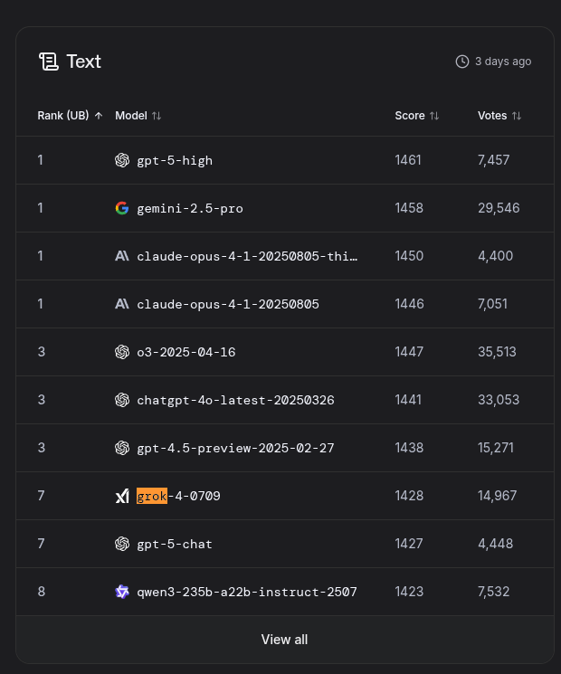
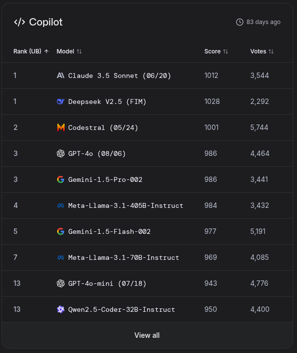
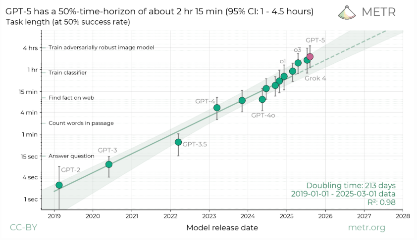

# Review of Industry Sentiment

## Some current rankings as of Aug 2025
Post-GPT5 release:

[ai-2027](https://ai-2027.com/)

[metr.github.io](https://metr.github.io/)

- Prediction markets have dropped for OpenAI AGI
- Long term markets unchanged: AGI 20

# AI IDEs, Coding Assistants, Vibe-Coding Tools, and Related AI Developer Tools (2025)

The top-performing coding models are:

- Anthropic's Claude
- Deepseek
- Mistral
- OpenAI's GPT
- Google's Gemini
- Facebook's Llama
- Alibaba's Qwen
- X.ai's Grok

---

## Task

The task is to create an API interface to download all data from the Department of Justice API site.
This project has already been completed and we would like to use it as a test case for how the
current AI coding tools perform on this relatively straightforward task.
https://www.justice.gov/developer/api-documentation/api_v1

## Browser Interfaces

- **OpenAI**
- **Google's Gemini**
- **Anthropic's Claude**
- **DeepSeek**
- **Grock**

## AI IDEs and Agentic Coding Tools

Platforms that embed AI deeply within the development environment—some even offering autonomous or
“agentic” coding features:

### VSCode with Copilot with GPT-5

- Prompt Response is [here](./prompt-responses/vscode-gpt5.md)
- Issues:
  - I asked it to setup a `pyproject.toml` file to support a virtual environment crated with `uv`.
    It added hatchling as a build system and had a hard time installing. I removed it since I didn't
    need to build package.
  - Did not integrate my aws profile into `session()` but not really the fault of the tool that it
    wasn't aware of my environment.

### Cursor with Claude-4-Sonnet

- Prompt Response is [here](./prompt-responses/cursor-claude4-sonnet.md)

### Other

- **GitHub Copilot Agent** – Autonomous Copilot that takes end-to-end actions within the editor.
- **QodoAI** (formerly CodiumAI) – Agentic assistant focused on automating workflows.
- **Devin AI** (by Cognition) – A powerful AI software engineer capable of autonomous code
  generation.
- **OpenAI Codex CLI / Agent** – CLI-based AI coding agent integrated into tools like ChatGPT.

---

## 🤖 AI Coding Assistants & Completions

Integrated into editors or CLI for code suggestions, completions, and enhancements:

- **GitHub Copilot** – Autocomplete assistant built by GitHub/OpenAI.
- **Amazon Q Developer** – AWS-native assistant for IDEs and CLI.
- **Tabnine** – AI autocompletion tool supporting many editors.
- **Sourcegraph Cody** – Context-aware code assistant that understands entire codebases.
- **Replit Agent (Ghostwriter)** – Cloud-based AI assistant in Replit’s IDE.
- **Others:** Continue.dev, MutableAI, AskCodi, CodeGeeX, Saturnhead AI, Hugging Face, OpenAI Codex.

---

## 🎨 Vibe Coding & No-Code AI Tools

Platforms aimed at coding through natural language or minimal technical knowledge:

- **Vibecode** – iOS app for “vibe coding” via natural-language prompts (GPT-5, Claude, Kimi, Qwen
  models).
- **Replit & Bolt.new** – Browser-first platforms allowing intuitive, prompt-based app building.
- **Other tools** – Lovable.com, VoidEditor, CodeCompanion.ai.

---

## Open-Source, Research & Emerging Tools

- **Awesome-Code-AI (GitHub repo)** – Curated list of open-source AI coding tools.
- **CodingGenie** – Open-source editor assistant suggesting bug fixes and tests.
- **AutoDev** – Research prototype for fully automated development (code editing, testing, builds,
  git, containerization).

---
