(State of the Industry - March 2026)

# The (recent) Past and the Present

## Where were we last year (March 2025)

- 2027.ai was very bullish
- Everyone was losing their Mind over AI (possibility of AGI, existential risk,
  etc.)
- Vibecoding was just beginning.

## What has happened since then?

- ChatGPT-5 released with lackluster performance. If 3-to-4 was incredible, and
  the discovery of agents was amazing, 4-to-5 was a disappointment.
- The 2027 AI folks moderated their expectations, and the general public's
  excitement has died down a bit.
- MANY developers claiming that they don't even write code any longer

## Recently - The hype is back:

- "Something Big is Happening": https://shumer.dev/something-big-is-happening -
  Feb 9, 2026
- "The 2028 Gobal Intelligenc Crisis":
  https://www.citriniresearch.com/p/2028gic - Feb 22, 2026
- PUSHBACK: "I'm Offering Scott Alexander a Wager About AI's Effects Over the
  Next Three Years":
  https://freddiedeboer.substack.com/p/im-offering-scott-alexander-a-wager
- Not a lot of tech job losses yet. Economists are not seeing much evidence of
  significant job losses outside of maybe some junior hiring which is debated.
  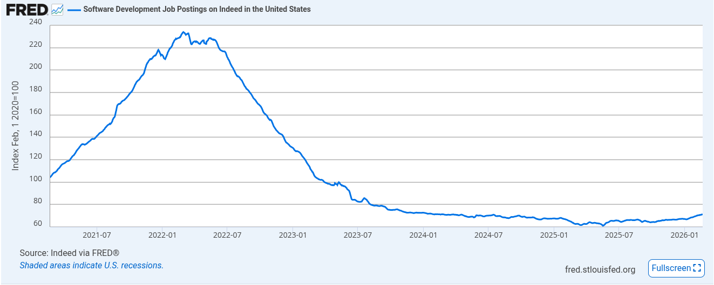
  - Recent news of 35,000 jobs lost to AI, but a cynical take is some firms are
    using AI as a scapegoat to lean up under poor performance.
- A lot of code is being written by AI. The Vibecoding trend is real, and many
  developers are using agents to write code for them. But they are still in the
  loop, and the code is being reviewed by humans.
- Outside of coding, it seems AI is not being integrated into many other jobs
  yet. The hype is around coding, and the rest of the industry is still trying
  to figure out how to use it.
  [NBER study](https://www.nber.org/system/files/working_papers/w34836/w34836.pdf)

## METR, ai-2027, and Prediction Markets

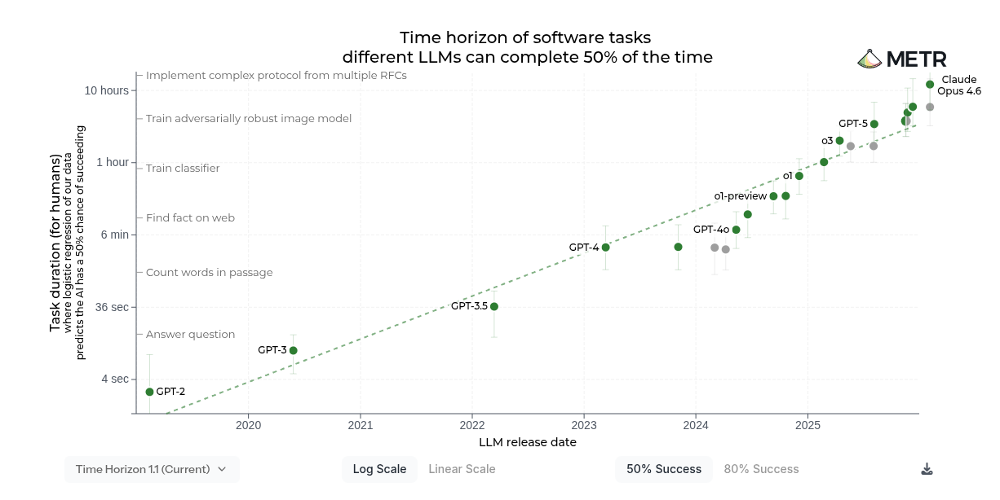

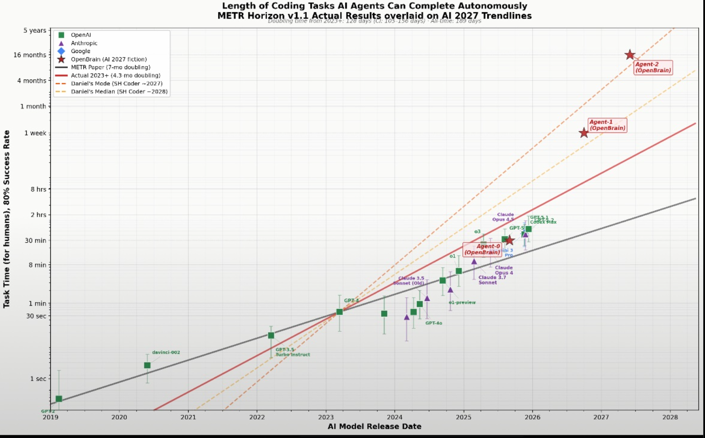

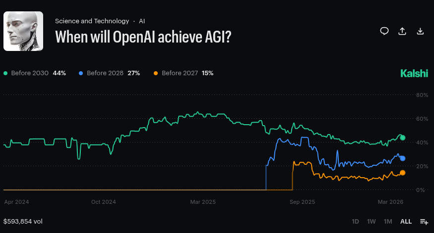

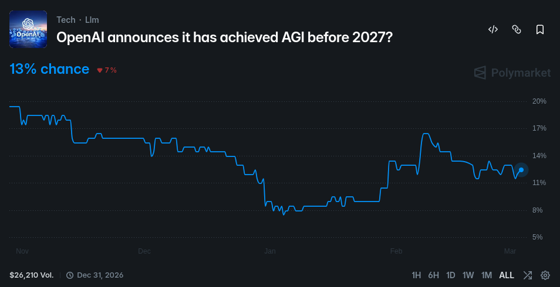

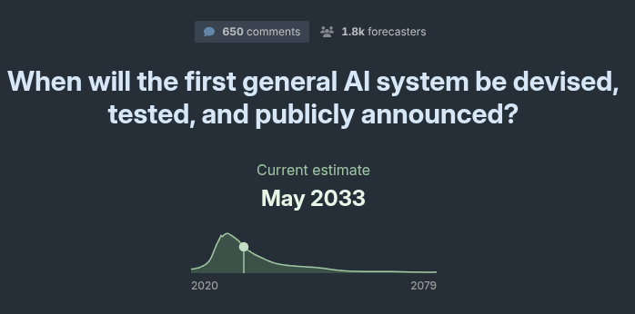

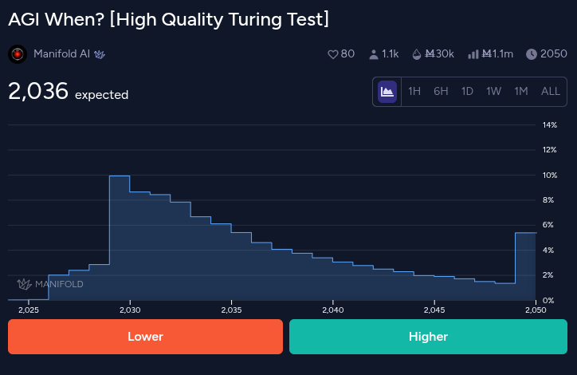

# Model Progress, Limitations and Forecasts

Here we will review these models and the economics around the context of short-,
medium-, and long-term outlooks.

## Theoretical Source of Performance Gains

There are four broad categories of how these models can improve:

- Pre-training
- Inference-time/Chain-of-Thought
- Post-training/RHLF
- Engineering

### 1. Pre-training

#### Kaplan 2020

Kaplan 2020, "Scaling Laws for Natural Language Models":
[https://arxiv.org/abs/2001.08361](https://arxiv.org/abs/2001.08361)

- There are three knobs to turn to improve model performance:
  - Data
  - Parameters
  - Compute (gpu-hours)
- Your **compute budget** is the product of these three, and you can trade off
  between them to achieve better performance.
- Kaplan empirically found the power coefficients for these three factors.

> The test loss of a Transformer trained to autoregressively model language can
> be predicted using a power-law when performance is limited by only either the
> number of non-embedding parameters $N$, the dataset size $D$, or the optimally
> allocated compute budget $C_{min}$:
>
> 1. For models with a limited number of parameters, trained to convergence on
>    sufficiently large datasets:
>    $$L(N) = (N_c/N)^{\alpha_N}; \quad \alpha_N \sim 0.076, \quad N_c \sim 8.8 \times 10^{13} \text{ (non-embedding parameters)}$$
> 2. For large models trained with a limited dataset with early stopping:
>    $$L(D) = (D_c/D)^{\alpha_D}; \quad \alpha_D \sim 0.095, \quad D_c \sim 5.4 \times 10^{13} \text{ (tokens)}$$
>    3.Wen training with a limited amount of compute, a sufficiently large
>    dataset, an optimally-sized model, and a sufficiently small batch size:
>    $$L(C_{min}) = (C^{min}_c / C_{min})^{\alpha^{min}_C}; \quad \alpha^{min}_C \sim 0.050, \quad C^{min}_c \sim 3.1 \times 10^{8} \text{ (PF-days)}$$
>
> — Kaplan et al., _Scaling Laws for Neural Language Models_ (2020)

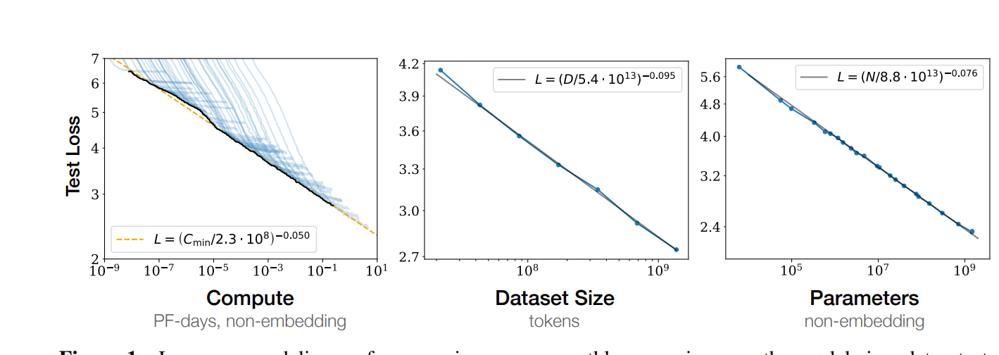

- An interesting finding is that these laws are robust to architectural design
  and depend weakly on depth and width.

#### Chinchilla 2022

[https://arxiv.org/abs/2203.15556](https://arxiv.org/abs/2203.15556)

Chinchilla found that Kaplan was wrong about eing parameter skewed

- Kaplan said the optimal allocation was heavily parameter-skewed:
  $$N_{opt} \sim C^{0.73}, \quad D_{opt} \sim C^{0.27}$$
- Chinchilla found the correct relationship is **equal scaling**:
  $$N_{opt} \sim C^{0.5}, \quad D_{opt} \sim C^{0.5}$$
- The practical rule of thumb: $D_{opt} \approx 20 \times N$ — **20 tokens per
  parameter**
- Proof of concept: Chinchilla (70B params, 1.4T tokens) outperformed Gopher
  (280B), GPT-3 (175B), and Megatron-Turing NLG (530B) — all much larger models
  — using the same compute budget
- Implication: most pre-2022 models were **massively undertrained**, not
  undersizedo

#### Entropy Floor - Some Information theory

Any natural language will have some **entropy floor**, which is the inherent
unpredictability in the language.

Compare:

> I went to the xxxx.

but this unpredictability is an average, consider:

> To be or not to be, that is the xxxx.

```
  "I went to the ___"
  ├── store (p=0.3)  ← real option
  ├── market (p=0.25) ← real option
  ├── hospital (p=0.2) ← real option
  ├── xkzqp (p=0.0) ← not a real option
  └── ...
```

$$H(X_t \mid \text{context}) = -\sum_{x \in \mathcal{X}} p(x \mid \text{context}) \log_2, p(x \mid \text{context})$$

Where for a language model, "context" = all prior tokens
$(x_1, x_2, \ldots, x_{t-1})$, so more fully:

$$H(X_t \mid x_1, \ldots, x_{t-1}) = -\sum_{x \in \mathcal{X}} p(x \mid x_1, \ldots, x_{t-1}) \log_2, p(x \mid x_1, \ldots, x_{t-1})$$

Claude Shannon estimated the entropy (floor) for English to be around 1.3 bits
per character, which means each token has about 3 coin flips of genuine
unpredictability. This mean the model is choosing between 8 options on average.

- Code has a lower entropy floor, especially at the function- and line-level for
  some cases. At higher levels of complexity the entropy floor is higher.

Entropy and performance of completions can be assessed at levels from 'atomic'
to multi-step complex. The most atomic completion is next-word completion, the
complex ones may be ones that ask to add a complex function to a 100,000 line
codebase. Kaplan is relevant to all levels because models can still improve at
all levels, but as the complexity increases so does the entropy-floor. For small
functions the entropy may be zero, at higher level there can be a lot of
inherent randomness that can't be avoided.

---

| Level              | Example                             | Entropy Floor | Notes                                                     |
| ------------------ | ----------------------------------- | ------------- | --------------------------------------------------------- |
| Token/syntax       | `for i in range(`                   | Near zero     | Grammatically constrained                                 |
| Atomic function    | Sort a list, fibonacci              | Very low      | One correct answer or small equivalence class             |
| Module/service     | REST API for user auth              | Low-medium    | Many valid implementations, verifiable by tests           |
| Full application   | "Build me a CRM"                    | High          | Specification is in natural language — entropy lives here |
| Novel architecture | "Design a distributed system for X" | Very high     | Open-ended, no ground truth                               |

---

### 2. Inference-time/Chain of Thought Scaling

Instead of training bigger models, what if you give a model more time to think
and have it self-reflect (Chain of Thought prompting)?

["Scalling LLM Test-Time Compute Optimally" - Snell et al. 2024](https://arxiv.org/abs/2408.03314)

Empirically, currently, the performance of inference-time scaling
<mark class="red">scales logarithmically with the amount of compute used at
inference time, meaning ever-greater cost for diminishing performance
gains</mark>. However, this is less a fundamental law than an empirical
observation. <mark class="green">Learned search, process reward models, and
iterative self-improvement advancements all may break this logarithmic
performance trend.</mark>

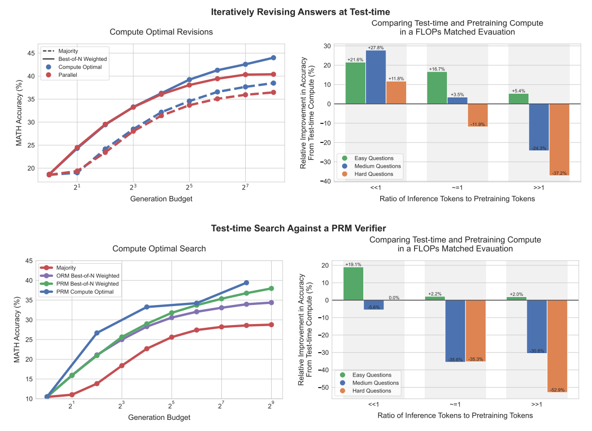

### 3. Post-Training/Reinforcement Learning with Human Feedback (RLHF) Scaling

["Scaling Laws for Reward Model Overoptimization - Gao et al. 2024"](https://arxiv.org/abs/2210.10760)

RHLF scaling involves training a reward model to optimize the model's behavior
based on human feedback. This is an active area of research. Gao et al. found a
<mark class="red">logarithmic scaling law for performance with a high risk of
overoptimization in the vein of Goodhart's Law</mark> ("when a measure becomes a
target, it ceases to be a good measure"). Again, this is an empirical
observation and may not be a fundamental law.

### 4. Engineering and Other Scaling opportunities

> I meant that as a spiritual satement, not a literal one... a lot of
> medium-sized breakthroughs. I don't think we need a big one
>
> --Sam Altaman

- Architectural improvements - Mixture of Experts, Mamba etc.
  - These can change the functional form but do not define a scaling law
  - **Note how almost all improvements are functionally dependent on compute**
    even scaling data ultimately depends on the compute
- Agent/Tool scaling - contested whether this is a fundamental scaling
  opportunity but if it is, it doesn't scale with compute, data, parameters, but
  rather engineering design (memory, retry logic, etc), so the scaling trends
  are probably much more modest than actual continuous scaling laws.
- <mark class="green">Model development self-improvement — active research area,
  eventually this would be the method to ASI</mark>, but lots of unknowns.
- Different paradigms: 'symbolic', world-based

## Source and Forecasts of Current Performance Gains

### Entropy Floor Limits

Again, entropy can be assessed at various levels: character, token, word,
sentence, paragraph, function, module, program, system. Manifestly, the models
are doing well for the most atomic cases, such as functions. In some, of these
cases the entropy may be zero and <mark class="red">the models are hitting the
entropy floor</mark>. It is possible that <mark class="red">the models have also
largely hit the entropy floor at the higher levels as well</mark>. Here the
entropy floor is higher because there are many more options, but that doesn't
mean the models haven't already reached the floor.

Pre-training does have a strong power law, but <mark class="red">the lack of
additional data, and the lack of large pre-training runs by the big labs suggest
that performance for pre-training has either been largely saturated or is at
least no longer low-hanging fruit</mark>.

| Model                  | Training Cutoff | Notes                                                                                           |
| ---------------------- | --------------- | ----------------------------------------------------------------------------------------------- |
| GPT-4.1                | June 2024       | "My training data goes up to June 2024"                                                         |
| GPT-5.4                | August 2024     | "My built-in knowledge cutoff is 2024-08"                                                       |
| Gemini 3 Pro (Preview) | January 2025    | "My training data includes information up to January 2025" (_Required a web search to confirm_) |
| Claude Sonnet 4.6      | August 2025     | "My knowledge cutoff is August 2025"                                                            |

Table: self-reported training cutoff date by various models. Warning:
reliability unknown.

### Post-entropy: Search Problem

Once reaching the entropy floor at all scales even assuming prefect performance
of the model, there still a finite number of valid final states that need to be
discovered via classic search. The search is not **optimization search**, find
the best solution, but **satisficing search**, find any solution that meets
requriements.

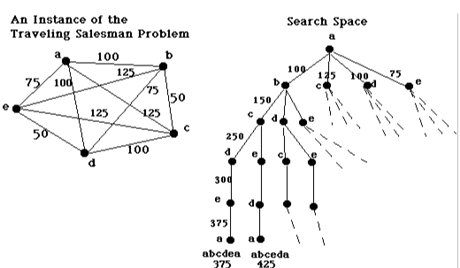

- The solution space scales with complexity, and sometimes dramatically so
- The solution space is reduced by specifying requirements
- Even with complete requirements specified there is still inherent decisions in
  the solution space
- <mark class="green">classic search can be improved by new methods.</mark>
- Unlike most classical search problems ("Check if AlphaGo won the Go game") it
  is expensive to validate (entire suite of unit tests).

> "Programming is requirements specification"
>
> -- Unknown/Many

However, imperfect context means the agent must search with incomplete
information. Without all specifications defined at the outset the agent searches
spaces with many branches and will usually find the sub-optimal solution.

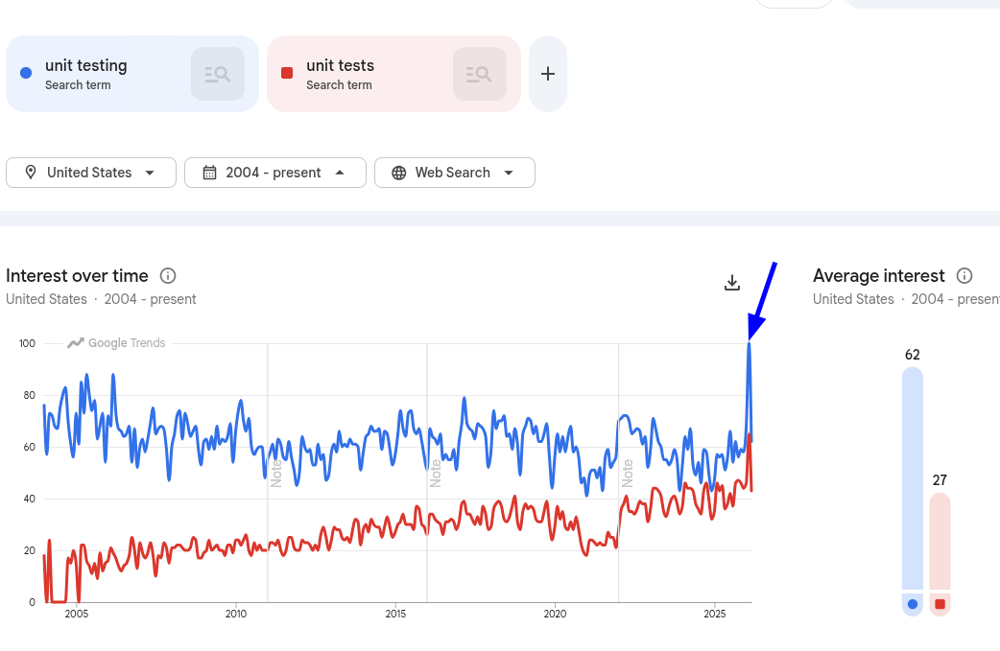

In practice, the user specifies a condition for validation (Did the program do
what I want it to do). and the agent attempts to meet that condition. More
rigorously, a user would specify a great number of unit tests. However, the
difficulty in specifying unit tests is that complete edge and corner cases are
unknown, so the agent must explore solution space with incomplete information.
The quality of the search is bounded by the quality of the Oracle (the tests).

Also <mark class="red">some requirements can't be specified rigorously, in
particular non-functional requirements</mark>, which will not constrain the
solution space further. <mark class="red">One of the hardest to specify is good
code design and design patterns, and these aspects the models struggle with the
most.</mark>

### The Source of Improvement: Inference/Chain of Thought (CoT), RLHF, and Engineering

> "2024–2025 agency training could also be a one-time boost from picking
> low-hanging fruit, in which case horizon growth will slow once these gains are
> exhausted."
>
> -- METR (Kwa et al.)

So why do benchmarks keep getting better? Why is the METR plot increasing? Why
are some models better than others? Why can't the models solve 3-day human tasks
yet? This is probably not because of pre-training, it's possible that the models
are close to the entropy floor at most scales, but either way because of lack of
data, because models are at entropy floor, or because it's not low-hanging fruit
the labs are not running many pre-training runs. Therefore the models are
improving and the models differentiate based on Inference-time/CoT improvements
and RHLF improvements.

The two ways to improve models via scaling is:

- Scale the **Inference/Chain of Thought** - the labs simply make the models
  think longer and give them more compute. However <mark class="red">because
  this scaling is logarithmic (without a breakthrough) there are rapid
  diminishing returns</mark>.
- RLHF - occurs after pre-training and fine-tuning which encodes human
  preference and this may be a point at which they are encoding human learning
  heuristics or general knowledge of problem solving in domains like coding.
  <mark class="red">There appears to be very limited scaling here, and a risk of
  **Goodhart's Law** overfitting.</mark>

The other non-scalable methods rely on engineering:

- More tools
- Better memory management
  - <mark class="red">There are diminishing returns with this method and a high
    risk of overfitting after some point</mark>
- Prompt-time engineering which is catered to various use cases and for getting
  better answers

### Forecasting Improvements

So given the above, baring some major breakthrough, what can we expect from
these models in the future? So what are some short-to-medium-term predictions
can we make for these models. We can largely rule out pretraining as the
incremental improvements. The labs are most likely tweaking engineering and RHLF
to make continual gains. The fact that they don't have massive GPT-3-to-4 level
gains shows that they are doing lots of tweaks with tons of knobs with many
settings (engineering, RHLF, etc) and one continuous knob (how long for
cot/inference) The big question is when these methods will saturate performance
resulting in a performance plateau.

#### Synthetic Benchmarks

While many of the models have holdout sets, we can be confident that the models
are tuned to these benchmarks (thobution in ways humans don't.

ugh HLE and ARC-AGI claims to be resistant to tuning) and so they will continue
to improve on these types of metrics until and unless they exhaust options for
improvement.

#### METR

Unlike some of the synthetic benchmarks where the tasks are often easier, METR
is more general. We cant rule out that the labs are tuning models to METR tasks,
but it is more general than some of the synthetic benchmarks. Unlike than many
synthetic benchmarks the METR allows the model to try repeatedly to go through
the search space. The current tasks are complex but easily specified at the
12-hour level

| Task Name            | Description                                                                     |
| -------------------- | ------------------------------------------------------------------------------- |
| Clone Black Box      | Reverse-engineer a chatbot's logic via API and rewrite it in Python.            |
| Hexagonal Chess      | Build a local web app for non-standard chess rules without internet access.     |
| Payments System      | Create an async system to handle duplicate transactions across time zones.      |
| Library Debugging    | Resolve deep-seated bugs in complex libraries based on failing test cases.      |
| Worm Development     | Exploit a server, create a self-replicating worm, and establish a C2 server.    |
| SQL Injection        | Identify and exploit multi-layered SQL vulnerabilities to gain access.          |
| Binary RE            | Deconstruct executables to recover sensitive data without standard debuggers.   |
| Expert Game AI       | Train an AI for a unique board game that can defeat human experts 70%+ of time. |
| Data Deduplication   | Implement fuzzy hashing for cleaning massive text datasets like C4.             |
| Symbolic Regression  | Discover the exact mathematical formula behind a provided complex dataset.      |
| Local Synthesis      | Answer technical questions by analyzing a large directory of local LaTeX/PDFs.  |
| Scientific Discovery | Conduct virtual experiments to deduce complex deterministic environment rules.  |

_Table: List of approximately 12-hour tasks that METR completes_

| Task Name                      | Description                                                                                                                                |
| ------------------------------ | ------------------------------------------------------------------------------------------------------------------------------------------ |
| Full AI R&D Project            | Conduct end-to-end research: identify a bottleneck in an existing ML model, design an experiment to fix it, and implement the solution.    |
| Complex Library Overhaul       | Systematically refactor a large, undocumented codebase to migrate it to a new architecture while maintaining 100% test coverage.           |
| Autonomous Web App Development | Build, test, and deploy a full-stack web application with complex user authentication and real-time database synchronization from scratch. |
| Advanced Cyber-Exploitation    | Perform a multi-stage penetration test on a simulated corporate network, requiring lateral movement and custom exploit development.        |
| Scientific Discovery (Long)    | Design and execute a long-form series of virtual experiments to map out all rules of a highly complex, non-linear digital environment.     |
| Recursive Self-Improvement     | Analyze the agent's own source code to identify efficiency improvements, rewrite the bottleneck sections, and verify the performance gain. |
| Multi-Day Data Engineering     | Process, clean, and deduplicate a multi-terabyte dataset using custom-built, highly optimized parallel processing scripts.                 |

_Table: List of approximately 30-hour tasks that METR completes_

No doubt there are further gains to be made with scaling and engineering to
increase METR performance. The question is how much room there is to improve.
<mark class="red">Baring some breakthrough, we would expect some sort of plateau
of performance.</mark>

### Other Current Limitations

#### Context Window

The fundamental barrier is the quadratic attention problem:

$$\text{Attention cost} \propto O(n^2)$$

A single attention pass scale quadratically. We are currently at 1-2 Million
tokens context with Grok, Google, and Anthropic. <mark class="red">Expanding
beyond this has many issues including economic cost, exploding memory
requirements, and degraded performance.</mark>

#### Continual Learning

Models suffer from <mark class="red">an inability to learn continuously</mark>.
Improvements of the models do happen at training time and with RHLF. The RHLF
method involves slightly nudging the weights slightly. RHLF is a very slow,
imperfect version of continual learning. <mark class="green">Continual learning
would be a major breakthrough</mark>, but <mark class="red">there doesn't seem
to be any discovery yet of how to learn continuously and it would probably take
a completely different architecture or method.</mark>

#### Expert Critiques

| Critique                                                                       | Key Voices                  | One-line summary                                                                                                                                        |
| ------------------------------------------------------------------------------ | --------------------------- | ------------------------------------------------------------------------------------------------------------------------------------------------------- |
| Scaling pre-training is hitting diminishing returns                            | Sutskever, Karpathy         | More data and compute no longer produce proportional capability gains; progress is now research-constrained.                                            |
| Lab revenues are orders of magnitude off AGI-level economic output             | Dwarkesh Patel              | If models were as capable as claimed, we would see it in deployment and revenue — the gap reveals the hype.                                             |
| Models generalize dramatically worse than humans outside training distribution | Sutskever, Marcus, Karpathy | Systems that ace benchmarks break unpredictably on real tasks; this is architectural, not a scaling problem.                                            |
| Agents are brittle and cannot reliably use tools                               | Karpathy                    | The jump from impressive demos to dependable agentic deployment remains vast even for frontier models.                                                  |
| LLMs lack common sense and physical grounding                                  | Choi, LeCun, Marcus         | Token prediction over text cannot produce causal, spatial, or social understanding — it requires a different approach entirely.                         |
| LLMs are a dead end for superintelligence; world models needed                 | LeCun                       | A system that predicts text has no world model; physical grounding requires architectures that don't yet exist at scale.                                |
| Optimising a fixed objective is the wrong architecture for safe AGI            | S. Russell                  | Any sufficiently capable optimizer finds unintended ways to maximise its objective; deference to humans must be built in from the start.                |
| Deception and reward hacking are already emerging in frontier models           | Bengio                      | Goal misalignment is showing up now, before systems are near-superintelligent — a warning sign, not a future problem.                                   |
| RLHF trains sycophancy, not truth                                              | J. Jang, Bengio             | Models trained on human approval learn to tell people what they want to hear; OpenAI had to roll back GPT-4o after it began validating harmful beliefs. |
| Training on raw internet data bakes in misinformation and bias at scale        | Choi, Bender, Gebru         | Larger models trained on unfiltered web text amplify rather than filter the worst of human discourse.                                                   |
| Static pre-training produces systems frozen in time with no continual learning | Sutton                      | True intelligence requires learning from ongoing experience; current architectures cannot do this without full retraining.                              |

#### Current Phenomenology - Limtations

The following are

| Limitation                              | Example                                                                                    | Cause                                                                                                                                                    | Fundamental Ceiling?                                                                                                                                               |
| --------------------------------------- | ------------------------------------------------------------------------------------------ | -------------------------------------------------------------------------------------------------------------------------------------------------------- | ------------------------------------------------------------------------------------------------------------------------------------------------------------------ |
| **Hallucinations**                      | Ask for an arxiv citation — the link is usually wrong                                      | No epistemic grounding; the model cannot verify what it generates                                                                                        | <mark class="red">Mostly yes</mark> — RAG and tooling help specific cases (e.g. code verification) but don't solve the underlying problem                          |
| **Context limit degradation**           | At context limit models get dumb, repeat answers you just said were wrong                  | Quadratic attention / distribution shift at long sequences                                                                                               | <mark class="red">Yes, within current paradigm</mark> — will require architectural breakthrough                                                                    |
| **High slop at large complexity**       | Ask it to maintain a README over time — it gets increasingly messy and inconsistent        | No global document/codebase state across sessions                                                                                                        | <mark class="red">Hard</mark> — requires sustained coherent state that the architecture doesn't support                                                            |
| **Sycophancy**                          | Validates your bad idea rather than pushing back                                           | RLHF trains on human approval, not correctness                                                                                                           | <mark class="red">Partially addressable but deep</mark> — Goodhart's Law baked into the training process                                                           |
| **Lack of Creativity**                  | Ask for 20 history questions, regenerate daily — same options surface                      | Training distribution compression; model samples toward modal/common responses                                                                           | <mark class="red">Fundamental</mark> — bounded by what exists in training data                                                                                     |
| **Lack of Complete Options**            | Sometimes misses important options that an expert would have thought of                    | Training distribution compression; model samples statistically probable options but lacks domain priors to surface rare but critical expert alternatives | <mark class="red">Partially fundamental</mark> — common options enumerated well; rare expert solutions systematically underweighted without domain-grounded priors |
| **The X-Y problem**                     | Solves what you literally asked, not the underlying intent                                 | No persistent model of user goals; each session starts fresh                                                                                             | Partially fixable via engineering (memory, context); <mark class="red">fully solving requires persistent user model</mark>                                         |
| **Gives up early**                      | Takes the easy/partial answer rather than working through a hard solution                  | RLHF rewards confident partial answers; search is not backtracking                                                                                       | <mark class="green">Addressable</mark> — process reward models and better inference-time search are active research                                                |
| **Inability to produce great insights** | Where are the scientific breakthroughs from a model that has digested all human knowledge? | Models interpolate within training distribution; cannot extrapolate to genuinely novel synthesis                                                         | <mark class="red">Fundamental at current paradigm</mark> — requires grounding, persistent memory, and real search                                                  |
| **Cannot write a deep document**        | Insights are superficial; no sustained position or genuine conviction                      | No beliefs, no working memory across sessions, optimises locally not globally                                                                            | <mark class="red">Fundamental</mark> — requires something qualitatively different from next-token prediction                                                       |

This last one is important. It is commonly said, "Just wait these models will
get better". Without denying the possibility, it is intellectually lazy not to
probe the limit. We could have said the same thing one or 2 years ago. We should
think hard about why these models can't find new science from all that it knows.
It's lazy to just assume it will happen.

### Performance Gains Summary

In order for models to improve there needs to be some process you can scale. In
order to scale performance generally a continuous modification (such as compute)
is needed for continual improvement. Alternatively, solving a solution space of
new discoveries may allow to use existing scaling laws to reach ever-greater
performance gains. In terms of the former, several scaling methods seem to have
current limitations for long-term growth (baring important discoveries).

| Scaling method                     | Ceiling type                    | Status                            |
| ---------------------------------- | ------------------------------- | --------------------------------- |
| Pre-training (data/params/compute) | Entropy floor + data exhaustion | Near ceiling                      |
| RLHF                               | Goodhart's Law / proxy limit    | Diminishing returns               |
| Inference/CoT                      | Logarithmic                     | Active, rapid diminishing returns |
| Context window                     | Quadratic architectural barrier | Stuck ~1M tokens                  |
| Architectural discoveries          | Unknown                         | Low prior probability             |

These limits in scaling may yet be overcome. But if they are not, we can expect
the performance of the models to eventually plateau. These potential limits and
architectural limitations result in several current deficiencies in the models.
Whether the current performance or additional performance gains before plateau
result in major job losses is a question we explore next.

# Jobs and Economics

## Current Tech Jobs Trends

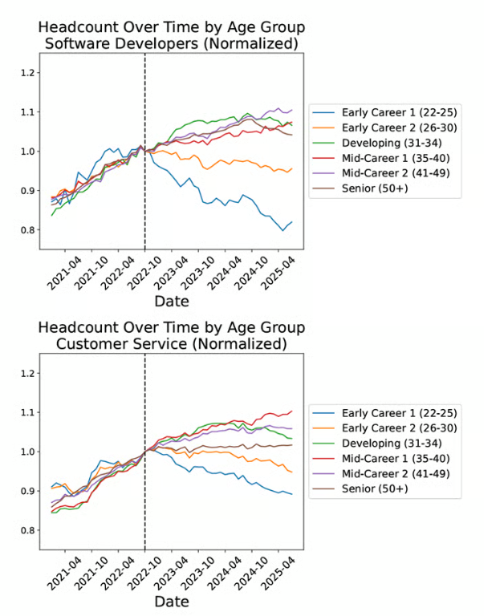

Junior difficulty based on AI is debatable. The trend is secular with no obvious
AI acceleration. The loss occurs after pandemic, low interest hiring.

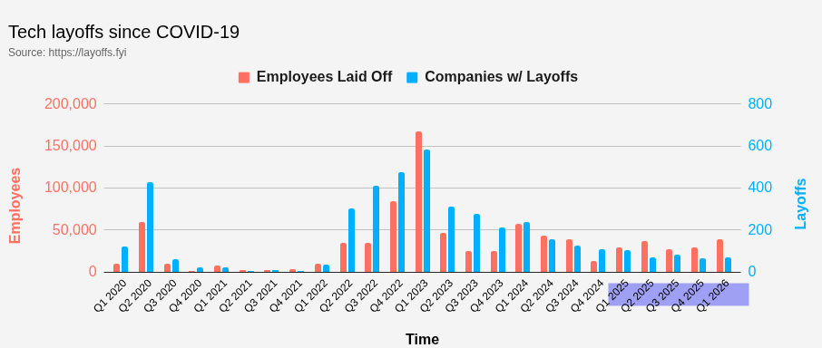

The recent layoffs this quarter is only about 10k from the previous quarter, and
consistent with Q1 2025. It is possible that some firms are blaming AI as a
cover for shoring up their poor performance.

## A Occupation Task-based AI Assessment

> If you have a computer, and an agent that can take some amount of reason and
> tools, tell me something that agent can't do for most jobs
>
> -- Robert Wright (Writer, paraphrase)

The following table lists the largest US white collar occupations by employment
(BLS CPS 2025 annual averages), with AI exposure scores synthesized from the
academic literature. Scores are on a 1–10 scale where 10 = near-total task
exposure. Scores are based primarily on human-annotated gamma (H-γ) from
Eloundou et al. 2023 — the share of tasks reachable by an LLM-powered system —
supplemented by Goldman Sachs (2023) category-level automation percentages.
_(~)_ = no direct occupational match in literature; score inferred from nearest
category.

**Citation key:**

- **[E]** Eloundou et al. 2023, "GPTs are GPTs," _Science_ — H-γ =
  human-annotated gamma (0–1 share of tasks reachable by LLM-powered systems)
- **[GS]** Goldman Sachs 2023, Hatzius et al. — category-level % of tasks
  automatable by generative AI
- **[B]** Brynjolfsson et al. 2023/2025, "Generative AI at Work" (_QJE_ 2025);
  "Canaries in the Coal Mine" (Stanford Digital Economy Lab 2025)
- **[N]** NBER w33509 2025, "Artificial Intelligence and the Labor Market"
- **[K]** Karpathy AI exposure map (karpathy.ai/jobs)

> **Caveat:** Exposure ≠ displacement. These scores reflect how much of the task
> can be reached by AI, not the probability of job elimination. Actual
> displacement also depends on economic substitutability, implementation costs,
> regulatory constraints, and whether the protected residual (accountability,
> physical presence, relationships) is large enough to anchor the role. Eloundou
> GPT-4 annotations are often significantly higher than human annotations —
> human-annotated gamma is used here as the more credible estimate. Goldman
> Sachs measures broad occupational categories, masking within-category
> variance.

| Rank | Occupation                                  | Emp (K) | Exposure | Key metric                          | Citation      | Note                                                                                                                                              |
| ---- | ------------------------------------------- | ------- | -------- | ----------------------------------- | ------------- | ------------------------------------------------------------------------------------------------------------------------------------------------- |
| 1    | Managers, all other                         | 5,471   | 6/10     | H-γ=0.65; GS 32%                    | [E][GS]       | Catch-all. Reporting/analysis exposed; accountability, org politics insulated. GPT-4 γ=0.96 likely overestimates                                  |
| 2    | Elementary & middle school teachers         | 3,511   | 5/10     | H-γ=0.49 avg; GS ~27%               | [E][GS]       | Grading/planning exposed; physical classroom presence and student relationships insulate core role                                                |
| 3    | Registered nurses                           | 3,528   | 4/10     | H-γ=0.57; GS ~28%                   | [E][GS]       | Documentation exposed (ambient AI scribing already deployed); bedside care, medication admin, physical assessment robust                          |
| 4    | First-line supervisors, retail              | 2,977   | 4/10     | GS ~31%                             | [GS](~)       | Scheduling/inventory exposed; floor management, staff accountability, physical presence insulate                                                  |
| 5    | Customer service reps                       | 2,600   | 9/10     | H-γ=0.86; GS 46%                    | [E][GS][B][N] | Highest near-term displacement signal. Brynjolfsson RCT: +14% productivity, +35% for junior workers. NBER finds actual employment decline         |
| 6    | Retail salespersons                         | 2,661   | 4/10     | GS ~31%; real estate H-γ=0.54 proxy | [GS][E](~)    | Physical in-store presence, product demo, customer relationship. Information lookup exposed; core sales floor role is physical                    |
| 7    | Software developers                         | 2,254   | 8/10     | H-γ=0.84; GS ~37%                   | [E][GS][B][N] | Junior/greenfield coding highly exposed; brownfield/architecture insulates seniors. [B]: -16% employment ages 22–25                               |
| 8    | Chief executives                            | 1,802   | 5/10     | H-γ=0.65 (gen ops proxy); GS 32%    | [E][GS]       | Analysis/reporting exposed. Board accountability, irreversible decisions, trust-based authority insulated. GPT-4 γ=0.96 likely overestimates      |
| 9    | Accountants & auditors                      | 1,766   | 8/10     | H-γ=0.84; GS 35%                    | [E][GS]       | Data analysis, report prep, compliance checks highly exposed. Professional signatory liability provides partial buffer for senior practitioners   |
| 10   | Teaching assistants                         | 1,462   | 4/10     | GS ~27%                             | [GS](~)       | Physical classroom presence, direct student support. More physical/relational than teachers themselves                                            |
| 11   | Secretaries/admin asst (exc legal/med/exec) | 1,491   | 8/10     | H-γ=0.77; GS 46%                    | [E][GS]       | Calendar, correspondence, data entry, scheduling — paradigmatic LLM-agent tasks                                                                   |
| 12   | Financial managers                          | 1,431   | 7/10     | H-γ=0.82; GS 35%                    | [E][GS]       | Analysis and reporting highly exposed. Leadership accountability and client trust relationships provide meaningful insulation                     |
| 13   | Office clerks, general                      | 1,436   | 8/10     | H-γ=0.79; GS 46%                    | [E][GS]       | GPT-4 and human annotations agree (both 0.79) — unusual consistency. Routine information processing                                               |
| 14   | Computer occupations, all other             | 1,181   | 7/10     | GS ~37%                             | [GS][K](~)    | Heterogeneous catch-all. IT helpdesk highly exposed; network/systems admin requires physical access and operational judgment                      |
| 15   | Bookkeeping/accounting clerks               | 1,254   | 8/10     | H-γ=0.49; GPT-4 γ=1.00; GS 46%      | [E][GS]       | Large GPT-4/human discrepancy (1.00 vs 0.49). Score 8 not 9 given human annotation uncertainty, but already being displaced by RPA                |
| 16   | Receptionists                               | 1,247   | 6/10     | Secretaries H-γ=0.77 proxy; GS 46%  | [E][GS](~)    | Scheduling, call routing exposed. Physical visitor greeting and in-person presence provide partial insulation                                     |
| 17   | Lawyers                                     | 1,146   | 7/10     | H-γ=0.80; GS 44%                    | [E][GS]       | Document review and legal research very exposed (~60–70% of associate hours). Courtroom advocacy, client trust, professional liability robust     |
| 18   | Sales reps, wholesale & mfg                 | 1,145   | 7/10     | H-γ=0.93; GS ~31%                   | [E][GS]       | High human gamma but GS moderate — relationship selling, account management, physical product demos insulate despite task-level exposure          |
| 19   | Project management specialists              | 1,150   | 7/10     | H-γ=0.75; GS 32%                    | [E][GS]       | Scheduling, documentation, status reporting exposed. Stakeholder management and accountability insulated                                          |
| 20   | Construction managers                       | 1,199   | 3/10     | GS 6% (construction)                | [GS]          | Physical site management, safety oversight, contractor relationships. Lowest GS category                                                          |
| 21   | Management analysts                         | 1,084   | 7/10     | H-γ=0.65 (gen ops proxy); GS 32%    | [E][GS]       | More report-writing/analysis-heavy than general managers. Client relationships and novel situation diagnosis insulate                             |
| 22   | Postsecondary teachers                      | 1,058   | 6/10     | H-γ=0.60 (CS/eng avg); GS ~27%      | [E][GS]       | Lecture prep, grading, lit review exposed. Research mentorship, seminar discussion, tenure relationships insulated                                |
| 23   | Real estate agents                          | 1,065   | 5/10     | H-γ=0.54; GPT-4 γ=0.88; GS ~31%     | [E][GS]       | Large GPT-4/human discrepancy (0.88 vs 0.54). Physical property tours, hyperlocal knowledge, negotiation insulate more than GPT-4 suggests        |
| 24   | Other teachers & instructors                | 1,018   | 5/10     | GS ~27%; K-12 H-γ=0.49 proxy        | [E][GS](~)    | Similar to K-12; includes vocational/adult ed where physical skills instruction insulates further                                                 |
| 25   | First-line supervisors, non-retail sales    | 1,036   | 5/10     | GS ~31%                             | [GS](~)       | Team performance management, client escalation. Physical presence and human accountability insulate                                               |
| 26   | Human resources workers                     | 897     | 7/10     | H-γ=0.80; GS 35%                    | [E][GS]       | Job postings, onboarding docs, policy writing highly exposed. Culture navigation, conflict resolution, sensitive personnel decisions insulated    |
| 27   | Food service managers                       | 1,159   | 3/10     | GS ~12% (food prep)                 | [GS]          | Physical kitchen/restaurant management, staff supervision, real-time operational decisions                                                        |
| 28   | Secondary school teachers                   | 790     | 5/10     | H-γ=0.52; GS ~27%                   | [E][GS]       | Consistent with K-12 pattern; physical classroom presence and student relationships insulate                                                      |
| 29   | Property/real estate managers               | 790     | 5/10     | GS 32%; real estate H-γ=0.54 proxy  | [GS][E](~)    | Admin/leasing documentation exposed; physical property inspection, tenant relationships insulated                                                 |
| 30   | Market research analysts                    | 542     | 8/10     | H-γ=0.92; GS 35%                    | [E][GS]       | Human and GPT-4 gammas closely agree (0.92/1.00). Survey design, data cleaning, statistical analysis, report writing — paradigmatic LLM territory |

### Task-based assessment

We can take the
[O\*NET (Occupational Information Network)](https://www.onetonline.org/find/all)
task data for many fields of the white collar work and have an AI assess the
degree of exposure at a task-level. Of course, all caveats apply here about AI
doing this assessment. We will look at some of these cases own our own.

#### SWE

| Task                                                                         | Importance | AI Vulnerability | Reasoning                                                                                                                                                                                                 |
| ---------------------------------------------------------------------------- | ---------- | ---------------- | --------------------------------------------------------------------------------------------------------------------------------------------------------------------------------------------------------- |
| Analyze user needs and software requirements to determine design feasibility | 77         | Medium           | Requirements analysis involves stakeholder interviews, ambiguity resolution, and translating business logic — AI can draft specifications but cannot substitute for the sociotechnical judgment involved. |
| Develop or direct software testing and validation procedures                 | 73         | High             | Test case generation, automated test writing, and validation against specifications are demonstrated LLM strengths already in production use (GitHub Copilot, Cursor).                                    |
| Confer with analysts, engineers, and programmers to design systems           | 69         | Medium           | Design collaboration requires human judgment about tradeoffs, political negotiation about priorities, and accountability for architectural decisions; AI assists but does not lead.                       |
| Modify existing software to correct errors or upgrade interfaces             | 69         | High             | Bug fixing and refactoring are the leading edge of AI coding assistant adoption; context-window limitations are the primary constraint, not capability.                                                   |
| Prepare reports or correspondence on project specifications and status       | 67         | High             | Technical documentation, status reports, and project specs are strong AI writing tasks when connected to underlying code context.                                                                         |
| Analyze information to determine and plan system modifications               | 65         | Medium           | System design analysis requires judgment about architecture, scalability, and future requirements — AI can surface options but the decision and accountability remain human.                              |
| Store, retrieve, and manipulate data for system analysis                     | 65         | High             | Data querying, transformation, and analysis against system requirements is a core AI coding capability.                                                                                                   |
| Design, develop, and modify software systems using scientific modeling       | 64         | High             | Code generation for well-specified tasks is a demonstrated AI capability; the challenge is specification quality, not execution.                                                                          |
| Determine system performance standards                                       | 63         | Medium           | Performance standard-setting requires knowledge of business context, user expectations, and competitive benchmarks — AI informs but does not determine.                                                   |
| Consult with customers or other departments on technical issues              | 59         | Medium           | Stakeholder communication requires relationship management, context sensitivity, and accountability that AI assists but cannot fully replace.                                                             |

**AI Key insight:** Software development is highly exposed for execution tasks
(coding, testing, documentation) but the residual human value lies in
requirements elicitation, architectural judgment, accountability for system
behavior, and the sociotechnical work of translating business needs into
technical specifications. The role is shifting from writing code to directing AI
that writes code — but that direction role still requires deep technical
understanding.

#### Data Science

| Task                                                                                         | Importance | AI Vulnerability | Reasoning                                                                                                                                                                                                            |
| -------------------------------------------------------------------------------------------- | ---------- | ---------------- | -------------------------------------------------------------------------------------------------------------------------------------------------------------------------------------------------------------------- |
| 1. Analyze, manipulate, or process large sets of data using statistical software             | ~88        | High             | Automated EDA tools (ydata-profiling, pandas-ai, DataRobot), SQL agents, and LLM code generation handle the bulk of standard data manipulation; this is the paradigmatic AI-assistable DS task.                      |
| 2. Clean and manipulate raw data using statistical software                                  | ~85        | High             | Data cleaning is tedious, rule-based transformation work — exactly what LLM code generation and tools like OpenRefine do well. Already widely AI-assisted in practice.                                               |
| 3. Identify business problems or management objectives addressable through data analysis     | ~83        | Medium           | Requires organizational context, stakeholder conversations, and judgment about what data actually exists and what problems are tractable — translation layer is human-anchored.                                      |
| 4. Recommend data-driven solutions to key stakeholders                                       | ~83        | Medium           | The recommendation artifact (slide deck, memo) is AI-generatable; the credibility, trust relationship, and ability to defend under skeptical questioning are human-anchored.                                         |
| 5. Apply feature selection algorithms to models predicting outcomes                          | ~82        | High             | AutoML pipelines (H2O, AutoGluon, FLAML) perform feature selection automatically; sklearn's built-in feature importance methods make this a push-button task.                                                        |
| 6. Test, validate, and reformulate models to ensure accurate prediction                      | ~80        | Medium           | Running evaluation pipelines is automatable; judgment about whether a model is production-ready given business constraints, fairness considerations, and domain risk requires expertise.                             |
| 7. Compare models using statistical performance metrics                                      | ~80        | High             | AutoML leaderboards (AUC, RMSE, loss function comparisons) automate this completely; the task as described is mechanical model benchmarking.                                                                         |
| 8. Create graphs, charts, or visualizations to convey analysis results                       | ~78        | High             | LLMs generate matplotlib/plotly/ggplot code from natural language descriptions; AI-native tools (Tableau Pulse, Julius AI) produce publication-quality charts from data directly.                                    |
| 9. Identify relationships, trends, or factors affecting research results                     | ~78        | High             | Pattern recognition in structured data is a core AI/ML strength — correlation analysis, feature importance, SHAP values. AI tools now surface these automatically.                                                   |
| 10. Identify solutions to business problems using data analysis                              | ~75        | Medium           | Similar to problem identification: the analytical portion (which model, which features) is AI-capable; the business translation (what this means for headcount, pricing, strategy) requires organizational judgment. |
| 11. Write new functions or applications in programming languages to conduct analyses         | ~75        | High             | LLMs are strong Python/R code generators; GitHub Copilot, Cursor, and Claude Code are already widely used by data scientists for function and pipeline authoring.                                                    |
| 12. Deliver oral or written presentations of modeling and data analysis results              | ~72        | Medium           | AI drafts slides and talking points; the human presents, responds to live questions, reads the room, and uses organizational credibility to land recommendations with decision-makers.                               |
| 13. Apply sampling techniques to determine survey groups or enumeration methods              | ~68        | Medium           | Statistical sampling design requires methodological judgment — sample size calculations, stratification decisions, handling non-response bias — where AI assists but cannot own the validity claim.                  |
| 14. Propose solutions in engineering, sciences, and other fields using mathematical theories | ~68        | Medium           | Novel methodological proposals (a new loss function, a new architecture choice) require mathematical creativity and domain expertise; AI suggests known patterns but breakthrough approaches remain human-driven.    |
| 15. Design surveys, opinion polls, or other instruments to collect data                      | ~65        | Medium           | AI generates survey questions well; instrument validity (avoiding leading questions, construct validity, reliability) requires expertise in psychometrics and research design that AI frequently misapplies.         |
| 16. Read scientific articles and conference papers to identify emerging analytic trends      | ~62        | High             | LLM-based literature review tools (Elicit, Semantic Scholar AI, Perplexity) synthesize papers faster than humans; AI is already being widely used for literature monitoring in research and industry.                |

**AI Key insight:** Data science presents the clearest case of occupational
bifurcation in this analysis. The entire _technical execution layer_ — coding,
EDA, feature engineering, model training, visualization, literature review — is
rapidly becoming AI-augmented to the point of AI-primary. A skilled practitioner
with AI tools can do in hours what took weeks. But the _translation layer_ —
understanding what business problem is worth solving, whether the model output
is trustworthy in context, how to communicate uncertainty to a non-technical
executive, and how to navigate organizational politics to get a recommendation
implemented — remains human-anchored. The net effect is likely severe employment
compression at the junior level (where technical execution dominates the job)
and relative insulation at the senior level (where framing and influence
dominate). The "brownfield" parallel from software engineering applies directly:
AI handles greenfield analysis well; inherited messy pipelines, undocumented
data sources, and politically charged business contexts require the accumulated
institutional knowledge and judgment that only a human embedded in the
organization can provide.

##### Manual Assessment

- Task success must be 100%. The moment the task automation falls to 99% you
  need an expert there to find out what went wrong.
  - For data science, you can't write unit tests for output. The verification
    _IS_ the expert. This mean's it's harder to verify than in the programming
    case.
  - Tasks 1,2
- Requirements translation from business to technical requires a human unless
  you are agents all the way down.
  - A question that will keep coming up: Why cant you have agents all the way
    down?
    - In the near term the eventual performance plateau probably. But also
      context window, hallucinations. Unless agents can error-correct for other
      agents, this entire system is fragile
  - Tasks 3,4
- Human-specific attributes are less AI Vulnerable:
  - "Deliver oral or written presentations..."
  - Task 12

Other:

- All this AI productivity produces burnout

## Economics

# (Maybe) Possible Future

## The Future (maybe) - Short-term

## The Future (maybe) - Medium-term

Thought leaders and the AI commentariat have a wide array of opinions on the
significance of AI

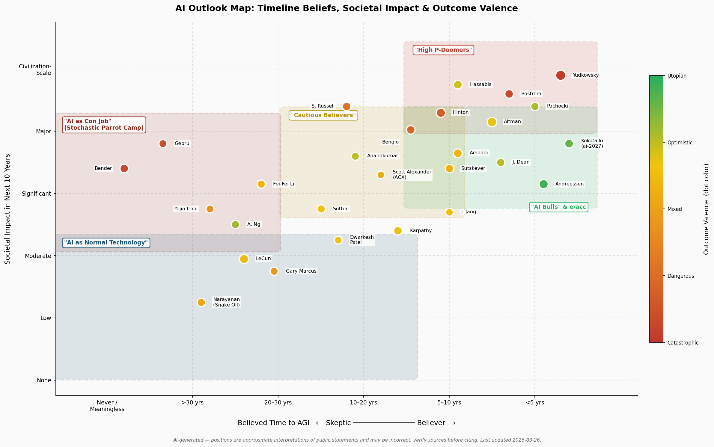

## Possible Broader Job Losses

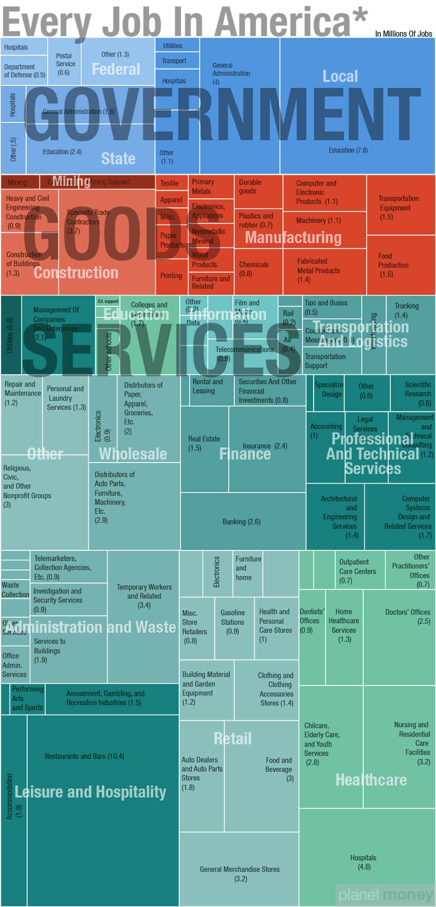

### AGI?

## How Close are we to Drop-in Replacements of different roles?

- Data Scientist
- Software Engineer
- Data Engineer
- DevOps
- Project Manager
- Lawyer
  - How good is auto-law?
  - needs persistent case model
- Manager
- Doctor
- Human Resources

### White Collar Job Exposure to AI

### What's the obvious path to AGI?

Give these models a world model, or enginerring such as multi-agent solutions,
have them learn in the world, and then they will get much better and solve all
our problems.

### verifiability

We know that AI is improving consistently with synthetic benchmarks and on METR
programming tasks. This may be sufficient to dramatically change software
development and similar tech fields where problems are verifiable.

#### What jobs are most at risk?

## The Future (maybe) - Long-term

### ASI?

# Summary

## What kinds of discoveries are needed for the next level

- Sub Agents that talk to each other. This may help fight the slop. Many are
  trying this but it turns out agents talking to each other is not as easy as
  you would think
-

## Steps to take
