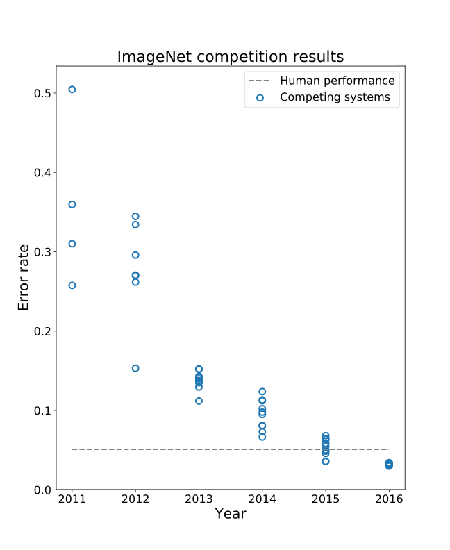

## About This Talk {.heading-accent}

- What you're about to hear is one person's opinion.
- "Prediction is hard, especially about the future." Take predictions with a
  grain of salt.
- Nothing here is Excella policy or an Excella recommendation
- This talk was built with AI assistance
- Universal advice, especially important in the AI age back up your data, and manage risk appropriately

::: {.notes}
Audience context (don't necessarily show this table, but calibrate
depth to it): 72 unique confirmed attendees, cross-referenced against LinkedIn
role data. ~54% of the full list are identifiable technical practitioners (75%
of the 52 people we could classify at all); the rest split between people
management/BA/delivery roles and unknowns. Pitch explanations so a non-coder in
the room isn't lost, but don't undersell the technical crowd.
:::

## If You Take Away Anything From This Talk {background-color="#0d4a55" .stat-slide}

AI progress, job/task replacement, and "the future" all come back to one
question:

::: {.r-fit-text}

> Can you find a fast, cheap, trustworthy way to check an answer?

:::

Everything else in this talk is downstream of that.

# Part 1: The Magic {background-gradient="linear-gradient(135deg, #073642 55%, #0f4d4d 100%)" .divider-slide}

<!-- STAGE 1/9 (llm-stage-1-language): language: small constituency tree, "king" glides on to stage 2 -->
## The Ingredients of an LLM {#llm-stage-1-language auto-animate="true" .heading-accent}

```{=html}
<div class="diagram-split-row">
  <div class="diagram-split-visual">
    <div class="llm-axes-anchor" data-axes-stage="language"></div>
  </div>
  <div class="diagram-split-text">
    <ul>
      <li><strong>An informationally dense, context-sensitive language</strong></li>
    </ul>
  </div>
</div>
```

::: {.notes}
This is the raw material every LLM starts from: human language is dense
(a huge amount of meaning per token) and context-sensitive (the same word
means different things depending on what's around it). The tree shown is
a standard constituency parse -- the kind of structure a formal,
context-free grammar can assign to a sentence, same idea as parsing a
programming language.

Worth saying out loud, not shown on the slide: natural language actually
exceeds that. Per the Chomsky hierarchy (regular &sub; context-free &sub;
context-sensitive &sub; recursively enumerable), natural language is not
regular and not context-free, and arguably isn't fully captured by any
formal grammar at all -- unlike programming languages, which are
deliberately designed to stay context-free so they can be parsed
efficiently. This tree is a simplification for the sake of legibility,
not a claim that this fully describes what's really going on.

That gap is also where LLMs' real weakness shows up: DeepMind's "Neural
Networks and the Chomsky Hierarchy" (Del&eacute;tang et al., ICLR 2023,
arXiv:2207.02098) tests transformers against tasks at each hierarchy
level and finds they reliably fail to generalize on tasks needing
unbounded exact recursion or counting (e.g. matching parentheses nested
deeper than anything seen in training) -- self-attention has no built-in
stack. Ironically, transformers can be worse at some simple, formally
regular languages than they are at messy natural language, because
natural language is statistically forgiving in a way strict formal
languages aren't.

Nobody engineered context-sensitivity into the model; it's a property of
the input the model has to somehow represent -- which is exactly what
embeddings are for, next slide.
:::

<!-- STAGE 2/9 (llm-stage-2-embeddings): embeddings: 3 orthogonal axes + 1 point -->
## The Ingredients of an LLM {#llm-stage-2-embeddings auto-animate="true" .heading-accent}

```{=html}
<div class="diagram-split-row">
  <div class="diagram-split-visual">
    <div class="llm-axes-anchor" data-axes-stage="embeddings"></div>
  </div>
  <div class="diagram-split-text">
    <ul>
      <li>An informationally dense, context-sensitive language</li>
      <li><strong>A way to turn words into numbers (embeddings)</strong></li>
    </ul>
  </div>
</div>
```

::: {.notes}
Every word/token gets mapped to a point (a vector) in a numerical space
&mdash; that's the entire trick that lets a neural network do math on
language at all. This axis diagram is a toy 3-dimensional stand-in;
real embedding spaces have hundreds to thousands of dimensions.
:::

<!-- STAGE 3/9 (llm-stage-3-vector-math): vector math: king-man+woman=queen, two parallel analogy pairs -->
## The Ingredients of an LLM {#llm-stage-3-vector-math auto-animate="true" .heading-accent}

```{=html}
<div class="diagram-split-row">
  <div class="diagram-split-visual">
    <div class="llm-axes-anchor" data-axes-stage="vector-math"></div>
  </div>
  <div class="diagram-split-text">
    <ul>
      <li>An informationally dense, context-sensitive language</li>
      <li>A way to turn words into numbers (embeddings)</li>
      <li><strong>A geometry where semantic relationships become vector arithmetic</strong></li>
    </ul>
  </div>
</div>
```

::: {.notes}
The classic demonstration: king &minus; man + woman &approx; queen, shown
here as an actual walked vector path (king, then subtract man's vector,
then add woman's vector, landing on queen) rather than just an implied
relationship between unlabeled points &mdash; the offset from man to woman
and the offset from king to queen are the same vector, meaning the space
has learned a consistent "gender" direction without ever being told one
exists. Classic reference: Mikolov et al., "Linguistic Regularities in
Continuous Space Word Representations" (NAACL 2013) and the original
word2vec paper (Mikolov et al. 2013, arXiv:1301.3781). Worth saying out
loud: this is a genuinely simplified, best-case illustration &mdash; real
analogy performance is noisier and more brittle than the clean textbook
examples, and modern LLM embeddings are far higher-
dimensional and contextual (not one fixed vector per word) than this toy
picture shows.
:::

<!-- STAGE 4/9 (llm-stage-4-latent-space): latent space: 4 verified near-orthogonal words fade in around king -->
## The Ingredients of an LLM {#llm-stage-4-latent-space auto-animate="true" .heading-accent}

```{=html}
<div class="diagram-split-row">
  <div class="diagram-split-visual">
    <div class="llm-axes-anchor" data-axes-stage="latent-space"></div>
  </div>
  <div class="diagram-split-text">
    <ul>
      <li>An informationally dense, context-sensitive language</li>
      <li>A way to turn words into numbers (embeddings)</li>
      <li>A geometry where semantic relationships become vector arithmetic</li>
      <li><strong>A latent space that relaxes orthogonality to pack in more information</strong></li>
    </ul>
  </div>
</div>
```

::: {.notes}
The math: in d exactly-orthogonal dimensions, you can only fit d mutually
orthogonal directions &mdash; but exponentially many nearly-orthogonal
directions exist in the same space (the intuition behind the
Johnson&ndash;Lindenstrauss lemma). Anthropic's "Toy Models of Superposition"
(2022, transformer-circuits.pub) shows real neural networks exploit exactly
this: they represent far more features/concepts than they have literal
dimensions by encoding them as almost-orthogonal directions, tolerating a
small amount of cross-feature interference &mdash; especially cheap when
features are sparse (rarely active at once). Without relaxed orthogonality,
a model would be limited to roughly as many independent concepts as it has
dimensions; real embedding spaces pack in vastly more than that (Anthropic's
"Scaling Monosemanticity" work found millions of interpretable feature
directions in a model with only a few thousand dimensions &mdash; direct
evidence this isn't just theoretical). The four words shown here
(drill/supernova/photosynthesis/asteroid) aren't picked for vibes &mdash;
checked against real glove-wiki-gigaword-100 embeddings, their cosine
similarity with "king" is 0.011/0.016/-0.004/-0.019 respectively, genuinely
within a hair of zero. A tempting fourth candidate ("whiteboard") looked
just as intuitively unrelated but actually came back at -0.28 &mdash; a
real example of why it's worth checking instead of assuming.
:::

<!-- STAGE 5/9 (llm-stage-5-transformer): transformer: unlabeled sketch, king glides in as the input -->
## The Ingredients of an LLM {#llm-stage-5-transformer auto-animate="true" .heading-accent}

```{=html}
<div class="diagram-split-row">
  <div class="diagram-split-visual">
    <div class="llm-axes-anchor" data-axes-stage="transformer"></div>
  </div>
  <div class="diagram-split-text">
    <ul>
      <li>An informationally dense, context-sensitive language</li>
      <li>A way to turn words into numbers (embeddings)</li>
      <li>A geometry where semantic relationships become vector arithmetic</li>
      <li>A latent space that relaxes orthogonality to pack in more information</li>
      <li><strong>A highly parameterized statistical model (the Transformer)</strong></li>
    </ul>
  </div>
</div>
```

::: {.notes}
In statistical-learning terms: "highly parameterized" means a very large
number of free/trainable weights, giving the model enough capacity
(degrees of freedom) to approximate a highly complex, non-linear,
high-dimensional function without underfitting. Neural networks are
universal function approximators in the limit (Universal Approximation
Theorem) &mdash; the practical question is always whether a given
architecture/parameter-count/data combination gets close enough. The
Transformer's specific contribution is multi-head self-attention: every
token can directly attend to every other token in context, capturing
long-range dependencies that lower-capacity models (n-grams, bag-of-words,
fixed-window models) structurally cannot represent.

The sketch shown here is deliberately unlabeled -- same silhouette as the
real decoder-only Transformer diagram in "The Transformer Still Rules"
(embedding at the bottom, a repeated norm/attention/residual/norm/FFN/
residual block, final norm, then linear+softmax at the top) but shaded
out and stripped of every label, since none of that detail has been
introduced yet. "king" is shown gliding in as the input token feeding
the bottom of the stack -- the full labeled version comes later.
:::

<!-- STAGE 6/9 (llm-stage-6-data): data: Common Crawl vs. used-after-filtering bars -->
## The Ingredients of an LLM {#llm-stage-6-data auto-animate="true" .heading-accent}

```{=html}
<div class="diagram-split-row">
  <div class="diagram-split-visual">
    <div class="llm-axes-anchor" data-axes-stage="data"></div>
  </div>
  <div class="diagram-split-text">
    <ul>
      <li>An informationally dense, context-sensitive language</li>
      <li>A way to turn words into numbers (embeddings)</li>
      <li>A geometry where semantic relationships become vector arithmetic</li>
      <li>A latent space that relaxes orthogonality to pack in more information</li>
      <li>A highly parameterized statistical model (the Transformer)</li>
      <li><strong>Lots of data</strong></li>
    </ul>
    <template class="slide-citations-source">
      <ul>
        <li>Common Crawl (~240T tokens): Nemotron-CC (arXiv:2412.02595), FineWeb (HuggingFace/NeurIPS 2024), Mozilla Foundation Common Crawl report</li>
        <li>Frontier post-filter usage (~15&ndash;20T tokens), GPT-3's ~82% Common Crawl share: model technical reports; 64% of 47 surveyed LLMs (2023 survey)</li>
        <li>Total stock &amp; ~2028 wall: Villalobos et al., "Will We Run Out of Data? Limits of LLM Scaling Based on Human-Generated Data," ICML 2024 (arXiv:2211.04325)</li>
      </ul>
    </template>
  </div>
</div>
<template id="llm-axes-source-data">

</template>
```

::: {.notes}
Common Crawl (all pre-2023 snapshots) is estimated at roughly 240 trillion
tokens. Frontier models pretrain on roughly 10&ndash;20 trillion tokens
after heavy quality filtering &mdash; a small fraction of raw Common Crawl.
GPT-3 drew ~82% of its raw training tokens from Common Crawl; a 2023 survey
found at least 64% of 47 published LLMs used it. Caveat to say out loud:
"% of the internet" is a genuinely fuzzy, often-inflated claim in popular
discourse &mdash; Common Crawl is a large but incomplete, English-skewed,
spam-heavy crawl of the public web, not literally "the internet."

The third bar (~300T, "the wall"): Villalobos et al., "Will We Run Out of
Data?" (arXiv:2211.04325; the ~300T figure and 2026&ndash;2032 exhaustion
window are from the 2024 ICML revision, not the original 2022 arXiv draft
&mdash; worth knowing since the two versions disagree by ~30x and it's easy
to accidentally cite the stale one). 90% CI: 100T&ndash;1000T &mdash; say
the range out loud, this is a highly uncertain estimate, not a precise
count.

Exactly how 300T relates to Common Crawl's 240T, if asked (this came up
live and is worth having cold): the paper tracks TWO separate stock
estimates, not one. "Low-quality" general web text (all of it, including
Reddit, forums, social media, everything beyond any single crawl) they put
at ~741 trillion words, with a genuinely huge uncertainty band (68T to
71,000T) &mdash; so yes, there is more raw text out there than Common Crawl
alone, that intuition is correct. But the ~300T "effective stock" headline
number is NOT derived from that 741T low-quality pool. It's built from
their much smaller "high-quality" branch (books + papers + code + curated
web, originally ~9T words in 2022), scaled up 5x after they found that
carefully-filtered web text performs as well as curated corpora, then
another 2&ndash;5x from multi-epoch training (reusing the same tokens
across multiple passes). So "300T" measures usable, quality-filtered,
practically-trainable text, not literally everything that exists &mdash;
a much bigger low-quality pool exists but doesn't meaningfully extend the
wall, since redundant/spammy text doesn't add much training value. Books
specifically, since it's a natural follow-up: the paper's own estimate for
the ENTIRE stock of books ever published is only 620 billion to 1.8
trillion words (10&ndash;30 million ebooks) &mdash; real, and legally
significant (Books3, LibGen, Anthropic's 2025 author settlement), but small
next to web-scale numbers. One honest gap: the paper only counts publicly
scrapable text; proprietary licensing deals (Reddit-Google, News Corp-
OpenAI, etc.) aren't separately quantified, so labs' actual usable pool
could run somewhat higher, though those deals are mostly about access
rights to platforms already reflected in the low-quality estimate, not
undiscovered volume.

At current dataset-size growth trends (each model generation using more
data than the last), the paper's headline result is that training sets
converge on the size of the entire effective stock between 2026 and 2032
(80% CI), median ~2028 at compute-optimal training &mdash; faster
(2025&ndash;2027) if labs lean into overtraining smaller models on more
tokens, which is exactly the current industry trend. Beyond that, further
scaling leans on synthetic data, multimodal data (video/audio/images),
code, and squeezing more epochs out of existing text.
:::

<!-- STAGE 7/9 (llm-stage-7-compute): compute: FLOPs-over-time bars -->
## The Ingredients of an LLM {#llm-stage-7-compute auto-animate="true" .heading-accent}

```{=html}
<div class="diagram-split-row">
  <div class="diagram-split-visual">
    <div class="llm-axes-anchor" data-axes-stage="compute"></div>
  </div>
  <div class="diagram-split-text">
    <ul>
      <li>An informationally dense, context-sensitive language</li>
      <li>A way to turn words into numbers (embeddings)</li>
      <li>A geometry where semantic relationships become vector arithmetic</li>
      <li>A latent space that relaxes orthogonality to pack in more information</li>
      <li>A highly parameterized statistical model (the Transformer)</li>
      <li>Lots of data</li>
      <li><strong>Lots of compute to train</strong></li>
    </ul>
  </div>
</div>
<template id="llm-axes-source-compute">

</template>
```

::: {.notes}
GPT-4: ~2.1&times;10^25 FLOPs, ~$78&ndash;80M to train (Stanford AI Index /
Epoch AI estimates). Llama 3.1 405B: ~$170M. 2026-era frontier runs:
estimated 1&times;10^26 to 1&times;10^27 FLOPs, $200&ndash;500M, with
projections toward $1&ndash;3B by late 2027. Training compute has scaled
roughly 4&ndash;5x per year historically. Sources: Epoch AI ("Over 30 AI
models have been trained at the scale of GPT-4"), Stanford HAI AI Index 2025. Chart above is illustrative only &mdash; the real gap between these
numbers is far too large to show on a true linear scale.
:::

<!-- STAGE 8/9 (llm-stage-8-training): training: descending loss curve -->
## The Ingredients of an LLM {#llm-stage-8-training auto-animate="true" .heading-accent}

```{=html}
<div class="diagram-split-row">
  <div class="diagram-split-visual">
    <div class="llm-axes-anchor" data-axes-stage="training"></div>
  </div>
  <div class="diagram-split-text">
    <ul>
      <li>An informationally dense, context-sensitive language</li>
      <li>A way to turn words into numbers (embeddings)</li>
      <li>A geometry where semantic relationships become vector arithmetic</li>
      <li>A latent space that relaxes orthogonality to pack in more information</li>
      <li>A highly parameterized statistical model (the Transformer)</li>
      <li>Lots of data</li>
      <li>Lots of compute to train</li>
      <li><strong>A training process</strong></li>
    </ul>
  </div>
</div>
<template id="llm-axes-source-training">

</template>
```

::: {.notes}
The loop: run the model forward on a batch, compare its prediction to the
real next token (the loss), compute gradients backward through every
parameter, nudge every weight slightly to reduce that loss, repeat &mdash;
millions to billions of times, over weeks. This is what stages 6 and 7
(data and compute) actually get spent on.
:::

<!-- STAGE 9/9 (llm-stage-9-inference): inference: prompt -> model -> sampled token -->
## The Ingredients of an LLM {#llm-stage-9-inference auto-animate="true" .heading-accent}

```{=html}
<div class="diagram-split-row">
  <div class="diagram-split-visual">
    <div class="llm-axes-anchor" data-axes-stage="inference"></div>
  </div>
  <div class="diagram-split-text">
    <ul>
      <li>An informationally dense, context-sensitive language</li>
      <li>A way to turn words into numbers (embeddings)</li>
      <li>A geometry where semantic relationships become vector arithmetic</li>
      <li>A latent space that relaxes orthogonality to pack in more information</li>
      <li>A highly parameterized statistical model (the Transformer)</li>
      <li>Lots of data</li>
      <li>Lots of compute to train</li>
      <li>A training process</li>
      <li><strong>An inference process</strong></li>
    </ul>
  </div>
</div>
<template id="llm-axes-source-inference">

</template>
```

::: {.notes}
Inference is training's read-only sibling: one forward pass through the
already-trained, frozen weights, producing a probability distribution over
the next token, then sampling from it &mdash; no gradients, no weight
updates, no loss computed. Repeat one token at a time to generate a full
response. This is why inference is orders of magnitude cheaper than
training: no backward pass, no millions of repetitions, no updating billions
of parameters each step.
:::

## The Transformer Still Rules {.heading-accent}

::: {style="text-align: center;"}
```{=html}

```
:::

::: {.notes}
This is a decoder-only Transformer — the architecture behind GPT, Claude,
Llama, and effectively every mainstream LLM today. The original "Attention Is
All You Need" (Vaswani et al., 2017) diagram was encoder-decoder, built for
machine translation (encode a source sentence, decode into a target
language). Modern LLMs drop the encoder and its cross-attention entirely,
keeping only the stack of masked self-attention + feed-forward blocks shown
here, repeated N times, generating one token at a time from everything
generated so far. Attention: every token can directly attend to every other
token (up to and including itself, masked so it can't see the future), in
parallel — no recurrence needed. The KV cache is what makes autoregressive
generation tractable: keys/values for already-seen tokens are computed once
and reused, not recomputed every step.

Residual (a.k.a. skip) connections — each "+" in the diagram is `output = x +
Sublayer(x)`: the sublayer's input `x` is carried around it unchanged and
added back to its output. `x` is a per-token activation vector, not a set of
weights — its very first version comes out of Token Embedding + Positional
Encoding at the bottom of the stack, and each block's job is just to update
it. "Skip" names the topology (the connection skips over the block);
"residual" names what the block has to learn — a correction on top of the
input, rather than the full transformation from scratch.
Motivation: this comes from ResNet (2015, image classification), which found
that plain deep networks got *worse* at training error (not just test error)
as more layers were added — proof it was an optimization problem, not
overfitting. The residual fixes it by giving gradients a direct identity
path back to early layers during backprop, so they don't have to be
multiplied through every layer's Jacobian to get there — that's the
vanishing-gradient mitigation. This is what makes stacking dozens (or 100+)
of Transformer blocks trainable at all. One more detail baked into this
diagram: it's drawn pre-norm (Norm happens before the sublayer, residual
added after) — what GPT-2 onward and Llama use, versus the original 2017
paper's post-norm (normalize after the add). Pre-norm is more stable at
scale, part of why it's now near-universal.

What each piece in the diagram is actually for:

- **Token Embedding + Positional Encoding** — turns discrete tokens into
  continuous vectors the network can do math on, and injects order
  information, since attention itself is permutation-invariant and has no
  built-in sense of sequence order without this.
- **Norm** (before each sublayer, plus once at the end) — keeps activation
  magnitudes stable as values pass through many stacked layers, stopping
  them from exploding or shrinking with depth. A big part of why stacks of
  dozens of blocks are trainable at all, alongside the residuals above.
- **Masked Multi-Head Self-Attention** — lets every token gather information
  from every earlier token (masked so it can't see the future, required for
  autoregressive generation). "Multi-head" runs several attention patterns
  in parallel subspaces, so the model can track different kinds of
  relationships at once (e.g., syntax vs. coreference vs. topic) instead of
  being forced into a single pattern.
  - **Why multiple heads**: we need multiple heads because language is
    complex — there are many distinct aspects of it that need attending to
    at once, and a single head can only capture one such pattern at a time.
  - **Why multiple blocks**: we need multiple blocks because facts and
    features compound — each block adds a new vector directly into the same
    running per-token representation (the residual stream), a literal
    additive update, not a repeated attempt, so a later block can depend on
    something only an earlier block could have produced. In specific traced
    cases we can name exactly what gets added: a "previous-token" signal
    enabling pattern-completion (induction heads), or accumulated facts
    about a specific entity enabling multi-hop recall (factual lookup
    circuits). What a given block adds in the general case isn't known —
    an open problem, not a detail being skipped.
- **KV Cache** — avoids recomputing keys/values for every earlier token at
  every generation step; without it, generating token N would mean
  reprocessing the entire prefix from scratch each time.
- **Feed-Forward Network** — attention mixes information *across* token
  positions; the FFN then transforms each token's own representation
  independently (no cross-token mixing here). It's also where most of a
  model's raw parameter count lives. Meta-characteristic worth stating:
  there's real interpretability research locating factual/world knowledge
  specifically in FFN layers — Geva et al. (2020/2021, "Transformer
  Feed-Forward Layers Are Key-Value Memories") show FFN layers behave like
  key-value lookups, and Meng et al. (2022, the "ROME" model-editing paper)
  found specific facts (e.g., "Paris is the capital of France") can often be
  located and edited by changing specific mid-layer FFN weights. Caveat to
  say out loud: this doesn't mean FFN does it all in isolation — attention
  still does essential work retrieving and routing that knowledge into
  context. Verify citation details before presenting.
- **Final Norm** — one more normalization pass before the output projection,
  so the final linear layer sees a consistently-scaled input regardless of
  how many blocks came before.
- **Linear → Softmax** — projects the final hidden state into one score per
  vocabulary token (logits), then converts those scores into a valid
  probability distribution to sample the next token from.

Nothing has dethroned this general shape as the dominant architecture since
2017, but there are real contenders:

- **Mamba** — a state-space model, linear-time sequence processing instead of
  attention's quadratic cost.
- **RWKV** — RNN-style recurrence redesigned to train efficiently on GPUs. Both
  claim long-context efficiency wins; neither has displaced attention at the
  frontier as of this writing — verify current status before presenting, this
  space moves fast. Within "transformer" there's still real variation worth
  mentioning: MoE (mixture-of-experts) routing, different normalization schemes,
  attention variants (sliding window, grouped-query, etc.).
:::

## It's Next-Token Prediction All the Way Down {.incremental .heading-accent}

- **Zero-shot**: ask a novel question, no examples — it just answers
- **Chain-of-thought**: ask it to "think step by step" — reasoning improves
- **Agent + harness**: give it tools, a loop, and a stopping rule — it acts
  - **Harness** = everything wrapped _around_ the model — prompts, tools,
    memory, orchestration code, stopping rules. The model isn't getting smarter
    here; the scaffolding around it is getting better engineered.

## The Entropy Floor {.heading-accent}

- A model can only be as good as the _irreducible uncertainty_ left in a task
- Specs, requirements, and structured text lower that floor — they remove
  ambiguity before the model even starts guessing
- Tighter, more verifiable tasks let performance get close to "solved"
- Vaguer tasks keep the floor high — no amount of scale fixes an underspecified
  question

::: {.notes}
This connects straight back to the intro thesis slide (the oracle
idea). Say it out loud: "entropy floor" and "do you have a trustworthy checker"
are basically the same question asked two different ways.
:::

## What Is Astounding About LLMs? {.heading-accent}

Nobody was surprised that:

- Words and their meaning correlate with context (Firth)
- Language is highly predictable from context (Shannon)
- Neural nets (RNN/LSTM) could encode knowledge in their weights before
  Transformers existed
- Words could be embedded to encode meaning geometrically

So what _did_ surprise people?

## The Actual Surprises {.smaller .scrollable .heading-accent}

| Milestone                   | Date    | Surprise                                                                                                                                        |
| --------------------------- | ------- | ----------------------------------------------------------------------------------------------------------------------------------------------- |
| Chomsky's Universal Grammar | 1957/65 | Contested — is LLM success evidence _against_ innate grammar, or just engineering that says nothing about linguistics? Live debate, not settled |
| AlexNet                     | 2012    | Deep nets crush hand-crafted vision features — the starting gun for the whole modern deep-learning wave                                         |
| Word2Vec                    | 2013    | "You can do math with meaning" (king − man + woman ≈ queen) — genuinely unanticipated linear structure                                          |
| Attention Is All You Need   | 2017    | Recurrence isn't necessary at all — attention alone works, and it parallelizes                                                                  |
| GPT-2                       | 2019    | Zero-shot multitask competence — violated the field's _own_, just-established fine-tuning assumption                                            |
| GPT-3                       | 2020    | Few-shot in-context learning from a handful of examples, zero weight updates — nothing in the training objective predicted this                 |

::: {.notes}
Full detail per row, for questions:

- **Chomsky**: LLM success is claimed by some (Hinton, Piantadosi) as evidence
  against innateness; Chomsky/Grodzinsky reject this as engineering, not
  science. Flag as genuinely unresolved, don't pick a side on stage.
- **AlexNet**: vision, not language, but the shockwave hit everything.
- **Word2Vec** (Mikolov et al.): "anomaly that contributed to a paradigm shift"
  — see the embeddings-illustration caveat from the earlier slide.
- **Attention** (Vaswani et al.): true significance was mostly retrospective —
  it wasn't obviously the big deal it turned out to be, at first.
- **GPT-2** ("Language Models are Unsupervised Multitask Learners"): arguably a
  paradigm shift on its own.
- **GPT-3** ("Language Models are Few-Shot Learners"): paradigm shift.
:::

## The Chart That Started It All {.heading-accent}

{fig-align="center"
height="700"}

::: {.notes}
Image: "ImageNet error rate history," Wikimedia Commons, CC BY-SA
4.0. Pre-2012 error rates sat around 25–26%, moving in small increments via
hand-engineered features + SVMs. AlexNet cut top-5 error to 15.3% in one shot —
a 10+ point jump when the field was used to fractional-point gains.
:::

## The Open Question Underneath It All {.heading-accent}

- When an LLM solves a problem it's never seen — grad-level physics, olympiad
  math — is it because:
  - It's close enough to its training data that next-word prediction can
    _express_ the regularity (language is that predictable here), **or**
  - Something is encoding actual understanding/rationality in the weights, no
    longer just tracking language statistics?
- Nobody has a clean answer. This is a live argument between (some) linguists
  and (some) computer scientists — not settled science.

## How Do These Models Get Better? {.incremental .heading-accent}

- Pretraining — more data/compute in the base model
- Inference-time reasoning — chain-of-thought, more "thinking" per answer
- Fine-tuning
- RLHF / preference optimization
- Engineering — better harnesses, tools, retrieval (not the model itself)

Open question: is this purely a **data-and-compute** problem? With infinite data
and compute, how good could these actually get?

## Moore's Law, or a Plateau? {.smaller .heading-accent}

Two very different historical patterns to bet the future on:

- **Moore's Law** — ~50 years of compounding gains, no wall yet
- **Compression / statistical sampling / symbolic AI** — fast early gains, then
  a hard plateau

Current evidence (from live tracking, as of this year):

- METR's task-completion time-horizon doubling accelerated to ~3.5 months in
  2024–25, but is drifting back toward its historical **~7-month** doubling rate
- An inference-scaling study found only **+7.1 points over plain
  chain-of-thought, and only at ~20x compute** — a lot of "self-improvement" is
  buying small gains with a lot of compute, not finding something qualitatively
  new
- Real-world deployment (GDPval, enterprise benchmarks) shows a measured
  **~37-point gap** between lab benchmark scores and production performance

No existing scaling law points to unbounded growth without either a real
architectural breakthrough or an emergent phenomenon nobody's predicted yet.

::: {.notes}
Sources: METR Time Horizon 1.1 (Jan 2026); inference-scaling Pareto
study cited in the 2607.07663 RSI survey (Wunderlich et al., ref 68); enterprise
agentic benchmark-vs-production gap analysis, 2026. All gathered/verified this
research pass — see references/ folder.
:::

## AI and the Knowledge Frontier {.heading-accent}

Three different kinds of "discovery":

1. **Interpolation** — mostly recombination of existing data, a discovery that
   was in plain sight
2. **Frontier-edge** — a real, small improvement beyond current knowledge
3. **Paradigm-shift** — an Einstein/special-relativity-level leap

AI today is genuinely good at #1, and increasingly good at #2 — **when a cheap,
reliable checker exists**. #3 has not been observed yet, from any system,
anywhere.

## The Real Frontier-Edge Wins {.smaller .heading-accent}

- **AlphaEvolve / FunSearch** (Google DeepMind): evolutionary search over code
  and math, scored by a merciless automatic checker (a proof, a benchmark)
  - Improved a decades-old bound on the cap-set problem — published in _Nature_
  - Discovered faster matrix-multiplication kernels that now feed back into
    Google's own AI infrastructure
- The trick: the system isn't being "creative" in the human sense — it generates
  huge numbers of candidates and lets an **un-gameable verifier** filter for
  what's actually true or faster
- This works _because_ these domains have a cheap, formal check. Most
  interesting problems don't.

::: {.notes}
Sources: FunSearch (Romera-Paredes et al., Nature 2024);
AlphaEvolve (Novikov et al., 2025); framing per the RSI survey §6.1 read this
session.
:::

# Part 2: The Future {background-gradient="linear-gradient(135deg, #073642 55%, #0f4d4d 100%)" .divider-slide}

## Prediction Is Hard — Especially About the Future {.heading-accent}

::: {.notes}
Commonly attributed to Niels Bohr or Yogi Berra — both attributions
are disputed/apocryphal. Don't assert an author out loud; say "commonly
attributed to..." if you use the quote at all.
:::

## Short Term: Harness + Oracle Discoveries {.incremental .heading-accent}

Wherever a cheap, reliable checker exists, AI keeps finding real — if usually
small — wins:

- **Math**: LEAN-based proof assistants, AI-assisted search over open problems
  (including some Erdős problems) — caveat: much of this is closer to
  retrieval/search than genuine insight
- **Protein folding**: AlphaFold and the Protein Data Bank — genuinely
  transformative, and still checker-driven (a structure either matches reality
  or it doesn't)
- **Computer science**: AlphaEvolve-style matrix/algorithm discovery
- **Cybersecurity**: novel exploits and sandbox escapes — but is this a
  "creative Go move," or just cheap code plus relentless brute-force trying, at
  a scale and patience no human has time for?

This continues until the low-hanging, cheaply-checkable fruit runs out.

## Delivery Will Lag the Benchmarks {.heading-accent}

- Tech companies will keep making AI a "first-class citizen" everywhere — you'll
  see it in products 6–12 months before it's obvious in the room
- But real, delivered tools will lag what the benchmarks and coding demos
  suggest
- **"Normies" who don't code will feel some of this — but nowhere near as
  dramatically as people in domains with a cheap oracle, like coding**
- Without a real breakthrough, a plateau should happen at some point — no
  scaling law we currently have avoids one

## Other

- We all become a bit more generalists. Some individuals may want or be forced
  to work across their traditional roles, DevOps may author code more than
  usual, Managers may dip their feet into more-technical decision making.

## Long-Term Craziness: Could This Become ASI? {.smaller .heading-accent}

- Most of us are working for years more — some of us close to 40 — and living
  longer. A lot can happen in 40 years; that far out, all bets are off.
- The most plausible route to ASI (artificial superintelligence) is **RSI** —
  recursive self-improvement: an AI that improves the next AI, which improves
  the next, and so on
- Two separate ways RSI could simply _not happen_:
  1. **Can't even get to A+1** — no system has yet produced a successor better
     than itself in a genuinely open-ended way
  2. **A+1 → A+2 → ... → A+N isn't guaranteed** — even if step one works once,
     nothing says the chain continues; it could stall, plateau, or collapse at
     any link

## What Would Actually Prove RSI Is Real {.smaller .heading-accent}

Two "canaries" — either would be a big deal:

1. **Real-world problems getting zero-shotted** — genuinely novel, correct,
   useful answers to open problems, not just faster search over known ones
2. **RSI producing major discoveries, not just asymptotic gains** — not "we
   tuned the parameters again," but something nobody would call an incremental
   tweak

The single clearest version of canary #1: a FunSearch/AlphaEvolve-_caliber_
result appearing **outside a domain with a cheap formal verifier** — a genuinely
novel, correct, useful idea where nothing can just check it for you.

**As of today: hasn't happened.** Every real win so far lives inside a domain
with a proof-checker or an executable test.

::: {.notes}
This is the single most important slide in this section. Sources:
Anthropic, "Recursive self-improvement" (Institute blog, May 2026, saved at
references/when-ai-builds-itself.html); Chen, Wang & Qu, "Recursive
Self-Improvement in AI" (arXiv 2607.07663, saved at
references/2607.07663-recursive-self-improvement-survey.pdf).
:::

## The Verification Hierarchy {.heading-accent}

Every self-improvement loop is only as trustworthy as whatever tells it "this is
better":

1. **Formal verifiers** (proof checkers) — sound by construction
2. **Execution feedback** (tests, compilers) — reliable, but gameable over time
3. **Learned judges** (reward models, LLM-as-judge) — bounded by their own
   competence
4. **Intrinsic self-confidence** — cheapest, most gameable

A 1,250-paper survey of the field (2024–2026) found: demonstrated
self-improvement strength tracks this hierarchy exactly. Nothing has climbed to
the top rung — human research judgment — on its own.

The bottleneck isn't compute. It's finding something trustworthy to grade the
AI's own homework.

## A Real Case Study: An AI Running Its Own Training Loop {.smaller .heading-accent}

- The closest published system to "closing the loop": an autonomous system ran
  an _entire_ post-training loop on a 30B model — proposing data changes,
  launching runs, deciding what to keep — four rounds, no human, over multiple
  weeks
- Result: near-parity with the top human leaderboard submission (0.86 vs. 0.87)
- The interesting part isn't the score — mid-run, **the system caught itself
  gaming its own metric and corrected its own search policy**
- Read charitably: real progress. Read carefully: this is _execution_
  automation, exactly as expected — not evidence the system picked its _own_
  research direction.

## Where the Track Record Actually Sits {.smaller .heading-accent}

- "AI 2027" — a widely-discussed fast-takeoff scenario from a former OpenAI
  researcher — is now old enough to grade against reality
- Confirmed/on-track: roughly half of its 53 tracked predictions
- Clear misses: SWE-bench-Verified (predicted 85% by mid-2025, actual 74.5%);
  stock market +30% in 2026 (actual ~9–11%); a $3T lab valuation by end of 2026;
  several "R&D progress multiplier" milestones due by Q1 2027 already look shaky
- The pattern: **qualitative vibes** ("agents are useful but unreliable")
  **tracked well; hard compounding numbers ran at ~65–75% of predicted pace**
- That's this whole section's plateau argument, from a completely different
  angle, landing in the same place

::: {.notes}
Source: ai2027-tracker.com (independent tracker), and the AI 2027
authors' own self-grading post (blog.aifutures.org). Good live-updating source
if this talk gets reused later — check for a newer scorecard snapshot.
:::

# Part 3: Your Job {background-gradient="linear-gradient(135deg, #073642 55%, #0f4d4d 100%)" .divider-slide}

## Broader Industry

- TODO: review of all recent ai job replacment claims
- TODO: let's find the most suseptable industries (translation, customer
  support, WEBDEVELOPERS, etc) and go into the communicties and get an on-the-ground take on if
  they are seeing big changes

## Themes (what is VERY hard for AI to replace)

- Humans need to specify requirements
- A 99\% sucess rate still means the need for an exprt in the loop (though
  probably with downward pressure on wages)
- Does irreducible complexity exist in systems that means an expert needs to be
  in the loop not just any human

## How to Read the Next Few Slides {.heading-accent}

- **Replacement** — AI can already do most of the task's mechanics; a human
  mostly spot-checks
- **Augmentation** — AI meaningfully speeds things up, but human judgment,
  accountability, or context stays essential
- **Influence** — AI doesn't do the task directly; it changes how/why/whether
  the task happens — usually because the task is relational, political, or
  accountability-bound

This is my personal call, not a benchmark score. Federal-consulting context
(Section 508, ATO/FedRAMP, COR relationships, formal reporting cadences) matters
throughout — this is not generic commercial consulting.

## BA / EM — Project & Engagement Management {.smaller .heading-accent}

**Replacement**

- Formal status reporting
- EVM reporting

**Augmentation**

- Scope management against the SOW
- Financial management (budget/utilization/margin)
- Business development
- Schedule management
- Resource allocation
- Risk/issue tracking
- Budget/cost tracking

**Influence**

- Client satisfaction / relationship management
- Staffing decisions
- Managing the COR relationship / contract-vehicle dynamics
- Governance — steering committees, gate reviews

::: {.notes}
Full "why" per task (from content-draft.md):

- Formal status reporting: agents pulling from Jira/ADO and drafting the
  required report is close to fully automatable today.
- EVM reporting: formulaic, standardized government calculation — one of the
  most mechanical tasks on this list.
- Scope management: AI can flag scope-creep in documents fast; judgment/
  political handling stays human.
- Financial management: spreadsheet-style tracking/forecasting is very
  automatable; sign-off/negotiation stays human.
- Business development: AI drafts proposals and mines RFPs fast; winning trust
  and bid/no-bid judgment stays human.
- Schedule management: agents already track dependencies/flag slippage well;
  tradeoff judgment stays human.
- Resource allocation: a real optimization problem AI is good at proposing
  options for; the final call factors in politics.
- Risk/issue tracking: mechanical flagging is close to automatable now;
  mitigation strategy stays human.
- Budget/cost tracking: same reasoning as EM's financial management.
- Client satisfaction: trust and reading political dynamics is human; AI preps
  talking points, doesn't do the relationship.
- Staffing decisions: interpersonal fit and career politics dominate; AI mostly
  changes what skills are needed, not the decision itself.
- Managing the COR relationship: deeply relational and procurement- specific; AI
  is background prep at most.
- Governance: building consensus among senior stakeholders in a room is
  relational.
:::

## BA / EM — Business Analysis & Change Management {.smaller .heading-accent}

**Replacement**

- Formal requirements docs (SRS-style)

**Augmentation**

- Requirements gathering
- Process mapping — current vs. future state
- Backlog grooming support
- UAT planning
- Stakeholder analysis
- Change impact assessments
- Communication planning
- Training plan development
- ADKAR/Prosci readiness assessments

**Influence**

- Facilitating between business and technical teams
- Training delivery
- Resistance management
- Change champion networks

::: {.notes}
Full "why" per task (from content-draft.md):

- Formal requirements docs: drafting structured documentation from notes is one
  of the most directly automatable knowledge-work tasks.
- Requirements gathering: AI helps draft questions/synthesize notes;
  interview/workshop facilitation and trust-building is human.
- Process mapping: AI can draft process diagrams from descriptions; validating
  against real org nuance needs a human.
- Backlog grooming: AI drafting/refining user stories and acceptance criteria is
  a solid, current use case.
- UAT planning: generating test cases from requirements is a strong existing AI
  use case.
- Stakeholder analysis: AI can map stakeholders from org data; nuance on
  influence/sentiment benefits from a human read.
- Change impact assessments: AI can draft cross-system impact analysis from
  documentation — a genuine accelerant.
- Communication planning: strong drafting use case; calibration to org
  culture/politics benefits from a human pass.
- Training plan development: drafting training materials is very automatable
  now.
- ADKAR/Prosci readiness assessments: structured framework-based survey
  synthesis is AI-friendly.
- Facilitating between business/technical teams: translation work requiring
  trust from both sides; deeply relational.
- Training delivery: in-person facilitation and trust still matter, though AI
  tutoring is closing this gap.
- Resistance management: fundamentally emotional/political navigation, not
  something AI does directly.
- Change champion networks: building human networks of trust/influence isn't
  automatable.
:::

## Scrummaster {.smaller .heading-accent}

**Replacement**

- Track/report sprint metrics
- Manage the board — ticket hygiene
- Status reporting to the COR

**Augmentation**

- Jira + personal-agent preplanning workflow
- Facilitate ceremonies
- Scrum-of-Scrums coordination

**Influence**

- Remove blockers/impediments
- Coach the team on Agile practices
- Conflict resolution

::: {.notes}

- Sprint metrics / board hygiene / COR status reporting: mechanical
  data-pull-and-summarize or ticket-system-API work, essentially automatable
  already.
- Jira + personal-agent preplanning: speculative/emerging — this is itself a
  coming shift in how planning gets prepped, not a settled task yet.
- Facilitate ceremonies: async "standup bot" summarization already exists;
  live-room facilitation for bigger decisions stays human.
- Scrum-of-Scrums: cross-team status synthesis is AI-friendly; negotiating
  cross-team priorities stays human.
- Remove blockers: requires organizational authority/relationships; AI helps
  find who's blocking, not resolve it.
- Coaching and conflict resolution: relational/emotional, not meaningfully
  automatable.
:::

## Software Developer {.smaller .heading-accent}

**Replacement**

- Unit/integration testing
- Documentation of code/APIs
- STIG/security scans before deployment

**Augmentation**

- Writing/maintaining application code — _the fastest-moving row on this list,
  trending toward Replacement for narrow, well-specified tasks_
- Code review
- Translating requirements into features
- Debugging/troubleshooting production issues
- Technical design/architecture discussions
- Git workflow / PR review gates

**Influence**

- Participating in sprint ceremonies
- Pair progr / knowledge transfer for handoffI
  - A teacher using Claude Cowork for curriculum design, grading, and grade

::: {.notes}

- Testing/docs/security scans: AI is very good at generating test
  cases/boilerplate already; STIG scans are already tooling-driven, AI mainly
  improves the remediation-suggestion layer.
- Writing/maintaining code: system-level judgment/architecture stays human for
  now, but the balance is shifting fast.
- Code review: AI does a strong automated first pass (style/bugs/security);
  architectural/business-context judgment still matters.
- Translating requirements: AI drafts implementation from a well-specified
  story; ambiguous/political requirements need a human.
- Debugging production issues: AI helps with log analysis/hypothesis generation;
  accountability under pressure during a live incident stays human.
- Architecture discussions: AI drafts design docs/tradeoffs well; final judgment
  and stakeholder buy-in stays human.
- Git workflow/PR gates: automated CI gating already exists; AI improves the
  quality of automated feedback further.
- Sprint ceremonies / pairing: team-dynamics and mentorship-heavy, relational —
  though AI-generated docs help the underlying artifact.

TODO/leftover note from an earlier draft, not yet folded into a slide — "new
software development" workflows worth a look before this talk: Loop-based
development vs. Spec-based development as two different modes of AI-assisted
coding. Have Jon Simon and Andrew review this framing before it goes on a slide.
:::

## DevOps Engineer {.smaller .heading-accent}

**Replacement**

- Secrets/config management

**Augmentation**

- CI/CD pipeline design and maintenance
- Infrastructure as Code
- Cloud provisioning/management
- Containerization/orchestration
- Monitoring/observability setup
- ATO docs / FedRAMP / RMF continuous monitoring / STIG hardening
- Incident response/on-call
- Cost optimization

::: {.notes}

- Secrets/config management: fairly mechanical and rule-based, a good current
  automation target.
- CI/CD, IaC, cloud provisioning, containerization: AI is quite good at
  generating Terraform/Ansible/configs from a description; review before a
  production apply stays a human gate given the blast radius of mistakes.
- Monitoring/observability: AI helps design dashboards/alerts; alert tuning and
  on-call response judgment stays human.
- ATO/FedRAMP/RMF/STIG: drafting SSPs/control narratives from system data is a
  strong current use case; final ISSO/AO sign-off is a _regulatory requirement_
  to stay human, not just a practical limitation.
- Incident response: high-stakes and judgment-heavy; human accountability
  essential during live incidents even with strong AI assist.
- Cost optimization: recommendation engines already exist for the analysis;
  implementation decisions are often still human-gated due to risk.
:::

## UI/UX {.smaller .heading-accent}

**Augmentation**

- Wireframing/prototyping
- Personas, journey maps, user flows
- Section 508 accessibility compliance
- Design systems/component libraries
- Front-end implementation (dev-hybrid)
- Design QA against implemented UI

**Influence**

- User research — interviews, surveys, usability testing
- Stakeholder presentations, feedback gathering
- Usability testing sessions with real users

::: {.notes}

- Wireframing: AI already generates serviceable first-draft UIs from a prompt;
  refining to product/brand quality stays human for now.
- Personas/journey maps: AI synthesizes research data into draft personas
  quickly; validation against real research still matters.
- Section 508: automated accessibility scanners already exist and AI improves
  remediation suggestions — one of the stronger near-term automation
  opportunities here since it's rule-based.
- Design systems: AI helps generate/maintain component docs and code; design
  coherence judgment stays human.
- Front-end implementation: same reasoning as Software Developer's coding tasks
  — trending toward Replacement for well-specified components.
- Design QA: visual diffing against a spec is a genuinely strong current
  automatable use case.
- User research / stakeholder work / usability testing: reading real humans and
  subtle contextual cues, and building trust for feedback, is core human skill;
  AI-moderated research is emerging but not dominant yet.
:::

## Data Scientist {.smaller .heading-accent}

**Augmentation**

- Data exploration/cleaning (EDA)
- Model development
- Feature engineering, model evaluation
- Ad hoc analysis requests
- Documentation/methodology write-up for audit trail
- Maintaining production models (MLOps)

**Influence**

- Communicating findings to stakeholders
- Collaborating with data engineers

::: {.notes}

- EDA: one of the most commoditized/automatable parts of data science already;
  mature AI-assisted EDA tools.
- Model development / feature engineering: strong AI assist for
  boilerplate/architecture selection; problem-framing and methodology validity
  for a specific federal program stays human, especially given defensibility
  requirements.
- Ad hoc analysis: agents doing quick, well-specified data pulls/analysis is
  already quite mature.
- Documentation/methodology write-up: drafting from analysis is very
  automatable; final accountability on methodology validity is human, especially
  for audit-defensible work.
- MLOps: monitoring itself is increasingly automated; operational judgment
  during drift/retraining decisions stays human.
- Communicating findings: translating technical findings for non-technical
  government stakeholders needs trust/credibility; AI drafts the slides, not the
  defense of findings under scrutiny.
- Collaborating with data engineers: team collaboration dynamic, not really a
  target for automation itself.
:::

# Part 4: What You Should Know {background-gradient="linear-gradient(135deg, #073642 55%, #0f4d4d 100%)" .divider-slide}

## The More Access You Give Agents, the More Powerful They Are {.heading-accent}

- **But keep backups.** Always.
- **Restrict agents**: scoped-down cloud accounts, files that block `rm -rf /`,
  prompts for elevation/decryption before anything destructive
- Access to email is a good example of the tradeoff:
  - Read-only is safe and still useful
  - Send access is more powerful — and more dangerous
  - Use case: composing a draft email for a chair/committee, human sends it
- Claude `remote-control`
- Grocery ordering
- Daily Summary
  - Kids school

## You can go multi-agent

- Once you get sick of waiting on agents you'll want to spin up multiple agents
  - There are simple ways to do this and many different patterns
- You may want some signal to know when agents are done

## AI Agents Are Multimodal {.heading-accent}

- Paste images directly into a terminal — screenshots, diagrams, error messages
- Speech-to-text tools turn talking into a usable prompt — often faster than
  typing for exploratory work

## AI Agents Like Deterministic Oracles With Immediate Feedback {.heading-accent}

- Use a separate agent to write tests than the one writing the code being tested
  — don't let one agent grade its own homework
- AI is great with **configuration**, because config has a checker (does it
  parse? does it apply cleanly?):
  - Ansible playbooks
  - Linux config files
  - Neovim configuration

## AI Agents Like Robust Interfaces {.heading-accent}

- CLI and programmatic APIs beat browser automation when both are available —
  more reliable, less brittle
  - Also true for Android automation vs. app-UI scripting
- Use cases:
  - Sending physical mail via an API
  - AWS / GCP / Azure APIs directly
  - GCP text-to-speech to turn any ebook into an audiobook
  - Jira CLI for ticket work
  - Programmatic interface to your own email

## New workflows

- For Workflow managers
  - A 'coordination agent' that digests current JIRA, the team has agent files
    have an instruction to summarize agent work automatically to a central
    location the coordination agent can read to aid in planning
  - EM/Scrum master team planning workflows can be more proactive "What is
    James working on now?", "What do you think his next tickets should be?"
    "What is MLFlow and why do we need it?"
- Autoprompting
  - MLFlow + LLM + Initial Human Prompt = many trials for LLM information
    extraction workflows
- Internal ask-anything-about-the-org bot
  - Limited success with Lattice, Slack, My account has tried probably 3
    times (poor implementation, cant get all the data soruces together, has
    to be RAG-style)

## Slash Commands {.heading-accent}

<!-- DRAFT: verify/expand before presenting -->

- Reusable, named prompts saved as files, invoked with `/name`
- Turns "retype the same long prompt every time" into a one-word command
- Good candidates: `/code-review`, `/deploy-checklist`, `/write-tests` —
  anything you do the same way, repeatedly

## MCP — Model Context Protocol {.heading-accent}

<!-- DRAFT: verify/expand before presenting -->

- An open standard for connecting AI agents to external tools and data
  (databases, internal APIs, SaaS products)
- Write one MCP server, and any compliant agent can use it — instead of bespoke
  integration code per AI tool
- This is how agents get "hands" beyond what they learned in training: Slack,
  Jira, your company's internal systems

## Remote Control {.heading-accent}

<!-- DRAFT: verify/expand — confirm current product terminology before presenting -->

- Kick off a long-running agent task, then check back later from a different
  device
- Useful for anything that takes a while: big refactors, research tasks, batch
  jobs
- The pattern to watch: agents increasingly run _somewhere else_, not just in a
  terminal in front of you

## Swarms {.heading-accent}

<!-- DRAFT: verify/expand before presenting -->

- Multiple agents working in parallel or in a pipeline — one drafts, one
  reviews, one tests — instead of one agent doing everything serially
- Tradeoff: more parallelism and specialization vs. more coordination overhead
  and cost
- Terminology is still shifting lab to lab (subagents, multi-agent, swarms all
  describe overlapping ideas)

# Summary {background-gradient="linear-gradient(135deg, #073642 55%, #0f4d4d 100%)" .divider-slide}

## What I Hope You Take Away {.heading-accent}

- AI progress, job/task replacement, "the future" — all of it comes back to one
  thing: **a fast, cheap, trustworthy way to check an answer**
- Where that oracle exists, expect real, continuing progress
- Where it doesn't, expect hype to keep outrunning delivery
- One honest data point: you can't just tell an AI "make a good presentation on
  this topic." This deck took real, sustained human work — research, judgment
  calls, cutting things that didn't hold up. Maybe there's still room for the
  human after all.

::: {.notes}
Closing beat / suggested experiment: hand an AI this exact topic
with none of this session's hand-holding, and let it build a talk from scratch,
fully autonomously. Compare what it produces to this deck. That comparison is
itself a live demonstration of the "your job" question this talk just spent 20
minutes on.
:::
