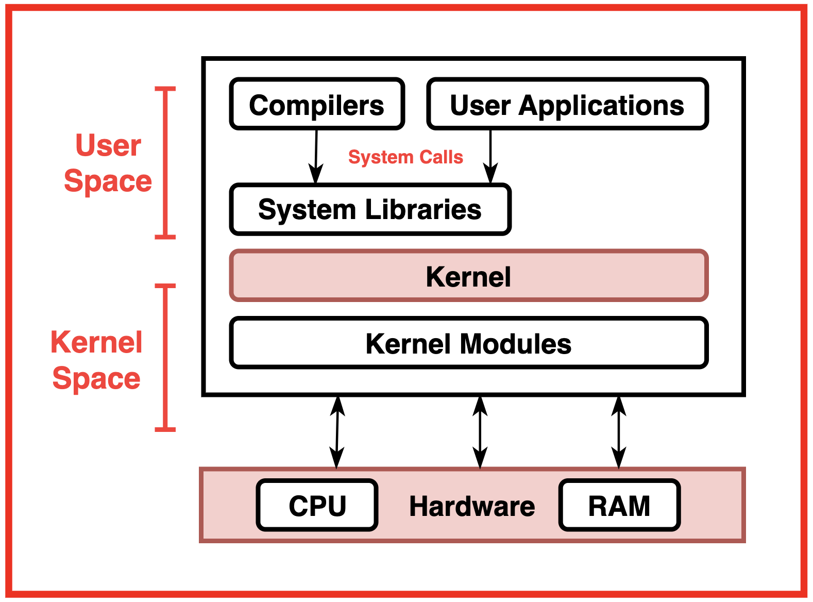
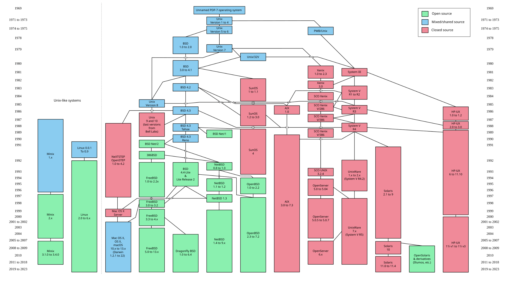
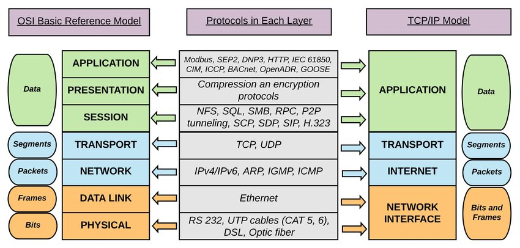

# Linux

This section serves as a primer on Linux operating system.

## Overview

### CPU

- CPU families:
  - x86
    - Intel
    - AMD
  - amd64
    - Intel
    - AMD
  - ARM
    - Apple M1/M2
    - Apple A-series
    - Qualcomm Snapdragon
- Code is compiled specific to the CPU architecture and operating system.

### Kernel

- Kernels:
  - Linux
  - BSD
    - FreeBSD
    - OpenBSD
  - Solaris
    - OpenSolaris
  - Unix
    - AIX
    - HP-UX
  - macOS
  - Windows
  - Android
  - iOS
  - ChromeOS

### Operating System

- In most cases the Operating Systems have unique kernels (i.e Windows kernel on windows, MacOS
  kernel on macOS, etc.)
- Linux is the exception. Linux has variations on the operating system and bundled software that are
  distinct called **jdistributions**.
- They often form common families based on their similar designs and package management systems.
- Linux distributions:
  - Debian-based
    - Ubuntu
    - Linux Mint
    - Kali Linux
  - Red Hat-based
    - Fedora
    - CentOS
    - RHEL
  - Arch-based
    - Arch Linux
    - Manjaro
  - Gentoo-based
    - Sabayon
    - Calculate Linux
  - Slackware-based
    - Slackware
    - Vector Linux
  - SUSE-based
    - openSUSE
    - SUSE Linux Enterprise Server (SLES)

### Package Manager

It's important to know how to install software on Linux. These options are:

1. Using a package manager
1. Downloading a precompiled binary
1. Compiling from source

The package manager should be the first option you try. It is the most common way to install
software on Linux.

| Distribution family | Package Manager | Command         |
| ------------------- | --------------- | --------------- |
| Debian-based        | APT             | `apt`/`apt-get` |
| Red Hat-based       | YUM/RPM         | `yum`/`rpm`     |
| Arch-based          | Pacman          | `pacman`/`yay`  |
| Gentoo-based        | Portage         | `emerge`        |
| Slackware-based     | Slackpkg        | `slackpkg`      |
| SUSE-based          | Zypper          | `zypper`        |

### Shell

- A shell is a command-line interface that allows users to interact with the operating system.
- The shell interprets commands and executes them.
- Common shells:
  - Bourne Again shell (bash)
  - Z shell (zsh)
  - Bourne shell (sh)
  - C shell (csh)
  - Korn shell (ksh)
  - Fish shell (fish)

### Display Server

- A display server is a program that manages the display of graphical user interfaces (GUIs) on a
  computer.
- This has many config files to ensure the proper start and config of the graphical environment.
- Common display servers:
  - X Window System (X11)
    - X.Org Server
  - Wayland
- X11 is the most common; Wayland is a newer alternative that is gaining popularity.

### Window Manager and Desktop Environment

- A Desktop Environment (DE) is a collection of software designed to provide a graphical user
  interface (GUI) for Linux. It includes a window manager, file manager, and other applications.
- A Window Manager (WM) is a software component that controls the placement and appearance of
  windows
  - A Desktop Environment will come with other tools and programs that a window manager will not.
- A Desktop Environment contans a Window Manager, but a Window Manager does not contain a Desktop
  Environment.
- Complete Desktop Environments (with corresponding Window Managers):
  - GNOME
  - KDE Plasma
  - XFCE
  - LXDE
  - Cinnamon
  - MATE
- Lightweight Window Managers:

  - i3
  - Openbox
  - Fluxbox
  - AwesomeWM
  - JWM (Joe's Window Manager)
  - IceWM (Ice Window Manager)
  - Blackbox

- Some popular graphical libraries exist for the window managers
- Common graphical libraries:
  - GTK (GIMP Toolkit)
  - Qt (pronounced "cute")
  - FLTK (Fast, Light Toolkit)
  - EFL (Enlightenment Foundation Libraries)
  - wxWidgets
- GTK and Qt are the most common. This is most relevant when, as a developer, you are writing
  applications that use these libraries. pyGTK and PyQt are popular Python bindings for GTK and Qt,
  respectively.

### Aside: OSI Model

## Common Linux components

These are important components of the Linux environment that may be relevant to the data scientist
in the development capacity.

### Linux Files and Directories

There are several important Files and directories in Linux that are relevant for the data science
practitioner in the development context.

- `/bin` - Contains essential user binaries (programs) that are required for the system to function.
  - Most non-system binaries are located in `/usr/bin` and `/usr/local/bin`.
- `/boot`- Contains files required for the boot process, including the kernel and initial RAM disk.
  - Relevant: if you need to mess with the bootloader (unlikely)
- `/dev` - Contains device files that represent hardware devices on the system.
  - Relevant: if you need to check low-level information about hardware
  - `/dev/null` is a special file that discards all data written to it and returns EOF when read.
  - `/dev/zero` is a special file that produces an infinite stream of null bytes (zeros). Important
    for wiping or initializing storage devices. (unlikely)
  - `/dev/random` and `/dev/urandom` are special files that provide random data. They are used for
    cryptographic purposes and other applications that require randomness.
  - `/dev/sda` is the first hard disk on the system. There could be reasons to run commands against
    the hard drive devices. You could also use it to see how many installed hard drives you have.
- `/etc` - Contains system configuration files and directories.
  - `/etc/fstab` - Contains information about filesystems and mount points.
  - `/etc/passwd` - Contains user account information.
  - `/etc/shadow` - Contains encrypted passwords and password expiration information.
  - `/etc/group` - Contains group account information.
  - `/etc/systemd` - Contains systemd service unit files. If you need to edit a system service
    (possible) will need to know this.
  - `/etc/X11` - Contains configuration files for the X Window System (X11). If you need to edit the
    display server config (unlikely) will need to know this.
  - Many more files too long to list
- `/home` - Contains user home directories.
- `/lib` - Contains essential shared libraries and kernel modules.
- `/mnt` - Contains mount points for temporarily mounted filesystems.
  - If you need to see if a drive (e.g. EBS drive in AWS) is mounted this is where you would look.
- `/opt` - Contains optional software packages and add-on applications.
  - When you install optional software this is where it may go
- `/proc` - Contains virtual files that provide information about the system and processes.
  - `/proc/cpuinfo` - Contains information about the CPU.
  - `/proc/meminfo` - Contains information about memory usage.
  - `/proc/version` - Contains information about the kernel version.
- `/root` - The home directory for the root user (superuser).
  - Must be superuser to access this directory.
  - Can be relevant to docker containers
- `/run` - Contains runtime data for processes and services.
- `/sbin` - Contains essential system binaries (programs) that are required for system
  administration.
- `/srv` - Contains data for services provided by the system.
- `/sys` - Contains virtual files that provide information about the kernel and devices.
- `/tmp` - Contains temporary files created by applications and the system.
  - Write any tmp files here. Will be deleted on reboot.
- `/usr` - Contains user-related programs and data.
  - `/usr/bin` - Contains user binaries (programs) that are not essential for the system to
    function.
  - `/usr/local/bin` - Contains user binaries (programs) that are installed locally.
- `/var` - Contains variable data files, such as logs and databases.
  - `/var/log` - Contains log files for the system and applications. Modern systems you will use the
    `dmesg` or `journalctl` commands to view logs.
  - `/var/www` - Contains files for the web server. If you are running a web server this is where
    the files will be.

### File Permissions

### Permission Elevation - sudo

### File Size and Disk Usage

- `du` - Disk usage
- `df` - Disk free

### Systemd

### Network Access

Important commands

- `ip`
- `ssh`
- `scp`
- `curl`
- `wget`
- `ping`
- `rsync`

#### Network Security and Firewalls

- Linux generally does not have a firewall installed by default. As long as a service is not running
  on a port the system cant be accessed. Also network-level firewalls are common.

### X11

### Virtual Machines

### Docker

### Cron

### Compile Toolchain

### Shell Scripting

#### Environment Variables

- `$PATH` - The directories that are searched for executables when a command is run.
- `$HOME` - The home directory of the current user.
- `$SHELL` - The path to the current shell.
- `$EDITOR` - The default text editor for the current user.

### Text Manipulation - grep, sed, awk
