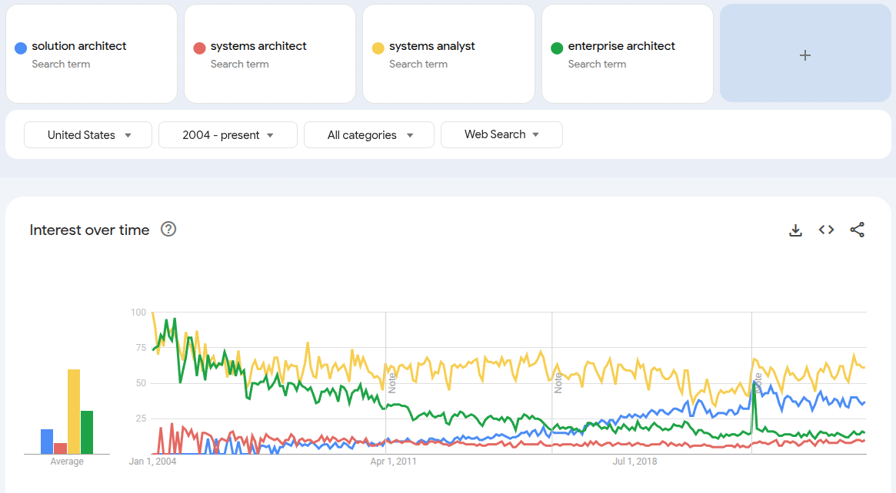

This summary is an overview of solution architecture developed based on the following resources:

- "Solution Architecture's Handobook", Shrivastava and Srivastav
- Ultimate AWS Certified Solutions Architect Associate 2025 - Udemy Course, Stephan Marek
- Ultimate AWS Certified Solutions Architect Professional 2025 - Udemy Course, Stephan Marek
- Microsoft Cloud Deisng Patterns, Microsoft
  - https://learn.microsoft.com/en-us/previous-versions/msp-n-p/dn568100(v=pandp.10)

# What should we learn in 30 minutes?

Best things to come away with in 30 minutes:

- What is Solution Architecture? The Scope of SA.
- Important definitions and concepts
- Some Design Patterns
- Which resources to study/learn more

## What resources to master to have a solid foundation in Solution Architecture?

- **AWS (et. al.) Certification content or cert** - If client has a particular cloud provider,
  familiarity with their product offerings is important. At least understanding the questions for
  their SA certification, or even the certification, is helpful.
- **Several courses on Solution Architecture/System Design** - Solution Architecture is a broad
  field with lots of aspects. Going through a few diverse courses would lead towards a broad
  understanding of Solution Architecture.
- **Practical experience** - Working on real-world projects is the best way to solidify your
  understanding of solution architecture. This includes designing and implementing systems, working
  with different technologies, and collaborating with other architects and engineers.
- **Books on Solution Architecture** - There arn't many great books on Solution Architecture. Some
  may be under related names such as 'system design' or 'scalable systems'.
  - Solution Architecture can be a interview topic for some roles. It is found in the famous
    'Cracking the Coding Interview' under Chapter 9 with questions like "How would you build
    TinyURL?" (A URL shortening service that goes back to 2002.)

## Scope of Solution Architecture

The level practice of a systems-level Solution Architect concerns **systems** and the
**communication** and relationships among them, which results in the design of a solution satisfying
a set of requirements, not necessarily requiring deep understanding of data, hardware, software, or
operating systems. However, a deeper understanding of solution development may require lower-level
understanding of these areas or others.

# Solutions Architect in Organizations

The broadest definition of a Solution Architect:

**Solutions Architect** is a professional who designs and manages the architecture of software
solutions, ensuring they meet both functional and non-functional requirements.

At the systems-level a Solutions Architect may have been previously called a Systems Architect,
Systems Analyst, or Enterprise Architect.



- Solutions Architects work to design systems that meet business needs. This may have no direct
  focus on deliverable software--such as the case of data pipelines, data lakes, and data
  warehouses--but also may also include the design of systems around software applications.
- Solutions Architect vs Software Architect vs Software Engineer:
  - **Solutions Architect**: Focuses on the overall architecture and design of systems, ensuring
    they align with business goals and requirements.
  - **Software Architect**: Concentrates on the technical aspects of software design, including code
    structure, frameworks, and technologies. Some organizations may refer to this role as a Software
    Engineer.
  - **Software Engineer**: Implements the software solutions based on the designs provided by
    architects.


## Types

- **Enterprise Architect**: Focuses on the overall architecture of an organization.
- **Application Architect**: Also called a Software Architect, focuses on the design and
  architecture of specific software applications.
- **Cloud Architect**: Specializes in designing and managing cloud-based solutions, ensuring they
  are scalable, secure, and cost-effective.
- **Architect Evangelist**: desinging archtiectures that cater to customer requirements and resolve
  point points
- **Infrastructure Architect**: define and plan organizations IT resources, focused heavily on IT
  infrastructure
- **Network Architect**: Specializes in designing and managing network infrastructure, ensuring
  connectivity, security, and performance.
- **Data Architect**: Focuses on the design and management of data systems, including databases,
  data warehouses, and data lakes.
- **ML Architect**: Specializes in designing and managing machine learning systems, ensuring they
  are scalable, secure, and cost-effective.
- **Generative AI Architect**: Focuses on designing and managing systems that leverage generative AI
  technologies, ensuring they are scalable, secure, and cost-effective.
- **DevOps Architect**: Specializes in designing and managing DevOps practices and tools, ensuring
  that software development and operations teams work together effectively.
- **Industry-Specific Architect**: Focuses on designing and managing systems for specific
  industries, such as healthcare, finance, or retail, ensuring they meet industry-specific
  requirements and regulations.


# AWS Solutions Architect Certification Paths

Certifications arn't everything when it comes to Solutions Architecture, but they do show what
skills the cloud providers consider essential for the role.

While there are 3 major cloud providers all with their own certifications, current clients often use
AWS, and so we review them here assuming their material is important for the skill set of a
Solutions Architect.


A list of Certification Paths can be found on the
[AWS Certification Paths](https://d1.awsstatic.com/training-and-certification/docs/AWS_certification_paths.pdf)
page. Some important paths are:

- Solutions Architect
- Application Architect
- Cloud Data Engineer
- Software Development Engineer
- Machine Learning Engineer
- Machine Learning Operations Engineer
- Data Scientist

Important certifications include:

- Cloud Practitioner/AI Practitioner (CLF-C02) - optional and found in most paths
- Solution Architect - Associate (SAA-C03) -- found in:
  - Solutions Architect
  - Application Architect
  - Cloud Data Engineer
  - Machine Learning Engineer
  - Machine Learning Operations Engineer
  - Data Scientist
- Solution Architect - Professional (SAP-C02) -- found in:
  - Solutions Architect
  - Application Architect (Dive Deep)
  - Cloud Data Engineer
- Developer - Associate (DVA-C02) -- found in:
  - Application Architect
  - Software Development Engineer
- DevOps Engineer - Professional (DOP-C02)-- found in:
  - Application Architect
  - Machine Learning Operations Engineer
- Data Engineer - Associate (DEA-C01) -- found in:
  - Cloud Data Engineer
  - Machine Learning Engineer
- Machine Learning Engineer - Associate (MLA-C01) -- found in:
  - Machine Learning Engineer
  - Machine Learning Operations Engineer
  - Data Scientist
- Machine Learning - Specialty (MLS-C01) -- found in:
  - Machine Learning Engineer
  - Data Scientist

## Topics in AWS Solution Architect Exams

### Solution Architect Associate Exam (SAA-C03)

The associate-level exam covers the following question types:

- Design Secure Architectures (30%)
- Design Resilient Architectures (26%)
- Design High-Performing Architectures (24%)
- Design Cost-Optimized Architectures (20%)
- Total Questions: 65

The associate-level exam covers the following topics (this list was taken from the Udemy prep
course) which is the most important topics found in the
[certification guide](https://d1.awsstatic.com/onedam/marketing-channels/website/aws/en_US/certification/approved/pdfs/docs-sa-assoc/AWS-Certified-Solutions-Architect-Associate_Exam-Guide.pdf):

- IAM
- EC2, Instance Storage
- High Availability and Scalability - ELB & ASG
- RDS, Aurora, ElastiCache
- Route 53
- Classic, Solution Architecture Discussions
- S3
- CloudFront & Global Accelerator
- SQS, SNS, Kinesis, Active MQ
- ECS, Fargate, ECR, EKS
- Serverless
- Databases
- Data & Analytics
- Machine Learning
- Cloudwatch, CloudTrail, Config
- KMS, SSM Parameter Store, Shield, WAF
- VPC
- Disaster Recovery
- More Solution Architecture
- Other Services

### Solution Architect Professional Exam (SAP-C02)

The professional-level exam covers the following question types:

- Design for Organizational Complexity (26%)
- Design for New Solutions (29%)
- Continuously Improve Existing Solutions (25%)
- Accelerate Workload Migration and Modernization (20%)
- Total Questions: 75

The professional-level exam covers the following broad topics (this list was taken from the Udemy
prep course). The professional exam goes into many more services which can be seen in the
[certification guide](http://d1.awsstatic.com/onedam/marketing-channels/website/aws/en_US/certification/approved/pdfs/docs-sa-assoc/AWS-Certified-Solutions-Architect-Associate_Exam-Guide.pdf):

- Identity and Federation
- Security
- Compute & Load Balancing
- Storage
- Caching
- Databases
- Service Communication
- Data Engineering
- Monitoring
- Deployment and Instance Management
- Cost Control
- Migration
- VPC
- Machine Learning

# Principles of Solution Architecture Design

## Scalable Architecture Design

- **horizontal scaling**: Adding more instances to handle increased load.
- **vertical scaling**: Increasing the resources of existing instances to handle increased load.
- **predictive scaling**: Anticipating future load and scaling resources accordingly.
- **reactive scaling**: Scaling resources in response to current load.

### Scaling Static Content

- **CDN**: Use a Content Delivery Network (CDN) to cache and deliver static content closer to users.

### Database Scaling

- **Relational databases** offer strong consistency but don't scale horizontally without complex
  changes like sharding.
- **Offload database load** by using NoSQL for sessions, object stores for static content, and
  caching (e.g., Redis, Memcached) for frequent queries.
- **Use read replicas** to separate read/write operations; plan for slight sync delays (e.g., Amazon
  RDS supports up to 15).
- **Shard the database** when it exceeds capacity, using a partition key to distribute data and
  direct queries accordingly.
- **Design for scalability** with elasticity in mind—consider CDNs, load balancing, autoscaling, and
  diverse storage strategies.

### Elastic Architecture Design

A 3-tier architecture is a common pattern for elastic architecture design, consisting of:

- **Presentation Layer**: The user interface, often served by a web server or application server.
- **Application Layer**: The business logic, typically implemented as microservices or serverless
  functions.
- **Data Layer**: The database or data store, which can be relational or NoSQL.

Also note the use of a **load balancer** to distribute traffic across multiple instances.

- **load balancer**: Distributes incoming traffic across multiple instances to ensure high
  availability and reliability.


## Building Highly Available and resilient architectures

The goal is to create systems which are

- **Highly Available**: Systems that are operational and accessible most of the time, minimizing
  downtime.
- **Resilient**: Systems that can recover quickly from failures, ensuring minimal impact on users.
- **Redundant**: Systems that have multiple components to ensure availability even if one fails.

## Making your architecture fault-tolerant

## Designing for performance

- Use the **browser cache** on the user’s system to load frequently requested web pages.
- Use the **DNS cache** for quick website lookup.
- Use the **CDN cache** for high-resolution images and videos near the user’s location.
- At the **server level**, maximize the memory cache to serve user requests efficiently.
- Use cache engines such as **Redis** and **Memcached** to serve frequent queries from the caching
  layer.
- Use the **database cache** to serve frequent queries directly from memory.
- Handle **cache expiration** (when cached data becomes outdated) and **cache eviction** (removal of
  data to free space for new entries).

## Creating immutable architecture

Design systems where you treat your servers as a replaceable resource. Servers should not be
meticulously maintained but should be provisioned quickly, managed consistently, and replaced
without impact to the system. During application updates you should upgrade hardware along with your
software.

## Loose Coupling

Subsystems should be loosely coupled to allow for independent development, deployment, and scaling.
This can be achieved through intermediate layers such as load balancers


or message queues, which allow subsystems to communicate without being directly dependent on each
other.


## Service, not Server

- **microservice architecture**: A design pattern where applications are built as a collection of
  loosely coupled services, each responsible for a specific business capability.


<!--# Cloud Migration and Cloud Architecture Design -->

## Data-Driven Design

- **Data is central** to all software solutions, influencing how applications are designed and
  operated.
- **Proper data handling**—including secure storage and management—is critical for application
  success.
- **Operational needs** like monitoring rely on data:
- **Solutions architects** must design with data in mind to drive business value, enhance customer
  satisfaction, and improve profitability through insights.

## Adding Security Everywhere

- **physical security**: Protecting the physical infrastructure where systems are hosted.
- **network security**: Securing the network infrastructure, including firewalls, VPNs, and
  intrusion detection systems.
- **identity and access management (IAM)**: Controlling who can access resources and what actions
  they can perform.
- **data security in transit**: Encrypting data as it travels over networks to prevent unauthorized
  access.
- **data security at rest**: Encrypting data stored on disks or in databases to protect it from
  unauthorized access.
- **security monitoring**: Continuously monitoring systems for security threats and vulnerabilities.

## Making applications usable and accessible

### Achieving usability

### Achieving accessibility

## Building future-proof extendable and reusable architecture

## Ensuring architectural interoperability and portability

### Making applications interoperable

### Making applications portable

## Applying automation everywhere

An important aspect of solution architecture is to automate as much as possible, including:

- **Infrastructure as Code (IaC)**: Using code to manage and provision infrastructure resources.
- **Continuous Integration/Continuous Deployment (CI/CD)**: Automating the software development
  lifecycle to ensure quick and reliable deployments.
- **Automated Testing**: Implementing automated tests to ensure code quality and functionality.
- **Monitoring and Alerting**: Setting up automated monitoring and alerting systems to detect issues
  in real-time.

## Plan for business continuity

- **Recovery Time Objective (RTO)**: The maximum acceptable time to restore a system after a
  failure.
- **Recovery Point Objective (RPO)**: The maximum acceptable amount of data loss measured in time.

## Design for operation

## Overcoming architectural constraints

- **MVP (Minimum Viable Product)**: Start with a basic version of the product that meets the
  essential requirements and can be built quickly.

### Taking the MVP approach

- **MoSCoW Prioritization**: A technique to prioritize requirements into four categories:
  - Must have
  - Should have
  - Could have
  - Won't have

<!--
#  Cloud Migration and Cloud Architecture Design
## Public, private, and hybrid clouds
## Solution architecture in the public cloud
### The public cloud architecture
### Popular public cloud providers
### Cloud-native architecture
### Designing cloud-native architecture
## Creating a cloud migration strategy
### Lift and shift migration
#### Rehost
#### Replatform
#### Relocate
### The cloud-native approach
#### Refactor
#### Repurchase
### Retain or retire
#### Retain
#### Retire
## Choosing a cloud migration strategy
## Steps for cloud migration
### Discovering your portfolio and workloads
### Analyzing the information
### Creating a migration plan
### Designing the application
### Executing application migration to the cloud
#### Data migration
#### Server migration
### Integrating, validating, and cutover
#### Validation
#### Integration
#### The cutover process
## Operating the cloud application
## Application optimization in the cloud
## Creating a hybrid cloud architecture
## Taking a multi-cloud approach
## Implementing CloudOps
### CloudOps pillars
-->

# Chapter 4: Solution Architecture Design Patterns

## Building an n-tier layered architecture

In an n-tier architect the application is divided into multiple layers that are loosely coupled. A
3-tier architecture is the most common form of this pattern.


### The web layer

The web layer is the user-facing part of the application, responsible for handling user requests and
serving web pages. The presentation layer can be built with HTML/CSS, JavaScript, and various
javascript framworks.

### The application layer

The application layer contains the business logic of the application.\

| Langauge | Frameworks                |
| -------- | ------------------------- |
| Java     | Spring, JAX-RS, Micronaut |
| Python   | Flask, Django, FastAPI    |
| Node.js  | Express, NestJS           |
| .NET     | ASP.NET Core, NancyFX     |
| Ruby     | Ruby on Rails, Sinatra    |

### The database layer

The database layer is responsible for storing and retrieving data. It can be a relational database
like MySQL or PostgreSQL, a NoSQL database like MongoDB or DynamoDB, or a data warehouse like Amazon
Redshift or Google BigQuery.

## Creating a multi-tenant SaaS-based architecture

**Software as a Service (SaaS)** is a software delivery model where applications are hosted in the
cloud and accessed over the internet. SaaS applications are typically multi-tenant, meaning that
multiple customers share the same application instance while keeping their data isolated and secure.

SaaS providers such as Salesforce, CRM, Jira, Slack, Gmail, GeForce Now, Mural, and others, provide
a platform to provide software usually controlled through a browser, though Adobe Creative Cloud
(with a Desktop application) would be a non-browser based example (though Adobe has a browser
option).

Isolation occurs by different mechaniasms:

- **Database-level isolation**: Each tenant has its own database schema or database instance.
- **Table-level isolation**: Each tenant's data is stored in the same database but in separate
  tables.
- **Role-based isolation**: Each tenant has its own set of roles and permissions, ensuring that data
  and configurations are kept separate.
- **Container-based isolation**: Each tenant's application instance runs in its own container,
  providing a high level of isolation and security.

## Understanding service-oriented architecture

- **Service-Oriented Architecture (SOA)** is a design pattern where applications are built as a
  collection of loosely coupled services that communicate over a network.

In SoA, a monolithic application is broken down into smaller, independent services that can be
developed, deployed, and scaled independently. Each service is responsible for a specific business
capability and communicates with other services through well-defined APIs.

### SOA vs Microservices

- **SOA**: Focuses on building large, complex applications with a set of services that can be reused
  across different applications. SOA services are typically larger and more complex, often
  encapsulating multiple business capabilities.
- **Microservices**: Focuses on building small, independent services that can be developed and
  deployed independently. Microservices are typically smaller and more focused, each encapsulating a
  single business capability.

### Interfaces and APIs

- **Interface**: A contract that defines how services communicate with each other, including the
  data formats and protocols used. An interface generally is a boundary between two areas. Think of
  it like that: there is a boundary that separates two systems and transmits communication between
  them.
  - **API (Application Programming Interface)**: A set of rules and protocols that allow different
    software components to communicate with each other.
    - Examples:
      - RESTful API - Uses HTTP methods (GET, POST, PUT, DELETE) to perform CRUD operations on
        resources.
        - Twitter API Example:
        ```http
        GET /2/tweets?ids=1453489038376132610
        ```
        - This example retrieves a specific tweet by its ID using the Twitter API.
      - Program API - Defines the methods and properties of a class or module, allowing other
        components to interact with it often defined through a particular programming library.
        - Pandas API Example:
        ```python
        DataFrame.merge(right, how='inner', on=None, left_on=None, right_on=None, left_index=False, right_index=False, sort=False, suffixes=('_x', '_y'), copy=None, indicator=False, validate=None)
        ```
- Other inter-service communication protocols:
  - **HTTP (Hypertext Transfer Protocol)**: The foundation of data communication on the web, used
    for
  - **REST (Representational State Transfer)**: An architectural style that uses HTTP methods and
    URIs to access and manipulate resources, often used in web services.
    - Example: A RESTful API for a book store might have endpoints like `/books`, `/books/{id}`, and
      `/authors`.
  - **SOAP (Simple Object Access Protocol)**: A protocol for exchanging structured information in
    web services using XML.
  - **WebSockets**: A protocol for full-duplex communication channels over a single TCP connection,
    allowing real-time data exchange between clients and servers.
  - **Event-Driven Architecture**: A design pattern where services communicate by producing and
    consuming events, allowing for asynchronous communication and decoupling of services.
  - **GraphQL**: A query language for APIs that allows clients to request only the data they need.
  - **gRPC (Google Remote Procedure Call)**: A high-performance, open-source RPC framework that uses
    HTTP/2 for transport and Protocol Buffers for serialization.
  - **Message Queues**: A communication method where messages are sent between services through a
    queue, allowing for asynchronous processing and decoupling of services.
    - Examples: RabbitMQ, Apache Kafka, Amazon SQS, Google Pub/Sub

Reminder of Open Systems Interconnection (OSI) model:


<!-- TODO examples of messages at each layer -->

### RESTful web service architecture

Some important principles of RESTful web service

- **Statelessness**: Each request from a client to a server must contain all the information needed
  to understand and process the request. The server does not store any client context between
  requests.
- **Client-Server Architecture**: The client and server are separate entities that communicate over
  a network. The client is responsible for the user interface, while the server handles data storage
  and processing.
- **Uniform Interface**: RESTful APIs should have a consistent and standardized interface, making it
  easy for clients to interact with the server. This includes using standard HTTP methods (GET,
  POST, PUT, DELETE) and status codes.
- **Resource-Based**: RESTful APIs are designed around resources, which are identified by URIs
  (Uniform Resource Identifiers). Each resource can be manipulated using standard HTTP methods.
- **Representation**: Resources can have multiple representations, such as JSON or XML. Clients can
  request a specific representation using the `Accept` header in the HTTP request.
- **Layered System**: RESTful APIs can be composed of multiple layers, allowing for scalability and
  separation of concerns. Each layer can have its own responsibilities, such as caching, load
  balancing, or security.
- **Code on Demand (Optional)**: Servers can provide executable code to clients, allowing for
  dynamic behavior. This is an optional feature of REST and is not commonly used.

### Building a RESTful-architecture-based e-commerce website

An ecommerce website is a common example of a RESTful web service architecture. The components are
built as independent as possible and communicate through RESTful APIs.


## Building a cache-based architecture

Caching involves storing frequently accessed data in a temporary storage location to improve
performance and reduce latency and cost. Caching can be applied at various levels, including:

- **Client-side caching**: Storing data in the user's browser or device to reduce server requests.
- **Internet DNS caching**: Caching DNS records to speed up domain name resolution.
- **Web content caching**: Storing static web content (HTML, CSS, JavaScript) on a CDN or edge
  server to reduce load on the origin server.
- **Application-level caching**: Storing frequently accessed data in memory (e.g., using Redis or
  Memcached) to reduce database queries and improve application performance.
- **Database caching**: Storing query results or frequently accessed data in a cache layer to reduce
  database load and improve response times.

### Cache distribution pattern in a three-tier web architecture

In the case of the n-tier architecture, caching can be applied at various layers to improve
performance and reduce latency.

### Rename distribution pattern

The Rename pattern apples most frequently to CDN layer of architectures. If content needs to be
updated, and usually updated immediately, the new content is uploaded to the CDN with a new name and
the page references this new name. When a user requests the page, the server is forced to not
display the readily available cached content, but instead the new content is fetched from the CDN.


### Cache proxy pattern

A frequently used pattern is to add a cache layer between the client and the server. This cache
layer stores frequently accessed data, reducing the load on the server and improving response times.
The cache proxy can be implemented using various technologies, such as Redis, Memcached, or Varnish.


### Rewrite proxy pattern

In the rewrite proxy pattern, a load ballancer acts as a reverse proxy, intercepting requests from
the client and rewriting the request URL to point to a redirected proxy server. This allows the
cache layer to serve cached content directly to the client without involving the server, however
another benefit is changing static content without changing existing systems.


### App caching pattern

In the app caching pattern, a cache layer is added between the application and the database
providing quick response to frequently accessed data.

- **lazy caching**: Data is cached only when it is requested, reducing the load on the database. Use
  when data is not frequently accessed or when immediate consistency is not required.
- **write-through caching**: Data is written to the cache and the database simultaneously, ensuring
  that the cache is always up-to-date. Use when you need immediate data consistency.


### Memcached versus Redis

There are pros and cons to the Memcached and Redis caching engines. The following table summarizes
the differences between the two. Generally Redis is more powerful and flexible, but Memcached is
simpler and faster for basic caching needs.

<!-- prettier-ignore-start -->
| **Memcached**                                                                         | **Redis**                                                                               |
|---------------------------------------------------------------------------------------|-----------------------------------------------------------------------------------------|
| Offers multithreading                                                                 | Single-threaded                                                                         |
| Able to use more CPU cores for faster processing                                      | Unable to utilize multi-core processor, which results in comparatively slow performance |
| Supports key-value style data                                                         | Supports complex and advanced data structures                                           |
| Lacks data persistence; loses the data stored in cache memory in the event of a crash | Data can persist using built-in read replicas with failover                             |
| Easy maintenance                                                                      | More complexity is involved owing to the need to maintain the cluster                   |
| Good to cache flat strings such as flat HTML pages, serialized JSON, and more         | Good to create a cache for a gaming leaderboard, a live voting app, and more            |
<!-- prettier-ignore-end -->

## Model-View-Controller (MVC) architecture

The Model-View-Controller (MVC) architecture is one of the most popular design patterns for software
applications. It separates the application into three components:

- **Model**: Represents the data and business logic of the application. It is responsible for
  managing the data, including retrieving, storing, and processing it.
- **View**: Represents the user interface of the application. It is responsible for displaying the
  data to the user and handling user interactions.
- **Controller**: Acts as an intermediary between the Model and View. It receives user input from
  the View, processes it, and updates the Model accordingly. It also updates the View with the
  latest data from the Model.

A number of frameworks implement the MVC pattern, including:

- **Java**: Spring MVC, Struts, JSF
- **Python**: Django
- **JavaScript**: AngularJS, Vue.js
- **Ruby**: Ruby on Rails
- **PHP**: Laravel, Symfony

Alternatives to the MVC pattern include:

- **Model-View-ViewModel (MVVM)**: A variation of MVC that separates the ViewModel from the View,
  allowing for better separation of concerns and easier testing.
- **Model-View-Presenter (MVP)**: Similar to MVC, but the Presenter handles the presentation logic
- **HMVC (Hierarchical Model-View-Controller)**: A variation of MVC that allows for hierarchical
  relationships between models, views, and controllers.

### Applying MVC to design an online bookstore

## Building Domain-Driven Design (DDD)

**Domain-Driven Design (DDD)** is an approach to software development that focuses on modeling the
business domain and creating a shared understanding between developers and domain experts. DDD
emphasizes collaboration between technical and non-technical stakeholders to create a common
language and understanding of the domain.

## Understanding the circuit breaker pattern

**Circuit Breaker Pattern** is a design pattern used to prevent cascading failures in distributed
systems. It is used to detect failures in a service and prevent further requests from being sent to
that service until it is deemed healthy again. The circuit breaker pattern consists of three states:

- **Closed**: The circuit breaker is closed, and requests are allowed to pass through to the
  service.
- **Open**: The circuit breaker is open, and requests are not allowed to pass through to the
  service.
- **Half-Open**: The circuit breaker is in a half-open state, allowing a limited number of requests
  to pass through to the service to test if it is healthy again.

## Implementing the bulkhead pattern

In the Bulkhead pattern, the system is divided into isolated compartments or "bulkheads" to prevent
failures in one part of the system from affecting other parts. This pattern is commonly used in
distributed systems to improve resilience and fault tolerance. It is best to isolate the service
that has a high dependency on another service, so that if the dependent service fails, it does not
bring down the entire system.


## Creating a floating IP pattern

Often you might need to push traffic to a new server, either because of a new deployment or a
failure of the current server. The floating IP pattern allows you to redirect traffic to a new
server by creating a virtual IP address that can be moved between servers. This allows you to
quickly switch traffic to a new server without changing the DNS records or waiting for DNS
propagation. In AWS this is achieved using Elastic IPs, Elastic Network Interfaces or Load
Balancers.


## Deploying an application with a container

Containers are a lightweight and prortable way to package and deploy applications. They provide a
consistent environment for applications to run in, regardless of the underlying infrastructure.


### The benefit of containers

- **Portability**: Containers can run on any platform that supports the container runtime, making it
  easy to move applications between development, testing, and production environments.
- **Isolation**: Containers provide a level of isolation between applications, allowing them to run
  independently without interfering with each other.
- **Scalability**: Containers can be easily scaled up or down to handle changes in traffic or load.
- **Resource Efficiency**: You can run multiple containers on a single host.
- **Automation**: Containers can be easily automated using container orchestration tools like
  Kubernetes, Docker Swarm, or Amazon ECS.
- **Versioning**: Containers can be versioned, allowing you to roll back to a previous version of an
  application if needed.

### Container deployment

AWS provides ECS (Elastic Container Service) and EKS (Elastic Kubernetes Service) for deploying
containers. These services allow you to run and manage containers at scale, providing features like
auto-scaling, load balancing, and service discovery.


### Building container-based architecture


## Database handling in application architecture

Databases can be scaled horizontally or vertically, depending on the requirements of the
application. Horizontal scaling can be difficult for relational databases, however by sharding the
database, you can achieve horizontal scaling. Sharding involves partitioning the data across
multiple database instances, allowing for parallel processing and improved performance.

- **Read replicas**: A common approach to scaling databases is to use read replicas, which are
  copies of the primary database that can handle read requests. This allows you to offload read
  traffic from the primary database and improve performance and dedicate write traffic to the
  primary database.
- **Sharding**: Sharding is a technique used to horizontally scale databases by partitioning data
  across multiple database instances. Each shard contains a subset of the data, allowing for
  parallel processing and improved performance.


### High-availability database pattern

Having a replica of your database is a common pattern to ensure high availability. When the primary
instance goes down, the replica can take over, ensuring that the application remains available. This
can be achieved using database replication, where changes made to the primary database are
automatically replicated to the replica database. In AWS, this can be achieved using Amazon RDS
(Relational Database Service) with Multi-AZ deployments or read replicas.


## Clean Architecture

## Avoiding anti-patterns in solution architecture

# Avoiding Anti-Patterns in Solution Architecture

This chapter emphasizes best practices in solution architecture by identifying and avoiding common
anti-patterns.

## Key Anti-Patterns and Their Solutions

- Reactive and Manual Scaling
  - **Problem:** Manual server scaling after users report issues.
  - **Solution:** Implement proactive auto-scaling based on CPU/memory thresholds (e.g., 60%).
- Lack of Automation
  - **Problem:** Manual replacement of crashed servers and manual user notification.
  - **Solution:** Automate detection, replacement, and notifications of unhealthy resources.
- Hardcoded IPs and Long-Running Servers
  - **Problem:** Inflexible infrastructure with inconsistent configurations.
  - **Solution:** Keep servers identical, use dynamic IPs, and auto-terminate unused resources.
- Monolithic Architecture
  - **Problem:** Tightly coupled web, app, and data layers causing total failure on single server
    crash.
  - **Solution:** Decouple layers using load balancers to ensure high availability.
- Server-Bound Application Design
  - **Problem:** Local storage of sessions, authentication, and static files.
  - **Solution:**
    - Use RESTful services with HTTP.
    - Store sessions in low-latency distributed storage.
    - Serve static files from centralized object storage.
- Single Database for All Use Cases
  - **Problem:** Performance and latency issues due to inappropriate use of relational DBs.
  - **Solution:** Use purpose-fit storage:
    - NoSQL for user sessions.
    - Cache for low-latency data.
    - Data warehouse for reporting.
    - Relational DB for transactions.
- Single Point of Failure
  - **Problem:** One database instance serving the entire app.
  - **Solution:** Replicate data with a standby server for failover.
- Serving Static Content Without Caching
  - **Problem:** High latency and load times from serving large static files directly.
  - **Solution:** Use a CDN to cache content near user locations.
- Inadequate Security Controls
  - **Problem:** Broad server access without fine-grained control.
  - **Solution:** Apply the **principle of least privilege**—grant only necessary access.

# Cloud-Native Architecture Design Patterns

This chapter covers cloud-native design, which uses serverless, stateless, or fully managed services
offered by cloud providers.

## What is cloud-native architecture?

- **Microservices**: Applications are built as a collection of small, independent services that can
  be developed, deployed, and scaled independently.
- **Serverless**: Applications are built using serverless computing, where the cloud provider
  manages the infrastructure and automatically scales resources based on demand.
- **Elasticity**: Applications can automatically scale up or down based on demand, ensuring optimal
  resource utilization and cost efficiency.
- **Resilience**: Applications are designed to be resilient to failures, with built-in redundancy
  and failover mechanisms to ensure high availability.
- **Fault Tolerance**: Applications can continue to operate even in the event of failures, with
  mechanisms to handle errors and recover gracefully.
- **Automation**: Applications are built with automation in mind, allowing for continuous
  integration and deployment (CI/CD) pipelines, automated testing, and infrastructure as code (IaC).
- **Devops Practices**: Cloud-native architecture encourages DevOps practices, enabling
  collaboration between development and operations teams for faster delivery and improved quality.
- **API-First Design**: Applications are designed with APIs as the primary interface, allowing for
  easy integration with other services and systems.
- **Continuous monitoring and improvement**: Applications are continuously monitored for
  performance, security, and reliability, with feedback loops to drive improvements.

## Building serverless architecture

As an example of a serverless architecture, consider an online survey application.


A few notable components,

- The **S3 bucket** is setup as a static website including client-side scripts for AJAX calls.
- An **API Gateway** is used to route requests to the appropriate Lambda functions.
- **Lambda functions** handle the business logic, such as creating surveys, submitting responses,
  and retrieving results.
- **CloudTrail** to log API calls and monitor access to the application.
- A separate **S3 bucket** to store encrypted survey responses, ensuring data security.
- **DynamoDB** is used to store survey metadata (without PII), providing a fully managed NoSQL
  database service.

### Considerations for serverless architecture

- **Granualr function design**: Break down functions into small, focused units to improve
  maintainability and scalability.
- **Statelessness**: Ensure that functions are stateless, meaning they do not rely on any previous
  state or context. This allows for better scalability and easier debugging.
- **Event-driven architecture**: Use event-driven patterns to trigger functions based on specific
  events, such as HTTP requests, database changes, or scheduled tasks. This allows for more
  efficient resource utilization and better responsiveness to user actions.
- **Cold starts**: Be aware of cold starts, which occur when a function is invoked after a period of
  inactivity. This can lead to increased latency for the first request. To mitigate this, consider
  using provisioned concurrency or keeping functions warm with scheduled invocations.
- **Scalability**: Design functions to scale automatically based on demand. This can be achieved by
  using managed services like AWS Lambda, Azure Functions, or Google Cloud Functions, which handle
  scaling automatically.
- **Distributed tracing**: Implement distributed tracing to monitor the performance and behavior of
  serverless functions. This helps identify bottlenecks and optimize performance.
- **Security**: Implement security best practices, such as using IAM roles and policies to control
  access to resources, encrypting sensitive data, and validating input to prevent injection attacks.
- **Data storage**: Choose appropriate data storage solutions based on the requirements of the
  application. For example, use DynamoDB for NoSQL data, S3 for object storage, and RDS for
  relational data.
- **Leveraging managed services**: Take advantage of managed services provided by cloud providers,
  such as API Gateway, S3, DynamoDB, and CloudWatch, to reduce operational overhead and focus on
  building the application logic.
- **Compliance and governance**: Ensure that the serverless architecture complies with relevant
  regulations and governance policies, such as data protection and privacy laws.

## Building stateless and stateful architectural designs

Some applications will need to maintain state for a user, such as a shopping cart or user
preferences. The question arises: where to store this state? It can be stored on the client, on the
application server, on the data persistence layer, but they all have compromises. Having the client
control state can lead to security issues, while having the application server control state can
lead to scalability issues as the same server that interacted with the user must now handle all
subsequent requests. The data persistence layer can be used to store state, but it can lead to
latency issues as the application must query the database for state on each request.

A stateful architecture does allow for more complex interactions and custom experience, but it is
harder to scale.

### Stateful and Stateless architecture

A solution to user sessions stored on the application server is to use sticky sessions that route
the request to the same system that previously interacted with the user. This allows the application
server to maintain state for the user, but it can lead to scalability issues as the same server must
handle all subsequent requests.

Another option is a state store, which is a separate service that stores the state for the user.
This allows the application server to be stateless, as it can query the state store for the user's
state on each request. This allows for better scalability, as the application server can be scaled
independently of the state store. However, it can lead to latency issues as the application must
query the state store for state on each request.


## Creating a microservice architecture

An important aspect of microservices are **bounded contexts**, which define the boundaries of the
domain of a process such as a user account context, a product catalog context, an order processing
context.

Each bounded context should be a self-contained system with it's own domain logic, database,
communicating with well-defined APIs.

Other best practices for microservices include:

- **Separate data store**: Each microservice should have its own data store to ensure loose coupling
  and independence. This allows each team to choose the best data store for their specific use case.
- **Keep servers stateless**: Microservices should be designed to be stateless, meaning they do not
  rely on any previous state or context. This allows for better scalability and easier debugging.
- **Create a separate build** Each microservice should have its own build and deployment pipeline to
  ensure independence and flexibility. This allows teams to deploy and scale their services
  independently without affecting other services.
- **Deploy in a container**: Microservices should be deployed in containers to ensure consistency
  and portability across different environments. This allows for easier scaling and management of
  services.
- **Go Serverless**: Consider using serverless architectures for microservices that have variable
  workloads or require rapid scaling. This allows for automatic scaling and reduced operational
  overhead.
- **Blue-Green Deployment**: Use blue-green deployment strategies to minimize downtime and ensure
  smooth transitions between service versions. This allows for easy rollback in case of issues with
  the new version.
- **Monitor your environment**: Implement monitoring and logging for each microservice to track
  performance, detect issues, and ensure reliability. This allows for proactive identification and
  resolution of problems.
- **Service Discovery**: Implement service discovery mechanisms to allow microservices to find and
  communicate with each other dynamically. This can be achieved using tools like Consul, Eureka, or
  Kubernetes.


### Saga pattern

The **saga pattern** (as in a saga a long story) is a design pattern used to manage distributed
transactions in a microservices architecture. It allows for long-running transactions to be broken
down into smaller, independent transactions that can be executed in a sequence or in parallel. Each
transaction is responsible for its own data and can be rolled back if necessary. The saga pattern
ensures that the overall transaction is completed successfully, even if some of the individual
transactions fail.

Important features of the saga pattern:

- **Decomposition**: Break down long-running transactions into smaller, independent transactions.
- **Compensation**: If a transaction fails, it can be compensated by executing a compensating
  transaction to undo the changes made by the previous transactions.
- **Coordinator**: A coordinator service is responsible for managing the execution of the saga and
  ensuring that all transactions are completed successfully.
- **Local Transactions**: Each transaction in the saga pattern is a local transaction (local to that
  microservice) that can be executed independently of other transactions.
- **Eventual Consistency**: The saga pattern allows for eventual consistency, meaning that the
  system may not be in a consistent state at all times, but will eventually reach a consistent state
  once all transactions are completed.


### Fan-out/fan-in pattern

In the **fan-out/fan-in pattern**, a single request is processed by multiple services in parallel,
and the results are aggregated back into a single response. This pattern is useful for improving
performance and scalability by distributing the workload across multiple services.


### Service mesh pattern

In a **service mesh pattern**, a dedicated infrastructure layer is used to manage service-to-service
communication in a microservices architecture. This layer provides features such as service
discovery, load balancing, traffic management, security, and observability. Service meshes help to
simplify the management of microservices by providing a consistent way to handle communication
between services, without requiring changes to the application code.

Some benefits of using a service mesh include:

- **Traffic Management**: Service meshes provide advanced traffic management capabilities, such as
  routing, load balancing, and circuit breaking, allowing for better control over service
  communication.
- **Security**: Service meshes can enforce security policies, such as mutual TLS (mTLS) for secure
- **Observability**: Service meshes provide built-in observability features, such as distributed
  tracing and metrics collection, allowing for better monitoring and debugging of microservices.
- **Resilience**: Service meshes can implement patterns like retries, timeouts, and circuit breakers
  to improve the resilience of microservices and handle failures gracefully.
- **Policy Enforcement**: Service meshes can enforce policies for service communication, such as
  rate

Some of the more popular service mesh implementations include:

- **Istio**: An open-source service mesh that provides advanced traffic management, security, and
  observability features for microservices.
- **Linkerd**: A lightweight service mesh that focuses on simplicity and performance, providing
- **Consul Connect**: A service mesh solution that integrates with HashiCorp Consul for service
  discovery and configuration management.
- **AWS App Mesh**: A fully managed service mesh that makes it easy to monitor and control


It is essential to recognize that while service meshes provide many benefits, they also introduce
complexity to the architecture. Therefore, it is crucial to evaluate whether the benefits of using a
service mesh outweigh the added complexity for your specific use case.


## Reactive architecture

**Reactive architecture** is an architectural style that focuses on building responsive, resilient,
elastic, and message-driven systems. It is designed to handle the challenges of modern applications,
such as high concurrency, scalability, and fault tolerance. Reactive architecture is based on the
Reactive Manifesto (www.reactivemanifesto.org), which outlines the principles of reactive systems:

- **Responsive**: The system responds in a timely manner, providing a consistent user experience.
- **Resilient**: The system remains responsive even in the face of failures, ensuring high
  availability and reliability.
- **Elastic**: The system can scale up or down dynamically based on demand, ensuring optimal
  resource utilization.
- **Message-Driven**: The system is built around asynchronous message passing, allowing for loose
  coupling between components and enabling better scalability and fault tolerance.


## Building queue-based architecture

A queue-based architecture is a design pattern that uses message queues to decouple components of a
system, allowing them to communicate asynchronously. With a REST-based microservice you have to
implement retry logic to handle failures, but with a queue-based architecture, the message queue
will create a loosely-coupled system that can handle asynchronous communication between components.

- **Message**: A message is a piece of data that is sent from one component to another through a
  message queue. It can contain any type of data, such as JSON, XML, or binary data. And has a
  header and a body.
- **Queue**: A queue is a data structure that stores messages in a first-in, first-out (FIFO) order.
  It allows components to send and receive messages asynchronously, decoupling the sender and
  receiver.
- **Producer**: A producer is a component that sends messages to a queue. It can be any application
  or service that generates data that needs to be processed by another component.
- **Consumer**: A consumer is a component that receives messages from a queue. It can be any
  application or service that processes data generated by a producer.
- **Broker**: A broker is a middleware component that manages the message queue and facilitates
  communication between producers and consumers. It is responsible for routing messages, ensuring
  message delivery, and managing the queue's state.

### Queuing chain pattern

In the Queuing Chain pattern, messages are sent through a series of queues, where each queue
represents a step in the processing pipeline. Each queue can have one or more consumers that process
the messages in parallel. This pattern allows for better scalability and fault tolerance, as each
step in the pipeline can be scaled independently and failures in one step do not affect the entire
pipeline. It is commonly used in scenarios where messages need to be processed in a specific order
or where multiple steps are required to process a message.

An example of a image processing pipeline using the Queuing Chain pattern is shown below:


### Job observer pattern

The Job Observer pattern that allows downstream components to scale up as a queue grows. In this
pattern, a job observer monitors the queue and triggers the creation of new consumers when the queue
reaches a certain threshold. This allows the system to handle increased load without overloading
existing consumers. The job observer can also monitor the health of consumers and terminate or
replace them if they become unresponsive or fail to process messages in a timely manner.


## Pipes-and-Filters Architecture

Pipes-and-Filters is an architectural pattern that decomposes a system into a set of independent
components (filters) connected by communication channels (pipes).

- **Filter**: A filter is a processing component that takes input, processes it, and produces
  output. Filters can be composed to create complex processing pipelines.
- **Pipe**: A pipe is a communication channel that connects filters, allowing data to flow between
  them. Pipes can be synchronous or asynchronous, depending on the requirements of the system.

An example of a pipe and filter architecture is the Unix Shell, where commands are connected through
pipes to create a processing pipeline.

```bash
cat input.txt | grep "error" | sort | uniq > output.txt
```

The key is that each filter can be developed, tested, and deployed independently, allowing for
flexibility and scalability. Pipes-and-Filters architecture is commonly used in data processing,
stream processing, and ETL (Extract, Transform, Load) systems.


## Creating Event-Driven Architecture

**Event-Driven Architecture (EDA)** is an architectural style that focuses on the production,
detection, consumption, and reaction to events. It is designed to handle asynchronous communication
between components, allowing them to react to events in real-time. EDA is based on the principles of
loose coupling, scalability, and flexibility. In EDA, components communicate through events, which
are messages that represent a change in state or an occurrence of interest. Components can produce,
consume, and react to events independently, allowing for better scalability and fault tolerance.

### Publisher/subscriber model

The **Publisher/Subscriber (Pub/Sub)** model is a messaging pattern that is event-driven and
asynchronous. In this model, publishers send messages to a message broker, which then distributes
those messages to subscribers who have expressed interest in receiving them. This decouples the
publisher and subscriber, allowing them to operate independently. The Pub/Sub model is commonly used
in event-driven architectures to enable real-time communication between components.


What is the difference between SNS and SQS? SNS (Simple Notification Service) is a pub/sub messaging
service that allows publishers to send messages to multiple subscribers. It is designed for
high-throughput, low-latency messaging and is commonly used for real-time notifications and alerts.
SQS (Simple Queue Service) is a message queuing service that allows components to send and receive
messages asynchronously. It is designed for reliable, scalable, and decoupled communication between
components. So you cant send a message in SQS to multiple subscribers, but you can subscribe an SQS
queue to an SNS topic, allowing messages published to the SNS topic to be sent to multiple SQS
queues.

### Event stream model

In the **Event Stream model**, events are produced and consumed in a continuous stream. This model
is commonly used in real-time data processing and analytics applications, where events are
continuously generated and processed in real-time. In this model, producers send events to an event
stream, which is a continuous flow of events that can be consumed by multiple consumers. Consumers
can subscribe to the event stream and process events as they arrive, allowing for real-time
processing and analysis of data.


## Backend for Frontend pattern

The **Backend for Frontend (BFF)** pattern is an architectural pattern that provides a dedicated
backend service for each frontend application. This allows for better separation of concerns and
improved performance by tailoring the backend to the specific needs of the frontend. This allows
teams to own the backend and frontend for their specific application, enabling them to develop,
deploy, and scale independently.

As an example for a intelligent TV frontends there may be separate teams for Web BFF, Mobile BFF,
and Smart TV BFF, each with its own backend service that is tailored to the specific needs of the
frontend application. This allows each team to optimize the backend for their specific use case,
ensuring better performance and user experience.

## Cloud-native architecture anti-patterns

### Single point of failure

### Manual scaling

### Tightly coupled services

### Ignoring security best practices

### Not monitoring or logging

### Ignoring network latency

### Lack of testing

### Over-optimization

### Not considering costs

## Summary

# Chapter 6: Performance Considerations

## Design principles for high-performance architecture

### Reducing latency

### Improving throughput

### Handling concurrency

### Applying caching

## Technology selection for performance optimization

### Making a computational choice

### Working with containers

### Going serverless

### Making a storage choice

#### Block and SAN

#### File and NAS

#### Object and cloud storage

#### Storage for databases

### Making a database choice

#### OLTP

#### Nonrelational databases

#### OLAP

#### Data search functionality

### Improving network performance

#### Edge computing

#### DNS strategy

#### Load balancing

#### Auto-scaling

## Performance for mobile applications

### Load time optimization

### Resource efficiency

### Responsive UI

### Network efficiency

### Battery use

### Cross-platform compatibility

### UX design

### Data management

### Testing and QA

## Performance testing

### Types of testing

## Managing performance monitoring

## Summary

# Chapter 7: Security Considerations

## Design principles for architectural security

### Authentication and authorization

### Applying security everywhere

### Blast radius reduction

### Monitoring and auditing

### Automation

### Data protection

### Incident response

## Selecting technology for security

### Identity and access management

### Federated identity and SSO

### Kerberos

### Active Directory

### SAML

### OAuth

### JWT

## Handling web security

### Cyberattacks

### Mitigation techniques

## Application and infrastructure security

### OS and app hardening

### Secure coding

### Network security

### IDS/IPS

## Data security

### Classification

### Encryption at rest

### Encryption in transit

## API security

## Security compliance

## Cloud shared responsibility model

## Threat modeling

## Summary

# Chapter 8: Architectural Reliability Considerations

## Design principles for reliability

### Self-healing with automation

### Quality assurance

### Distributed systems

### Monitoring and scaling

### Recovery validation

## Technology selection for reliability

### RPO and RTO planning

### Data replication

#### Sync vs async

#### Replication methods

## Disaster recovery planning

### Backup and restore

### Pilot light

### Warm standby

### Multi-site

### DR best practices

## Improving cloud reliability

## Summary

# Chapter 9: Operational Excellence Considerations

## Design principles

### Automation

### Reversible changes

### Failure prediction and response

### Continuous improvement

### Runbook updates

## Technologies for excellence

### Operational planning

### IT asset management

### Configuration management

## Operational functioning

### Monitoring system health

### Operational analytics

### Root cause analysis

### Auditing and reporting

## Public cloud operational excellence

### CloudOps for efficiency

## Summary

# Chapter 10: Cost Considerations

## Design principles

### TCO calculation

### Budgeting and forecasting

### Demand and catalog management

### Expense tracking

### Continuous cost optimization

## Optimization techniques

### Reducing complexity

### IT efficiency

### Standardization and governance

## Cost tagging

## Usage monitoring

## Public cloud optimization

## Green IT

### AWS cost-effective hosting

## Summary

# Chapter 11: DevOps and Solution Architecture Framework

## DevOps introduction

### Benefits

## DevOps components

### CI/CD

### Monitoring and improvement

### IaC

### Configuration management

## DevSecOps

### CI/CD integration

## CD strategy

### In-place

### Rolling

### Blue-green

### Red-black

### Immutable

### Strategy selection

## Continuous testing

### A/B testing

## DevOps tooling

### Editor, SCM, CI server, deployment, pipeline

## Best practices

## Cloud DevOps

## Summary

# Chapter 12: Data Engineering for Solution Architecture

## Big data architecture

## Data pipelines

## Data flow stages

### Ingestion

### Storage

### Processing and analytics

### Visualization

## Big data architecture types

### Lake, lakehouse, mesh, streaming

## Best practices

## Summary

# Chapter 13: Machine Learning Architecture

## What is ML?

## Types

## Data science and ML

## Model evaluation

## ML algorithms

## ML tools/frameworks

## ML in the cloud

## ML architecture lifecycle

## ML design principles

## MLOps

## Deep learning

## NLP applications

## Summary

# Chapter 14: Generative AI Architecture

## What is GenAI?

## Use cases

## Architecture and models

## Hyperparameter tuning and regularization

## Popular GenAI FMs

## Getting started

## Choosing the right FM

## Avoiding hallucinations

## Reference architecture

## Challenges

## Summary

# Chapter 15: Rearchitecting Legacy Systems

## Challenges

## Modernization strategy

## Techniques

## Migration strategy

## Mainframe modernization

## Application decoupling

## Cloud benefits

## GenAI for legacy code

## Summary

# Chapter 16: Solution Architecture Document

## Purpose

## Views

## Structure

## Life cycle

## Best practices and pitfalls

## Procurement docs

## Summary

# Chapter 17: Learning Soft Skills to Become a Better Solutions Architect

## Importance

## Pre-sales skills

## Ownership and accountability

## OKRs and big thinking

## Flexibility and design thinking

## Hands-on coding

## Continuous learning

## Mentorship and evangelism

## Summary
