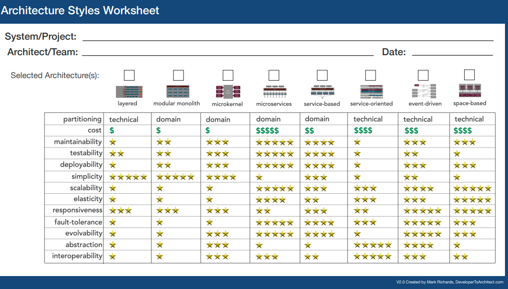

This is a review of Solution Architecture learning resource list provided by Chris A.

# Leadership

- [The 12 Characteristics of a Good Leader](https://www.ccl.org/articles/leading-effectively-articles/characteristics-good-leader/)
- [Drama Triangle Explained: How to REcognize and Excepe It](https://www.attachmentproject.com/psychology/drama-triangle/)
- [Five Steps to Effective Team Decision Making](https://www.cairnleadership.com/five-steps-to-effective-team-decision-making/)
- [How to Communicate Effectively with Both Technical and Non-Technical Stakeholders](https://statics.teams.cdn.office.net/evergreen-assets/safelinks/1/atp-safelinks.html)

# Teams

## Articles

- [Team Topologies](https://teamtopologies.com)
- [5 essential values for the DevOps mindset](https://opensource.com/article/19/5/values-devops-mindset)

## Books

- [Reinventing Organizations](https://www.amazon.com/Reinventing-Organizations-Frederic-Laloux/dp/2960133501)
- [Turn the Ship Around](https://www.amazon.com/Turn-Ship-Around-Turning-Followers/dp/1591846404)
- [The Phoenix Project](https://www.amazon.com/Phoenix-Project-DevOps-Helping-Business/dp/0988262592)

# Design

## Articles, Apps, Worksheets

- [Architectural Katas](https://www.architecturalkatas.com/)
  - Great site to practice architecture and get you thinking about design. Works even better in a
    group or with answers provided by others
- [Developer to Architect](https://developertoarchitect.com/resources.html)

### Review of Some Architecture Styles

- [Architectural Styles Worksheet](/www.developertoarchitect.com/downloads/architecture-styles-worksheet.pdf)

- **Layered Architecture**: A common pattern where the system is divided into layers, each with a
  specific responsibility.
  - AKA 'Tiered Architecture' or 'N-Tier Architecture'
    
- **Modular Monolith**: A single application that is composed of multiple modules, allowing for
  separation of concerns while still being deployed as a single unit.

  - This still makes sense in some cases.

- **Microkernel**: A minimal core system that can be extended with additional components, often used
  in operating systems. 

- **Microservices**: An architectural style that structures an application as a collection of
  loosely coupled services, each responsible for a specific business capability.
  

- **Service-based Architecture (SBA)**: Similar to microservices, but typically involves larger
  services that communicate over a network.
  

- **Service-oriented Architecture (SOA)**: An architectural pattern that allows different services
  to communicate over a network, often using protocols like SOAP or REST.

- **Event-driven Architecture**: A design pattern where the system reacts to events, allowing for
  asynchronous communication and decoupling of components.

- **Space-based Architecture**: A pattern that organizes components based on their spatial
  relationships, often used in distributed systems.

## Books

- [Fundamentals of Software Architecture](https://www.amazon.com/Fundamentals-Software-Architecture-Comprehensive-Characteristics/dp/1492043451)

# Diagramming

- [The C4 Model for visualizing software architecture](https://c4model.com/)

# Code

## Books

- [Clean Code](https://www.amazon.com/Clean-Code-Handbook-Software-Craftsmanship/dp/0132350882)
- [Refactoring](https://www.amazon.com/Refactoring-Ruby-Addison-Wesley-Professional/dp/0321984137)

# Systems

## Books

- [How Linux Works](https://www.amazon.com/Refactoring-Ruby-Addison-Wesley-Professional/dp/0321984137)
- [Site Reliability Engineering](https://www.amazon.com/dp/149192912X)

# Fundamentals

## DNS

- [What is DNS?](https://www.cloudflare.com/learning/dns/what-is-dns/)
  - DNS (Domain Name System) is the phonebook of the internet, translating human-readable domain
    names into IP addresses.
    - DNS resolver - A DNS resolver is a server that receives DNS queries from clients and resolves
      them by querying other DNS servers.

### Process

1. A user types ‘example.com’ into a web browser and the query travels into the Internet and is
   received by a DNS recursive resolver.
1. The resolver then queries a DNS root nameserver (.).
   - 13 identities; about 600 physical servers
1. The root server then responds to the resolver with the address of a Top Level Domain (TLD) DNS
   server (such as .com or .net), which stores the information for its domains. When searching for
   example.com, our request is pointed toward the .com TLD. 1.The resolver then makes a request to
   the .com TLD.
1. The TLD server then responds with the IP address of the domain’s nameserver, example.com.
1. Lastly, the recursive resolver sends a query to the domain’s nameserver.
1. The IP address for example.com is then returned to the resolver from the nameserver.
1. The DNS resolver then responds to the web browser with the IP address of the domain requested
   initially. Once the 8 steps of the DNS lookup have returned the IP address for example.com, the
   browser is able to make the request for the web page:

1. The browser makes a HTTP request to the IP address.
1. The server at that IP returns the webpage to be rendered in the browser (step 10).

- [What happens in a TLS handshake?](https://www.cloudflare.com/learning/ssl/what-happens-in-a-tls-handshake/)
- [Write Your Own Operating System From Scratch](https://www.udemy.com/course/writing-your-own-operating-system-from-scratch/?srsltid=AfmBOop3c6s3I3_T1bp7f9WL_jQGaH4UwBF43j181Z1_A-RmG_l9cP64)
- [Profiling](https://www.jetbrains.com/help/idea/cpu-and-allocation-profiling-basic-concepts.html#)
- [Understanding Packets and packet inspection](https://www.wireshark.org/) - Do not use on a
  government laptop
- [OSI Model](https://en.wikipedia.org/wiki/OSI_model)
