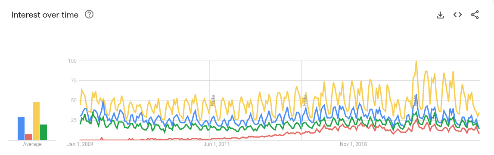

# Overview

## Definition

Classical Machine Learning - A set of techniques, algorithms, and approaches in machine learning
that developed **before the rise of modern deep learning**. These algorithms include decision trees,
support vector machines, and k-nearest neighbors among others.

## Motivation - In the Age of LLMs/DL/NLP? Why Bother?

- Google Trends, Google Scholar all relatively high

- Current LLM processing options of tabular data:

  1. Process directly - very limited to small samples (e.g Bob is how old?)

  - They can read limited tabular data:
    > Why this is limited
    >
    > - LLMs don’t have a built-in concept of “rows and columns.” They tokenize the input as text
    >   and infer structure heuristically.
    >
    > - For large datasets (thousands of rows), this breaks down — context length, token costs, and
    >   reasoning ability limit performance.
    >
    > - Operations like joins, aggregations, or statistical inference are clumsy compared to
    >   specialized tabular ML models.

  2. You can pass results of the some analysis (e.g. pandas summaries) to the model for
     interpretation
  3. The model can create a classical model for you
  4. Some models (TabPFN, TAPAS, or Finetuned LLaMA variants) are trained to understand table
     natively
     - **PFN** - Prior Data-Fitted Network
     - Pretrain on lots of synthentic classification tasks
     - Can classifify in under one second
     - Currently these models only work on smaller datasets with several limitations. Also not clear
       why other AutoML models such as Auto Scikit-Learn arn't a better alternative besides even .

- These models are now easily produced quickly and have some benefits over Deep Learning and other
  advanced models in terms of interpretability

## Purpose and Goals

- 5-8 discussion series
- Review (comprehensive as possible given difficult constraints)
- Deeper dive:
  - Answering important questions from Stackoverflow
  - Information theory/statistical learning emphasis (if possible)
  - New information in an intermediate/advanced level

## Ideas

- Include wikipedia
- Include Stackoverflow
  - need really good statistical improvement questions (how to find these? Maybe a question search
    for each topic?)
- Include Reddit (probably not)
- Include Review of scikit-learn
- Include Review of R (esp CARET models)
- Should there be a deep dive into regression models?
- Need to find the best books

## Source Material

- Wikipedia [Machine Learning Topic](https://en.wikipedia.org/wiki/Machine_learning)
- Books
  - Machine Learning
  - Machine Learning Algorithms in Depth
  - Elements of Statistical Learning
- Courses

## Outline

1. Data Preprocessing
   - Cleaning Data
   - Feature Selection
   - Feature Engineering
2. Supervised Learning - Classification
   - Review of Scikit-learn
   - Review of CARET
   - Review of SAS
3. Supervised Learning - Regression
   - Review of Scikit-learn
   - Review of CARET
   - Review of SAS
4. Unsupervised Learning - Clustering
5. Unsupervised Learning - Dimensionality Reduction

6. Model Evaluation and Selection
7. Advanced Topics
   - Ensemble Methods
   - Feature Engineering

## Skipping

- Saving for MLE discussion:
  - AutoML
    - Auto Scikit-learn
    - TabPFN
      - https://jmlr.org/papers/volume25/22-0493/22-0493.pdf
    - AMLB
      - https://jmlr.org/papers/volume25/22-0493/22-0493.pdf
  - ML Pipelining
- Reinforcement Learning
- Deep Learning?
