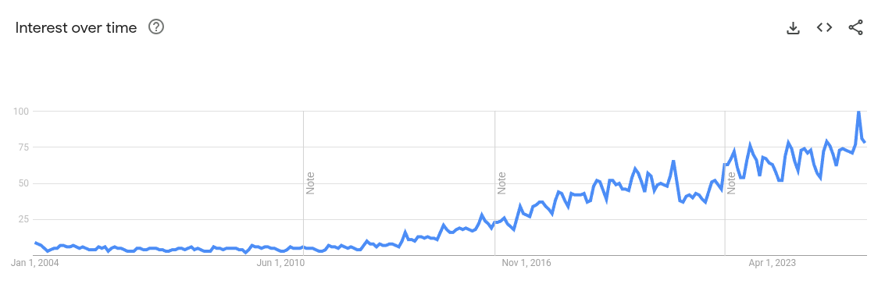
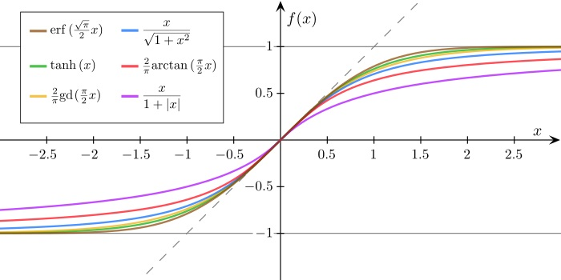
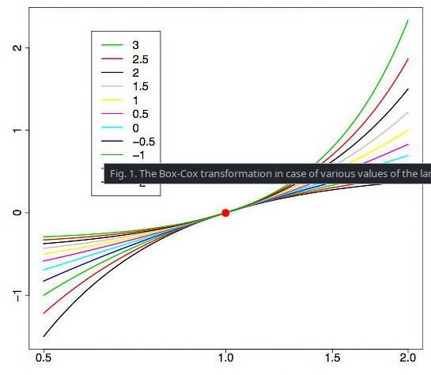
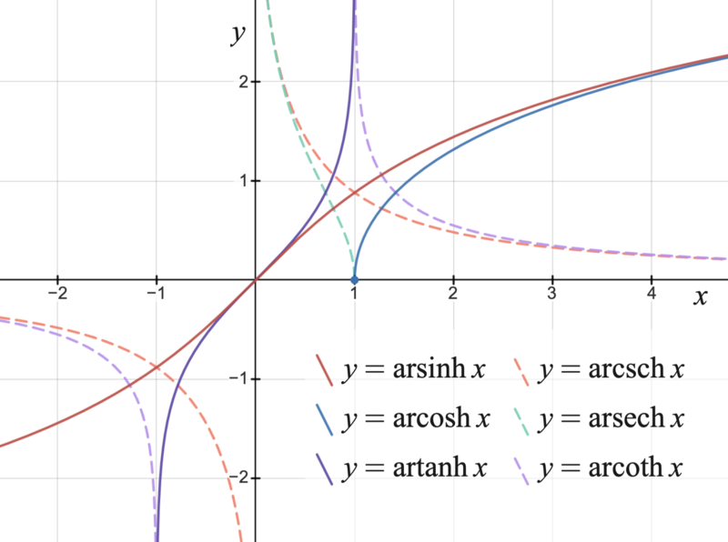
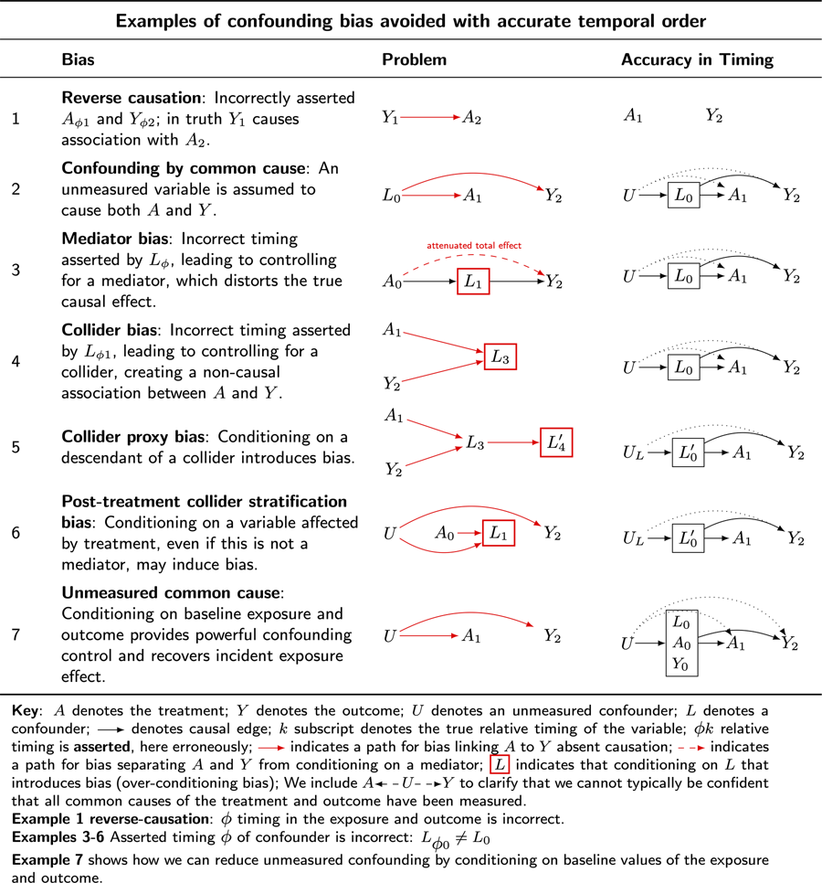
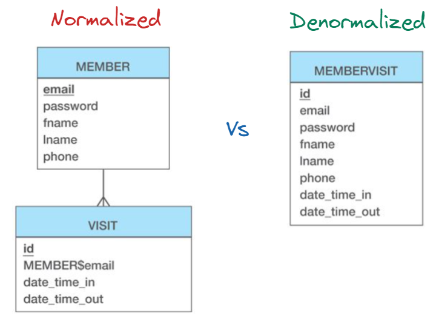

# Data Collection, Preprocessing, and Exploration

## Data Scientists vs Statisticians - Two cultures

The term 'Data Scientist' goes back to 1985 at least. In 2012 Data Science was called the 'The
sexisest Job of the 21st century'

However, models were built prior to 1985/2012. It's important to understand how models are built by
our statistician colleagues for one to have a broader understanding of modeling. This difference was
predicted in in a seminal paper,
["Statistical Modeling: The Two Cultures"](https://projecteuclid.org/journals/statistical-science/volume-16/issue-3/Statistical-Modeling--The-Two-Cultures-with-comments-and-a/10.1214/ss/1009213726.full)
by Leo Breiman. A subsequent discussion online in 2004 around the difference with 'machine learning'
is illuminating:

Simon Blomberg:

> From R's fortunes package: To paraphrase provocatively, 'machine learning is statistics minus any
> checking of models and assumptions'. -- Brian D. Ripley (about the difference between machine
> learning and statistics) useR! 2004, Vienna (May 2004) :-) Season's Greetings! Andrew Gelman: In
> that case, maybe we should get rid of checking of models and assumptions more often. Then maybe
> we'd be able to solve some of the problems that the machine learning people can solve but we
> can't!

The biggest differences are

- PREDICTIONS OVER INFERENCE: Usually care about prediction over inference (i.e. what variable is
  important to the model)
  - Even if a variable is not directly causative, or maybe even spurious, it can still make
    predictions.
- HOLD OUT SET: Because we hold out data this allows us to tune our model and evaluate on data the
  model has never seen.
  - We need this because our models are often higher dimensional
  - We also have much more data

An example of how statisticians build models is the Framingham Heart study

- Did not use hold out sets
  - Only 5000 participants
- Original study did not appear to use logistic regression (discovered in 1940s). Though this was a
  long-running longitudinal study. However, models based on the Framingham study were developed and
  published
- Used Likelihood ratio tests and Wald Tests To check whether each risk factor significantly
  improved the model
- Goodness-of-fit (Hosmer-Lemeshow test) - for medical studies with small samples
- Residual Analysis and Influence Diagnositic

This theme will come up: statisticians test models over a much smaller data to make inferences about
the world (which variable is driving heart disease); data scientists use much more data with very
complex models but relax requirements around inference/causation in favor of predictions and use
holdout sets to avoid overfitting.

Other important differences:

  <!-- prettier-ignore-start -->

| Aspect                  | Statisticians                                                                    | Data Scientists                                                                   |
| ----------------------- | -------------------------------------------------------------------------------- | --------------------------------------------------------------------------------- |
| **Primary Goal**        | Inference: understanding relationships, testing hypotheses, explaining data      | Prediction & optimization: building models that generalize well to unseen data    |
| **Typical Data Size**   | Small to moderate (surveys, experiments, controlled studies)                     | Large-scale (databases, logs, streaming, high-dimensional data)                   |
| **Data Source**         | Designed experiments, randomized trials, carefully collected samples             | Observational data, APIs, user behavior logs, sensors, “found data”               |
| **Validation Approach** | Emphasis on theoretical properties, asymptotics, p-values, confidence intervals  | Emphasis on empirical performance, accuracy, precision, recall, ROC, etc.         |
| **Model Validation**    | Analytical methods (goodness-of-fit tests, residual analysis, likelihood ratios) | Empirical methods (cross-validation, A/B testing, train/validation/test splits)   |
| **Use of Holdout Sets** | Rare with small datasets—relies more on analytical diagnostics and resampling    | Common and essential—holdout sets, cross-validation, bootstrapping                |
| **Tooling & Methods**   | Classical statistical models (linear regression, ANOVA, logistic regression)     | Machine learning algorithms (trees, ensembles, neural networks, deep learning)    |
| **Philosophy**          | Explainability and causal inference                                              | Predictive accuracy and scalability                                               |
| **Common Evaluation**   | P-values, confidence intervals, bias/variance trade-off                          | Metrics like accuracy, RMSE, F1-score, AUC, log-loss                              |
| **Domain**              | Academic research, clinical trials, policy analysis                              | Industry applications: recommender systems, fraud detection, NLP, computer vision |

  <!-- prettier-ignore-end -->

- Applied Example: Linear Regression
  - Both Data Scientist and Statisticians use linear regression
  - see:
    https://stats.stackexchange.com/questions/268755/when-should-linear-regression-be-called-machine-learning
  - However, data scientists will concentrate on the learning and predictions
  - Statisticians will concentrate on inference and testing assumptions of the model.

## Aside: Bayesian vs Frequentist

- **Bayesian Statistics**

  - Incorporates prior beliefs and evidence into the analysis.
  - Uses Bayes' theorem to update the probability of a hypothesis as more evidence becomes
    available.
  - Provides a natural framework for incorporating uncertainty and making probabilistic statements.

- **Frequentist Statistics**
  - Focuses on the long-run behavior of estimators and tests.
  - Does not incorporate prior beliefs; relies solely on the data at hand.
  - Emphasizes concepts like p-values and confidence intervals.

## Aside: Normalize from 0-1:

- Linear Normalization
  - https://stats.stackexchange.com/questions/70801/how-to-normalize-data-to-0-1-range
- Standarization
- Sigmoid Transformation

- Box-Cox Transformation
  - https://en.wikipedia.org/wiki/Box%E2%80%93Cox_transformation

- Inverse Hyperbolic Sine Transformation
  - https://en.wikipedia.org/wiki/Inverse_hyperbolic_sine

- Winsorization
  - Limits extreme values in the data to reduce the effect of outliers
  - Useful when you want to limit the influence of outliers without removing them
  - Process: Set all values above a certain percentile to that percentile value, and all values
    below a certain percentile to that percentile value
  - https://en.wikipedia.org/wiki/Winsorizing

## Reminder of General Machine Learning Development Process

1. Discussion 1
   1. Collect data (APIs, sensors, scraping, surveys).
   2. Prepare/clean input data (normalize, handle missing values).
   3. Feature engineering, Feature selection
1. Discussion 2-4
   1. Explore/analyze data (statistics, visualization, detect anomalies).
   2. Train algorithm on labeled data (for supervised learning).
   3. Test algorithm on held-out data.
1. Discussion 5

MLE - 1. Deploy into production (real-world integration, monitoring).

## Data Collection

### Causative Data = Best Data

Complex systems can have many relations between dependent/target variables and independent/predictor
variables.

- Directly causation
  - Join causation
  - Multicausality
- Indirectly causation
  - Mediated
- Reverse causation
- Spurious causation

### Best Data is causative data

Example 1: Predicting turnover

- Works best when you find data that is as close to the cause of the reasons someone would leave.
  Good place to use common sense for the data you want (or consult with domain experts) and try and
  get that data.
  - Who is their boss?
  - What is their job?
  - What is their pay?
- Less helpful:
  - Which Division the are in
  - Military Service

Example 2: Combatting Fraud

- More Helpful: Audit flags
- Less helpful: Total dollars awarded

### Data Formats

#### Data Types in Machine Learning

##### Structured Data

- **Definition**: Data that is highly organized in a fixed format, fitting neatly into rows and
  columns in relational databases. It is easy to search, sort, and analyze.
- **Examples**: Tabular data (such as CSV), numerical, categorical, and time-series data.

##### Unstructured Data

- **Definition**: Data that lacks a predefined format or schema. It cannot be stored in a
  traditional relational database and requires specialized techniques for processing and analysis.
- **Examples**: Text (emfails, articles), images, audio, and video files.

##### Semi-Structured Data

- **Definition**: Data that has some organizational properties but does not conform to the rigid
  structure of a table. It often contains tags or markers to separate and identify data elements.
- **Examples**: JSON, XML, and YAML.

#### Specialized and Optimized Formats

##### Data Serialization and Model Persistence

- **Serialization**: The process of converting an object, such as a Python object or a machine
  learning model, into a format that can be stored on disk or transmitted across a network.
- **Deserialization**: The reverse process of reconstructing an object from the stored or
  transmitted format.

- Aside: Remember the difference between Normalized and Denormalized?
  

##### Data Formats for DfataFrames

- **Parquet (columnar storage format)**

  - **Characteristics**: Optimized for big data analytics. Stores data in columns rather than rows,
    improving compression and query performance by allowing you to read only the columns you need.

- **Avro (row-based storage format)**

  - **Characteristics**: Includes a rich data schema. Good for data that needs to be serialized and
    evolves over time, handling schema changes gracefully.

- **Feather (fast binary format)**
  - **Characteristics**: Designed for efficient transfer of data frames (e.g., Pandas, R) between
    environments. Not intended for long-term storage.

##### Model Serializatiofn and Transfer

- **ONNX (Open Neural Network Exchange)**

  - **Characteristics**: Open format for ML models. Enables models to be trained in one framework
    (e.g., PyTorch, TensorFlow) and deployed in another, promoting interoperability.

- **joblib**

  - **Characteristics**: Python library optimized for serializing Python objects, especially large
    NumPy arrays. Common for saving/loading scikit-learn models.

- **Pickle and cloudpickle**

  - **Characteristics**:
    - _Pickle_: Standard Python serialization format for arbitrary objects. Can be a security risk
      with untrusted data.
    - _Cloudpickle_: Extefnds Pickle to handle more complex objects (e.g., lambda functions), useful
      in distributed computing.

- **Safetensors**
  - **Characteristics**: Modern, secure format for storing tensors. Avoids security risks of Pickle
    by ensuring safe data loading without arbitrary code execution. Preferred for sharing ML models.

## Preprocessing

### Data Cleaning

- **Handling Missing Data**

  - **Detection techniques**

    - Summary statistics (null counts, % missing)
    - Visualization (heatmaps, bar plots of missingness)
    - Correlation with other variables to detect systematic missingness

  - **Missing Data Mechanisms**

    - **MCAR (Missing Completely At Random)**
      - The probability of missingness is unrelated to _observed or unobserved_ data.
      - Example: A sensor fails randomly, dropping values independent of other variables.
      - **Implication:** Analysis remains unbiased, but sample size is reduced.
      - Acceptable to use listwise/pairwise deletion or simple imputation.
    - **MAR (Missing At Random)**
      - The probability of missingness depends only on _observed_ data, not the missing values
        themselves.
      - Example: Income is more likely to be missing for younger respondents (age is observed).
      - **Implication:** More sophisticated imputation (e.g., regression, MICE, tree-based) can
        recover information without bias.
    - **MNAR (Missing Not At Random)**
      - The probability of missingness depends on the _unobserved_ (missing) data itself.
      - Example: Patients with more severe symptoms are less likely to report their health status.
      - **Implication:** Hardest case — requires domain knowledge, sensitivity analysis, or
        specialized statistical models (selection models, pattern-mixture models).

  - **Deletion methods**

    - **Listwise deletion (complete case analysis)**
      - Removes entire rows if _any_ value is missing.
      - Simple but can drastically reduce sample size.
      - Can introduce bias if missingness is not completely random.
    - **Pairwise deletion (available case analysis)**
      - Instead of discarding an entire row, keeps all non-missing data.
      - Each analysis (e.g., correlation, covariance) is computed using all rows where _both
        variables_ of interest are present.
      - **Advantages:** maximizes data usage and preserves more information than listwise deletion.
      - **Disadvantages:**
        - Different analyses may be based on different subsets of data, making results harder to
          compare.
        - Can produce inconsistent covariance/correlation matrices.
        - Works best when missingness is small and random.

  - **Imputation methods**
    - **Simple imputation**
      - Mean/median/mode imputation
      - Forward/backward fill (time series)
    - **Model-based imputation**
      - **K-nearest neighbors (KNN) imputation**
        - Fills missing values based on similarity to nearest data points.
      - **Regression imputation**
        - Predicts missing values from other features using regression models.
      - **Tree-based imputation**
        - Uses decision trees or ensembles (Random Forests, Gradient Boosted Trees) to predict
          missing values.
        - Handles nonlinearities and mixed data types effectively.
    - **Iterative and advanced methods**
      - **MICE (Multiple Imputation by Chained Equations)**
        - Iteratively models each variable with missing values as a function of others.
        - Produces multiple completed datasets and pools results.
        - Reduces bias and captures uncertainty.
      - **Autoencoder-based imputations**

### Feature Engineering

- Important point: Use domain knowledge to engineer features

- **Feature Creation / Transformation**

  - Polynomial features (e.g., interaction terms, squared values).
  - Logarithmic, exponential, or power transformations.
  - Aggregations (sums, averages, counts).
  - Text transformations (TF-IDF, embeddings, n-grams).
  - Image transformations (edges, histograms of oriented gradients).

- **Encoding Features**

  - One-hot encoding
  - Label/Categorical encoding
  - Ordinal encoding

#### Feature Scaling

- **Standardization and Normalization**

  - **Scaling** adjusts the range of features to a standard scale without distorting differences in
    the ranges of values.
  - **Standardization** transforms features to have a mean of 0 and a standard deviation of 1.
  - **Normalization** typically rescales features to a range of [0, 1] or [-1, 1], often using L1 or
    L2 norms.

- How to transform hour or year variables:
  - Sin/Cos transformations will preserve the cyclical nature of these variables

Let us underline that (assuming $x_{max} > x_{min}$)

$$
\frac{x_i - x_{min}}{x_{max} - x_{min}}
$$

yields results in $[0, 1]$ (and the limits will always be present in the results), while

$$
\frac{x_i - x_{mean}}{x_{max} - x_{min}}
$$

yields results in $(-1, 1)$ (noting that $-1$ and $1$ are unattainable). In contrast

$$
\frac{x_i - \mu}{\sigma}
$$

-- where $\mu$ and $\sigma$ are understood as mean and standard deviation -- produces results with
mean 0 and SD 1 and with some values always outside $[-1, 1]$.

- **Scaling Methods**

  - These methods are generally not used in Tree-based methods

  - Types:
    - **Min-Max Scaling**
      - Formula: $((x-x_{min})/(x_{max}-x_{min}))$
      - Rescales values to a fixed range, typically \([0, 1]\).
      - Sensitive to outliers.
    - **Standardization (Z-score Scaling)**
      - Formula: $((x-\mu)/\sigma)$.
      - Centers data around mean \(0\) with standard deviation \(1\).
      - Preserves outliers but makes features comparable.
    - **Robust Scaling**
      - Uses median and interquartile range (IQR) instead of mean and variance.
      - More robust to outliers than Min-Max or Z-score.
  - When used:
    - SVMs, PCA, deep learning

- **Normalization Methods**

  - Types:
    - Data Scaling normalizes features within [0, 1] or [-1, 1]
    - Norms applied to vectors - **L1 Normalization (Manhattan norm)** - Scales features so the sum
      of absolute values equals 1. - Useful for sparse features (e.g., text word counts). - **L2
      Normalization (Euclidean norm)** - Scales features so the sum - Distance based models (kNN,
      k-Means), bounded activations (sigmoid/tanh NN), images of squares equals 1. - Common in
      models sensitive to vector magnitude (e.g., SVM, k-NN). - **Unit Vector Normalization** -
      Rescales feature vectors to length \(1\). - Often used in text mining and cosine similarity
      tasks.
  - When used:
    - Distance based models (kNN, k-Means), bounded activations (sigmoid/tanh NN), images
    - Text data (TF-IDF, word embeddings)
  - Note: The vector norms are the same norms used in regularization (L1, L2) but apply to the
    feature vectors (rows) rather than model weights (parameters).

- **Feature Extraction Tools**
  - `FeatureTools` (automated feature synthesis).
  - Deep Feature Synthesis (DFS).

<!-- prettier-ignore-begin -->

| Concept                       | What it acts on                | Math definition                                                                                     | Goal / Use case                                                      | Typical models                                                            |     |     |
| ----------------------------- | ------------------------------ | --------------------------------------------------------------------------------------------------- | -------------------------------------------------------------------- | ------------------------------------------------------------------------- | --- | --- |
| **Scaling (Min–Max)**         | **Features (columns)**         | $x' = \frac{x - x_{min}}{x_{max} - x_{min}}$ → \[0,1] (or other range)                              | Make features comparable, especially when bounded range is useful    | kNN, k-Means, Neural Nets (sigmoid/tanh), Image pixels                    |     |     |
| **Standardization (Z-score)** | **Features (columns)**         | $x' = \frac{x - \mu}{\sigma}$ (mean = 0, std = 1)                                                   | Center & equalize variance                                           | Linear regression/logistic regression w/ regularization, SVM, PCA         |     |     |
| **Normalization (L1)**        | **Samples (rows)**             | $\mathbf{x}' = \frac{\mathbf{x}}{\|\mathbf{x}\|_1}, with (\|\mathbf{x}\|\_1 = \sum_i x_i$           | Make each vector’s **sum abs values = 1**                            | Text mining (TF-IDF), sparse data, ML pipelines using Manhattan distances |
| **Normalization (L2)**        | **Samples (rows)**             | $\mathbf{x}' = \frac{\mathbf{x}}{\|\mathbf{x}\|_2}$, with $\|\mathbf{x}\|_2 = \sqrt{\sum_i x_i^2}$  | Make each vector’s **Euclidean norm = 1**; enables cosine similarity | Text embeddings, kNN, SVM (when inputs are document vectors)              |     |     |
| **Normalization (L∞)**        | **Samples (rows)**             | $\mathbf{x}' = \frac{\mathbf{x}}{\|\mathbf{x}\|_\infty}, with (\|\mathbf{x}\|\_\infty = \max_i x_i$ | Scale so max abs feature value = 1                                   | Rare, but sometimes in bounded optimization problems                      |
| **L1 Regularization (Lasso)** | **Model weights (parameters)** | Loss = Error + $\lambda \|\mathbf{w}\|_1$                                                           | Encourages **sparsity** (feature selection)                          | Linear/logistic regression, sparse models                                 |     |     |
| **L2 Regularization (Ridge)** | **Model weights (parameters)** | Loss = Error + $\lambda \|\mathbf{w}\|_2^2$                                                         | Shrinks weights smoothly, avoids large coefficients                  | Linear/logistic regression, SVM, neural nets                              |     |     |
| **Elastic Net**               | **Model weights (parameters)** | Loss = Error + $\lambda_1 \|\mathbf{w}\|_1 + \lambda_2 \|\mathbf{w}\|_2^2$                          | Combines sparsity (L1) + shrinkage (L2)                              | High-dimensional regression, genomics, text models                        |     |     |

<-- - prettier-ignore-end -->

### Feature Selection

- **Definition**

  - The process of identifying and selecting the most relevant features (variables) from a dataset.
  - **Goal:** Improve model performance, reduce overfitting, speed up training, and enhance
    interpretability.
  - Different from feature engineering: feature selection reduces dimensionality, while feature
    engineering creates/augments features.

- Reduces model complexity and training time.
- Mitigates the curse of dimensionality.
- Improves generalization by reducing overfitting.
- Enhances interpretability of models.
- Helps remove irrelevant, redundant, or noisy features.

---

#### Categories of Feature Selection Methods

- **Filter Methods** (model-agnostic, fast, statistical tests)

  - Select features based on statistical properties of data.
  - **Examples:**
    - Correlation analysis (Pearson, Spearman).
    - Chi-squared test.
    - Mutual information.
    - ANOVA F-test.
    - **Relief Algorithm**
      - Assigns weights to features based on how well they distinguish between instances of
        different classes.
      - Considers nearest neighbor instances of the same and different classes.
      - **Pros:** Captures feature interactions and works well with noisy data.
      - **Cons:** Sensitive to irrelevant features, requires good sampling.
  - **Pros:** Simple, scalable.
  - **Cons:** Ignores interactions between features (except Relief family).

- **Wrapper Methods** (model-driven, iterative search)

  - Evaluate subsets of features by training models repeatedly.
  - Note - in classical statistics **Stepwise Regression** is considered a bad practice (see:
    https://www.stata.com/support/faqs/statistics/stepwise-regression-problems/). However, because
    of prediction in machine learning (vs inference in statistics) and cross-validation, it is
    considered more acceptable.

- **Examples:**
  - **Forward Selection**
    - Start with no features.
    - Iteratively add the feature that improves model performance the most until no significant gain
      is achieved.
    - **Pros:** Simple, finds useful small subsets.
    - **Cons:** Computationally expensive as dataset grows.
  - **Backward Elimination**
    - Start with all features.
    - Iteratively remove the least significant feature until performance drops.
    - **Pros:** Useful when many irrelevant features are present.
    - **Cons:** Very expensive for large feature spaces.
  - **Stepwise/Bidirectional Selection** - combination of forward and backward methods allowing
    variables to be removed in each step
  - **Recursive Feature Elimination (RFE)**
    - Trains a model, ranks features by importance, and removes the least important features
      iteratively.
  - **Las Vegas Wrapper (LVW)**
    - Randomized search algorithm for feature selection.
    - Randomly generates candidate feature subsets, evaluates them with a classifier, and retains
      the best subset.
    - **Pros:** Can escape local optima compared to greedy methods like forward/backward selection.
    - **Cons:** Stochastic, results can vary; computationally intensive.
- **Pros:** Considers feature interactions.
- **Cons:** Computationally expensive, prone to overfitting.

- **Embedded Methods** (feature selection during model training)
  - Feature importance is learned as part of training.
  - **Examples:**
    - LASSO (L1 regularization).
    - Ridge regression (L2 regularization, weaker selection effect).
    - Elastic Net (L1 + L2).
    - Tree-based methods (Random Forest, Gradient Boosted Trees, XGBoost feature importance).
  - **Pros:** Balance between accuracy and efficiency.
  - **Cons:** Tied to specific models.

---

#### Advanced / Modern Approaches

- **Stability Selection**

  - Combines subsampling with feature selection methods (e.g., LASSO).
  - Selects features that are consistently Infochosen across subsets.

- **Boruta Algorithm**

  - Wrapper method built around Random Forests.
  - Compares importance of real features to “shadow features” (randomized versions).
  - Retains features that consistently outperform shadow features.
  - **Pros:** Captures nonlinear interactions, robust to noise.
  - **Cons:** Computationally intensive.

- **Regularization-based Deep Learning Approaches** Info

  - Neural network feature pruning.
  - Attention-based feature weighting.

- **Feature Importance from Ensemble Learning**
  - SHAP (SHapley Additive exPlanations).
  - Permutation importance.

---

#### Best Practices & Pitfalls

- **Best Practices**

  - Use cross-validation when evaluating feature subsets.
  - Start with filter methods for large datasets, refine with wrappers/embedded methods.
  - Combine domain knowledge with algorithmic selection.
  - Monitor performance metrics before and after selection.

- **Pitfalls**
  - Removing too many features may underfit.
  - Using all features can overfit.
  - Feature selection can cause data leakage if done before train-test splitting.
  - Different algorithms may rank feature importance differently.

---

#### Tools and Libraries

- Python: `scikit-learn` (RFE, SelectKBest, SelectFromModel, VarianceThreshold).
- Feature importance: `xgboost`, `lightgbm`, `catboost`.
- Interpretability: `shap`, `lime`.
- Boruta: `boruta_py` (Python), `Boruta` (R).
- Relief: Implementations available in `skrebate` (Python).
- LVW: Typically implemented in research/academic codebases (custom).

### Unbalanced Data

- **Resampling Techniques**

  - **Oversampling the minority class**
    - Random oversampling (duplicate minority samples).
    - SMOTE (Synthetic Minority Over-sampling Technique) - generates synthetic samples.
    - ADASYN (Adaptive Synthetic Sampling) - focuses on harder-to-learn examples.
  - **Undersampling the majority class**
    - Random undersampling (remove majority samples).
    - Tomek links (remove overlapping samples).
    - Cluster-based undersampling.
  - **Combination methods**
    - BalanceCascade, SMOTEENN, SMOTETomek.
  - **Metrics for Imbalanced Data**
    - Precision, Recall, F1-score (PPV)
    - ROC-AUC, PR-AUC.
    - Confusion matrix analysis.
  - However there is debate on whether to class-ballance at all:
    - https://stats.sta.ckexchange.com/questions/10289/whats-the-difference-between-normalization-and-standardization
    - The argument: rare classes are a problem because of high variance, but oversampling biases
      thehttps://stats.stackexchange.com/questions/268755/when-should-linear-regression-be-called-machine-learning
      model. It's also a problem if we assess by accuracy but maybe accuracy is a bad metric.

### Data Splitting

- **Train-Test Split**

  - Common practice to split data into training and testing sets.
  - Ensures model is evaluated on unseen data.
  - Typical split: 70-80% training, 20-30% testing. caused by wild over-fitting wher

- **Cross-Validation**

  - More robust than a single train-test split.
  - Data is divided into k subsets (folds).
  - Model is trained on k-1 folds and tested on the remaining fold.
  - Repeated for each fold, results are averaged.
  - Helps mitigate overfitting and provides better estimate of model performance.

- **Stratified Sampling** caused by wild over-fitting wher

  - Ensures that each class is represented proportionally in train/test splits.
  - Important for imbalanced datasets.

- **Time Series Split**

  - Special consideration for time-dependent data.
  - Ensures that training data precedes testing data.
  - Often uses techniques like walk-forward validation. caused by wild over-fitting wher

- The nuance of data splitting:
  - You should normalize/standardize data on the training set and apply those same transformations
    to test set. Do not normalize across all data before splitting this could cause information
    leakage because passing information from test set to training set.
