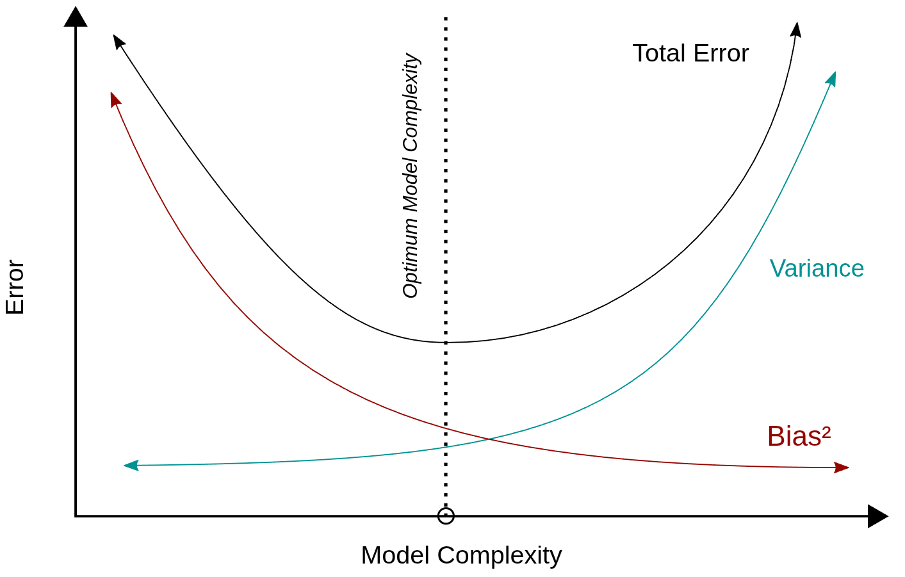
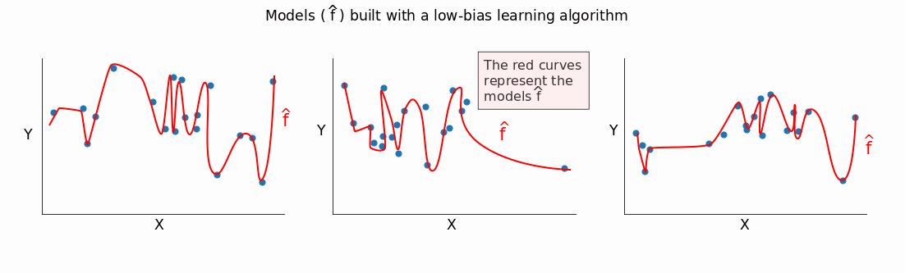
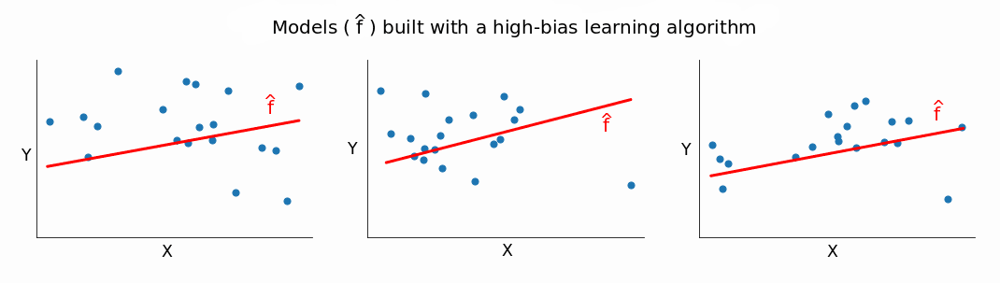
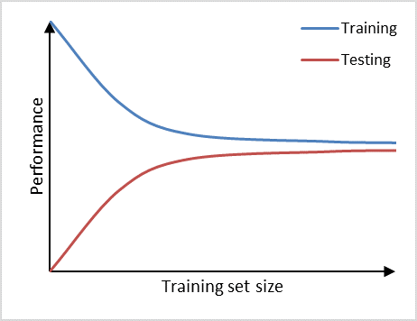
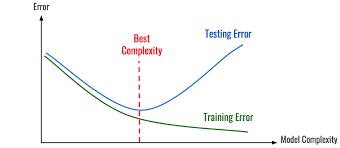
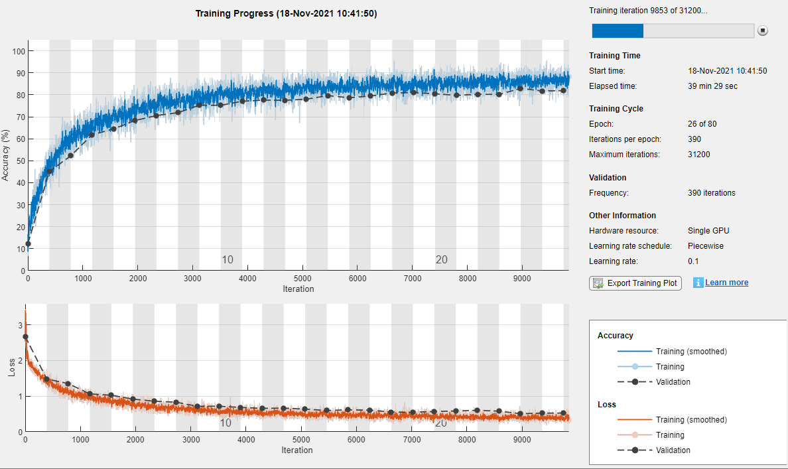
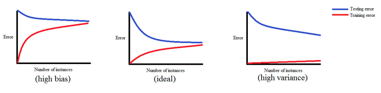

# Supervised Learning - Classification

## Fundamental Concepts

### The Classification Problem

- Binary vs Multi-class vs Multi-label
- Decision boundaries and separability
- Probabilistic vs deterministic predictions
- Class imbalance challenges

### Theoretical Foundations

- Bayes Decision Theory
- Maximum Likelihood Estimation (MLE)
- Maximum A Posteriori (MAP)
- Bias-Variance Tradeoff in classification
  - describes the relationship between model complexity, training error, and generalization error.
    In general, as model complexity increases, training error decreases, but generalization error
    may initially decrease and then increase due to overfitting.







- No Free Lunch Theorem

#### Learning Curves

Learning curves are one of the most powerful diagnostic tools for understanding model performance
and guiding development decisions. They plot model performance (e.g., accuracy, error rate, loss) as
a function of training set size or training iterations.

**Types of Learning Curves:**

1. **Training Size Learning Curves**: Performance vs. number of training examples

<!-- prettier-ignore-start -->
| |
| :-- |
| Training Size Learning Curve - At low training set size training accuracy is high because the model overfits the small dataset, but as training size increases, the model generalizes better. Testing accuracy improves with more data as learning progresses. Note these curves approach the theoretical informational limit of the dataset here, though more complex models may have different performance ceilings. |
<!-- prettier-ignore-end -->

2. **Model Complexity Learning Curves**: Performance vs. model complexity

<!-- prettier-ignore-start -->

|  |
| :-- |
| Model Complexity Learning Curve - As model complexity increases (e.g., deeper trees, more features), training accuracy typically increases while validation accuracy may initially increase and then decrease due to overfitting. Note if data saturated the best complexity is theoretically hitting the informational limit of the data|

<!-- prettier-ignore-end -->

3. **Training Progress Learning Curves**: Performance vs. training iterations/epochs



**How to Create Learning Curves:** y=y_train, train_sizes=np.linspace(0.1, 1.0, 10), # Use 10%

```python
# Scikit-learn example
from sklearn.model_selection import learning_curve
import numpy as np
import matplotlib.pyplot as plt

# Generate learning curve data
train_sizes, train_scores, val_scores = learning_curve(
    estimator=model,
    X=X_train,
    y=y_train,
    train_sizes=np.linspace(0.1, 1.0, 10),  # Use 10%, 20%, ..., 100% of data
    cv=5,  # 5-fold cross-validation
    scoring='accuracy',
    n_jobs=-1
)

# Calculate mean and std
train_mean = np.mean(train_scores, axis=1)
train_std = np.std(train_scores, axis=1)
val_mean = np.mean(val_scores, axis=1)
val_std = np.std(val_scores, axis=1)

# Plot
plt.plot(train_sizes, train_mean, label='Training score')
plt.plot(train_sizes, val_mean, label='Validation score')
plt.fill_between(train_sizes, train_mean - train_std, train_mean + train_std, alpha=0.1)
plt.fill_between(train_sizes, val_mean - val_std, val_mean + val_std, alpha=0.1)
plt.xlabel('Training Set Size')
plt.ylabel('Accuracy')
plt.legend()
```

**What Learning Curves Tell You:** 

**1. High Bias (Underfitting) Detection:**

- **Pattern**: Training and validation scores converge at a LOW value
- **Characteristics**:
  - Small gap between training and validation scores
  - Both curves plateau quickly
  - Adding more data doesn't help much
- **Diagnosis**: Model is too simple to capture the underlying patterns
- **Solutions**:
  - Increase model complexity (deeper trees, more features, polynomial features)
  - Reduce regularization
  - Try more sophisticated algorithms
  - Add feature engineering

**2. High Variance (Overfitting) Detection:**

- **Pattern**: Large gap between training and validation scores
- **Characteristics**:
  - Training score is HIGH
  - Validation score is LOW and much lower than training
  - Gap persists or grows with more data
- **Diagnosis**: Model is memorizing training data rather than learning patterns
- **Solutions**:
  - Increase training data (if gap narrows with more data)
  - Reduce model complexity
  - Increase regularization (L1/L2, dropout)
  - Use ensemble methods (bagging)
  - Feature selection to reduce dimensionality

**3. Data Starvation vs. Data Saturation:**

_Data Starvation:_

- **Pattern**: Validation score continues to improve as training size increases
- **Characteristics**:
  - Curves have not plateaued
  - Upward trend in validation score
  - Gap between training and validation may be narrowing
- **Diagnosis**: Model would benefit from more training data
- **Solutions**:
  - Collect more data
  - Data augmentation techniques
  - Synthetic data generation (e.g., SMOTE for imbalanced classes)
  - Transfer learning (if applicable)

_Data Saturation:_

- **Pattern**: Validation score has plateaued
- **Characteristics**:
  - Flat validation curve despite more data
  - No improvement with additional training examples
- **Diagnosis**: Model has extracted all learnable patterns from current features
- **Solutions**:
  - Adding more data won't help
  - Focus on feature engineering
  - Try different algorithms
  - Ensemble methods
  - Domain expertise to create better features

**4. Optimal Training Set Size:**

- Learning curves help determine if you need all your data or can train on a subset
- If curves plateau early, you can potentially:
  - Speed up training by using subset
  - Reserve more data for validation/testing
  - Use excess data for ensemble diversity

**5. Model Comparison:**

- Compare learning curves across different algorithms
- A model with higher validation score at all training sizes is genuinely better
- A model that reaches good performance with less data is more data-efficient

**6. Expected Performance with More Data:**

- Extrapolate curves to estimate performance with additional data
- Power law relationship often observed: $\text{Error} \propto n^{-\alpha}$
- Helps justify data collection efforts

**Advanced Insights:**

**Learning Curve Patterns:**

| Pattern             | Training Score   | Validation Score | Gap       | Interpretation       | Action               |
| ------------------- | ---------------- | ---------------- | --------- | -------------------- | -------------------- |
| **Ideal**           | High (~95%)      | High (~90%)      | Small     | Good generalization  | Production ready     |
| **High Bias**       | Low (~70%)       | Low (~68%)       | Tiny      | Underfitting         | Increase complexity  |
| **High Variance**   | Very High (~99%) | Low (~75%)       | Large     | Overfitting          | Regularize/more data |
| **Data Starvation** | High             | Rising           | Narrowing | Need more data       | Collect data         |
| **Data Saturation** | High             | Flat             | Stable    | More data won't help | Better features      |

**Statistical Considerations:**

- Use cross-validation to get confidence intervals
- Plot error bars or confidence bands
- Larger variance in validation scores indicates instability
- Consider computational cost vs. number of training size samples

**Computational Tips:**

- Computing learning curves is expensive (training multiple models)
- Use stratified sampling to maintain class distribution
- For large datasets, use representative samples
- Cache results for hyperparameter tuning experiments

**Common Pitfalls:**

1. **Not using cross-validation**: Single train/val split can be misleading
2. **Too few training size points**: Use at least 8-10 points for clear trends
3. **Ignoring confidence intervals**: Single lines can hide instability
4. **Wrong metric**: Use metric aligned with business objective
5. **Data leakage**: Ensure proper preprocessing in cross-validation folds

**Practical Example - Decision Tree:**

```python
# Shallow tree (underfit)
tree_shallow = DecisionTreeClassifier(max_depth=2)
# Learning curve shows: both scores low and converged

# Deep tree (overfit)
tree_deep = DecisionTreeClassifier(max_depth=None)
# Learning curve shows: training score high, validation score low, large gap

# Optimized tree
tree_optimal = DecisionTreeClassifier(max_depth=5, min_samples_leaf=10)
# Learning curve shows: small gap, both scores reasonably high
```

**Integration with Other Diagnostics:**

- **Learning curves** (data quantity): Am I data-starved or saturated?
- **Validation curves** (hyperparameters): What's the optimal regularization?
- **Feature importance**: Which features contribute most?
- **Confusion matrix**: What types of errors am I making?
- **ROC/PR curves**: How does performance vary with threshold?

**Key Takeaways:**

- Learning curves are essential for diagnosing model problems
- They distinguish between needing more data vs. needing better features/models
- Always use cross-validation for robust curve estimation
- The gap between training and validation curves is more informative than absolute values
- Combine with other diagnostics for comprehensive model understanding

## Classical Classification Algorithms

### Algorithm Comparison Table

<!-- prettier-ignore-end -->

| Algorithm                   | Robust to Missing Data       | Parametric/Non-parametric | Multi-class Support | Classification/Regression | Interpretability    | Training Speed   | Prediction Speed | Feature Scaling Required | Handles Non-linear               | Prone to Overfitting          | Handles High-Dimensional Data  | Handles Categorical Features | Memory Usage  | Hyperparameter Sensitivity                    |
| --------------------------- | ---------------------------- | ------------------------- | ------------------- | ------------------------- | ------------------- | ---------------- | ---------------- | ------------------------ | -------------------------------- | ----------------------------- | ------------------------------ | ---------------------------- | ------------- | --------------------------------------------- |
| **Logistic Regression**     | No (requires imputation)     | Parametric                | Yes (multinomial)   | Classification only       | High                | Fast             | Very Fast        | Yes                      | No (without feature engineering) | Low (with regularization)     | Moderate                       | Requires encoding            | Low           | Low                                           |
| **Naive Bayes**             | Moderate (can skip features) | Parametric                | Yes (natural)       | Classification only       | High                | Very Fast        | Very Fast        | No                       | Limited                          | Low                           | Excellent                      | Yes (natural)                | Low           | Low                                           |
| **K-Nearest Neighbors**     | No (requires imputation)     | Non-parametric            | Yes (natural)       | Both                      | Low                 | Very Fast (lazy) | Slow             | Yes (critical)           | Yes                              | High (low k)                  | Poor (curse of dimensionality) | Requires encoding            | High          | Medium (k selection)                          |
| **Decision Trees**          | Yes (native handling)        | Non-parametric            | Yes (natural)       | Both                      | Very High           | Fast             | Very Fast        | No                       | Yes                              | Very High                     | Moderate                       | Yes (native)                 | Moderate      | High (depth, splits)                          |
| **Support Vector Machines** | No (requires imputation)     | Non-parametric\*          | Yes (OvO/OvR)       | Both                      | Low (except linear) | Slow             | Fast             | Yes (critical)           | Yes (with kernels)               | Moderate                      | Excellent                      | Requires encoding            | Moderate-High | Very High (C, kernel, gamma)                  |
| **Random Forests**          | Yes (native handling)        | Non-parametric            | Yes (natural)       | Both                      | Medium              | Moderate         | Fast             | No                       | Yes                              | Low                           | Good                           | Yes (native)                 | High          | Medium                                        |
| **Gradient Boosting**       | Yes (native handling)        | Non-parametric            | Yes (native)        | Both                      | Medium              | Slow             | Fast             | No                       | Yes                              | High (without regularization) | Good                           | Yes (native, CatBoost best)  | Moderate      | Very High (learning rate, depth, etc.)        |
| **Neural Networks (MLP)**   | No (requires imputation)     | Non-parametric            | Yes (softmax)       | Both                      | Very Low            | Very Slow        | Fast             | Yes (critical)           | Yes                              | Very High                     | Excellent                      | Requires encoding            | High          | Very High (architecture, learning rate, etc.) |

<!-- prettier-ignore-end -->

**Notes:**

- \*SVM can be considered parametric with linear kernel, non-parametric with RBF/polynomial kernels
- "Native handling" means the algorithm has built-in mechanisms for missing data
- Training speed assumes medium-sized datasets (~10k-100k samples)
- Interpretability ratings are relative and depend on model complexity
- Feature scaling critical = performance significantly degraded without proper scaling
- Memory usage refers to model storage and training requirements
- Hyperparameter sensitivity = how much performance depends on careful tuning

#### Reminder: Parametric vs Non-parametric Models

This is a fundamental distinction in machine learning that affects model flexibility, assumptions,
and behavior.

**Parametric Models** (Linear Regresison, Logistic Regression, Naive Bayes):

- Have a **fixed number of parameters** determined before seeing the data
- Make **strong assumptions** about the functional form of the data distribution
  - **Linear Regression** assumes additive, homoscedastic error with independent observations.
  - **Logistic Regression** assumes a logistic/sigmoid functional form in the probability
    distribution
  - **Naive Bayes** assumes feature independence given the class label
- Model complexity doesn't grow with dataset size
- Examples:
  - **Logistic Regression**: Has exactly p+1 parameters (p features + intercept), regardless of
    whether you have 100 or 1 million training samples
  - **Naive Bayes**: Number of parameters determined by number of features and classes (e.g., means
    and variances for Gaussian Naive Bayes)
- **Advantages**:
  - Computationally efficient
  - Less prone to overfitting with small datasets
  - Easier to interpret
  - Faster training and prediction
- **Disadvantages**:
  - Limited flexibility
  - May underfit if assumptions don't match data
  - Cannot capture complex patterns beyond assumed form

**Non-parametric Models** (KNN, Decision Trees, SVM with kernels, Random Forests, Gradient Boosting,
Neural Networks):

- Number of parameters **grows with the training data** or model complexity
- Make **fewer assumptions** about the underlying data distribution
- Model complexity can increase with more data
- Examples:
  - **KNN**: Stores all training data points (n samples = effectively n "parameters")
  - **Decision Trees**: Number of splits/nodes grows with data
  - **SVM with RBF kernel**: Number of support vectors increases with data complexity
  - **Random Forests**: Ensemble of non-parametric trees
  - **Neural Networks**: While having fixed architecture, they're considered non-parametric due to
    their flexibility and ability to approximate any function (Universal Approximation Theorem)
- **Advantages**:
  - High flexibility
  - Can capture complex patterns
  - No assumptions about data distribution
  - Performance improves with more data
- **Disadvantages**:
  - Computationally expensive
  - Prone to overfitting
  - Require more data
  - Often less interpretable

**Special Cases:**

_Support Vector Machines (SVMs):_

- **Linear SVM**: Could be considered parametric (fixed weight vector + bias)
- **Kernel SVM**: Non-parametric (number of support vectors grows with data complexity, effectively
  storing portions of training data)
- The distinction depends on the kernel choice

_Neural Networks:_ Neural Networks are a nuanced case:

- Have a **fixed architecture** (fixed number of weights) - which seems parametric
- But classified as **non-parametric** because:
  - Their flexibility allows them to approximate any continuous function (Universal Approximation
    Theorem)
  - The number of parameters needed typically scales with problem complexity
  - Make no assumptions about data distribution
  - In practice, architecture is often adjusted based on data complexity
  - The function space they can represent grows with network capacity

**Key Takeaway**: The parametric/non-parametric distinction isn't always binary. It's better thought
of as a spectrum, with some models having characteristics of both. What matters most is
understanding the assumptions and flexibility of each algorithm for your specific problem.

<div style="background-color: rgb(87, 61, 61);">

<font color="red">**To Remember Forever**</font>

- **Parametric Models** makes **strong assumptions** about the data distribution, have parameter
  values derived from training data and **training data can be disregarded** after training.
- **Non-parametric models** **don't assume specific distributions** and **require training data** to
  make predictions.

</br>
</div>

##### Real-World relevance:

- Mobile app recommendation systems - need a small models, so parametric
- High-frequency trading - need fast predictions, so parametric
- Medical Diagnosis with limited data - data starved so non-parametric (or simple parametric with
  strong regularization). Strong parametric assumptions may be wrong.
- Dynamic Pricing with Concept Drift - non-parametric to adapt to changing patterns

##### Parametric vs Non-Parametric Model Selection Guide

| Your Situation                           | Likely Better Choice                                                  |
| ---------------------------------------- | --------------------------------------------------------------------- |
| Deploying to edge/mobile/embedded        | Parametric                                                            |
| Need sub-second predictions at scale     | Parametric                                                            |
| Very limited training data               | Depends—strong theory → parametric; no theory → simple non-parametric |
| Massive training dataset                 | Parametric (compress into model)                                      |
| Rapidly changing patterns                | Non-parametric or online learning                                     |
| Must explain every decision              | Parametric (usually)                                                  |
| Unknown functional form, sufficient data | Non-parametric                                                        |

### Additional Property Explanations

**Feature Scaling Required:**

- Critical for distance-based (KNN, SVM) and gradient-based (Neural Networks, Logistic Regression)
  algorithms
- Not required for tree-based methods which use splitting rules

**Handles Non-linear:**

- Linear models require manual feature engineering (polynomial features, interactions)
- Tree-based and kernel methods naturally capture non-linearity

**Prone to Overfitting:**

- High-capacity models (deep trees, neural networks, high k in KNN) more susceptible
- Regularization and ensemble methods help mitigate

**Handles High-Dimensional Data:**

- Curse of dimensionality affects distance-based methods (KNN)
- SVM and Naive Bayes excel in high dimensions
- Tree-based methods select features implicitly

**Handles Categorical Features:**

- Native support means no preprocessing needed
- CatBoost specifically designed for categorical data
- Most require one-hot or ordinal encoding

**Memory Usage:**

- KNN stores entire training set
- Ensemble methods store multiple models
- Linear models have minimal memory footprint

**Hyperparameter Sensitivity:**

- Some algorithms (Naive Bayes, Logistic Regression) work well with defaults
- Others (SVM, Gradient Boosting, Neural Networks) require extensive tuning

### 1. Logistic Regression

- Linear decision boundaries
- Sigmoid function and odds ratios
- Maximum likelihood estimation
- Regularization (L1/L2)
- Multinomial logistic regression
- **When to use**: Interpretability needed, linear relationships, baseline model

### 2. Naive Bayes

- Bayes Theorem application
- Independence assumption and its implications
- Gaussian, Multinomial, and Bernoulli variants
- Laplace smoothing
- **When to use**: Text classification, high-dimensional data, fast training needed

### 3. K-Nearest Neighbors (KNN)

- Distance metrics (Euclidean, Manhattan, Minkowski)
- Choosing k: bias-variance considerations
- Curse of dimensionality
- Computational complexity (lazy learning)
- **When to use**: Non-linear boundaries, small datasets, no training time constraints

### 4. Decision Trees

- Information gain and entropy
- Gini impurity
- Tree construction algorithms (ID3, C4.5, CART)
- Pruning strategies (pre-pruning, post-pruning)
- Handling categorical vs continuous features
- **When to use**: Interpretability, mixed data types, non-linear relationships

### 5. Support Vector Machines (SVM)

- Maximum margin principle
- Support vectors concept
- Kernel trick (linear, polynomial, RBF, sigmoid)
- Soft margin and C parameter
- Multi-class strategies (One-vs-One, One-vs-Rest)
- **When to use**: High-dimensional spaces, clear margin of separation, kernel methods needed

### 6. Random Forests

- Bootstrap aggregating (bagging)
- Feature randomness
- Out-of-bag error estimation
- Feature importance measures
- Hyperparameter tuning (n_estimators, max_depth, min_samples_split)
- **When to use**: Robust performance needed, feature importance, reduce overfitting

### 7. Gradient Boosting Machines

- Boosting vs bagging
- Additive modeling
- Loss functions
- Learning rate and regularization
- Popular implementations (XGBoost, LightGBM, CatBoost)
- **When to use**: Maximum performance, structured data, competition-grade results

### 8. Classical Neural Networks

- Perceptron and multi-layer perceptrons (MLPs)
- Activation functions (sigmoid, tanh, ReLU)
- Backpropagation algorithm
- Universal approximation theorem
- Training considerations (learning rate, batch size, epochs)
- Avoiding overfitting (dropout, early stopping)
- **When to use**: Complex non-linear patterns, sufficient data, computational resources available

## Procedure for Algorithm Selection

## How to Improve Models

- Data Improvements
  - More data
  - Better quality data
- Algorithm Selection
- Feature Engineering
- Feature Selection
  - Dimensionality Reduction
- Hyperparameter Tuning
- Better Optimization
- Regularization Techniques
- Ensemble Methods

### Data/Model Compatibility

From learning curves:

- High bias (curves converged, low performance)
  - More complex model
  - Add features
  - Reduce regularization
- High variance (large gap between curves)
  - More data
  - Simpler model
  - Increase regularization
  - Ensemble methods
- Good fit but want better performance
  - More data
  - Better features
  - Different algorithm
  - Hyperparameter tuning

### Pragmatic Algorithm Selection

1. Filter out algorithms that don't fit constraints (speed, interpretability, memory)
2. Start with simple algorithms (Logistic Regression, Naive Bayes) and establish baseline
   performance
3. Try commonly strong algorithms (XGBoost/LightGBM, Random Forest, Neural network)
4. Improve on baseline (tune hyperparameters, feature engineering)

### When to use AutoML

The pragmatic approach is usually sufficient and a good approach, but AutoML can be useful when:

1. Initial Exploration - if you don't know much about the and want to explore the solution space
2. Benchmarking your best model against an AutoML scan.
3. Comparing your model against other models
4. Quick Good-Enough Model - when you need a quick solution and don't have time for manual tuning

### Practical Evaluation

1. Train-validation split
2. Look at final metrics
3. Eyeball the gap:
   - Small gap, low performance → high bias
   - Large gap → high variance
   - Both high → good fit, need more data/features/algorithm

## How to improve Model Performance


### Data-Centric Approaches

- Data cleaning and preprocessing
- Feature engineering and selection
- Handling class imbalance (resampling, synthetic data)
- Data augmentation techniques
- Dimensionality reduction (PCA, t-SNE)
- Outlier detection and treatment
- Feature scaling and normalization
- Dealing with missing data
- Collecting more data
- Domain knowledge integration
- Data labeling quality
- Exploratory Data Analysis (EDA)
- Feature interactions

### Model-Centric Approaches

- Hyperparameter tuning (grid search, random search, Bayesian optimization)
- Regularization techniques (L1, L2, dropout)
- Ensemble methods (bagging, boosting, stacking)
- Model architecture optimization
- Early stopping criteria
- Cross-validation strategies
- Transfer learning (if applicable)
- Model interpretability tools (SHAP, LIME)

### Monitoring and maintenance

- Model performance tracking over time
- Retraining strategies
  - Scheduled retraining
  - Performance-based retraining
  - Data drift detection
- Version control for models and data
- A/B testing for model updates

## Practical Implementation

### Scikit-learn Framework

- Pipeline architecture
- StandardScaler and preprocessing
- GridSearchCV and RandomizedSearchCV
- Cross-validation utilities
- Model persistence (joblib, pickle)

### CARET Framework (R)

- Training control and resampling
- Automatic hyperparameter tuning
- Feature selection integration
- Model comparison utilities

### Common Pitfalls

- Data leakage (temporal, spatial)
- Overfitting indicators
- Class imbalance handling (SMOTE, class weights, threshold tuning)
- Feature scaling importance
- Validation strategy mistakes

## Advanced Topics

### Ensemble Methods Deep Dive

- Stacking and blending
- Voting classifiers (hard vs soft)
- Diversity in ensemble members
- Theoretical foundations (Condorcet's Jury Theorem)

### Calibration

- Platt scaling
- Isotonic regression
- Why calibration matters
- Calibration curves

### Interpretability

- Feature importance methods
- Partial dependence plots
- SHAP values (brief introduction)
- LIME (Local Interpretable Model-agnostic Explanations)
- Decision tree visualization

### Handling Special Cases

- Imbalanced datasets strategies
- Ordinal classification
- Cost-sensitive learning
- One-class classification (anomaly detection)

## Information Theory Perspective

### Entropy and Information Gain

- Shannon entropy in feature selection
- Mutual information
- Kullback-Leibler divergence
- Connection to decision trees

### Model Complexity

- Minimum Description Length (MDL)
- Kolmogorov complexity (conceptual)
- Regularization as information constraint

## StackOverflow Deep Dives

### Selected Advanced Questions

1. "Why does XGBoost perform better than Random Forest on tabular data?"

   - Bias-variance decomposition
   - Sequential vs parallel learning
   - Feature interaction handling

2. "When should I use SVM vs Logistic Regression?"

   - Linear separability assessment
   - Computational considerations
   - Kernel methods advantage

3. "How to properly validate time-series classification?"

   - Temporal leakage prevention
   - Walk-forward validation
   - Time-based splits

4. "Understanding the bias-variance tradeoff in ensemble methods"
   - Bagging reduces varian### More/Better Data

### Better Model
ce
   - Boosting reduces bias
   - Mathematical formulation

## Best Practices and Recommendations

### Model Selection Strategy

1. Start simple (logistic regression, naive Bayes)
2. Establish baseline performance
3. Try tree-based methods (Random Forest, XGBoost)
4. Consider SVM for high-dimensional problems
5. Neural networks when sufficient data available
6. Ensemble for final performance boost

### Computational Considerations

- Training time complexity comparison
- Inference speed requirements
- Memory constraints
- Scalability to large datasets

### Production Deployment

- Model versioning
- Monitoring performance drift
- Retraining strategies
- A/B testing frameworks

## Resources and Further Reading

### Key Papers

- Breiman (2001) - Random Forests
- Friedman (2001) - Greedy Function Approximation (GBM)
- Vapnik (1995) - Support Vector Networks
- Chen & Guestrin (2016) - XGBoost

### Books

- "The Elements of Statistical Learning" - Chapters 4, 9, 10, 15
- "Pattern Recognition and Machine Learning" - Bishop
- "Machine Learning: A Probabilistic Perspective" - Murphy

### Online Resources

- Scikit-learn documentation
- CARET documentation
- CrossValidated (StackExchange)

## Summary and Key Takeaways

- No single best algorithm for all problems
- Understanding assumptions critical for algorithm selection
- Evaluation strategy as important as algorithm choice
- Interpretability vs performance tradeoffs
- Classical methods remain competitive on tabular data
- Ensemble methods often provide best performance
- Proper validation prevents optimistic bias
