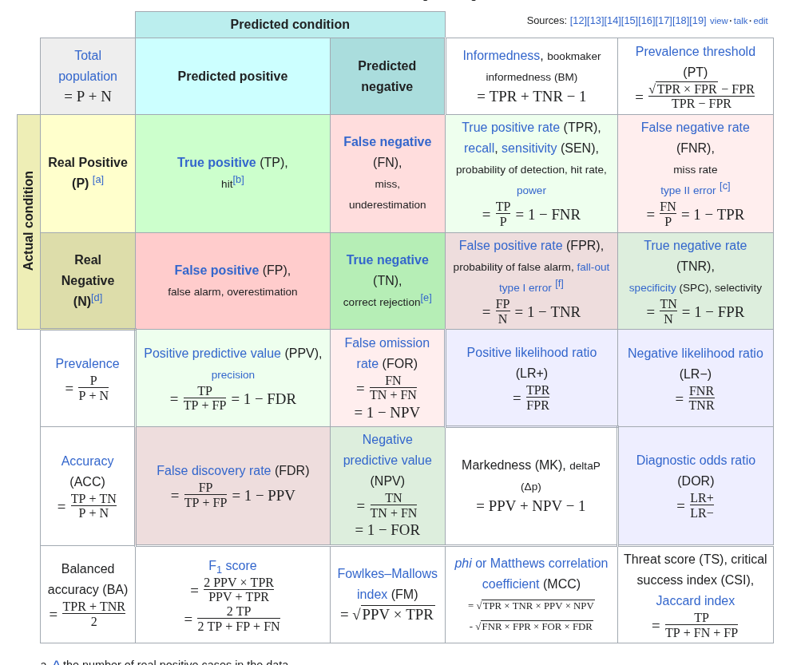
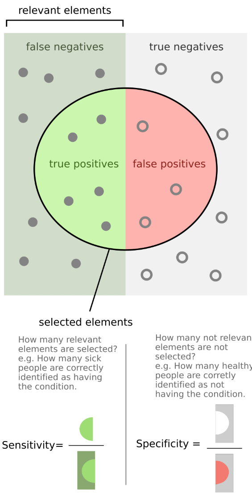
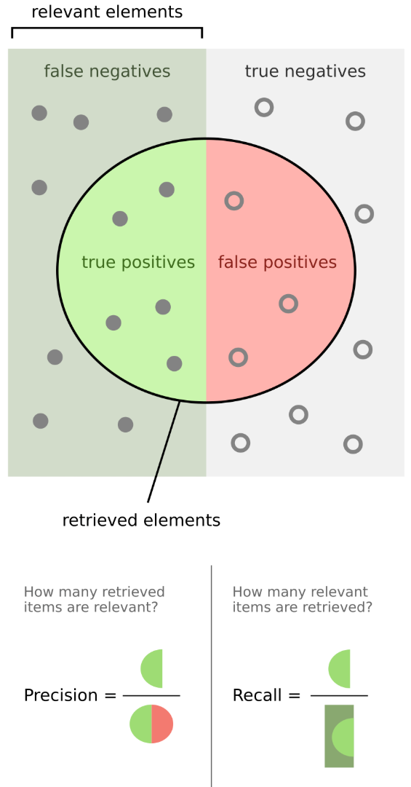
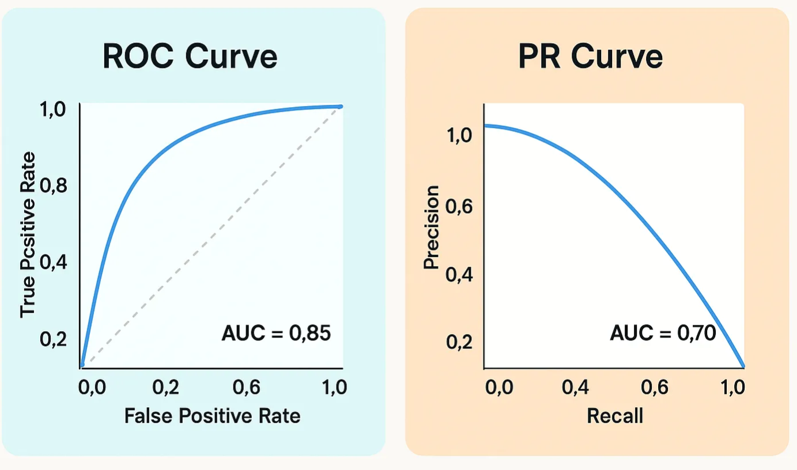

# Model Evaluation

**To Remember Forever**

## Review from last time:

### Data Model Complexity Tradeoff

- Statistical modeling is a balance between the the amount of data and the complexity of the model
  with a performance ceiling dictated by the informational content of the data (are your features as
  close to casual as possible? Is the dataset fully descriptive and representative?)
  - Sometimes your data doesn't have the informational content for the requirement. Sometimes the
    answer is "That's not possible"
  - Learning curves can diagnose if you are data starved for saturated and if the complexity of your
    model matches your data amount and complexity.

### Parametric vs Non-parametric

- 'Parameters' here is not hyperparameters but values you have to find
- Parametric - fixed parameters, strong assumptions about functional form, and data can usually be
  disregarded post training, can run fast and lean
- Non-parametric - flexible often cant disregard data, post training
- The 'throw out training' heuristic works most times (decision trees not obvious), but think:
  flexible = non-parametric; less flexible

### How to improve models

- More data (maybe)
- More complex model (maybe)
  - Feature engineering/selection
  - Hyperprameter tuning

### Pragmatic Algorithm Selection Process

1. Consider if AutoML fits your use case
2. Filter out algorithms that don't fit constraints from theory and requirements (speed,
   interpretability, memory, parametric, non-parametric)
3. Start with simple algorithms (Logistic Regression, Naive Bayes) and establish baseline
   performance
4. Try commonly strong algorithms (XGBoost/LightGBM, Random Forest, Neural network)
5. Improve on baseline (tune hyperparameters, feature engineering) https://z-library.sk/

## Confusion Matrix

**To Remember Forever**

**Key Terminology:**
- **True/False** = whether you got it right
- **Positive/Negative** = what you predicted

**TRICK:** You have to derive REALITY (not right, not predict). What is not described (you have to derive from those two): what is reality: CASE/NON-CASE

**The Four Outcomes:**
- **True Positive (TP)** = Predicted "positive" and got it right -- this is a real CASE
- **False Positive (FP)** = Predicted "positive" but got wrong -- this is a real NON-CASE
- **True Negative (TN)** = Predicted "negative" and got it right -- this is a real NON-CASE
- **False Negative (FN)** = Predicted "negative" and got wrong -- this is a real CASE

**Key Metrics:**

**Accuracy** = Correct/All = (TP + TN) / (TP + FP + TN + FN)

For most of the metrics below, TP is in the numerator:

**Recall** = Reality = True CASES (reality) over all CASES: TP / (TP + FN)

**Precision** = Prediction = True CASES over all Positive: TP / (TP + FP)

**Sensitivity/Specificity** are harder and used more in other fields (But is Miranda's language)

Always: X-opposite → X over P→cases or N→non-cases

- **SeNsitivity** = N opposite is P = TP over cases = TP / (TP + FN)
- **SPecificity** = P opposite is N = TN over non-cases = TN / (TN + FP)

**Therefore:** Recall = Sensitivity

**F1 Score** = Harmonic mean of Recall and Precision: "2 × multiply on top, add on bottom": (2 × Recall × Precision) / (Recall + Precision)

### Understanding the Confusion Matrix

A confusion matrix is a table that visualizes the performance of a classification model by comparing
actual vs. predicted classifications. For binary classification, it has four fundamental components:

**The Four Outcomes:**

- **True Positive (TP)**: The model correctly predicted the positive class. The actual
  classification was positive (1) and the predicted classification was also positive (1). Example:
  Correctly identifying a patient has cancer when they actually do.

- **True Negative (TN)**: The model correctly predicted the negative class. The actual
  classification was negative (0) and the predicted classification was also negative (0). Example:
  Correctly identifying a patient is cancer-free when they actually are.

- **False Positive (FP)**: The model incorrectly predicted positive when it was actually negative
  (Type I error). The actual classification was negative (0) but the predicted classification was
  positive (1). Example: Incorrectly saying a patient has cancer when they don't.

- **False Negative (FN)**: The model incorrectly predicted negative when it was actually positive
  (Type II error). The actual classification was positive (1) but the predicted classification was
  negative (0). Example: Missing a cancer diagnosis - saying a patient is cancer-free when they
  actually have cancer.

**Key Metrics Derived from the Confusion Matrix:**

  
  

- **Accuracy** = $\frac{TP + TN}{TP + TN + FP + FN}$: The proportion of all predictions that were
  correct. Can be misleading with imbalanced datasets.

- **Precision** (Positive Predictive Value) = $\frac{TP}{TP + FP}$: Of all positive predictions, how
  many were actually correct? Answers: "When the model says positive, how often is it right?"

- **Recall, Sensitivity** (Sensitivity, True Positive Rate) = $\frac{TP}{TP + FN}$: Of all actual
  positives, how many did the model correctly identify? Answers: "Of all the actual positive cases,
  how many did we catch?"

- **Specificity** (True Negative Rate) = $\frac{TN}{TN + FP}$: Of all actual negatives, how many did
  the model correctly identify? Answers: "Of all the actual negative cases, how many did we
  correctly identify as negative?"

- **F1-Score** = $\frac{2 \times Precision \times Recall}{Precision + Recall}$: The harmonic mean of
  precision and recall, providing a single metric that balances both concerns.

- **Matthews Correlation Coefficient (MCC)** =
  $\frac{TP \times TN - FP \times FN}{\sqrt{(TP + FP)(TP + FN)(TN + FP)(TN + FN)}}$: A correlation
  coefficient between predicted and actual classifications, ranging from -1 (total disagreement) to
  +1 (perfect prediction). Considered more reliable than accuracy or F1-score for imbalanced
  datasets, as it takes into account all four confusion matrix categories.

**Visual Tip**: All correct predictions appear on the diagonal of the confusion matrix, making it
easy to visually spot errors as off-diagonal values.

### How to Remember

**Confusion Matrix Basics:**

- **True/False tells you if the model was RIGHT or WRONG**
- **Positive/Negative tells you what the MODEL PREDICTED**
- So False Positive = Model predicted positive but was WRONG (it's actually negative)

**The Four Outcomes - Memory Tricks:**

- **False Positive (Type I Error)**: "Crying wolf" - False alarm, unnecessarily worrying a healthy
  patient
- **False Negative (Type II Error)**: "Missing the danger" - Telling a sick patient they're fine

**Recall vs Precision - Use the Word Meanings:**

**THE KEY DISTINCTION - Start with ACTUAL vs PREDICTED:**

- **RECALL starts with ACTUAL/REALITY**: "Out of all the ACTUAL positives in reality, what % did we
  RECALL/catch?"
  - Denominator: All actual positives (TP + FN)
  - Question: "Did we find all the real cases?"
  - Memory trick: **R**ecall = **R**eality first
  - Goal: Completeness (get the complete set of real cases)
  - _Think: A detective trying to RECALL/find ALL the criminals that exist_

- **PRECISION starts with PREDICTIONS**: "Out of all our PREDICTIONS of positive, what % were
  PRECISE/correct?"
  - Denominator: All predicted positives (TP + FP)
  - Question: "When we claimed positive, were we right?"
  - Memory trick: **P**recision = **P**redictions first
  - Goal: Correctness (don't cry wolf)
  - _Think: A sniper who only shoots when PRECISE/certain to hit_

**Sensitivity vs Specificity - Multiple Memory Approaches:**

**Approach 1 - RHYME/SOUND:**

- **"Sen-si-TIV-i-ty finds the POSITIVE-ity"** (both end in similar sounds)
- **"Speci-FIC-ity says NO with FIC-delity"** (fidelity to saying no/negative)

**Approach 2 - ETYMOLOGY (Word Origins):**

- **Sensitive** ← Latin "sentire" = **to SENSE/FEEL**
  - You want to SENSE/FEEL when disease is present → detect positives
  - Like how your skin is sensitive TO touch/stimuli → reacts TO what's there
- **Specific** ← Latin "species" = **particular TYPE/KIND**
  - You're identifying the specific TYPE = the non-diseased/negative kind
  - Being specific = discriminating/selective → ruling OUT disease

**Approach 3 - ANALOGY (Metal Detector at Airport):**

- **Sensitivity** = How well does the detector catch ALL weapons (positives)?
  - High sensitivity → beeps for every weapon (finds all threats)
  - Low sensitivity → misses some weapons (false negatives)
- **Specificity** = How well does it identify innocent people (negatives)?
  - High specificity → only beeps for weapons, not keys/belt buckles
  - Low specificity → beeps for everything (false positives/false alarms)

**Approach 4 - THE SYMMETRY (Both About "True" Rates):**

- Both measure how well you identify TRUE cases
- **Sensitivity = True POSITIVE Rate** (TPR) → actual positives correctly identified
- **Specificity = True NEGATIVE Rate** (TNR) → actual negatives correctly identified
- They're symmetric opposites: one for each class
- **Memory: Sensitivity comes FIRST alphabetically → it's about the FIRST/PRIMARY class (positive)**

**Approach 5 - VISUAL/ALPHABETIC TRICK:**

- **SensiTivity has a T in the middle → T for TRUE POSITIVES (TP)**
- **SpeciFicity has an F in the middle → F for FALSE POSITIVES (what it avoids) / or F for FALSE
  alarms it minimizes**

**Approach 6 - THE DISEASE CONTEXT:**

- **SenSitive = SenSing Sickness** (alliteration with S's) → finding disease/positives
- **sPecific = Proving Clean** (P and C) → identifying clean/negative cases

**The Precision-Recall Tradeoff:**

- You can catch everything (high recall) by predicting positive for everyone, but you'll have
  terrible precision
- You can be very precise by only predicting positive when you're absolutely sure, but you'll have
  terrible recall
- F1-Score balances both

**Quick Denominator Check:**

- **Recall** (and Sensitivity): Denominator is all ACTUAL positives (TP + FN)
- **Precision**: Denominator is all PREDICTED positives (TP + FP)
- **Specificity**: Denominator is all ACTUAL negatives (TN + FP)

## Additional Classification Metrics

Beyond the confusion matrix metrics, these are commonly used for evaluating classifiers:

- **ROC-AUC** (Receiver Operating Characteristic - Area Under Curve): Measures classifier
  performance across all classification thresholds. Plots True Positive Rate vs False Positive Rate.
  AUC ranges from 0 to 1, where 0.5 is random guessing and 1.0 is perfect. Very widely used in
  practice.

- **PR-AUC** (Precision-Recall AUC): Area under the Precision-Recall curve. Often better than
  ROC-AUC for imbalanced datasets because it focuses on the positive class performance.

- **Log Loss** (Cross-Entropy): The actual loss function minimized during training of logistic
  regression and neural networks. Measures the quality of predicted probabilities:
  $-\frac{1}{N}\sum_{i=1}^{N}[y_i \log(\hat{p}_i) + (1-y_i)\log(1-\hat{p}_i)]$. Lower is better.

- **Brier Score**: Measures calibration of predicted probabilities, computed as the mean squared
  difference between predicted probabilities and actual outcomes:
  $\frac{1}{N}\sum_{i=1}^{N}(\hat{p}_i - y_i)^2$. Lower is better (ranges 0 to 1).

- **Cohen's Kappa**: Agreement metric that accounts for agreement occurring by chance. Useful for
  multi-class problems and when you want to measure beyond simple accuracy.

## Regression Metrics

For continuous target variables:

- **MSE** (Mean Squared Error) = $\frac{1}{N}\sum_{i=1}^{N}(y_i - \hat{y}_i)^2$: Average of squared
  errors. Very common. Heavily penalizes large errors. Lower is better.

- **RMSE** (Root Mean Squared Error) = $\sqrt{MSE}$: Square root of MSE, making it the same scale as
  the target variable. More interpretable than MSE. Lower is better.

- **MAE** (Mean Absolute Error) = $\frac{1}{N}\sum_{i=1}^{N}|y_i - \hat{y}_i|$: Average of absolute
  errors. More robust to outliers than MSE. Lower is better.

- **R²** (R-squared) = $1 - \frac{\sum(y_i - \hat{y}_i)^2}{\sum(y_i - \bar{y})^2}$: Proportion of
  variance in the target explained by the model. Ranges from negative infinity to 1, where 1 is
  perfect prediction. Extremely common in practice.

- **Adjusted R²**: R² penalized for the number of features. Prevents overfitting when comparing
  models: $1 - \frac{(1-R^2)(N-1)}{N-p-1}$ where $p$ is the number of predictors.

- **MAPE** (Mean Absolute Percentage Error) =
  $\frac{100\%}{N}\sum_{i=1}^{N}\left|\frac{y_i - \hat{y}_i}{y_i}\right|$: Useful when you care
  about relative error rather than absolute error. Can be undefined if any actual values are zero.

- **Huber Loss**: Combines properties of MSE (for small errors) and MAE (for large errors), making
  it robust to outliers while still differentiable everywhere.

## Model Selection Criteria

Used for comparing models with different complexity:

- **AIC** (Akaike Information Criterion) = $2k - 2\ln(\hat{L})$: Balances model fit (likelihood
  $\hat{L}$) against complexity (number of parameters $k$). Lower is better. Common in statistics.

- **BIC** (Bayesian Information Criterion) = $k\ln(N) - 2\ln(\hat{L})$: Similar to AIC but with
  stronger penalty for complexity. Lower is better.

## Ranking and Recommendation Metrics

For systems that rank or recommend items:

- **NDCG** (Normalized Discounted Cumulative Gain): Standard metric for ranking quality. Measures
  how well the ranking places relevant items at the top, with position-based discounting.

- **MAP** (Mean Average Precision): Common in information retrieval. Averages precision at each
  position where a relevant document is retrieved.

- **MRR** (Mean Reciprocal Rank): Focuses on the position of the first relevant result. Simple and
  interpretable for search applications.

## Clustering Metrics

For unsupervised learning evaluation:

- **Silhouette Score**: Most common clustering metric. Ranges from -1 to 1, measuring how similar
  objects are to their own cluster compared to other clusters. Higher is better.

- **Davies-Bouldin Index**: Ratio of within-cluster to between-cluster distances. Lower is better.

- **Calinski-Harabasz Index**: Variance ratio criterion measuring cluster separation. Higher is
  better.
