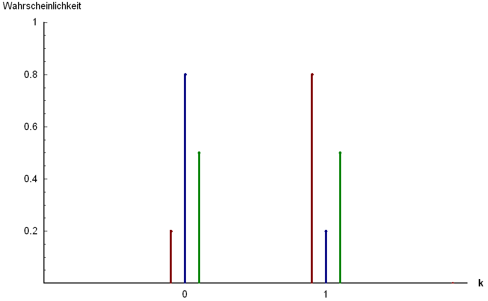
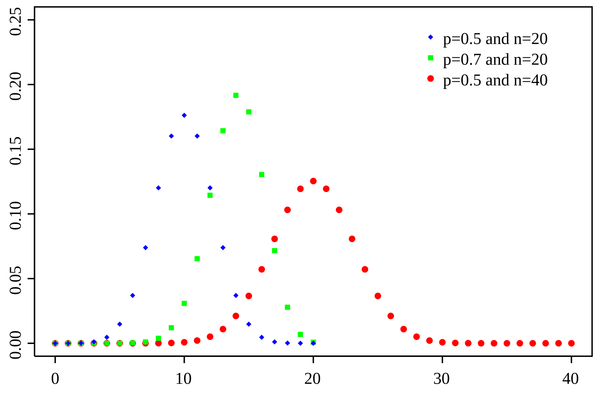

# Error on sample-derived evaluation metric

Problem: hard-to-label dataset, how many do we need to label to get statistical power needed for our
metrics

- Could I have come up with this idea? I did.
- Did I know which method to use? No.
  - Would I have found the answer? Yes probably but would have taken time.

Solution:

- If you want precision (TP/(TP+FP)) then this is a ratio of just the positive samples.
  - Need to get a lot of positive predictions and then label
- Do you label only 10? 100000?
  - The error on our precision comes from a binomial proportion'
    - When you think 'binomial' think 'Bernoulli trials' - (biased) coin flips
      - In our case we sample from our predicted positives and see how many are true positives, not
        unlike flipping a coin and seeing how many heads we get

$$
n \approx \frac{z_{\alpha/2}^{2} \; p (1 - p)}{\varepsilon^{2}}
$$

where:

- $n$ is the required sample size
- $z_{\alpha/2}$ is the z-score corresponding to the desired confidence level
- $p$ is the estimated proportion of successes (e.g., estimated precision)
- $\varepsilon$ is the desired margin of error
