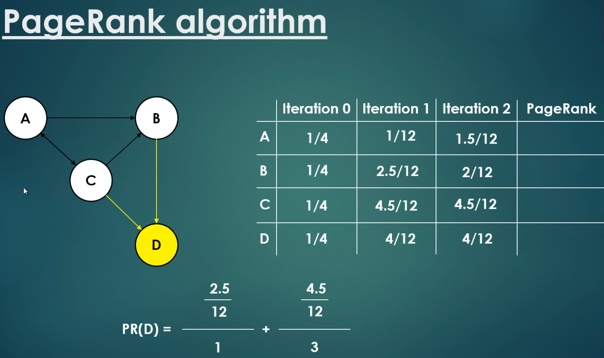
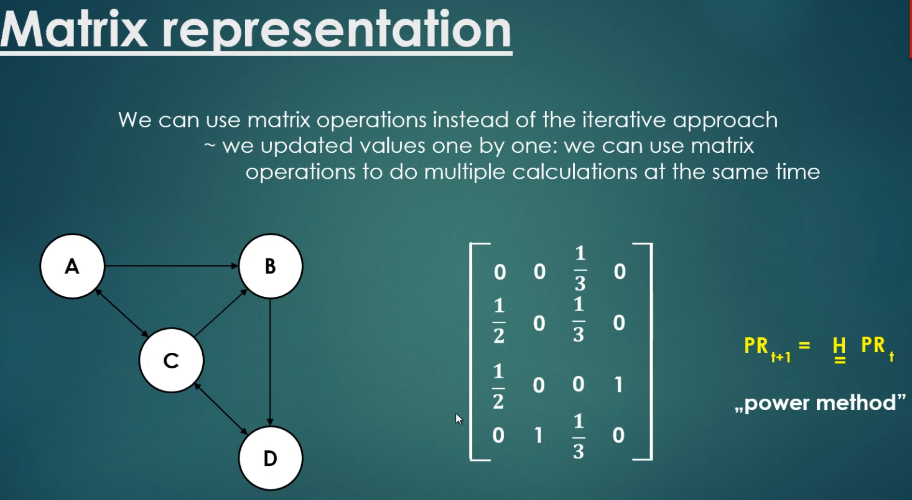
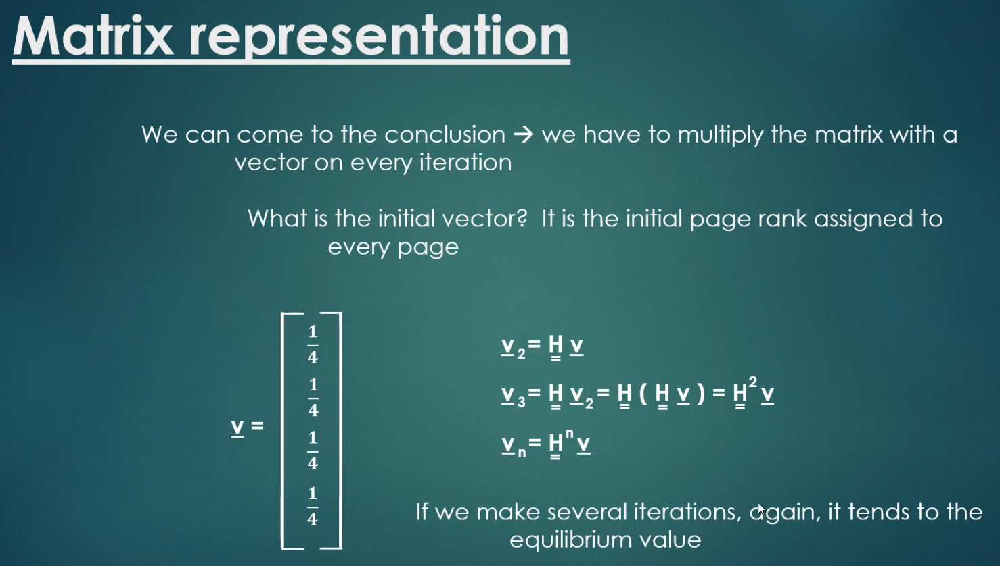
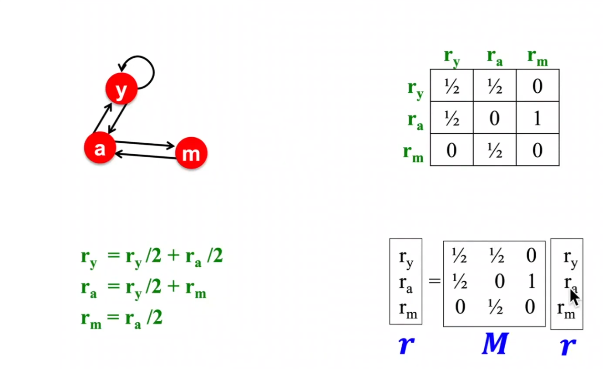

# Personal Pagerank

## Pagerank Recap

- Pagerank models a "random surfer" who randomly clicks links on the web.
  - At any time t, surever is on some page i
  - At time t+1, surfer randomly clicks one of the links on page i to go to page j
  - Ends up on some page j linked from i
  - Process repeats indefinitely
- This 'randomness' is represented by a set probability (damping factor) that the surfer will
  continue clicking links versus jumping to a random page. However the algorithm itself is not
  random, the dampening factor encapsulates the random behavior of a user without any natural
  variation
- The rank of a page is determined by the ranks of the pages linking to it.
- The Pagerank numbers eventaull converge to a steady state distribution of ranks across all pages.
- The basic Pagerank formula is:

$$PR(A) = (1-d) + d \left( \sum_{i=1}^{n} \frac{PR(T_i)}{C(T_i)} \right)$$

where:

- $PR(A)$ is the Pagerank of page A
- $d$ is the damping factor (usually set to 0.85)
- $T_i$ are the pages linking to page A
- $C(T_i)$ is the number of outbound links on page $T_i$

(The following slides were taken from: https://www.youtube.com/watch?v=kSmQbVxqOJc Global Software
Support -Youtube)

The matrix formula for Pagerank is:

$$R = d \cdot M \cdot R + (1-d) \cdot E$$

Where:

- $R$ is the rank vector
- $M$ is the transition matrix
- $E$ is the teleportation vector
- $d$ is the damping factor









The matrix representation shows we only need to repeatedly multiply the transition matrix by the
rank vector until convergence.

## Personal Pagerank

Personal Pagerank modifies the teleportation vector to bias the random jumps towards a specific set
of nodes (pages). This allows the ranking to be personalized based on user preferences or interests.

### Formulations of Personal Pagerank 

In neo4j:
```CALL gds.pageRank.stream('graph', {
  dampingFactor: 0.85,
  personalizationProperty: 'personalization',
  maxIterations: 20,
  tolerance: 0.0001
})YIELD nodeId, score
RETURN gds.util.asNode(nodeId).name AS name, score
ORDER BY score DESC
LIMIT 10;```
https://neo4j.com/docs/graph-data-science/current/algorithms/page-rank/
```

```python
def personalized_pagerank(vertices=None, directed=True, damping=0.85, reset=None, reset_vertices=None, weights=None, arpack_options=None, implementation='prpack', niter=1000, eps=0.001): 
```
https://igraph.org/python/api/0.9.11/igraph._igraph.GraphBase.ahtml#personalized_pagerank