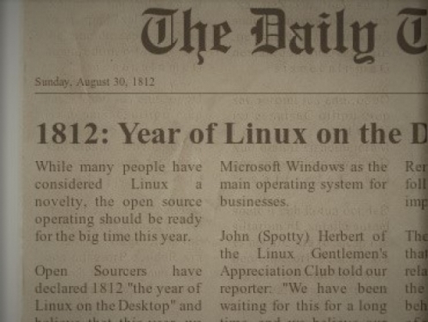

# Linux From Scratch Overview

## Why Learn Linux?

Linux is the backbone of modern computing. It dominates server environments, cloud infrastructure,
and is widely used in data centers around the world.

- Windows dominates in desktop and gaming, WSL helps bridge the gap for developers.
- MacOS is popular in creative industries and among developers.
- Linux dominates the server market, cloud computing, supercomputing.
  - 90% of web servers run on Linux.
  - 100% of the top 500 supercomputers run on Linux.
  - Major cloud providers (AWS, Google Cloud, Azure) primarily use Linux-based systems.
  - Android, the most widely used mobile OS, is based on the Linux kernel.
  - Embedded systems and IoT devices often run on Linux due to its flexibility and open-source
    nature.
  - Gaming in linux is growing with platforms like SteamOS and Proton.

- A perpetual joke is some year being the 'Year of the Linux Desktop', but 2025 is close to being
  the 'Year of the Linux Desktop', reaching close to 5% market share (more than most other years).

Insofar as our work as Data Scientists is done on servers and cloud infrastructure, Linux is the
operating system we will most often encounter.

### Your Carrer

There is an important characteristic I've noticed from the highly technical individuals in that
strong knowledge of Linux is a common trait. It may be this goes along with the tinkerer's mindset
and someone who enjoys solving problems with computers, but knowing Linux (among other skills of
course) will make you stand out as a highly technical individual.

## Purpose

- As an relevant and important skill, we want to review Linux as relevant for Data Scientists with
  some focus on what is relevant to Data Engineers, DevOps Engineers.
- In so far as Linux becomes increasingly relevant for Solution Architecture or being a Tech Lead,
  we want to make sure to master this skill
- There are very few skills that are more broadly relevant that enable someone to independently get
  things done on their own without relying on others.

## Another way to learn

- The best way to learn linux is to use it. The most radical way is to use Linux as your daily
  driver. A second-best way is to have linux as part of your workflow (development platform).
- If you want to go this way you may want to keep Windows/MacOS still available for other tasks and
  there are several ways of doing this:
  - Dual booting
  - Using a Virtual Machine
  - Using Windows Subsystem for Linux (WSL)
  - Use a second computer with Windows/MacOS installed (and switch with KVM)
  - Repurpose an old computer to run Linux to support Docker and VMs (KVM/qemu, Proxmox, etc)

## What should we cover?

- Operating System Theory Relevant to our applications
- All Linux topics relevant to Data Science and related roles operating as a consultant

## Plan

- Using Linux From Scratch as the framing we will take a components-based approach with
  concentration on consultant relevance.
- The components we will concentrate on (not necessarily in this order):
  - Kernel
  - File Permissions (and Filesystem and Storage Stack)
  - Init System and Service Management
  - Logging and Event Management
  - Shell and User Interface Layer
  - Networking Stack
  - Package Management and Software Installation
  - Authentication and User Management
  - Scheduled Tasks and Automation
  - Virtualization and Containerization
- Brief mentions:
  - Display and Graphics Stack
  - Boot loader (GRUB)
  - Hardware and Device Management
