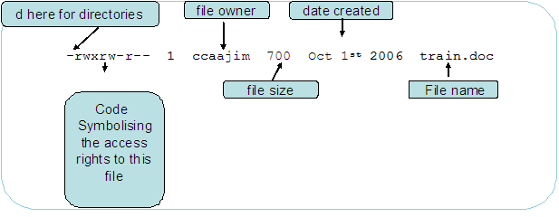

# Most Relevant Concepts

## Kernel

## Filesystems

There are several type of filesystems in Linux, each with its own features and use cases. Some of
the most common filesystems include:

- **ext4**: The fourth extended filesystem, widely used as the default filesystem for many Linux
  distributions. It offers good performance, reliability, and support for large files and volumes.
- **XFS**: A high-performance journaling filesystem designed for scalability and large files.
- **Btrfs**: A modern filesystem that supports advanced features like snapshots, compression, and
  pooling.
- **FAT32/exFAT**: Filesystems commonly used for removable storage devices,
- **NTFS**: A filesystem used by Windows, supported in Linux for read and write operations.
- **swap**: A special filesystem used for virtual memory.
- **proc**: A virtual filesystem that provides information about system processes and kernel
  parameters.
- **sysfs**: A virtual filesystem that exposes information about devices and drivers in the system.
- **tmpfs**: A temporary filesystem that stores files in volatile memory (RAM) for fast access.
- **NFS**: A network filesystem that allows file sharing over a network.
- **CIFS/SMB**: A network filesystem used for sharing files with Windows systems.
- **ZFS**: A robust filesystem with advanced features like data integrity, snapshots, and pooling.

### File links

- **Symbolic links (symlinks)**: Special files that point to another file or directory by its path.
  They can span different filesystems.
  - These will be 95% of your links
  - `ln -s target linkname`
- **Hard links**: Direct pointers to the data on disk. Multiple hard links to the same inode share
  the same data.
  - Like a copy of the file that shares the same data on disk, but not a separate file
  - Cannot span different filesystems
  - Cannot link to directories (with some exceptions for system use)
  - `ln target linkname`
  - Cannot have broken hard links (if the original file is deleted, the hard link still points to
    the data)
  - File contents only deleted when all hard links are removed
  - Usually more confusing therefor less obviously useful

### Permissions

Linux runs off of a permission model that controls access to files and directories. Each file and
directory has three types of permissions (read, write, execute) for three categories of users
(owner, group, others). Permissions can be viewed and modified using commands like `ls -l`, `chmod`,
`chown`, and `chgrp`.

The permissions are octally represented as a three-digit number, where each digit represents the
permissions for owner, group, and others respectively. Each permission type has a corresponding
value:

- Read (r) = 4
- Write (w) = 2
- Execute (x) = 1

For example, a permission of `755` means:

- Owner: 7 (read + write + execute)
- Group: 5 (read + execute)
- Others: 5 (read + execute)

```bash
ls -l filename
rw-r--r--  1 root root    0 Nov 20 02:44 filename
chmod 755 filename
chown user:group filename
chmod a+x filename
chmod g-w filename
chmod o-r filename
groupadd mygroup
useradd -g mygroup myuser
```




#### Sticky Bit

The sticky bit is a special permission that can be set on directories to restrict file deletion.
When the sticky bit is set on a directory, only the file owner, the directory owner, or the root
user can delete or rename files within that directory, regardless of the file permissions. This is
commonly used on directories like `/tmp` to prevent users from deleting or renaming files

```bash
chmod -v a+wt $LFS/sources
```

#### Umask

The default umask value determines the default permissions for newly created files and directories.
It is a three-digit octal number that is subtracted from the maximum possible permissions (777 for
directories and 666 for files) to determine the default permissions. For example, a umask of 022
results in default permissions of 755 for directories and 644 for files.

```bash
umask
touch before
umask 0022
touch after
ls -l before after
```

### Elevated Privileges


Most modern Linux systems use `sudo` to allow users to execute commands with elevated privileges.
The `sudo` command temporarily grants superuser (root) privileges to the user for the duration of
the command.

A related command is the `su` command, which allows a user to switch to another user account,
including the root account. When using `su`, the user must provide the password of the target
account.

```bash
sudo command
su - username
```

### Important directories

- `/etc`: Configuration files for the system and applications.
- `/bin`: Essential command binaries.
- `/sbin`: System binaries.
- `/usr`: User utilities and applications.
- `/var`: Variable data files (logs, databases, etc.).
- `/home`: User home directories.
- `/root`: Home directory for the root user.
- `/tmp`: Temporary files.
- `/dev`: Device files.
- `/proc`: Virtual filesystem for process and kernel information.

### Important files

- `/etc`
  - `/etc/os-release`: Operating system identification.
  - `/etc/cron.d`: Directory for cron jobfiles for projects definitions.
  - `/etc/crontab`: User-specific cron jobs.
  - `/etc/systemd`: Systemd service definitions.
  - `/etc/passwd`: User account information.
  - `/etc/shadow`: Secure user account information (passwords).
  - `/etc/group`: Group account information.
  - `/etc/fstab`: Filesystem mount information.
  - `/etc/hosts`: Static hostname to IP address mappings.
- `/bin`
  - `/bin/bash`: The Bourne Again Shell, a common command-line interpreter.

<!-- prettier-ignore-start -->
| **Shell Type**                          | **How It Starts / Examples**                                                                                                 | **Files Sourced (in order)**                                                                                                                   |
| --------------------------------------- | ---------------------------------------------------------------------------------------------------------------------------- | ---------------------------------------------------------------------------------------------------------------------------------------------- |
| **Login Shell**                         | - SSH session (`ssh user@host`)<br>- TTY login (`Ctrl+Alt+F3`)<br>- `bash --login`<br>- Desktop DM that calls shell as login | 1. `/etc/profile`<br>2. First one that exists:<br> • `~/.bash_profile` **OR**<br> • `~/.bash_login` **OR**<br> • `~/.profile`                  |
| **Interactive Non-Login Shell**         | - Opening a terminal emulator:<br> • gnome-terminal<br> • konsole<br> • kitty<br>- Running `bash` (no `--login`)             | `~/.bashrc`                                                                                                                                    |
| **Non-interactive Shell**               | - Running script: `bash script.sh`<br>- Cron<br>- System scripts                                                             | *(none)* unless `$BASH_ENV` is set                                                                                                             |
| **Non-interactive Shell with BASH_ENV** | - Scripts when:<br> `export BASH_ENV=~/.bashrc`                                                                              | **Whatever file `$BASH_ENV` points to**                                                                                                        |
| **`bash -i`**                           | Explicit interactive mode: `bash -i`                                                                                         | `~/.bashrc`                                                                                                                                    |
| **`bash --norc`**                       | Run bash but *skip* `.bashrc`                                                                                                | *(none)*                                                                                                                                       |
| **`bash --rcfile FILE`**                | Custom rc file for interactive non-login shell                                                                               | `FILE` only                                                                                                                                    |
| **`sh` symlink to bash**                | `/bin/sh` pointing to bash                                                                                                   | Reads **POSIX sh profile rules**, not Bash rules:<br>• `/etc/profile`<br>• `~/.profile`<br>→ **Never reads `.bashrc` unless manually sourced** |

<!-- prettier-ignore-end -->

- `/usr`
  - `/usr/bin`: Standard user command binaries.
  - `/usr/sbin`: Standard system command binaries.
- `/var`
  - `/var/log`: System log files.
- `/proc`
  - `/proc/cpuinfo`: CPU information.
    - `nproc` command shows number of CPU cores
  - `/proc/meminfo`: Memory information.
  - `/proc/uptime`: System uptime.

#### Aside: Sourcing files

Sourcing a file runs the commands in the current shell context, rather than in a subshell. This is
useful for setting environment variables or defining functions that you want to persist in the
current shell session.

```bash
source filename
. filename  # shorthand
```

### $PATH

The `$PATH` environment variable is a colon-separated list of directories that the shell searches

```bash
export
echo $PATH
```

#### Aside: Shell Variables

- `VAR_NAME=value` sets a shell variable
  - only available in the current shell session
  - not available to child processes
- `VAR_NAME=value command` sets a variable for the duration of a single command
  - only available to that command and its child processes
- `export` makes a variable available to child processes
- define in `~/.bashrc` (or `~/.zshrc` etc) to make it permanent for your user
  - in VSCode and many other programs can also use `.env` to define environment variables
  - in juypter notebooks can use `%env VAR_NAME=value` to set environment variables or load with
    `dotenv`

## Essential Linux Packages

These packages are used from the Linux From Scratch book as essential packages to build a functional
Linux system. The ordering below is the build order and the green marks signify the packages need to
create a minimal POSIX-compliant system.

<!-- prettier-ignore-start -->
| Build Order | Package | Category | Essential? | Description |
|-------------|----------|-----------|------------|-------------|
| **1** | **🟩 gzip** | Compression | E | DEFLATE compressor needed for source extraction. |
| **2** | **🟩 bzip2** | Compression | E | Block-sorting compressor for tarballs. |
| **2** | **🟩 xz** | Compression | E | LZMA2 compressor widely used by Linux projects. |
| **2** | iana-etc | Networking | E | Protocol/ports database for networking basics. |
| **3** | **🟩 patch** | Core Userland | E | Applies diff/patch files to source. |
| **4** | **🟩 tar** | Core Userland | E | Standard archive/unarchive tool. |
| **5** | **🟩 sed** | Core Userland | E | Stream editor used by countless build scripts. |
| **6** | **🟩 m4** | Toolchain | E | Macro processor required by autoconf & toolchain. |
| **7** | **🟩 grep** | Core Userland | E | Regex-based file searching. |
| **8** | **🟩 diffutils** | Core Userland | E | File comparison tools. |
| **9** | **🟩 ncurses** | Core Userland | E | Terminal control library used by many programs. |
| **10** | **🟩 binutils (pass 1)** | Toolchain | E | Assembler, linker, and binary utilities. |
| **11** | **🟩 readline** | Core Userland | E | Line-editing library for shells and REPLs. |
| **12** | **🟩 coreutils** | Core Userland | E | Basic utilities (cp, mv, rm, ls, etc.). |
| **13** | **🟩 gmp** | Core Libraries | E | Multi-precision arithmetic (needed by GCC). |
| **14** | **🟩 mpfr** | Core Libraries | E | Multi-precision float math for GCC. |
| **15** | **🟩 mpc** | Core Libraries | E | Multi-precision complex math for GCC. |
| **16** | **🟩 gcc (pass 1)** | Toolchain | E | Bootstrap C compiler. |
| **17** | **🟩 glibc** | Core Libraries | E | The GNU C library (core system ABI). |
| **18** | **🟩 libxcrypt** | Core Libraries | E | crypt(3) implementation used by passwords. |
| **19** | **🟩 gawk** | Languages | E | POSIX awk implementation used widely in builds. |
| **20** | **🟩 make** | Toolchain | E | Standard build automation tool. |
| **21** | **🟩 pkgconf** | Toolchain | E | pkg-config provider for dependency resolution. |
| **22** | **🟩 zlib** | Core Libraries | E | Required compression library for many packages. |
| **23** | **🟩 binutils (final)** | Toolchain | E | Final toolchain assembler/linker. |
| **24** | **🟩 gcc (final)** | Toolchain | E | Final compiler used by userland. |
| **25** | **🟩 bash** | Shell | E | Primary system shell. |
| **26** | man-pages | Documentation | E | Low-level system documentation. |
| **27** | expat | Libraries | NH | XML parser used by some build systems. |
| **28** | kmod | Kernel/Init | E | Kernel module loader. |
| **29** | openssl | Networking | E | TLS/crypto toolkit (often required by wget, git). |
| **30** | gperf | Toolchain | NH | Perfect hash generator. |
| **30** | **🟩 findutils** | Core Userland | E | find/xargs for file searches. |
| **31** | bison | Toolchain | NH | Parser generator. |
| **32** | flex | Toolchain | NH | Lexical analyzer generator. |
| **33** | elfutils | Libraries | NH | ELF manipulation tools. |
| **34** | **🟩 libpipeline** | Core Libraries | E | Pipeline helper used by man-db, others. |
| **34** | attr | Security | NH | Extended attribute utilities. |
| **35** | acl | Security | NH | ACL utilities. |
| **35** | autoconf | Toolchain | NH | Autotools macro generator. |
| **36** | libffi | Libraries | NH | Foreign function interface. |
| **37** | gettext | i18n | NH | Translation infrastructure. |
| **37** | libtool | Toolchain | NH | Portable library build helper. |
| **38** | automake | Toolchain | NH | Makefile.in generator. |
| **39** | gdbm | Libraries | NH | DBM-style key/value store. |
| **40** | bc | Languages | NH | Arbitrary precision calculator. |
| **41** | linux\* | Kernel | E | Linux kernel source. |
| **42** | file | Core Userland | NH | Detects file types by magic. |
| **43** | udev-lfs | Kernel/Init | E | Device manager. |
| **44** | systemd | Kernel/Init | E | Modern init system. |
| **44** | sysvinit | Kernel/Init | E | Traditional init system. |
| **45** | grub | Bootloader | NH | Bootloader. |
| **46** | less | Core Userland | NH | Pager. |
| **47** | lfs-bootscripts | Kernel/Init | E (sysv only) | SysV boot scripts. |
| **48** | python\* | Languages | NH | Python interpreter. |
| **49** | tcl | Languages | NH | Embeddable scripting language. |
| **49** | xml::parser | Developer Utils | NH | Perl XML parser. |
| **50** | flit-core | Python Packaging | NH | Simple Python package builder. |
| **50** | jinja2 | Python Packaging | NH | Templating for Python tools. |
| **50** | markupsafe | Python Packaging | NH | Safe HTML/XML escaping. |
| **50** | packaging\* | Python Packaging | NH | Python packaging helpers. |
| **51** | setuptools\* | Python Packaging | NH | Traditional Python build system. |
| **52** | sysklogd | Kernel/Init | NH | Simple logging daemon. |
| **52** | intltool | i18n | NH | Translation utilities. |
| **53** | wheel\* | Python Packaging | NH | Python wheel builder. |
| **54** | ninja | Toolchain | NH | Fast build executor. |
| **55** | meson | Toolchain | NH | Modern build frontend. |
| **55** | shadow | Security | E | User/passwd account tools. |
| **56** | **🟩 util-linux** | Core Userland | E | `mount`, `fdisk`, `agetty`, essential utilities. |
| **57** | procps | Core Userland | NH | ps/top/etc process utilities. |
| **58** | psmisc | Core Userland | NH | killall, fuser, misc tools. |
| **59** | e2fsprogs | Core Userland | E | ext2/3/4 filesystem tools. |
| **60** | kbd | Core Userland | NH | Keymap utilities. |
| **61** | vim | Editor | NH | Text editor. |
| **62** | time-zone-data | Core Userland | E | Time zone database. |
| **63** | inetutils | Networking | NH | ftp, telnet, hostname, etc. |
| **64** | iproute2 | Networking | NH | “ip” command for networking. |
| **65** | lz4 | Compression | NH | Very fast compressor. |
| **66** | zstd | Compression | NH | Modern fast high-ratio compression. |
| **67** | texinfo | Documentation | NH | GNU documentation system. |
| **68** | man-db | Documentation | NH | Man page viewer. |
| **69** | groff | Documentation | NH | Typesetting for manpages. |
| **70** | dejagnu | Developer Utils | NH | Test framework for toolchains. |
| **71** | expect | Developer Utils | NH | Automates terminal programs. |

### Installing packages on Linux Machines
- Compiling from source
  - Rarely used these days because of package managers
  - Sometimes used for small projects
  - Command sequence usually:
    ```bash
    ./configure
    make
    sudo make install
    ```
- Package managers
  - `apt` (Debian/Ubuntu)
    - `apt-get` (older Debian/Ubuntu)
    - `dpkg` (low-level Debian package tool)
  - `yum` / `dnf` (Fedora/CentOS)
  - `pacman` (Arch Linux)
  - `zypper` (openSUSE)
  - `emerge` (Gentoo)
  
| Task | APT (Debian/Ubuntu) | YUM (RHEL/CentOS 6/7) | DNF (Fedora / RHEL 8+) | Pacman (Arch) | Zypper (openSUSE) | emerge (Gentoo) |
|------|----------------------|------------------------|-------------------------|----------------|--------------------|------------------|
| **Update repo metadata** | `sudo apt update` | `sudo yum check-update` | `sudo dnf check-update` | `sudo pacman -Sy` | `sudo zypper refresh` | *(Portage auto-syncs)* `sudo emerge --sync` |
| **Upgrade installed packages** | `sudo apt upgrade` | `sudo yum update` | `sudo dnf upgrade` | `sudo pacman -Su` | `sudo zypper update` | `sudo emerge -uDU @world` |
| **Full system upgrade** | `sudo apt full-upgrade` | `sudo yum update` | `sudo dnf upgrade` | `sudo pacman -Syu` | `sudo zypper dup` | `sudo emerge -uDN @world` |
| **Install package** | `sudo apt install <pkg>` | `sudo yum install <pkg>` | `sudo dnf install <pkg>` | `sudo pacman -S <pkg>` | `sudo zypper install <pkg>` | `sudo emerge <pkg>` |
| **Remove package** | `sudo apt remove <pkg>` | `sudo yum remove <pkg>` | `sudo dnf remove <pkg>` | `sudo pacman -R <pkg>` | `sudo zypper remove <pkg>` | `sudo emerge -C <pkg>` |
| **Remove + dependencies** | `sudo apt autoremove` | *(auto)* | *(auto)* | `sudo pacman -Rs <pkg>` | `sudo zypper remove --clean-deps <pkg>` | `sudo emerge --depclean` |
| **Remove + config files** | `sudo apt purge <pkg>` | *(no direct purge)* | *(no direct purge)* | `sudo pacman -Rns <pkg>` | *(configs kept unless rm'd)* | `sudo emerge -C <pkg>` + manual config cleanup |
| **Check if installed** | `apt list --installed <pkg>` | `yum list installed <pkg>` | `dnf list installed <pkg>` | `pacman -Q <pkg>` | `zypper se -i <pkg>` | `equery list <pkg>` |
| **Search for package** | `apt search <term>` | `yum search <term>` | `dnf search <term>` | `pacman -Ss <term>` | `zypper search <term>` | `emerge -s <term>` |
| **Find package providing a file** | `apt-file search <file>` *(requires apt-file)* | `yum provides <file>` | `dnf provides <file>` | `pacman -F <file>` *(requires `-Fy` first)* | `zypper what-provides <file>` | `equery belongs <file>` |
| **List files in package** | `dpkg -L <pkg>` | `rpm -ql <pkg>` | `rpm -ql <pkg>` | `pacman -Ql <pkg>` | `rpm -ql <pkg>` | `equery files <pkg>` |
| **Show package info** | `apt show <pkg>` | `yum info <pkg>` | `dnf info <pkg>` | `pacman -Qi <pkg>` | `zypper info <pkg>` | `equery meta <pkg>` |
| **Clean cache** | `sudo apt clean` | `sudo yum clean all` | `sudo dnf clean all` | `sudo pacman -Sc` or `-Scc` | `sudo zypper clean` | `sudo eclean packages` |


- Universal package formats
  - `snap`
  - `flatpak`
  - `AppImage`

<!-- prettier-ignore-end -->

## Init System and Service Management

## Logging and Event Management

## Shell and User Interface Layer

## Networking Stack

## Package Management and Software Installation

## Authentication and User Management

## Scheduled Tasks and Automation

## Virtualization and Containerization

# Brief mentions:

## Display and Graphics Stack

## Boot loader (GRUB)

## Hardware and Device Management
