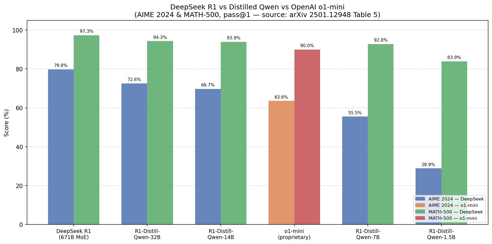
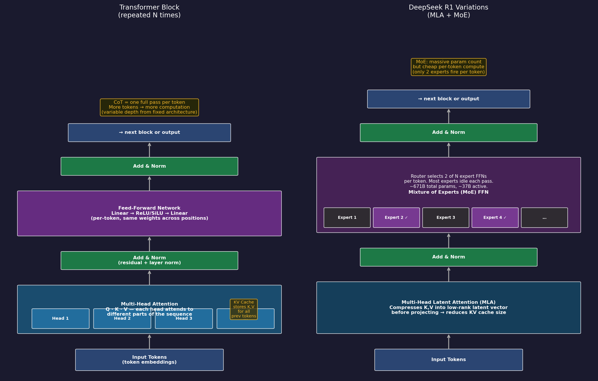
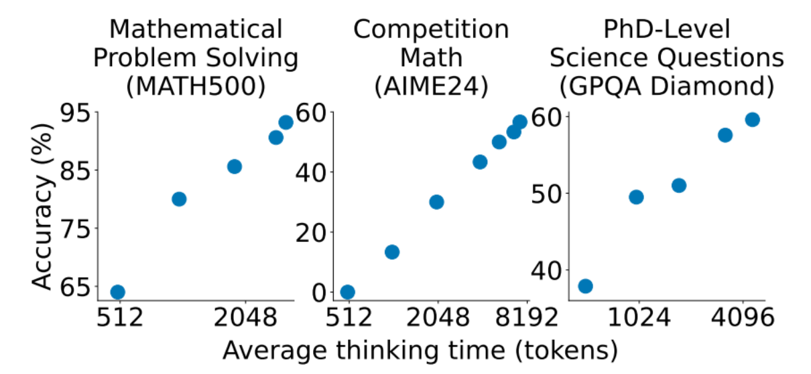

# LLM Engineering: Core Track Foundations

**Udemy Course — 8 Weeks, 5 Days Each. Instructor: Ed Donner (co-founder/CTO of
Nebula; ex-JP Morgan MD).**

Source: `~/Downloads/udemy_transcript_6100015.txt`

> Notes are grounded in the actual lecture transcript. Diagrams marked
> **AI-generated** were produced/researched by AI to illustrate concepts and
> should be verified against primary sources before citing.

---

## Table of Contents

- [Week 1: Build Your First LLM Product — Exploring Top Models](#week-1-build-your-first-llm-product--exploring-top-models)
- [Week 2: Build a Multi-Modal Chatbot — LLMs, Gradio UI, and Agents](#week-2-build-a-multi-modal-chatbot--llms-gradio-ui-and-agents)
- [Week 3: Open-Source Gen AI — Automated Solutions with HuggingFace](#week-3-open-source-gen-ai--automated-solutions-with-huggingface)
- [Week 4: Selecting the Right LLM & Code Generation](#week-4-selecting-the-right-llm--code-generation)
- [Week 5: Retrieval-Augmented Generation (RAG)](#week-5-retrieval-augmented-generation-rag)
- [Week 6: Fine-Tuning a Frontier Model + Data Curation (The Price Is Right)](#week-6-fine-tuning-a-frontier-model--data-curation-the-price-is-right)
- [Week 7: Fine-Tuning an Open-Source Model with QLoRA](#week-7-fine-tuning-an-open-source-model-with-qlora)
- [Week 8: Autonomous Agentic AI](#week-8-autonomous-agentic-ai)

---

## Week 1: Build Your First LLM Product — Exploring Top Models

### Day 1: Running Your First LLM Locally with Ollama + Environment Setup

Ed opens with action, not theory — the "instant gratification" section of the
course repo.

- **Ollama** — a product that runs open-source models locally on your machine
  (Mac/PC/Linux), packaged as efficient C++ with weights compressed into a GGUF
  file. Named as homage to Meta's Llama. `ollama run <model>` downloads and runs
  a model; `ollama serve` starts the local server (an "address already in use"
  error just means it's already running).
- Models tried locally: **Gemma 3 270M** (Google's tiny open model — 270 million
  parameters), **Phi-3** (Microsoft), and **GPT-OSS 20B** (OpenAI's open-source
  model). Demo: using a local model as a Spanish tutor — real value from a model
  running entirely on your own computer.
- **The 8-week roadmap**: (1) foundations + Chat Completions API, (2) frontier
  models + multimodal, (3) open-source via HuggingFace, (4) selecting the right
  model + code generation, (5) RAG, (6) fine-tune a frontier model + data
  curation, (7) fine-tune an open-source model (the "shocking week"), (8)
  agentic AI.

**Environment setup (rest of Day 1):** clone the course repo, install **Cursor**
(AI-enabled IDE), install **UV** (fast Python package/environment manager),
configure a `.env` file with API keys, select the `.venv` kernel in a Jupyter
notebook.

**First OpenAI call + core concepts:**

- **System prompt vs. user prompt**: <mark class="yellow-highlight"> the system
  prompt sets overall context/role for the whole conversation; the user prompt
  is the specific message. </mark>
- First gen-AI use case built Day 1: a **website summarizer** — scrape a page
  with BeautifulSoup, send the text to OpenAI, get back a markdown summary.

---

### Day 2: LLM Building Blocks, Frontier vs. Open-Source Models, Chat Completions API

**The three dimensions of LLM engineering** (the layers the course builds on):

1. **Models** — open/closed source, multimodal, architecture, model selection.
2. **Tools/frameworks/libraries** — HuggingFace, LangChain, Gradio, Weights &
   Biases, Modal.
3. **Techniques** — calling APIs, multi-shot prompting, fine-tuning, agentic AI.

**Frontier models (closed-source)** — also called foundation models. Built by
"frontier labs" that spent hundreds of millions training them, so you pay to use
them:

- **GPT** — OpenAI (most famous lab/model; GPT-5 is the current flagship)
- **Claude** — Anthropic (founded by ex-OpenAI people; haiku/sonnet/opus sizes;
  Claude is Ed's favorite; powers Claude Code)
- **Gemini** — Google (came from behind, now caught up)
- **Grok** — x.ai / Elon Musk (the "big four" is GPT, Claude, Gemini, Grok)

**Open-source (open-weight) models:**

- **Llama** — Meta (first to open-source seriously; Llama 3.2 in 1B/3B sizes
  runs locally; Llama 4 is bigger)
- **Mixtral / Mistral** — French; a **mixture-of-experts** model (many smaller
  specialist sub-models, traffic routed by question type)
- **Qwen** — Alibaba Cloud (powerful, underrated)
- **Gemma** — Google (open cousin of Gemini; the 270M is a true SLM)
- **Phi** — Microsoft (good at tool calling)
- **DeepSeek** — DeepSeek AI (671B main model; trained at a fraction of frontier
  cost — ~$4M vs. OpenAI's $100M+ — which is what caused the stir)
- **GPT-OSS** — OpenAI's open-source GPT (20B and 120B; possibly released in
  response to DeepSeek)

> **Open weights vs. open source**: "open weight" means the weights are public
> but the training data/methodology may not be. Most "open-source" LLMs are
> technically open-weight.

```python
from openai import OpenAI

client = OpenAI()  # reads OPENAI_API_KEY from environment

response = client.chat.completions.create(
    model="gpt-4o-mini",
    messages=[{"role": "user", "content": "Say hello."}],
)
print(response.choices[0].message.content)
```

```python
from openai import OpenAI

client = OpenAI()

response = client.chat.completions.create(
    model="gpt-4o-mini",
    messages=[
        {"role": "system", "content": "You are a helpful assistant."},
        {"role": "user", "content": "Say hello."},
    ],
)
print(response.choices[0].message.content)
```

#### `OpenAI()` supports other models:

Gemini (via Google's OpenAI-compatible endpoint):

```python
from openai import OpenAI

client = OpenAI(
    api_key="YOUR_GEMINI_API_KEY",
    base_url="https://generativelanguage.googleapis.com/v1beta/openai/",
)

response = client.chat.completions.create(
    model="gemini-2.0-flash",
    messages=[{"role": "user", "content": "Say hello."}],
)
print(response.choices[0].message.content)
```

Ollama (local, no API key needed — run `ollama serve` first):

```python
from openai import OpenAI

client = OpenAI(
    api_key="ollama",
    base_url="http://localhost:11434/v1",
)

response = client.chat.completions.create(
    model="llama3.2",
    messages=[{"role": "user", "content": "Say hello."}],
)
print(response.choices[0].message.content)
```

DeepSeek R1 via Ollama (`ollama pull deepseek-r1:1.5b`):

```python
from openai import OpenAI

client = OpenAI(
    api_key="ollama",
    base_url="http://localhost:11434/v1",
)

response = client.chat.completions.create(
    model="deepseek-r1:1.5b",
    messages=[{"role": "user", "content": "Say hello."}],
)
print(response.choices[0].message.content)
```

**Three ways to use models:**

1. **Packaged products** with a UI (ChatGPT, claude.ai) — a product built _on
   top of_ a model by AI engineers, with extras like memory and web search.
2. **Cloud APIs** — call models in the cloud directly (OpenAI), via frameworks,
   or via managed services (AWS Bedrock, Google Vertex, Azure ML), plus
   platforms like Groq (fast inference) and OpenRouter (routes to many
   providers).
3. **Direct inference** — run open-source models yourself, via **HuggingFace
   Transformers** (run the actual Python/C++ model code + weights) or **Ollama**
   (packaged, optimized, local API).

### Distillation

> ⚠️ **AI-generated** — chart and table below were researched/generated by AI to
> illustrate the distillation point.



| Model                | Params          | AIME 2024 | MATH-500  |
| -------------------- | --------------- | --------- | --------- |
| DeepSeek R1          | 671B (MoE)      | 79.8%     | 97.3%     |
| R1-Distill-Qwen-32B  | 32B             | 72.6%     | 94.3%     |
| R1-Distill-Qwen-14B  | 14B             | 69.7%     | 93.9%     |
| **OpenAI o1-mini**   | **proprietary** | **63.6%** | **90.0%** |
| R1-Distill-Qwen-7B   | 7B              | 55.5%     | 92.8%     |
| R1-Distill-Qwen-1.5B | 1.5B            | 28.9%     | 83.9%     |

Source: [arXiv 2501.12948](https://arxiv.org/pdf/2501.12948) Table 5.

- **Distillation**: DeepSeek's small variants (e.g. `deepseek-r1:1.5b`) are
  _not_ DeepSeek architecture — they are **Llama/Qwen base models trained
  further on synthetic data generated by big DeepSeek**. The big "teacher" model
  generates reasoning data; the small "student" learns to imitate it. (Ed:
  "there are various ways of doing distillation; that's one of them.")



- **RLHF (Reinforcement Learning from Human Feedback)**: The standard alignment
  pipeline used by GPT/Claude. Steps: (1) pretrain a base model; (2) SFT on
  human-written demonstrations; (3) collect human preference data — humans rank
  pairs of model outputs; (4) train a _reward model_ on those rankings; (5) run
  RL (typically PPO) to optimize the policy against the learned reward model.
  The reward model is a proxy for human judgment — expensive to build and can be
  gamed by the policy.
  - **PPO (Proximal Policy Optimization)**: The RL algorithm used inside RLHF.
    The "policy" is the LLM (maps prompt → token probabilities). PPO updates the
    policy to maximize reward model scores while staying close to the previous
    policy version — the "proximal" part. It clips the update size to prevent
    the model from changing too drastically in one step (which causes
    instability or reward hacking). Requires a separate **critic network** (a
    second model that estimates how good a given state is) running alongside the
    policy, making it memory-heavy and complex to tune.
- **GRPO (Group Relative Policy Optimization)**: DeepSeek's alternative to PPO,
  used to train R1. Eliminates the need for a separate reward model and critic
  network. Steps: (1) for each prompt, sample a _group_ of responses from the
  current policy; (2) score each response with a rule-based reward (math answer
  correct/wrong, code passes/fails tests, format valid/invalid); (3) compute
  each response's advantage relative to the group mean — no absolute reward
  needed; (4) update the policy to increase probability of above-average
  responses and decrease below-average ones. Works cleanly when rewards are
  verifiable; simpler and more stable than PPO at scale.
- **Chain-of-thought (CoT)** is not free — each token in a reasoning trace is a
  full forward pass through the entire model (every attention head, every
  feedforward layer). CoT buys additional computation by generating more tokens,
  turning a fixed-depth architecture into variable-depth reasoning at inference
  time. This matters for harder problems where a single pass lacks the
  sequential computation steps to reach a correct answer. The capacity for CoT
  was not explicitly programmed — it emerged from pretraining on human text
  (textbooks, proofs, worked solutions, forum reasoning), giving base models a
  latent ability to reason step-by-step when prompted. R1-Zero then showed that
  RL with a correctness reward alone could cause _extended_ CoT to emerge
  without any CoT examples in training: the model discovered that thinking
  longer led to more correct answers and more reward.
- DeepSeek distilled R1 into Qwen2.5 base models (1.5B–32B) via SFT on ~800K CoT
  traces — no RL required. Apache 2.0.
  1. **Generate traces** — feed problems to R1; collect its full
     `<think>...</think>` reasoning block + answer for each. The reasoning path
     is the "trace" (a record of every step taken, like a stack trace).
  2. **Pretrained student** — Qwen2.5 already has world knowledge and language
     fluency from pretraining. Fine-tuning redirects an existing model; it can't
     inject knowledge that isn't there yet.
  3. **Supervised fine-tuning** — train Qwen2.5 on (problem → trace + answer)
     pairs using next-token prediction. The model learns _when_ and _how_ to
     reason at length by imitating the teacher's style.
  4. **No RL stage** — unlike full R1 training (which used reinforcement
     learning to discover reasoning), SFT on teacher traces is cheap and stable.
     Tradeoff: the student is bounded by what the teacher demonstrated.

### Simple, vs CoT, vs Agentic completions


Let `T₁ T₂ … Tₙ` = the token sequence in context at any step. Each forward pass
takes the full sequence and runs it through all model components (tokenizer →
embedding → pos encoding → N × transformer block → final norm → LM head →
softmax → sample). **"Goes through all components"** is used below to mean
exactly that — no need to enumerate each layer every time.

---

#### Case 1 — Simple completion

```
Prompt:     "The capital of France is"
Completion: " Paris"
```

| Step | Context fed in                                | What happens                                   |
| ---- | --------------------------------------------- | ---------------------------------------------- |
| 1    | `"The capital of France is"` (5 tokens)       | Goes through all components → samples ` Paris` |
| 2    | `"The capital of France is Paris"` (6 tokens) | Goes through all components → samples `<EOS>`  |
| —    | EOS detected                                  | Harness stops generation, returns `" Paris"`   |

The KV cache stores K/V vectors for tokens 1–5 after step 1, so step 2 only
computes the new token's K/V. Each new token still runs through all layers — the
cache just avoids recomputing past ones.

---

#### Case 2 — Chain-of-thought (reasoning model)

```
Prompt:     "What is 17 × 24?"
Completion: "<think>
               17 × 20 = 340
               17 × 4  = 68
               340 + 68 = 408
             </think>
             408"
```

| Step | Context fed in                                     | What happens                                    |
| ---- | -------------------------------------------------- | ----------------------------------------------- |
| 1    | `"What is 17 × 24?"` (7 tokens)                    | Goes through all components → samples `<think>` |
| 2    | `… <think>`                                        | Goes through all components → samples `17`      |
| 3    | `… <think> 17`                                     | Goes through all components → samples `×`       |
| …    | `… <think> 17 × 20 = 340\n17 × 4 = 68\n340 + 68 =` | → samples `408`                                 |
| N    | `… 408`                                            | → samples `</think>`                            |
| N+1  | `… </think>`                                       | → samples `408` (final answer token)            |
| N+2  | `… 408`                                            | → samples `<EOS>`                               |

The `<think>` and `</think>` are ordinary vocabulary tokens the model was
trained to emit. The model has no special awareness that it is "reasoning" — it
is simply predicting the most likely next token at every step, and those tokens
happen to form a reasoning trace. The harness may hide or collapse the
`<think>…</think>` block before returning output to the user.

---

#### Case 3 — Agentic flow (a long conversation with tool calls)

```
System:  "You are Claude Code. You have access to tools: Bash, Read, Edit…"
User:    "can you find where scraper.py is defined?"
…        [many prior turns, tool results, assistant replies — elided]
User:    "ok now fix the import"
Assistant (generation):
         "Let me find the file first.
          <function_calls>
          <invoke name="Bash">
          <parameter name="command">grep -r 'def scraper' .</parameter>
          </invoke>
          </function_calls>"
```

| Step | Context fed in                                                             | What happens                                              |
| ---- | -------------------------------------------------------------------------- | --------------------------------------------------------- |
| 1    | system prompt + all prior turns + `"ok now fix the import"` (~150K tokens) | Goes through all components → samples `"Let"`             |
| 2    | `… "Let"`                                                                  | → samples `" me"`                                         |
| …    | `… "Let me find the file first.\n"`                                        | → samples `<function_calls>`                              |
| N    | `… <invoke name="Bash">…</parameter>`                                      | → samples `</function_calls>` → **harness intercepts**    |
| —    | Harness sees `</function_calls>`, runs `grep -r 'def scraper' .`           | Tool result injected into context as new tokens           |
| N+1  | `… </function_calls> [tool result: ./week1/scraper.py:1]`                  | Goes through all components → samples next response token |
| …    | continues until `<EOS>`                                                    |                                                           |

The `<function_calls>` / `<invoke>` / `<parameter>` tags are Claude's tool-call
syntax — ordinary tokens the model was trained to emit when it wants the harness
to run something. The harness watches the stream, intercepts on
`</function_calls>`, executes the tool, and appends the result to the context
before resuming generation. The model never "runs" anything directly — it just
produces tokens, some of which happen to be tool-call markup.

The critical difference from Case 1/2: the context window grows with every tool
round-trip, and **prompt caching** (Anthropic/OpenAI) makes re-sending 150K
tokens cheap by caching the prefix KV state (~5-minute TTL).

---

### Day 3: Base / Chat / Reasoning Models + Frontier Comparison (no lab)

**Three breeds of LLM** (reflecting what they were trained to do):

- **Base model** — only predicts what comes next in a sequence. Like phone
  predictive text. Pre-2022 GPT-3 was a base model; you coaxed answers with
  `Q:/A:` patterns.
- **Chat / Instruct model** — trained on system-prompt / user-prompt /
  assistant- reply structure. The technique that turned GPT into ChatGPT was
  **RLHF (Reinforcement Learning from Human Feedback)**.
- **Reasoning / Thinking model** — trained to output its thinking steps before
  the answer. Grew out of the **chain-of-thought** prompt trick ("think step by
  step"), then baked in via training.
- **Hybrid model** — decides how much to reason based on the question (GPT-5,
  Gemini 2.5 Pro, Claude 4.x).

**Reasoning budget & budget forcing:**

- The amount a reasoning model thinks is its **reasoning budget** / **reasoning
  effort**.
- **Budget forcing** makes a model think longer. The **S1 paper** (Jan 2025)
  found you can do this with a trick as crude as inserting the word **"wait"**
  into the thinking trace — it makes the model reconsider and reason deeper.



See
[s1: Simple Test-Time Scaling (arXiv 2501.19393)](https://arxiv.org/abs/2501.19393).

**When to use each:** reasoning models for problem-solving/puzzles (slower,
costlier — you pay for thinking tokens); chat models for interactive/creative
use (faster, cheaper); base models when you want to fine-tune a new behavior
from scratch.

**Frontier model strengths & rough edges:**

- Strengths: synthesizing information, structured answers, content generation,
  coding (has overtaken Stack Overflow).
- Limits: **knowledge cutoff** (training data ends at a date; web search is
  bolted on by engineers, not part of the model), **hallucination** delivered
  with confidence (they're trained for plausibility, not truth), and a tendency
  to apply band-aids instead of stepping back. **They perform best under
  supervision** — treat them like a tireless junior analyst you must check.

**Demos (chat products, not code):** testing GPT-5/Claude/Gemini/Grok/DeepSeek
through their web UIs (the "how many words in your answer?" meta-question trips
several up); **Deep Research** (multi-call agentic research); **agent mode**
(GPT browsing to book a restaurant); **Claude Code** solving the Day-2
challenge.

#### Outsmart project

https://github.com/ed-donner/outsmart

**Python ML UI Frameworks:**

Both Streamlit and Gradio let you build interactive web apps entirely in Python
— no HTML, CSS, or JavaScript required. You write Python; they handle the
browser UI. Designed for data scientists and ML engineers who want to demo
models or build internal tools without learning frontend development.

- **Gradio**: Build ML demos with minimal code. `gr.Interface` wraps a Python
  function with inputs and outputs (text, image, audio, file).
  `gr.ChatInterface` gives you a full chatbot UI in a few lines. `gr.Blocks` for
  custom layouts. Streaming supported via `yield`. Deploys to HuggingFace Spaces
  with one command — the standard way to share ML demos publicly. Used
  extensively in this course for LLM frontends.
- **Streamlit**: General-purpose data app framework. Script runs top-to-bottom
  on every interaction; `st.write()`, `st.dataframe()`, `st.chart()` render
  inline. Better than Gradio for dashboards, data exploration, and multi-page
  apps. `st.session_state` manages state across reruns. Slower iteration loop
  than Gradio for pure model demos but more flexible for full data applications.

---

### Day 4: Transformers, Parameters, Tokens, Context Windows, API Costs

**The Transformer:** GPT = **G**enerative **P**re-trained **T**ransformer.

- From the 2017 Google paper **"Attention Is All You Need."** The authors didn't
  realize how big it would be — they saw it as an optimization.
- Lineage: neural networks (1950s idea, loosely brain-inspired) → deep learning
  → **LSTMs** (recurrent, powerful but hard to parallelize) → **Transformers**
  (simpler, but the **attention** layer + massive parallelism let them scale far
  further). GPT-1 (2018) → GPT-2 → GPT-3 (2020) → ChatGPT/GPT-3.5 (2022, added
  RLHF) → GPT-4 → GPT-4o → GPT-5.
- The Transformer isn't believed to be fundamental — it's an efficiency play.
  State-space and hybrid architectures exist but haven't definitively beaten it.

**Emergent intelligence:** the surprise isn't that LLMs predict plausible next
tokens — it's that those tokens so often happen to be _true/intelligent_. Even
frontier-lab researchers don't fully understand why it works so well. (Contrast:
the "stochastic parrots" backlash paper.)

**Related concepts:** prompt engineering (a job that came and went — now we're
all prompt engineers), **context engineering** (the new prompt engineering —
giving the LLM all the right information + tools to succeed), and **agentic AI**
(an LLM controlling the workflow / an LLM in a loop with tools; "autonomy").

**Parameters:**

> ⚠️ **AI-generated** — diagram below generated by AI to illustrate the
> transformer block + DeepSeek's MoE/MLA variations.


- Traditional ML: 20–200 parameters. GPT-1: 117M → GPT-2: 1.5B → GPT-3: 175B →
  GPT-4: ~1.76T. Frontier counts now undisclosed (likely tens of trillions, but
  efficiency gains mean smaller can beat bigger — Gemma 270M < GPT-2 in size but
  far more capable).
- More parameters ≈ more training data absorbed ≈ more intelligent (**Chinchilla
  scaling laws**). Model size tiers (nano/mini/full; haiku/sonnet/opus) reflect
  parameter counts and cost.
- **Training-time scaling** (bigger model / more training) vs. **inference-time
  scaling** (reasoning, more context at run time) — two orthogonal ways to get
  more out of a model. The last year shifted attention to inference-time.
- **Mixture of Experts (MoE)**: big models contain many smaller sub-models
  activated per question (DeepSeek 671B is MoE).

**Tokens:**

- History: character-level (small vocab, too much for the net to learn) →
  word-level (vocab explosion) → **tokens** (sub-word chunks — the efficient
  middle ground). Not fundamental, just works well.
- The first input to the model is the **token ID** (distinct from **vectors**,
  which come later/deeper).
- Tokenizers (try `platform.openai.com/tokenizer` and the `tiktoken` library)
  split text into chunks; tokens encode a leading-space "start of word" vs.
  word-fragment distinction. Rule of thumb: **~4 chars/token**, **~750
  words/1000 tokens**; complete works of Shakespeare ≈ 900K words ≈ 1.2M tokens.
  Code/math use more tokens per character.

**The illusion of memory** (five points to internalize):

1. Every LLM call is **completely stateless**.
2. You pass the **whole conversation so far** with every request (system + user
   - assistant turns).
3. That's what creates the illusion the model "remembers."
4. The whole thing is a trick — it just predicts the next token given the full
   input.
5. You pay for that re-sent context every time, because the model must compute
   over all of it.

**Context window & API costs:**

- **Context window** = max tokens a model can consider (input + the conversation
  history + generated tokens must all fit). GPT-5: 400K; Claude: 200K; GPT-OSS:
  ~130K; Gemini 2.5 Flash: **1M**.
- Costs are per **input tokens** + **output tokens** (quoted per million).
  Output includes hidden reasoning tokens you may not see. **Caching** lowers
  cost when the same input prefix is sent again. GPT-5: $1.25 in / $10 out per
  1M; GPT-5 nano: $0.05 in / $0.40 out per 1M. (See the **Vellum leaderboard**
  for context windows + costs.)

---

### Day 5: Sales Brochure Generator — Chaining, One-Shot, JSON, Streaming

**Commercial project:** generate a company sales brochure from a URL — fetch the
landing page, have an LLM pick which links are relevant, fetch those too, then
synthesize a brochure. Two chained LLM calls.

**Concepts:**

- **One-shot / multi-shot prompting**: put example(s) of good output in the
  prompt. One example = one-shot; several = multi-shot. (Also showed _negative_
  examples — "do not include privacy/terms/email links.")
- **JSON prompting**: <mark class="yellow-highlight">LLMs are trained heavily on
  natural language, **markdown**, and **JSON** — so asking for a JSON structure
  (with an example) gives reliable, parseable output.
  `response_format={"type": "json_object"}` enforces it. This
  **constrained/grammar-based decoding** works by masking out (set to `-inf`)
  all logits for invalid tokens before softmax.</mark>
- **Constrained decoding**: at inference the model emits a probability
  distribution over next tokens; JSON mode constrains sampling so only tokens
  that keep the JSON well-formed are chosen — guaranteeing valid JSON even
  though the model doesn't "understand" the instruction. (Stronger version =
  structured outputs, covered in Week 8.)
- **Chaining LLM calls** (call → use result → call again) — a simple agentic
  workflow wrapped in Python functions.
- **Streaming**: `stream=True` returns an iterable of chunks; read
  `chunk.choices[0].delta.content` for the typewriter effect. Transport is SSE.
  Streaming literally reflects token-by-token generation.

**Business framing:** a "GPT wrapper" still has real commercial value (e.g.
Duolingo's AI feature calls GPT behind the scenes). Embrace the **notebook /
scientist mindset** — experiment and iterate on prompts.

---

## Week 2: Build a Multi-Modal Chatbot — LLMs, Gradio UI, and Agents

### Day 1: Connecting to Multiple Frontier Models + LLM Frameworks

- **Calling many providers**: OpenAI, Claude, Gemini, local Ollama, and <mark
  class="yellow-highlight"> **OpenRouter** </mark> (a router that forwards
  requests to many providers). Tested reasoning effort and brain-teaser/scaling
  puzzles across models. (Reminder: **Groq** with a Q = fast cloud inference of
  open models, distinct from Elon's **Grok** with a K.)
- **LLM frameworks / abstraction layers**:
  - **LangChain** — the famous, heavyweight abstraction framework (`ChatOpenAI`,
    `llm.invoke(...)`). Powerful but a lot to learn; revisited in Week 5. (Ed is
    a self-described mild LangChain skeptic.)

```python
from dotenv import load_dotenv
load_dotenv()


from langchain_openai import ChatOpenAI

def tell_a_joke(topic="cats"):
    return f"Tell me a short joke about {topic}."

llm = ChatOpenAI(model="gpt-5-mini")
response = llm.invoke(tell_a_joke())

print(response.content)

```

- **LiteLLM** — a _lightweight_ layer:
  `completion(model="provider/model", messages=...)`. Easy switching between
  models, including managed services
  (<mark class="yellow-highlight">`bedrock/`</mark>, `azure/`, `vertex/`).
  Reports input/output token counts and **cost** per call — useful for tracking
  unit economics.
- <mark class="yellow-highlight">**Prompt caching**</mark>: re-sending the same
  input prefix within a few minutes costs less. OpenAI does it automatically —
  the prefix must match _identically_, so put changing content (e.g. today's
  date) at the **end** of the prompt and static content first. Anthropic is
  explicit (prime the cache at +25%, then reuse ~10× cheaper). Demonstrated with
  the full text of Hamlet — and a **confident hallucination** when the context
  wasn't provided.
- **LLM-vs-LLM conversation**: pit two chatbots against each other (snarky GPT
  vs. polite Claude) by constructing the message lists by hand. Reinforces the
  illusion of memory (you pass the whole conversation each turn).
- **Technique for complex / 3+ party conversations**: instead of
  user/assistant/user/assistant, put the _entire_ conversation history inside a
  single system/user prompt ("You are Alex talking to Blake and Charlie; the
  conversation so far is… now respond as Alex"). More coherent, and generalizes
  to any case more complex than a simple back-and-forth chat.

### Day 2: Building Data Science UIs with Gradio

- **Gradio**: build interactive web UIs entirely in Python — no HTML/CSS/JS.
  `gr.Interface` wraps a function; `gr.ChatInterface` gives a chatbot UI;
  `gr.Blocks` for custom layouts; callbacks attach your code to the UI;
  `share=True` exposes a public link; `auth=` adds username/password; supports
  **markdown** rendering and **streaming**.

### Day 3: System Prompts, Multi-Shot Prompting, and Your First Look at RAG

- **System prompt** carries context, tone, and examples. Giving one example =
  **one-shot**; several = **multi-shot** prompting.
- **Dynamic context injection**: conditionally add information to the system
  prompt (e.g. insert "the store doesn't sell belts" only when the word _belt_
  appears). Hacky on purpose — a lead-in to RAG.
- **First look at RAG**: RAG is, at its core, just "find a smart way to put
  relevant information into the prompt." It's an **inference-time** technique
  (no training). The keyword-match version is brittle; RAG is about selecting
  relevant context robustly. You don't dump everything into the prompt because
  token cost grows and accuracy degrades.

### Day 4: How LLM Tool Calling Really Works (No Magic, Just Prompts)

- **Tools** let an LLM connect to external functions: database lookups, actions
  (book a ticket/meeting), calculations, executing code (a **coder agent** = an
  LLM that can run code, often sandboxed in Docker), or updating the UI.
- **How it actually works** (no voodoo — the LLM only generates tokens):
  1. In the first prompt you _describe the available tools as JSON_.
  2. If the LLM wants a tool, it replies with a tool-call request (just tokens).
  3. **Your** code runs the actual function (`if` statement on the tool name).
  4. You call the LLM again with the conversation history including the tool
     result; the LLM then produces the final answer.
  - Demonstrated by hand in ChatGPT: prompt it that it can "use tool to fetch
    ticket price," ask for a flight to Paris, and it replies verbatim with the
    tool-call request instead of answering.
- **Tools are the basis of agentic AI**: tools that call _other_ LLMs
  (orchestration), and to-do/planning tools that drive an agentic loop.
- **Project**: an airline customer-support assistant with a `get_ticket_price`
  tool (later backed by a SQLite database) in a Gradio chat UI.

### Day 5: Agentic AI + Multi-Modal Assistant

- **Defining agents** (the meme: nobody agrees). Two prevailing definitions: (1)
  a system where the **LLM controls the workflow** (autonomy), and (2) an **LLM
  running tools in a loop** to achieve a goal (the Claude Code feel). Hallmark
  features: memory/persistence, planning, autonomy, orchestration, tools.
  (Generating structured output ≈ tool calling — basically the same thing.)
- **Multi-modal**: image generation with **DALL-E 3** (OpenAI images API,
  ~$0.04/image) and **text-to-speech (TTS)**, assembled into a multimodal
  assistant using **Gradio Blocks**.
- **How Gradio works** (three steps): (1) translates your Python UI description
  into a **Svelte/JavaScript** front end; (2) `launch()` starts a **Starlette**
  web server (port 7860+) that serves it; (3) creates back-end **routes** for
  your callbacks. Scalable enough for internal apps; can run backend-only as a
  migration path to a production front end.
- **Day 5 Extra**: compare frontier LLMs by having them generate **SVG art** via
  OpenRouter.

---

## Week 3: Open-Source Gen AI — Automated Solutions with HuggingFace

### Day 1: The HuggingFace Platform, Libraries, and Google Colab

- **Two distinct things named "Hugging Face":**
  1. **The Platform / Hub** — a website, "GitHub for ML": **Models** (~2M+ open
     models), **Datasets** (~500K), and **Spaces** (hosted apps — Gradio,
     Streamlit, or any Docker container; `gradio deploy` pushes a Gradio app to
     a Space, more robust than `share=True`). Free account.
  2. **The open-source libraries** — run the actual model code yourself
     (PyTorch, also TensorFlow/JAX). Six key libraries: **hub** (download
     models/datasets from the Hub in code), **datasets**, **transformers** (the
     core library), **peft** (Parameter-Efficient Fine-Tuning — Week 7, includes
     LoRA), **trl** (Transformers Reinforcement Learning), **accelerate**
     (distribute across multiple GPUs).
- **Ollama vs. HF Transformers**: Ollama = packaged, pre-baked, fast C++ app
  (GGUF files, OpenAI-compatible endpoint, not editable). HF Transformers = the
  actual Python code + weights — you can step through it, swap layers, and
  fine-tune (none of which Ollama allows).
- **Google Colab**: run notebooks in the browser on Google's cloud machines with
  free/cheap **GPUs** (free **T4**; bigger ones paid). Collaborative like Google
  Docs. Watch for being silently bumped onto a CPU box (the misleading "CUDA
  required but not available" error) — fix by resetting the runtime and
  re-running from the top.

### Day 2: HuggingFace Pipelines

- HF library code has **two levels**: **pipelines** (high-level, quick common
  tasks) and **tokenizers + models** (low-level, full control/power).
- **`pipeline(task=...)`** builds a callable for an inference task: sentiment
  analysis, **NER** (named entity recognition), question answering,
  summarization, translation, plus image and audio (diffusion) generation — a
  few lines of code. Run on a Colab T4 GPU. (Data-science code is "chatty";
  warnings ≠ errors.)

### Day 3: Tokenizers & Chat Templates

- **Tokenizers** convert text ↔ numbers via `encode`/`decode` (demonstrated with
  Llama 3.1).
- **Chat templates**: `apply_chat_template` turns system/user/assistant messages
  into the exact token string a model expects, including **special tokens**
  (e.g. `<|begin_of_text|>`). Each model family has its own template; using the
  wrong one (or a base model's) breaks chat behavior.
- **Comparing tokenizers** (Phi-4, DeepSeek, Qwen-Coder): different
  vocabularies; code-oriented models tokenize code more efficiently.

### Day 4: Transformers Low-Level API, Quantization, Inside LLaMA

- **transformers models API** (low-level): load a model + tokenizer and run the
  deep neural network directly.
- **Quantization**: store the billions of parameters at lower precision
  (32/16-bit → 8-bit or **4-bit**) to save memory and speed up compute.
  Counter-intuitively, reducing precision degrades accuracy only a _little_
  (whereas dropping 3/4 of the parameters outright hurts a lot) — evidence we
  had more precision than needed. 4-bit uses the **NF4** data type (a 4-bit
  representation of normally-distributed floats), via the **bitsandbytes**
  library.
- **Inside LLaMA** (PyTorch): token embeddings, decoder layers, attention,
  dimensionality, and why **non-linearity** matters — intuition, not deep
  architecture diagrams. Ran/compared five open models (Phi, Gemma, Qwen,
  DeepSeek, etc.); streaming with open-source models.

### Day 5: Token-by-Token Inference, Whisper Meeting Minutes, Synthetic Data

- **Visualizing token-by-token inference**: a transformer takes a token sequence
  and outputs one thing — a **probability distribution over the next token** —
  then generation loops one token at a time.
- **Project — meeting minutes from audio**: **Whisper** (speech-to-text)
  transcribes meeting audio (Denver City Council dataset), then an open-source
  model (**LLaMA 3.2**) generates the summary + action items, streamed as
  markdown. Combines frontier + open-source, multimodal, pipelines + models.
  (Optional: mount Google Drive in Colab.)
- **Wrap-up exercise — synthetic data generator**: use open-source models to
  generate datasets (employee records, product guides, etc.); experiment with
  quantizing vs. not, different model sizes, and a Gradio UI.

---

## Week 4: Selecting the Right LLM & Code Generation

### Day 1: Model Selection Strategy, Scaling Laws, Benchmarks

- **"What's the best LLM?" is ill-posed** — the real question is the best model
  _for the task at hand_. Strategy: understand requirements → use the **basics**
  to build a shortlist → compare **benchmarks**.
- **Basics** (mostly from the **model card**): open vs. closed source;
  chat/reasoning/hybrid; release date + **knowledge cutoff**; parameters;
  training tokens; context window; cost (API or compute), training cost, build
  cost, time-to-market; rate limits; speed; latency / **time-to-first-token**;
  and **license** (permissive vs. revenue caps vs. signed agreements).
- **Chinchilla scaling law**: to benefit from 2× the parameters you need ~2× the
  training data (parameters ∝ training tokens). Emphasized less now because of
  compression/efficiency gains and the rise of inference-time techniques.
- **Six hard benchmarks**: **GPQA** (Google-proof, PhD-level physics/chem/bio),
  **MMLU-Pro** (harder, 10-choice, de-ambiguated successor to MMLU), **AIME**
  (competition math), **LiveCodeBench** (coding, rotated to resist
  contamination), **MuSR** (multi-step soft reasoning — e.g. whodunit murder
  mysteries), **HLE** (Humanity's Last Exam — hardest possible).
- **Benchmark limitations**: training-data **contamination** (Apple's paper:
  scores drop when question facts are tweaked), inconsistent/self-reported runs,
  **narrow scope**, multiple-choice can't capture nuance, **saturation**,
  **overfitting** (always picking the best-on-metric candidate trains for the
  metric), and possible **evaluation awareness** (a model behaving differently
  when it senses it's being tested — worrying for alignment evals).

### Day 2: Leaderboards & Commercial Use Cases

- **Leaderboards**: **Artificial Analysis** (intelligence vs. cost), **Vellum**,
  **SEAL**, **LiveBench**, and **LM Arena** (formerly LMSYS Chatbot Arena) —
  anonymous head-to-head **blind human voting** with chess-style **Elo**
  ratings; the closest thing to a "people's choice" final say.
- **Commercial value continuum**: **automation** (repetitive tasks) →
  **augmentation** (copilot alongside a human) → **differentiation** (things
  previously impossible).
- **Three solution types**: (1) "GPT wrappers" (Duolingo, copilots); (2) bespoke
  proprietary AI platforms with domain expertise via fine-tuning or
  inference-time techniques (Harvey/law, Nebula/talent, Khanmigo/education,
  Salesforce, Palantir); (3) **agentic AI** (the new frontier). **Data is the
  differentiator** ("AI is the new electricity; data is the electricity").

### Day 3: Code Generation — Python → C++ (Frontier Models)

- **Project**: convert Python into high-performance **C++** (compiled,
  platform-specific machine code vs. interpreted Python). Tested frontier models
  (GPT-5, Claude, Gemini, Grok) in Cursor; **GPT-5 hit a ~230× speedup** on one
  port. An "AI coding showdown" across the models.

### Day 4: Code Generation — Open-Source Models

- Open-source code models: **Qwen Coder** and **DeepSeek**, run via Ollama.
  Built a Gradio UI to test Python→C++ conversion; compared **Qwen 3 Coder vs.
  GPT-OSS** through OpenRouter.

### Day 5: Evaluation — Technical vs. Business Metrics; Python → Rust

- **Two kinds of metric** (a critical AI-engineer skill, common interview
  topic):
  - **Model-centric / technical metrics** (computed from model outputs; used to
    train): **loss** (lower = better; **MSE** = mean squared error in
    traditional ML), **cross-entropy loss** (the LLM standard — negative log
    likelihood, revisited in Week 7), **perplexity** (1 = perfectly confident;
    higher = more uncertain, ≈ "N equally likely next tokens"), plus
    precision/recall/F1, confusion matrix, AUC-ROC.
  - **Business-centric / outcome metrics**: KPIs tied to goals — revenue, ROI,
    **customer satisfaction** (thumbs up/down). What you actually solve for, but
    separated from the technical solution by many "leaps of faith" (a
    thumbs-down might be the UI, not the model).
- **Project**: Python → **Rust** translation across Gemini 2.5 Pro, GPT, Claude,
  and Qwen (an open-source-vs-frontier speed challenge).

---

## Week 5: Retrieval-Augmented Generation (RAG)

### Day 1: RAG Fundamentals, Vectors & Embeddings

- **The "small idea" behind RAG**: just put relevant info from a knowledge base
  (a fancy word for a database) into the prompt. Match the query against the DB,
  pull what's relevant, shove it in. Project: an expert knowledge worker for the
  fictional insurance company **Insurellm** (knowledge base = the company share
  drive). Day 1 does the janky version — match product/employee names in the
  question, insert the whole document.
- **The "big idea" — vectors / embeddings**:
  - **Two types of LLM**: **autoregressive** (the usual kind — predicts the next
    token) and **autoencoder / encoder / embedding model** (takes a full input →
    one output reflecting the whole input). Encoders power classification,
    sentiment, and **vector embeddings**.
  - **Vector embedding** = a list of numbers (a point in N-dimensional space)
    representing the _meaning_ of text. Points close together = similar meaning,
    even with different words. Closeness is measured by **cosine similarity**.
  - **Tokens vs. vectors**: tokens are simple numeric _inputs_ (text→numbers);
    vectors are the rich, meaning-bearing _outputs_ (and internal
    representations).
  - **word2vec** classic: `king − man + woman ≈ queen`;
    `Paris − France + England ≈ London`. Encoder models now do this for whole
    paragraphs.
  - Encoder examples: **BERT** (Google, 2018), **OpenAI text-embedding-3-large/
    small**, open-source **all-MiniLM-L6-v2**.
- **RAG flow**: embed the query → search a **vector data store** for nearest
  vectors (fuzzy _semantic_ lookup, not string match) → retrieve the associated
  _natural-language_ text → put it in the prompt → the autoregressive LLM
  answers. Key clarification: the encoder is **separate from and unrelated to**
  the answering LLM; only natural language is sent to the answering LLM.
- Ed's framing: RAG is honestly "one big hack" — empirical, full of trial and
  error, "a whole zoo of hacks."

### Day 2: Chunking, LangChain, Chroma, Visualization

- **Chunking**: split documents into smaller pieces so a query matches the right
  fragment rather than a whole document. No single correct rule — highly
  experimental. Done with **LangChain text splitters** (e.g.
  `RecursiveCharacterTextSplitter`).
- **LangChain** is heavyweight: many separate packages (`langchain_openai`,
  Chroma, HuggingFace, document loaders in `langchain_community`, text
  splitters) — contrast with LiteLLM's single package.
- **Vector databases**: **Chroma** (open-source, used here) and **FAISS**; each
  chunk is stored with its text + vector + metadata.
- The Insurellm KB (~64K tokens) would actually fit in a context window — RAG
  matters when the KB is 10–100× bigger (Week 8 uses 400K documents).
- **Visualization**: project high-dimensional vectors to 2D/3D with **t-SNE** to
  inspect clustering and compare embedding models.

### Day 3: Building a Complete RAG Pipeline (LangChain + Chroma)

- A full LangChain RAG pipeline: retriever + LLM integration, packaged into
  Python modules with a Gradio UI.
- **Conversation history** in RAG (multi-turn).
- **Debugging chunking**: a common failure mode — always inspect the retrieved
  chunks to see what the LLM actually received.

### Day 4: RAG Evaluation

- **Three steps**: (1) build a **golden dataset** — questions + keywords
  expected in the relevant context + reference answers (best source = real user
  questions/expert answers; keep it living and growing); (2) measure
  **retrieval**; (3) measure **answers**.
- **Retrieval metrics**: **MRR (Mean Reciprocal Rank)** — reciprocal of the rank
  of the first relevant chunk, averaged (1.0 = always first); **nDCG**
  (normalized discounted cumulative gain — rewards relevant chunks near the
  top); plus **recall** and **precision**. Fast to iterate on (closely tied to
  the system).
- **Answer metrics — LLM-as-judge**: a (preferably stronger) LLM scores the
  generated answer against the reference on **accuracy, completeness,
  relevance**. Use **Pydantic / structured outputs** for a clean
  `{score, reasoning}`. Furthest downstream: real **end-user feedback** (most
  aligned with the goal, hardest to attribute).

### Day 5: Advanced RAG (~10 techniques) + "Is RAG Dead?"

- A toolbox of techniques to improve retrieval: better **chunking** including
  **semantic chunking** (split at topic boundaries using an LLM — done _without_
  LangChain), better **encoder/embedding-model** choice, **query rewriting**
  (turn a follow-up into a standalone question), **query expansion** (generate
  several queries, retrieve for each, merge), **re-ranking** (use an LLM/
  cross-encoder to reorder the k×n retrieved chunks and drop weak ones),
  **hierarchical RAG** (summary roll-ups to answer cross-document "how many"
  questions), **GraphRAG** (exploit chunk relationships via metadata or a graph
  DB like Neo4j — best when data is highly relational; metadata often suffices),
  and **agentic RAG** (give an agent retrieval tools and let it decide what/when
  to query in a loop — powerful but less repeatable).
- **Result**: combining techniques improved **MRR from 0.73 to 0.91** (with
  GPT-4o).
- **"Is RAG dead?"** (big context windows / agents) — Ed's answer: no. Removing
  irrelevant context always matters, and agentic retrieval is "just RAG by
  another name." **Long live RAG.**
- **RAG Challenge**: beat the results and build your own knowledge worker.

---

## Week 6: Fine-Tuning a Frontier Model + Data Curation (The Price Is Right)

### Day 1: Training, Generalization, Data Curation; Capstone Intro

- **Training** = setting a model's parameters from (input, output) examples so
  it predicts well. The single most important concept: **generalization** —
  performing accurately on _unseen_ data that's similar to, but different from,
  the training set. It's what makes LLMs remarkable.
- **Transfer learning → fine-tuning**: training an LLM from scratch costs
  millions; instead, take a **pre-trained** model and train it a _bit_ more on
  business-specific data (not too much, so it retains prior knowledge). That's
  **fine-tuning**.
- **Capstone — "The Price Is Right"**: predict a product's price from its
  description — a **regression problem** (predict a number from features). Runs
  across Weeks 6–8, culminating in an agentic deal-finder (Week 8).
- **Data curation**: download and curate an Amazon products dataset from
  HuggingFace; explore the price **distribution**, remove duplicates, use
  **weighted sampling** (NumPy) to balance categories, and upload curated
  datasets back to HuggingFace.

### Day 2: The Five-Step AI Process, MLOps, Groq Batch Mode

- **Five-step strategy**: (1) **Understand** the problem (business requirements,
  define success, assess data, non-functionals — "I need an AI agent" is a
  solution, not a requirement); (2) **Prepare** (baselines first, candidate
  models per Week 4, curate data); (3) **Select** the model via R&D; (4)
  **Customize** with the right technique(s); (5) **Productionize** (MLOps).
- **Four customization techniques** — the first three are inference-time, the
  last is training: **prompting/multi-shot**, **RAG**, **agentic AI**,
  **fine-tuning**. Rule of thumb: **RAG adds existing knowledge**; **fine-tuning
  teaches a skill that generalizes**. (Real answer: try them all and measure.)
- **Data pre-processing with LLMs + Groq batch mode**: use an LLM to
  quality-filter training data. The **Groq batch API** with **JSONL** files runs
  huge async jobs cheaply — **22K requests for under $1**.

### Day 3: Baseline Models (Traditional ML)

- Always build baselines before anything fancy: a **random pricer**, **linear
  regression** (scikit-learn), **bag-of-words** via **CountVectorizer** + linear
  regression, and the ensemble models **Random Forest** and **XGBoost**.
  Establishes a performance floor to beat.

### Day 4: Neural Networks (PyTorch) + Frontier Zero-Shot

- Build a first feedforward **neural network in PyTorch** for price prediction.
- **Human baseline**: have people guess prices (a realistic ceiling — even
  humans can't price perfectly from descriptions).
- **Frontier zero-shot**: test GPT-4o-mini, Claude Opus, Gemini 3, GPT-5.1, and
  Grok on price prediction with no training — frontier models reason about
  _relative_ prices but struggle to recall _exact_ ones.

### Day 5: Fine-Tuning GPT-4o (SFT) — and Why It Disappoints

- **Supervised Fine-Tuning (SFT)** of a frontier model via OpenAI's API: JSONL
  chat examples, run + monitor the job (training/validation loss, held-out
  validation set), receive a custom model ID. (Common mistake: leaving the
  assistant's answer in the _test_ messages → a fake perfect score.)
- **Result: fine-tuning made it slightly _worse_ / noisier** (error ≈ $76,
  sometimes wild outliers). **Why**: you fine-tune a frontier model for
  **style/tone, output reliability/format, edge cases, or skills you can't
  express in a prompt** — _not_ to cram specific factual knowledge into a model
  already trained on hundreds of millions of dollars of data. This task was
  already expressible in a prompt, so SFT mostly added noise.
- **"Redemption" — a deep neural network**: a purpose-built **289M-parameter**
  deep NN (stacked **residual blocks**: linear → LayerNorm → ReLU → dropout;
  trained via the four steps — **forward pass, loss, backward pass, optimizer
  step**) significantly outperforms the fine-tuned frontier model on this narrow
  task. The real fine-tuning payoff comes in Week 7 with an open-source model.
- Lesson: in data science a failed experiment is progress — it eliminates an
  approach.

---

## Week 7: Fine-Tuning an Open-Source Model with QLoRA

### Day 1: LoRA & QLoRA

- **Base model**: **LLaMA 3.2** (3B params, ~13GB at full precision — far too
  big to train normally on one GPU). Architecture: 28 stacked decoder layers,
  each with self-attention, MLP layers, a SiLU activation, and LayerNorm.
- **LoRA (Low-Rank Adaptation)**: **freeze** all base weights; pick **target
  modules** (the layers most worth adapting — usually the attention layers,
  optionally MLP too); create small low-rank adapter matrices **A** and **B**
  off to the side. `A × B` (dimensioned to fit) scaled by **alpha** is _added_
  to the target module. You train only the tiny adapters, not the 3B params.
- **LoRA hyperparameters**: **r** (rank/dimensions of the adapters — typically
  8/16/32, powers of two by convention), **alpha** (scaling factor, rule of
  thumb = 2×r), **target modules**, and **dropout**.
- **QLoRA = LoRA + Quantization**: quantize the **base model** down to **4-bit**
  (NF4 — 16 floating-point positions, _not_ integers) to cut memory by ~4× with
  only a small accuracy hit. The LoRA adapters are **separate** and not
  quantized (a common point of confusion — it's the _base_ model being
  quantized).

### Day 2: Dataset Prep; Base vs. Chat Models

- Prepare the dataset as prompt→completion pairs; handle **token limits** (round
  prices, manage token length); build HuggingFace datasets.
- **Base vs. chat/instruct for fine-tuning**: fine-tune a **base** model here
  because you want it to simply output a number, not converse. The untrained
  4-bit base LLaMA 3.2 scored **110.72** error — worse even than the human
  baseline — which is the starting point training must beat.

### Day 3: Hyperparameters, Weights & Biases, SFT Trainer

- Five **QLoRA** hyperparameters: target modules, r, alpha, quantization, and
  **dropout** — randomly zero ~10% of neurons on each pass to force the whole
  network to generalize and prevent overfitting.
- Five **training** hyperparameters: **epochs** (full passes; batches reshuffled
  each epoch), **batch size** (largest that fits the GPU; powers of two by
  convention), **learning rate** (step size, ~`1e-4`, tuned in factors of ten),
  **optimizer**, and gradient settings.
- Tools: **Weights & Biases (W&B)** for experiment tracking, and the **SFT
  Trainer** from HuggingFace **TRL**.

### Day 4: Running & Monitoring the Full Training Run

- Full run on a Colab **A100** GPU over **800K data points**.
- Monitor **training vs. validation loss** (and learning rate) in W&B; **catch
  overfitting** (training loss falling while validation loss rises); manage runs
  and **select the best checkpoint**.

### Day 5: Cross-Entropy Loss + The Shocking Result

- **Cross-entropy loss**: the standard LLM training metric — based on the
  probability the model assigns to the correct next token (negative log
  likelihood).
- **The result**: the fine-tuned 4-bit LLaMA 3.2 (with R=256 adapters on both
  attention and MLP layers) scored **error ≈ 39.85**, **beating every frontier
  model tested** — GPT-5.1 (~44.74), Claude 4.5 Opus, Gemini 3 — on this
  specific task. A tiny model that could fit on a phone beat models trained for
  $100M+.
- **The lesson**: fine-tuning builds a **narrow skill that generalizes**, and
  with enough **proprietary data** a small fine-tuned model can beat frontier
  models _on that specific task_ — the "redemption" Week 6 promised. Final
  ranking (best→worst on the task): full fine-tuned LLaMA → 1-hour fine-tuned
  LLaMA → deep NN (289M) → vanilla NN → traditional ML → fine-tuned GPT-4.1 nano
  (worst).

---

## Week 8: Autonomous Agentic AI (The Price Is Right Finale)

### Day 1: Agentic AI Intro + Serverless Deployment on Modal

- **Three definitions of agents**: (1) the OpenAI/Sam Altman style — AI systems
  that do work for you **independently** (delegate, like a human worker; e.g.
  GPT agent / "operator"); (2) (early 2025, Anthropic's "Building Effective
  Agents") — a system where **the LLM controls the workflow** (vs. an _agentic
  workflow_ = a fixed A→B→C orchestrated by Python code); (3) the emerging one —
  **an LLM running tools in a loop to achieve a goal** (the Claude Code feel).
  The capstone ticks all three.
- **Capstone — The Price Is Right finale**: an autonomous deal-finding framework
  with **seven agents** that watches **RSS feeds** for published deals,
  estimates each product's true value, picks the most compelling bargain, and
  sends a **push notification** to your phone.
- **Modal (modal.com)**: a **serverless** AI platform. Deploy the fine-tuned
  LLaMA specialist to the cloud with **persistent storage** for the weights and
  call it remotely — the productionizing step.

### Day 2: RAG Pricer + Ensemble

- Build a **second pricer** using a **frontier model + RAG**, with **ChromaDB
  directly (no LangChain)** — more code, more control. Visualize vectors with
  **t-SNE** to validate the index.
- **Ensemble**: combine the **fine-tuned specialist (on Modal)** + the
  **RAG/frontier pricer** + the **deep neural network** into one estimate — a
  classic ML technique applied to an LLM system.

### Day 3: Structured Outputs + Scanner & Messaging Agents

- **Structured outputs with Pydantic + constrained decoding**: define a Pydantic
  model; the API constrains token sampling so output matches the schema exactly
  (stronger than JSON mode). Used to turn unstructured RSS/deal text into
  reliable structured data.
- **Scanner agent**: subscribes to RSS feeds, parses them, and selects good
  deals (via structured outputs). **Messaging agent**: sends a push notification
  via **Pushover**.

### Day 4: Planning Agent + Autonomous Multi-Agent System

- **Planning agent**: an LLM given a goal + tools that orchestrates the other
  agents. The crucial line is the **agent loop**:
  `done = False; while not done:` — the LLM keeps calling tools until it stops
  (goal met). Demonstrated first with fake stub functions, then wired to the
  real sub-agents (scanner, ensemble, messaging) via a tool-name→function
  mapping (cleaner than globals).
- **The full run**: planner → scanner (RSS → structured deals) → ensemble
  (GPT-OSS-20B preprocessing → specialist on Modal + RAG frontier + deep NN) →
  messaging → Pushover alert (a "Dell 16 Plus Ultra" deal).
- **Scale**: **34 total model calls** — 29 LLM + 5 neural-network — across **3
  frontier models** (GPT-5, GPT-5.1, Claude 4.5) and **3 open-source** (the
  fine-tuned specialist, the **all-MiniLM-L6-v2** encoder, and GPT-OSS-20B for
  preprocessing), all collaborating.

### Day 5: Finalizing the Workflow + Becoming an AI Engineer

- Final touches: add **memory** to the agentic workflow and wrap it in a
  **Gradio UI** as the **DealAgentFramework**.
- **Course wrap-up — the complete LLM-engineer toolkit**: generation
  (text/code/image/audio), frontier + open-source models, APIs + HuggingFace,
  tools, structured outputs, assistants, RAG (with and without LangChain) +
  evaluation, the five-step strategy, data curation, frontier + open-source
  **fine-tuning (QLoRA)**, deployment (Modal), and **agentic AI**. At this
  point: **you are an LLM engineer.**

---

_Notes rebuilt from the lecture transcript (`udemy_transcript_6100015.txt`).
Lab/coding walkthroughs are summarized at the concept level; diagrams marked
AI-generated were produced to illustrate concepts and should be verified against
primary sources._
