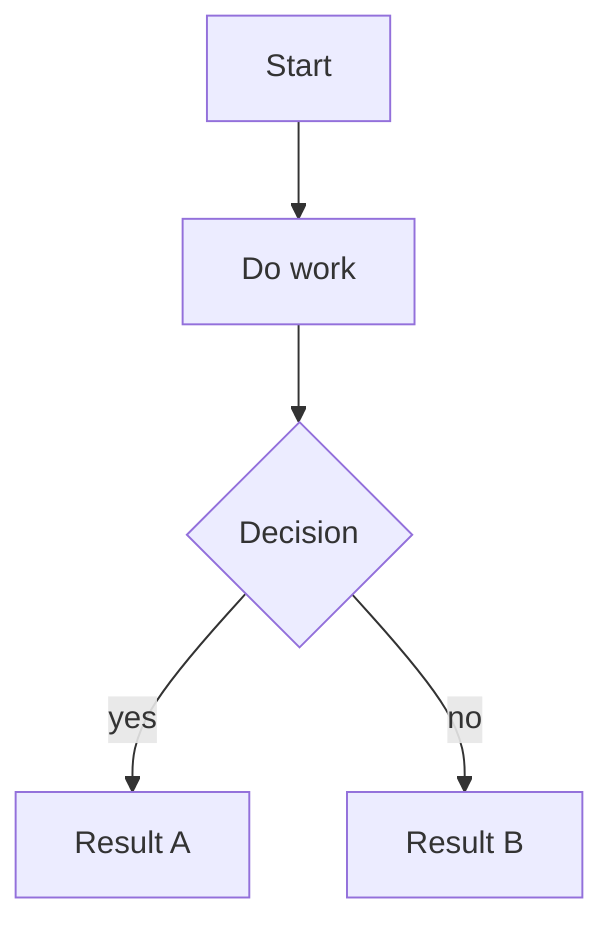

# Python Software Design: Things to Know

## Aside: Vibe-Coded Projects as Concrete Examples

Two small projects built quickly to solve real problems — useful here as
illustrations of common web architectures.

- **[`planner/`](~/code/recipe-management/planner/server.js)** — an Express
  (Node.js) backend that serves a recipe browser and uses Claude to generate
  meal plans, backed by Google Sheets as a database
- **[`shopping-assistant/`](~/code/recipe-management/shopping-assistant/sidepanel.js)**
  — a Chrome extension with a side panel that steps through a grocery list and
  auto-searches Walmart, Instacart, or Amazon

Source: `~/code/recipe-management`

Diagrams:

- [Express App Architecture](033-diagram-express-app.md)
- [Chrome Extension Architecture](033-diagram-chrome-extension.md)

---

### A Note on Mermaid Diagrams

Mermaid is a text-based diagramming language embedded in markdown fenced code
blocks. You write diagram code; tools render it visually. No image files, no
drag-and-drop editor — the diagram lives in the repo as text and diffs like
code.

````markdown

````

Supported natively in: GitHub, Obsidian, GitLab, many VS Code extensions.
Diagram types include: `graph` (flowchart), `sequenceDiagram`, `classDiagram`,
`erDiagram`, `stateDiagram`, `gantt`.

---

### How Express Apps Work

Express is a minimal Node.js web framework. The mental model: you register
**route handlers** — a method (`GET`, `POST`, etc.) plus a path — and Express
calls your function whenever a matching HTTP request arrives.

```js
app.get("/api/recipes", async (req, res) => {
  const data = await fetchFromDatabase();
  res.json(data); // send JSON back to the caller
});
```

Key concepts:

| Concept            | What it does                                                                                                                                                   |
| ------------------ | -------------------------------------------------------------------------------------------------------------------------------------------------------------- |
| **Route handler**  | A function bound to `METHOD /path` — receives `req`, sends `res` — [example](~/code/recipe-management/planner/server.js:24)                                    |
| **Middleware**     | Functions that run before handlers: `express.json()` parses bodies, `express.static()` serves files — [example](~/code/recipe-management/planner/server.js:10) |
| **`req`**          | Incoming request — `.body`, `.params`, `.query`, `.headers`                                                                                                    |
| **`res`**          | Outgoing response — `.json()`, `.send()`, `.status()`                                                                                                          |
| **Static serving** | `app.use(express.static('public'))` — Express serves the HTML/CSS/JS frontend directly — [example](~/code/recipe-management/planner/server.js:11)              |

In the recipe planner:

- Express serves `public/index.html` as the UI —
  [server.js:11](~/code/recipe-management/planner/server.js:11)
- Five API routes:
  [GET /api/recipes](~/code/recipe-management/planner/server.js:24),
  [GET /api/past-plans](~/code/recipe-management/planner/server.js:42),
  [POST /api/suggest](~/code/recipe-management/planner/server.js:58),
  [POST /api/save-plan](~/code/recipe-management/planner/server.js:112),
  [POST /api/process-ingredients](~/code/recipe-management/planner/server.js:132)
- There is no separate frontend server — Express does both jobs

Process model: Node.js runs a single-threaded event loop. `async/await` lets
multiple I/O operations (Sheets API call, Claude call) run concurrently without
blocking.

#### Step-by-step: `POST /api/suggest`

1. **Browser sends request** —
   `fetch('/api/suggest', { method: 'POST', body: JSON.stringify({...}) })`
2. **[`express.json()`](~/code/recipe-management/planner/server.js:10)
   middleware runs** — reads the raw bytes off the wire, parses them as JSON,
   and attaches the result to `req.body`. Without this middleware, `req.body`
   would be `undefined`.
3. **[`express.static()`](~/code/recipe-management/planner/server.js:11)
   middleware runs** — checks if the path matches a file in `public/`. It
   doesn't (`/api/suggest` is not a file), so it calls `next()` and passes
   control to the router.
4. **Router matches the route** — Express finds
   [`app.post('/api/suggest', ...)`](~/code/recipe-management/planner/server.js:58)
   and calls the handler.
5. **Handler destructures the body** —
   [server.js:59](~/code/recipe-management/planner/server.js:59) pulls
   `recipes`, `pastPlans`, `constraints`, and `freetext` out of `req.body`.
6. **Builds the prompt** —
   [server.js:61–97](~/code/recipe-management/planner/server.js:61) randomly
   samples recipes, formats past plans as "avoid these", injects constraints and
   freetext, and assembles the full prompt string.
7. **Calls Claude** —
   [server.js:100–104](~/code/recipe-management/planner/server.js:100)
   `await anthropic.messages.create(...)`. The event loop is free to handle
   other requests while waiting for the API response.
8. **Parses the response** —
   [server.js:105](~/code/recipe-management/planner/server.js:105) strips any
   markdown fences Claude may have added, then `JSON.parse()` the raw text into
   a JS object.
9. **Sends the response** —
   [server.js:106](~/code/recipe-management/planner/server.js:106)
   `res.json(...)` serializes the object back to JSON, sets
   `Content-Type: application/json`, and sends HTTP 200. The request is done.
10. **Error path** —
    [server.js:107–109](~/code/recipe-management/planner/server.js:107) if
    anything in steps 5–9 throws, the `catch` block sends HTTP 500 with
    `{ error: err.message }` instead of crashing the server.

---

### Express vs. React

They are not alternatives — they run in completely different places and do
completely different things.

|                 | Express                                   | React                                |
| --------------- | ----------------------------------------- | ------------------------------------ |
| **Runs on**     | Server (Node.js)                          | Browser                              |
| **Job**         | Handle HTTP requests, return data or HTML | Manage UI state, render DOM          |
| **Build step**  | None required                             | Yes — Vite/webpack compiles JSX → JS |
| **Knows about** | Routes, middleware, HTTP verbs            | Components, props, state, hooks      |
| **Talks to**    | Databases, external APIs, filesystem      | The DOM, browser APIs, your own API  |

A common pattern: a React frontend running in the browser makes `fetch()` calls
to an Express API running on a server. They cooperate; neither replaces the
other.

In the recipe planner the frontend is **vanilla JS** (not React) — there are no
components, no JSX, no build step. The HTML in `public/index.html` uses plain
`fetch()` calls and manually updates the DOM. This is fine for a small tool;
React would add complexity that isn't needed at this scale.

React becomes worth it when: the UI has many interdependent pieces of state, you
want component reuse, or the team is large enough that the structure pays for
itself.

---

### How Chrome Extensions Work

A Chrome extension is a small web application that runs inside the browser and
gets access to Chrome-specific APIs unavailable to ordinary web pages.

**The three main contexts:**

| Context                | File                                                                           | What it is                                                                                                     |
| ---------------------- | ------------------------------------------------------------------------------ | -------------------------------------------------------------------------------------------------------------- |
| **Manifest**           | [`manifest.json`](~/code/recipe-management/shopping-assistant/manifest.json:1) | Declares the extension: name, permissions, which files play which roles                                        |
| **Service worker**     | [`background.js`](~/code/recipe-management/shopping-assistant/background.js:1) | Persistent background script. Listens to Chrome events (icon click, tab updates). Runs even when no UI is open |
| **Side panel / popup** | [`sidepanel.js`](~/code/recipe-management/shopping-assistant/sidepanel.js:1)   | The visible UI. A normal web page, but with access to Chrome APIs                                              |

**Chrome APIs** (only available inside extensions):

| API                    | Used for                                                                                                                                                                                                          |
| ---------------------- | ----------------------------------------------------------------------------------------------------------------------------------------------------------------------------------------------------------------- |
| `chrome.tabs`          | Query the active tab, read its URL, navigate it — [example](~/code/recipe-management/shopping-assistant/sidepanel.js:78)                                                                                          |
| `chrome.storage.local` | Persist data across sessions (like `localStorage` but extension-scoped) — [save](~/code/recipe-management/shopping-assistant/sidepanel.js:9), [load](~/code/recipe-management/shopping-assistant/sidepanel.js:13) |
| `chrome.sidePanel`     | Open/close the side panel — [example](~/code/recipe-management/shopping-assistant/background.js:3)                                                                                                                |
| `chrome.action`        | Respond to the extension toolbar icon being clicked — [example](~/code/recipe-management/shopping-assistant/background.js:2)                                                                                      |

**[Permissions](~/code/recipe-management/shopping-assistant/manifest.json:6)**
in `manifest.json` declare what the extension is allowed to do.
[`host_permissions`](~/code/recipe-management/shopping-assistant/manifest.json:11)
restrict which domains it can interact with (the shopping assistant only touches
walmart.com, instacart.com, amazon.com).

In the shopping assistant:

- [`background.js`](~/code/recipe-management/shopping-assistant/background.js:1)
  has one job: open the side panel when the icon is clicked
- All real logic lives in
  [`sidepanel.js`](~/code/recipe-management/shopping-assistant/sidepanel.js:1) —
  it
  [reads the current tab URL](~/code/recipe-management/shopping-assistant/sidepanel.js:78)
  to detect which store the user is on,
  [builds the right search URL](~/code/recipe-management/shopping-assistant/sidepanel.js:25),
  and calls
  [`chrome.tabs.update()`](~/code/recipe-management/shopping-assistant/sidepanel.js:86)
  to navigate the tab
- [`chrome.storage.local`](~/code/recipe-management/shopping-assistant/sidepanel.js:9)
  persists the shopping list so it survives the panel being closed and reopened

---

## Package Structure

- Add `__init__.py` to mark any directory as a Python package — not just
  top-level. Enables subpackage imports like `acquisitions_dq.gx.suites`.
- Use editable installs (`pip install -e .`) during development so local changes
  are immediately reflected without reinstalling.
- Prefer absolute imports (Pythonic default); avoid bare imports.

Example structure:

```
src/
  acquisitions_dq/
    __init__.py
    gx/
      __init__.py
      suites/
        __init__.py
```

This makes `acquisitions_dq` a package, `acquisitions_dq.gx` a subpackage, and
`acquisitions_dq.gx.suites` another subpackage.

---

## Coupling and Pluggability

A sign of tight coupling: support code that knows too much about another layer.

**Symptoms:**

- A runner directly imports a specific implementation (e.g.
  `build_placeholder_suite`)
- Suite/config names are hardcoded
- Leftover artifacts tied to a specific implementation

**Goal:** make collaborators pluggable so the runner doesn't care which
implementation it gets.

---

## Functions vs. Classes

Default to **functions**. Promote to a class when:

1. Too many parameters keep traveling together
2. Hidden or shared state starts appearing
3. Multiple functions clearly belong to one concept
4. You need interchangeable implementations
5. Setup/teardown/lifecycle becomes important

Don't invent a class just to hold one method — that should probably be a
function.

**Idiomatic Python style:**

- Modules + functions for most logic
- `dataclass` for structured data
- Small classes/protocols where abstraction genuinely helps

> "Using functions" = procedural or function-oriented programming. "Functional
> programming" = a more specific paradigm with immutability, pure functions,
> etc. They are not the same thing.

### Simple decision rule

| Question                                                 | Answer                          |
| -------------------------------------------------------- | ------------------------------- |
| Is this mostly "do work on inputs and return outputs"?   | Use a function                  |
| Is this a thing with configuration, state, or lifecycle? | Use a class                     |
| Am I inventing a class only to hold one method?          | Probably use a function instead |

---

## `@dataclass(frozen=True)`

Eliminates `__init__` boilerplate for config/value objects. `frozen=True` makes
instances immutable after construction.

**Instead of:**

```python
class ValidationJobConfig:
    def __init__(self, input_path, delimiter=None, encoding=None, fail_on_empty=False):
        self.input_path = input_path
        self.delimiter = delimiter
        self.encoding = encoding
        self.fail_on_empty = fail_on_empty
```

**Write:**

```python
@dataclass(frozen=True)
class ValidationJobConfig:
    input_path: Path
    delimiter: str | None = None
    encoding: str | None = None
    fail_on_empty: bool = False
```

Use when multiple related parameters belong to one concept. Pass one config
object instead of 4–8 loose parameters:

```python
run_validation_job(config)          # good
run_validation_job(path, delim, enc, fail_on_empty, ...)  # bad
```

---

## Keyword-Only Arguments (`*`)

The `*` in a function signature forces everything after it to be passed by
keyword, preventing silent bugs from positional argument ordering.

```python
def load_dataframe(
    path: Path,
    *,
    delimiter: str | None = None,
    encoding: str | None = None,
) -> pd.DataFrame:
```

```python
load_dataframe(path, delimiter=",", encoding="utf-8")  # allowed
load_dataframe(path, ",", "utf-8")                     # TypeError
```

---

## Exception Handling

Only catch an exception if at least one of these is true:

1. You can recover
2. You can add important context
3. You need to translate across an abstraction boundary
4. You need to clean up, log, or emit telemetry
5. You need to convert it into a user-facing result instead of crashing

**Good — adds context:**

```python
try:
    df = pd.read_csv(path)
except Exception as exc:
    raise ValueError(f"Failed to load input file {path}") from exc
```

**Good — translates abstraction:**

```python
try:
    client.download_file(...)
except botocore.exceptions.ClientError as exc:
    raise InputDownloadError(f"Failed to download {s3_uri}") from exc
```

**Bad — pointless re-raise:**

```python
try:
    do_the_thing()
except Exception:
    raise  # useless
```

**Worse — loses type and traceback:**

```python
try:
    do_the_thing()
except Exception as exc:
    raise Exception(str(exc))  # strips type info and traceback
```

---

## OOP Polymorphism

Same interface, different implementations. Replaces `if/else` branching on type.

**Instead of:**

```python
if input_reference.source_type == "s3":
    local_path = materialize_s3_input(input_reference)
else:
    local_path = materialize_local_input(input_reference)
```

**Use a shared interface:**

```python
class InputMaterializer:
    def materialize(self, input_reference) -> Path:
        raise NotImplementedError

class LocalInputMaterializer(InputMaterializer):
    def materialize(self, input_reference) -> Path:
        return input_reference.local_path

class S3InputMaterializer(InputMaterializer):
    def materialize(self, input_reference) -> Path:
        # boto3 download
        ...
```

```python
materializer = get_materializer(input_reference)
local_path = materializer.materialize(input_reference)
```

The runner calls `materialize()` without knowing which implementation it has.

---

## Dependency Injection

The runner shouldn't construct its own collaborators internally — they should be
passed in from outside. This makes the runner testable and its dependencies
swappable.

**DI version:**

```python
class ValidationRunner:
    def __init__(self, materializer, loader, validator):
        self.materializer = materializer
        self.loader = loader
        self.validator = validator

    def run_validation_job(self, config):
        input_reference = resolve_input_reference(config.input_location)
        local_path = self.materializer.materialize(input_reference)
        dataframe = self.loader.load(local_path)
        return self.validator.validate(dataframe)
```

**Wired up in `cli.py`:**

```python
runner = ValidationRunner(
    materializer=S3OrLocalMaterializer(),
    loader=DataFrameLoader(),
    validator=GxValidator(),
)
return runner.run_validation_job(config)
```

---

## Architectural Patterns (Short Summary)

| Pattern               | Purpose                                                           |
| --------------------- | ----------------------------------------------------------------- |
| **Ports / Adapters**  | Separate business flow from outside systems (S3, databases, APIs) |
| **Strategy / Plugin** | Separate stable flow from swappable rule sets or implementations  |
